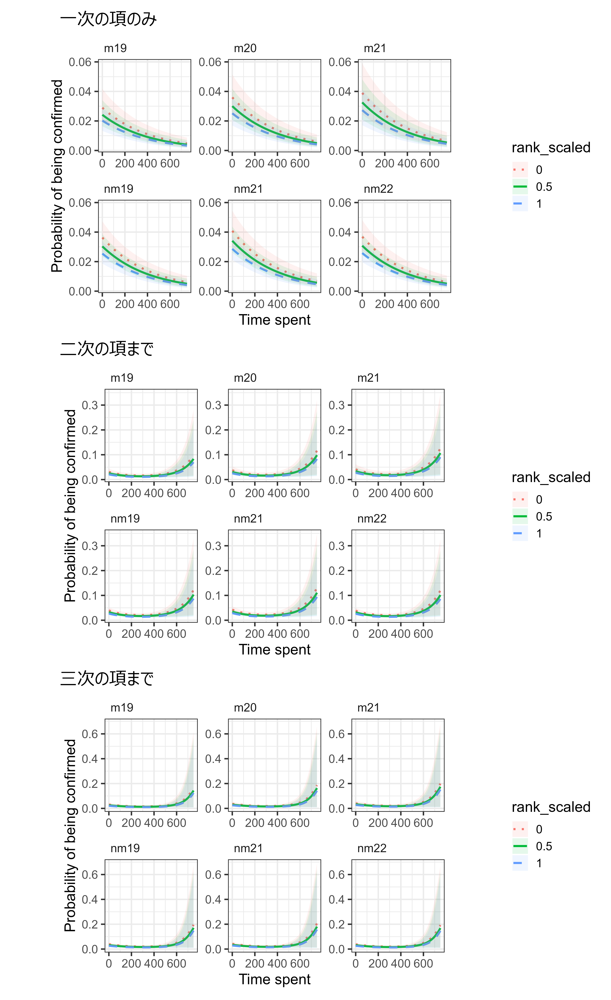
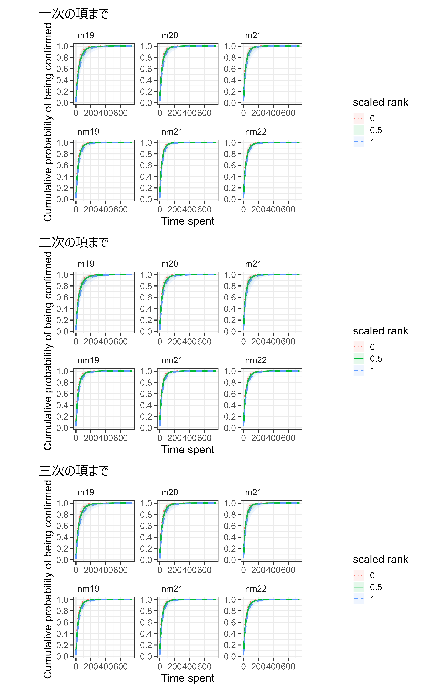

# メスの発見までに要する時間 {#c6}    
これ以降で、各観察日に群れで確認した個体数を分析する。そのとき、何分以上追跡した日であれば十分にメスを探索する時間があったとみなし、分析に含めることができるだろうか。以下ではこの基準を決めるため、メスを確認するのにどの程度時間がかかっていたかを**生存時間解析**[^foot1]を用いて分析する。

[^foot1]: 生存時間解析については[こちら](https://tsubasayamaguchi-jinrui.github.io/SurvivalAnalysis/)。

## データの読み込み・加工  
### データの読み込み  

まずは、各観察日にそれぞれの個体を確認した時刻を記したデータシートを読み込む。

```{r}
## 確認した時間  
female_time <- read_csv("../Data/data/others/female_pre_time.csv") %>% 
  mutate(date = as_date(date))
```

データは以下の通り。2018年交尾期から2022年交尾期まで、6歳以上の個体の確認時刻が記入されている。分析には、2019年交尾期から2022年非交尾期までのデータを用いる。

-   `?`: 確認されたが確認時刻は不明  
-   `DD`: 死亡   
-   `NS`: そのとき5歳以下  
-   `NA`: 確認できず  

```{r}
datatable(female_time,
          options = list(scrollX = 50))
```
<br/>  

個体の属性を記したデータシートも読み込む。  

```{r}
#個体の属性情報
att <- read_csv("../Data/data/others/attributes_sp_over6.csv")
```

各調査期間における年齢と順位が記されている。  

```{r}
datatable(att)
```

### データの加工   
メスの確認時刻のデータを縦型に変換し、分析のためにデータを加工・成型する。  

```{r}
female_time %>% 
  pivot_longer(cols = Kur:Cur,
               names_to = "femaleID",
               values_to = "presence") %>% 
  mutate(date = as_date(date)) %>% 
  ## 2022交尾期のデータは含めない  
  filter(date <= "2022-08-31") %>% 
  ## 調査期間の情報を追加  
  left_join(group_all %>% select(date, study_period) %>% distinct(date, study_period)) %>% 
  left_join(att, by = c("study_period","femaleID")) -> female_time_long
  
female_time_long %>% 
  ## 死亡個体(DD)と確認時間不明個体(?)、非対象個体(6歳未満)(NS)は除く
  filter((presence != "?" & presence != "DD" & presence != "NS")| is.na(presence)) %>% 
  ## 確認時刻をdatetime形式に
  mutate(found_time = str_c(date," ", presence)) %>% 
  mutate(found_time = as_datetime(found_time)) %>%    
  ## 確認の有無についての列を作成  
  mutate(confirmed = ifelse(is.na(presence),0,1)) %>% 
  mutate(date = as_date(date)) %>% 
  ## 1日前の日付を表す列を作成  
  mutate(date_pre = date-1) -> female_time_long_b
```

分析には、3通りのデータを用いた。  

1. 前日に全頭確認でき、かつその日も全頭確認できた日のみのデータ。前日に全頭確認できた日に限定したのは、分析対象日の前日に分派が生じており、分析対象の日の途中に分派していたサブグループが合流した、というような場合をできるだけ除外するためである。これにより、分派していない状態で全個体を探すのにかかる時間を可能な限り正確に推定できる。  
  - 2つ以上の集団を観察した日は、全頭確認している可能性のある大きい方の集団のデータを用いた。  
  - 途中で中断があり、中断以後に個体が見つかっている場合も除いた。    

2. 確認できない個体も含めた全個体のデータ。つまり、右側打ち切りの内、固定打ち切りのデータ[@Allison2014]も含まれる。  
  - 2つ以上の集団を観察した日は大きい方の集団のデータを用いた。   
  - 扱いが難しいので、中断があった日は除く。  
  
3. 確認できた全個体のデータ  
  - 2つ以上の集団を観察した日は大きい方の集団のデータを用いた   
  - 扱いが難しいので、中断があった場合は再開以後に見つけた個体のデータは除く  

まず、1のためのデータを作成する。  
```{r}
## 2つ以上の集団を観察した日に小さかった集団のID
exc_groupID <- c("m19_23","m19_24","m19_41","m19_53","m19_54","nm21_20","nm21_22","nm21_43","m20_52","m20_57","m21_35","m21_54")

## 各観察日の最大個体と確認個体数(確認時刻が記録できているメスのみ)を算出
female_time %>% 
  pivot_longer(cols = Kur:Cur,
               names_to = "femaleID",
               values_to = "presence") %>% 
  filter(is.na(presence)|(presence != "DD" & presence != "NS")) %>% 
  group_by(date) %>% 
  mutate(max_female = n()) %>% 
  distinct(date, max_female)  -> max_female

group_all %>% 
  select(groupID, study_period, date, Kur:Yun) %>% 
  select(-c(TY,IT, LK,KR,KM,TG)) %>% 
  pivot_longer(cols = Kur:Yun,
               names_to = "femaleID",
               values_to = "presence") %>% 
  left_join(female_time_long_b %>% select(-study_period, -presence), by = c("date","femaleID")) %>% 
  ## 6歳以上でかつ確認時刻が記録できている個体のみを抽出
  filter(age >= 6, confirmed == 1) %>% 
  ## groupIDごとに個体数を算出
  group_by(date, groupID) %>% 
  summarise(no_female = sum(presence, na.rm = TRUE)) %>% 
  ungroup() %>% 
  ## groupIDが上記のものは除く  
  filter(!(groupID %in% exc_groupID)) %>% 
  left_join(max_female, by = "date")  -> no_female

## 確認時刻データを結合する  
female_time_long_b %>% 
  ## 前日に全頭いたかの列を作成  
  left_join(no_female %>% select(-groupID), by = c("date_pre" = "date")) %>% 
  mutate(inc = ifelse(no_female == max_female,1,0)) %>% 
  select(-max_female, -no_female) %>% 
  ## 当日に全頭いたかの列を作成
  left_join(no_female, by = "date") %>% 
  mutate(inc2 = ifelse(max_female == no_female,1,0)) %>% 
  ## 前日も当日も全頭確認できている日のみを抽出  
  filter(inc == 1 & inc2 == 1)  -> female_time_anal
  
## 中断があり、中断以前に全頭が見つけられていない日は除く  
female_time_anal %>% 
  group_by(date, groupID) %>% 
  summarise(last_found = max(found_time)) %>% 
  ungroup() %>% 
  left_join(group_all %>% select(1:6), by = c("groupID", "date")) %>% 
  mutate(exclude = ifelse(is.na(suspend),0,
                          ifelse(last_found < suspend, 0, 1))) %>% 
  select(-last_found) -> suspend_exclude

female_time_anal %>% 
  left_join(suspend_exclude, by = c("date", "groupID")) %>% 
  ## 中断以前に全頭見つかっていない日は除く（結果的に0）
  filter(exclude != 1) %>% 
  ## 各個体が開始から何分で見つかったか
  mutate(dur = as.numeric(found_time - start)/60) %>% 
  ## 各個体は何番目に見つかったか  
  group_by(date) %>% 
  arrange(dur, .by_group = TRUE) %>% 
  mutate(N = 1:n()) %>% 
  ## その時間まで見つかっていた割合
  mutate(prop = N/max_female) %>% 
  ungroup() %>% 
  ## 2018年交尾期のデータは用いない  
  filter(study_period != "m18") -> female_time_anal_b
```

データは以下の通り。  
```{r}
datatable(female_time_anal_b,
          options = list(scrollX = 60,
                         filter = "top"))
```
<br/>  

続いて、2のためのデータを作成する。群れが多数の小集団に分かれていたと思われる9月28~30日、雨で小屋前での観察だけだった2021年12月8日(確認時刻の記録がない)、確認個体の記録がない2022年3月28日のデータは除く。        
```{r}
exc_date <- c(as_date("2019-09-28"),as_date("2019-09-29"), as_date("2019-09-30"), 
              as_date("2021-12-08"), as_date("2022-03-28"))

group_all %>% 
  select(groupID, study_period, start:fin, date, Kur:Yun) %>% 
  select(-c(TY,IT, LK,KR,KM,TG)) %>% 
  ## 縦型に変換  
  pivot_longer(cols = Kur:Yun,
               names_to = "femaleID",
               values_to = "presence") %>% 
  right_join(female_time_long_b %>% select(-study_period, -presence), by = c("date","femaleID")) %>% 
  ## 2つ以上の集団を観察した場合、小さい方は除く  
  filter(!(groupID %in% exc_groupID)) %>% 
  ## 上記の日付は除く  
  filter(!(date %in% exc_date)) %>% 
  ## 中断がある日は除く  
  filter(is.na(suspend)) %>% 
  ## 調査のない日は除く %>% 
  filter(!is.na(start)) %>% 
  ## 追跡時間
  mutate(dur_follow = as.numeric(difftime(fin, start, units = "mins"))) %>% 
  ## 2018年交尾期のデータは用いない  
  filter(study_period != "m18") %>% 
  ## 各個体が開始から何分で見つかったか
  ## 見つかっていない場合は追跡時間  
  mutate(dur = ifelse(presence == 1,
                      as.numeric(difftime(found_time, start, units = "mins")),
                      dur_follow)) %>% 
  ## 各個体は何番目に見つかったか  
  group_by(date) %>% 
  arrange(dur, .by_group = TRUE) %>% 
  mutate(N = 1:n()) %>% 
  ungroup() %>% 
  left_join(no_female, by = c("date","groupID")) %>% 
  mutate(prop = N/max_female) %>% 
  ## 複数の集団を発見したとき、小さい集団にいた方の個体のconfirmedを0にする  
  mutate(confirmed = ifelse(confirmed == 1 & presence == 0,
                            presence, confirmed)) -> female_time_anal_all
```

データは以下の通り。  
```{r}
datatable(female_time_anal_all,
          options = list(scrollX = 60,
                         filter = "top"))
```
<br/>  

最後に、3のためのデータを作成する。群れが多数の小集団に分かれていたと思われる9月28~30日、雨で小屋前での観察だけだった2021年12月8日(確認時刻の記録がない)、確認個体の記録がない2022年3月28日のデータは除く。        
```{r}
exc_date <- c(as_date("2019-09-28"),as_date("2019-09-29"), as_date("2019-09-30"), 
              as_date("2021-12-08"), as_date("2022-03-28"))

group_all %>% 
  select(groupID, study_period, start:fin, date, Kur:Yun) %>% 
  select(-c(TY,IT, LK,KR,KM,TG)) %>% 
  ## 縦型に変換  
  pivot_longer(cols = Kur:Yun,
               names_to = "femaleID",
               values_to = "presence") %>% 
  right_join(female_time_long_b %>% select(-study_period, -presence), by = c("date","femaleID")) %>% 
  ## 2つ以上の集団を観察した場合、小さい方は除く  
  filter(!(groupID %in% exc_groupID)) %>% 
  ## 上記の日付は除く  
  filter(!(date %in% exc_date)) %>% 
  ## 中断以後に見つけた個体は除く    
  filter(is.na(suspend)|found_time <= suspend) %>% 
  ## 調査のない日は除く %>% 
  filter(!is.na(start)) %>% 
  ## 追跡時間
  mutate(dur_follow = as.numeric(difftime(fin, start, units = "mins"))) %>% 
  ## 2018年交尾期のデータは用いない  
  filter(study_period != "m18") %>% 
  ## 各個体が開始から何分で見つかったか
  ## 見つかっていない場合は追跡時間  
  mutate(dur = ifelse(presence == 1,
                      as.numeric(difftime(found_time, start, units = "mins")),
                      dur_follow)) %>% 
  left_join(no_female, by = c("date","groupID")) %>% 
  ## 複数の集団を発見したとき、小さい集団にいた方の個体のconfirmedを0にする  
  mutate(confirmed = ifelse(confirmed == 1 & presence == 0,
                            presence, confirmed)) %>% 
  filter(confirmed == 1) -> female_time_anal_all_pre
```

データは以下の通り。  
```{r}
datatable(female_time_anal_all_pre,
          options = list(scrollX = 60,
                         filter = "top"))
```
<br/>    


## 生存時間分析  
### 全頭確認できた日のみ  
#### データの確認    
分析の前に、データを図示する。縦軸には累積確認個体数と累積確認個体割合をとる。  
```{r, fig.dim = c(12,4.5)}
female_time_anal_b %>% 
  ggplot(aes(x= dur, y = N))+
  geom_step(aes(color = study_period, group = date))+
  theme_bw(base_size = 16)+
  labs(y = "Cumulative number of \nconfirmed individuals")+
  theme(aspect.ratio = 1,
        axis.title.y = element_text(family = "Arial"),
        legend.position = "none") -> p_cumsum

female_time_anal_b %>% 
  ggplot(aes(x= dur, y = prop))+
  geom_step(aes(color = study_period, group = date))+
  theme_bw(base_size = 16)+
  labs(y = "Cumulative proportion of \nconfirmed individuals")+
  theme(aspect.ratio = 1,
        axis.title.y = element_text(family = "Arial")) -> p_prop

p_cumsum_allind <- p_cumsum + p_prop

p_cumsum_allind

# ggsave("figures/p_cumsum_allind.png", p_cumsum_allind,
#        width = 240, height = 120, dpi = 600, units = "mm")
```

<br/>

最後の個体が見つかるまでにかかる時間の分布は以下の通り。  
```{r, fig.height = 4.5}
female_time_anal_b %>% 
  group_by(date) %>% 
  summarise(last_time = max(dur)) %>% 
  ungroup() -> last_time
  
count <- hist(last_time$last_time,breaks = seq(0,620,10), plot = F)
cumsum <- data.frame(x = count$breaks[-63],
                     cumsum = (cumsum(count$counts)/max(cumsum(count$counts)))*10)

ggplot(last_time, aes(x = last_time))+
  geom_histogram(fill = "white",
                 color = "black",
                 binwidth = 10)+
  geom_line(data = cumsum, aes(x = x, y = cumsum),
            color = "red2", linetype = "dashed")+
  theme_bw(base_size = 16)+
  theme(aspect.ratio = 1)+
  scale_y_continuous(name = "Frequency", breaks = seq(0,10.2),
                     sec.axis= sec_axis(name = "Cumulative density", trans = ~.*0.1,
                                        breaks = seq(0,1,0.1)))+
  labs(x = "Time elapsed until the last individual")
```

#### コックス比例ハザードモデル {#s6-2-1}     
まずは、`brms`パッケージを用いてコックス比例ハザードモデルを適用する。コックス比例ハザードモデルについての解説は、[こちら](https://ehar.se/r/ehar2/)や[筆者がまとめた資料](https://tsubasayamaguchi-jinrui.github.io/SurvivalAnalysis/)を参照。  

##### モデリング   
コックス比例ハザードモデルは以下のような形をとる。なお、$h(t)$はハザード関数を表す。$h_0(t)$は基準ハザード関数と呼ばれ、経過時間$t$のみの関数である。なお、$\gamma_i$と$\delta_j$はそれぞれ日付とメスIDのランダム切片を表す。$age_{ijk}$は、$i$番目の日付の$j$番目のメスのデータを表す。分析に用いるのは、2019年非交尾期($nm19$)、2019年交尾期($m19$)、2020年交尾期($m20$)、2021年非交尾期($nm21$)、2021年交尾期($m21$)、2022年非交尾期($nm22$)で、それぞれの変数は各調査期間かを表すダミー変数である。事前分布は`brms`パッケージのデフォルトである。        

$$
\begin{aligned}
&h(t)_{ij} = h_0(t) exp(\beta_1 \times age_{ij} + \beta_2 \times rank_{ij} + \beta_3 \times nm19_{ij} + \beta_4 \times m19_{ij} + \\& \;\;\;\;\;\;\;\; \beta_5 \times m20_{ij} + \beta_6 \times nm21_{ij} +\beta_7 \times m21_{ij} + \beta_8 \times nm22_{ij} +  \gamma_i + \delta_j)\\
&  \gamma_i \sim Normal(0, \sigma_{\gamma})\\
&  \delta_j \sim Normal(0, \sigma_{\delta})\\
\end{aligned}
$$

Rでは以下のように実行する。  
```{r}
female_time_anal_b %>% 
  mutate(date = as.factor(date)) -> female_time_anal_b

mod_cox   <- brm(dur | cens(1 - confirmed) ~ 0 + study_period + age + rank + 
                   (1|date) + (1|femaleID),
                 data = female_time_anal_b,
                 iter = 5000,
                 warmup = 2500,
                 family = brmsfamily("cox"),
                 backend = "cmdstanr",
                 file = "model/mod_cox")
```

結果は以下の通り。順位が低いほど有意に見つかりにくいという関係があるよう。  
```{r}
posterior_summary(mod_cox) %>% 
  head(8) %>% 
  data.frame() %>% 
  mutate(across(1:4, ~round(.,3)))
```

調査期間ごとの係数の差の事後分布を調べたところ、いずれも95%確信区間に0を含んでおり、調査期間ごとに有意な差はなさそうなことが分かる。  
```{r}
posterior_samples(mod_cox) %>% 
  select(1:6) %>% 
  mutate(m19_m20 = b_study_periodm19 - b_study_periodm20,
         m19_m21 = b_study_periodm19 - b_study_periodm21,
         m19_nm19 = b_study_periodm19 - b_study_periodnm19,
         m19_nm21 = b_study_periodm19 - b_study_periodnm21,
         m19_nm22 = b_study_periodm19 - b_study_periodnm22,
         m20_m21 = b_study_periodm20 - b_study_periodm21,
         m20_nm19 = b_study_periodm20 - b_study_periodnm19,
         m20_nm21 = b_study_periodm20 - b_study_periodnm21,
         m20_nm22 = b_study_periodm20 - b_study_periodnm22,
         m21_nm19 = b_study_periodm21 - b_study_periodnm19,
         m21_nm21 = b_study_periodm21 - b_study_periodnm21,
         m21_nm22 = b_study_periodm21 - b_study_periodnm22,
         nm19_nm21 = b_study_periodnm19 - b_study_periodnm21,
         nm19_nm22 = b_study_periodnm19 - b_study_periodnm22,
         nm21_nm22 = b_study_periodnm21 - b_study_periodnm22) %>% 
  select(-(1:6)) %>% 
  pivot_longer(everything()) %>% 
  group_by(name) %>% 
  summarise(mean = mean(value),
            lower = quantile(value, 0.025),
            upper = quantile(value, 0.975)) %>% 
  mutate(across(where(is.numeric), ~round(.,3))) %>% 
  separate(name, sep = "_", into = c("Level1", "Level2"))
```

#### 離散時間モデル {#s6-2-2}     
続いて、離散時間モデル[@Allison2014]を適用する。離散時間モデルについては、[こちら](https://ehar.se/r/ehar2/)や[筆者がまとめた資料](https://tsubasayamaguchi-jinrui.github.io/SurvivalAnalysis/)を参照。

##### データの加工   
まず、データを加工する必要がある。  
```{r}
female_time_anal_b %>% 
  mutate(max_dur = as.numeric(fin - start)*60) %>% 
  group_by(date, femaleID) %>% 
  tidyr::expand(time = 1:max_dur) %>% 
  ungroup() -> female_dur_all

female_dur_all %>% 
  left_join(female_time_anal_b, by = c("date","femaleID")) %>% 
  filter(time <= dur) %>% 
  mutate(confirmed = ifelse(time == dur,1,0)) -> female_time_dcr
```

##### モデリング    
それでは、モデリングを行う。モデル式は以下の通り。なお、`t`は群れ発見からの経過時刻、`confirmed`は確認されたか否かを表す。連続変数はすべて標準化している。    

- 応答変数: メスが確認されたか否か($confirmed$)  
- 説明変数: 群れ発見からの経過時間($t, t^2, t^3$)、調査期間($nm19, \dots, nm22$)、順位($rank_std$)、年齢($age_std$)  
- ランダム切片: メスID($delta_j$)、日付($gamma_i$)  
- 分布: ベルヌーイ分布  
- リンク関数: logit関数  
- 事前分布  
   - 切片、回帰係数: $student\_t(4,0,10)$  
   - ランダム切片の標準偏差: $student\_t(4,0,5)$  
   
<br/>  

$$
\begin{aligned}
&confirmed_{ij} \sim Bernoulli(p_{ij}) \\
 log\biggl(\frac{p_{ij}}{1-p_{ij}}\biggl) &= \beta_0 + \beta_1  t_{ij} + \beta_2  t_{ij}^2  + \beta_3  t^3_{ij} +  \beta_4  nm19_{ij} + \beta_5  m19_{ij} + \beta_6  m20_{ij} + \\ & \beta_7  nm21_{ij} + \beta_8 m21_{ij} + \beta_9 nm22_{ij} + \beta_{10} rank\_std + \\& \beta_{11} age_std_{ij} + \gamma_i + \delta_j \\
&\gamma_i \sim Normal(0, \sigma_{\gamma}) \\
&\delta_j \sim Normal(0, \sigma_{\delta}) \\
\end{aligned}
$$
<br/>  


Rでは以下のように実行する。時間($time$)の一次の項のみを含むもの、二次までの項を含むもの、三次までの項を含むものを実行する。    
```{r}
female_time_dcr <- female_time_dcr %>% 
  mutate(date = as.factor(date)) %>% 
  mutate(age_std = standardize(age),
         time_scaled = time/max(time)) %>% 
  group_by(study_period) %>% 
  mutate(rank_scaled = rank/max(rank)) %>% 
  ungroup() %>% 
  mutate(rank_std = standardize(rank_scaled))

## 1次のみ
mod_dcr <- brm(confirmed ~ study_period + time  + rank_std + age_std + (1|date) + (1|femaleID),
               data = female_time_dcr,
               family = "bernoulli",
               iter = 11000, warmup = 6000, seed = 13,
               prior = c(prior(student_t(4,0,10),class = Intercept),
               prior(student_t(4,0,10), class = b),
               prior(student_t(4,0,5), class = sd)),
               control=list(adapt_delta = 0.999, max_treedepth = 20),
               backend = "cmdstanr",
               file = "model/mod_dcr")

## 2次まで  
mod_dcr2 <- brm(confirmed ~ study_period + poly(time, 2, raw = FALSE) + rank_std + age_std +
                  (1|date) + (1|femaleID),
               data = female_time_dcr,
               family = "bernoulli",
               iter = 11000, warmup = 6000, seed = 123,
               prior = c(prior(student_t(4,0,10),class = Intercept),
               prior(student_t(4,0,10), class = b),
               prior(student_t(4,0,5), class = sd, lb = 0)),
               control=list(adapt_delta = 0.99, max_treedepth = 15),
               backend = "cmdstanr",
               file = "model/mod_dcr2")

## 3次まで  
mod_dcr3 <- brm(confirmed ~ study_period + poly(time, 3, raw = FALSE) + rank_std + age_std +
                  (1|date) + (1|femaleID),
               data = female_time_dcr,
               family = "bernoulli",
               iter = 11000, warmup = 6000, seed = 123,
               prior = c(prior(student_t(4,0,10),class = Intercept),
               prior(student_t(4,0,10), class = b),
               prior(student_t(4,0,5), class = sd, lb = 0)),
               control=list(adapt_delta = 0.99, max_treedepth = 15),
               backend = "cmdstanr",
               file = "model/mod_dcr3")
```

##### モデルのチェック  
続いて、モデルチェックを行う。まず、DHARMaパッケージ[@Hartig2022]とDHARMa.helperパッケージ[@Francisco2023]でモデルの前提が満たされているかを確認する。いずれのモデルでも特に問題はないよう。 
```{r, fig.height = 4}
dharma_dcr <- dh_check_brms(mod_dcr, quantreg = TRUE)
dharma_dcr2 <- dh_check_brms(mod_dcr2, quantreg = TRUE)
dharma_dcr3 <- dh_check_brms(mod_dcr3, quantreg = TRUE)
```

bayesplotパッケージ[@Gabry2022]の`pp_check`関数で、事後分布からの予測分布と実測値の分布を比較しても大きな乖離はない。   
```{r, fig.height = 5}
ppcheck_dcr <- pp_check(mod_dcr, ndraws = 100)+
  theme_bw()+
  theme(aspect.ratio = 1)+
  guides(color = "none")

ppcheck_dcr2 <- pp_check(mod_dcr2, ndraws = 100)+
  theme_bw()+
  theme(aspect.ratio = 1)+
  guides(color = "none")

ppcheck_dcr3 <- pp_check(mod_dcr3, ndraws = 100)+
  theme_bw()+
  theme(aspect.ratio = 1)

ppcheck_dcr + ppcheck_dcr2 + ppcheck_dcr3
```
<br/>  

多重共線性の問題もない。  
```{r}
check_collinearity(mod_dcr)
check_collinearity(mod_dcr2)
check_collinearity(mod_dcr3)
```

##### 結果の確認  
推定結果は以下の通り。収束などの問題はないよう。いずれのモデルでも順位は有意な影響を持っているよう。    
```{r}
model_parameters(mod_dcr) %>% 
  data.frame() %>% 
  mutate("95%CI" = str_c("[",sprintf("%.2f",CI_low),",",sprintf("%.2f",CI_high),"]")) %>%
  select(c(1,2,9,7,8))

model_parameters(mod_dcr2) %>% 
  data.frame() %>% 
  mutate("95%CI" = str_c("[",sprintf("%.2f",CI_low),",",sprintf("%.2f",CI_high),"]")) %>%
  select(c(1,2,9,7,8))

model_parameters(mod_dcr3) %>% 
  data.frame() %>% 
  mutate("95%CI" = str_c("[",sprintf("%.2f",CI_low),",",sprintf("%.2f",CI_high),"]")) %>%
  select(c(1,2,9,7,8))
```

多重比較の結果、いずれのモデルでも調査期間によって有意な違いはなかった。  
```{r}
estimate_contrasts(mod_dcr, contrast = "study_period") %>%
  data.frame() %>%
  select(1:6) %>%
  mutate(across(where(is.numeric), ~round(., 3))) %>% 
  mutate(model = "model1") %>% 
  bind_rows(estimate_contrasts(mod_dcr2, contrast = "study_period") %>%
  data.frame() %>%
  select(1:6) %>%
  mutate(across(where(is.numeric), ~round(., 3))) %>% 
  mutate(model = "model2")) %>% 
  bind_rows(estimate_contrasts(mod_dcr3, contrast = "study_period") %>%
  data.frame() %>%
  select(1:6) %>%
  mutate(across(where(is.numeric), ~round(., 3))) %>% 
  mutate(model = "model3")) %>% 
  select(model, everything(), -pd) %>% 
  flextable() %>% 
  colformat_double(digits=2) %>% 
  set_table_properties(layout="autofit",width = 1) %>% 
  autofit(add_w = 0.2) %>% 
  merge_v(j = "model") %>% 
  theme_zebra() 
```

##### 結果の図示   
結果の図示すると以下のようになる。まずは、経過時間によるハザード率(= その時間まで見つからなかった各メスの発見確率)を図示すると以下のようになる。二次までの項を含むモデルと三次までの項を含むモデルはほとんど違いがなさそう。    

```{r}
# nd <- tidyr::crossing(time = seq(0,750,by = 1),
#                rank_scaled = c(0,0.5,1),
#                age_std = mean(female_time_dcr$age_std),
#                study_period = c("m19","m20","m21","nm19","nm21","nm22")) %>% 
#   mutate(rank_std = (rank_scaled - mean(female_time_dcr$rank_scaled))/sd(female_time_dcr$rank_scaled)) 
# 
# fit_dcr <- fitted(mod_dcr,
#            newdata = nd,
#            scale = "response",
#            re_formula = NA) %>%
#   bind_cols(nd) %>%
#   arrange(study_period, rank_scaled, time)
# 
# fit_dcr2 <- fitted(mod_dcr2,
#            newdata = nd,
#            scale = "response",
#            re_formula = NA) %>%
#   bind_cols(nd) %>%
#   arrange(study_period, rank_scaled, time)
# 
# fit_dcr3 <- fitted(mod_dcr3,
#            newdata = nd,
#            scale = "response",
#            re_formula = NA) %>%
#   bind_cols(nd) %>%
#   arrange(study_period, rank_scaled, time)
# 
# fit_dcr %>% 
#   mutate(rank_scaled = as.factor(rank_scaled)) %>% 
#   ggplot(aes(x = time, y = Estimate))+
#   geom_line(aes(color = rank_scaled, linetype = rank_scaled),
#             linewidth = 1)+
#   scale_linetype_manual(values = c("dotted","solid","dashed"))+
#   geom_ribbon(aes(ymin = Q2.5, ymax = Q97.5,
#                   fill = rank_scaled),
#               alpha = 0.1)+
#   theme_bw(base_size = 15)+
#   theme(aspect.ratio = 1,
#         strip.background = element_blank(),
#         axis.title = element_text("Arial"),
#         axis.text = element_text("Arial"),
#         strip.text = element_text(hjust = 0))+
#   labs(x = "Time spent", y = "Probability of being confirmed") +
#   facet_rep_wrap(~study_period,
#                  repeat.tick.labels = TRUE)+
#   labs(title = "一次の項のみ")  -> p_dcr1
# 
# fit_dcr2 %>%
#   mutate(rank_scaled = as.factor(rank_scaled)) %>%
#   ggplot(aes(x = time, y = Estimate))+
#   geom_line(aes(color = rank_scaled, linetype = rank_scaled),
#             linewidth = 1)+
#   scale_linetype_manual(values = c("dotted","solid","dashed"))+
#   geom_ribbon(aes(ymin = Q2.5, ymax = Q97.5,
#                   fill = rank_scaled),
#               alpha = 0.1)+
#   theme_bw(base_size = 15)+
#   theme(aspect.ratio = 1,
#         strip.background = element_blank(),
#         axis.title = element_text("Arial"),
#         axis.text = element_text("Arial"),
#         strip.text = element_text(hjust = 0))+
#   labs(x = "Time spent", y = "Probability of being confirmed") +
#   facet_rep_wrap(~study_period,
#                  repeat.tick.labels = TRUE)+
#   labs(title = "二次の項まで")  -> p_dcr2
# 
# fit_dcr3 %>% 
#   mutate(rank_scaled = as.factor(rank_scaled)) %>% 
#   ggplot(aes(x = time, y = Estimate))+
#   geom_line(aes(color = rank_scaled, linetype = rank_scaled),
#             linewidth = 1)+
#   scale_linetype_manual(values = c("dotted","solid","dashed"))+
#   geom_ribbon(aes(ymin = Q2.5, ymax = Q97.5,
#                   fill = rank_scaled),
#               alpha = 0.1)+
#   theme_bw(base_size = 15)+
#   theme(aspect.ratio = 1,
#         strip.background = element_blank(),
#         axis.title = element_text("Arial"),
#         axis.text = element_text("Arial"),
#         strip.text = element_text(hjust = 0))+
#   labs(x = "Time spent", y = "Probability of being confirmed") +
#   facet_rep_wrap(~study_period,
#                  repeat.tick.labels = TRUE)+
#   labs(title = "三次の項まで")  -> p_dcr3
# 
# p_dcr <- p_dcr1 / p_dcr2 / p_dcr3
# 
# ggsave("figures/p_dcr.png", p_dcr, dpi = 600,
#        width = 220, height = 360, units = "mm")
```
<br/>  

```{r p-dcr, out.width = "80%", fig.align = "center", echo = FALSE, fig.cap = "その時間まで見つからなかった各メスの発見確率"}

```
<br/>    

続いて、データを用いて累積発見確率(ある時点までに見つかる累積確率)を図示すると以下のようになる。どの期間、順位の個体でもおよそ200分あれば95%以上の確率で見つかることが分かる。   
```{r}
# fit_dcr_b <- fit_dcr %>% 
#   arrange(study_period, rank_scaled, time) %>% 
#   group_by(study_period, rank_scaled) %>% 
#   mutate(mean = 1 - cumprod(1-Estimate),
#          upper = 1 - cumprod(1-Q97.5),
#          lower = 1 - cumprod(1 - Q2.5)) %>% 
#   ungroup()
# 
# fit_dcr2_b <- fit_dcr2 %>% 
#   arrange(study_period, rank_scaled, time) %>% 
#   group_by(study_period, rank_scaled) %>% 
#   mutate(mean = 1 - cumprod(1-Estimate),
#          upper = 1 - cumprod(1-Q97.5),
#          lower = 1 - cumprod(1 - Q2.5)) %>% 
#   ungroup()
# 
# fit_dcr3_b <- fit_dcr3 %>% 
#   arrange(study_period, rank_scaled, time) %>% 
#   group_by(study_period, rank_scaled) %>% 
#   mutate(mean = 1 - cumprod(1-Estimate),
#          upper = 1 - cumprod(1-Q97.5),
#          lower = 1 - cumprod(1 - Q2.5)) %>% 
#   ungroup()
# 
# fit_dcr_b %>%
#   mutate(rank_scaled = as.factor(rank_scaled)) %>%
#   ggplot(aes(x = time, y = mean))+
#   geom_line(aes(color = rank_scaled,
#                 linetype = rank_scaled),
#             linewidth = 1)+
#   scale_linetype_manual(values = c("dotted", "solid", "dashed"))+
#   geom_ribbon(aes(ymin = lower,
#                   ymax = upper,
#                   fill = rank_scaled),
#               alpha = 0.1)+
#   theme_bw(base_size = 16)+
#   theme(aspect.ratio = 1,
#         strip.background = element_blank(),
#         axis.title = element_text("Arial"),
#         axis.text = element_text("Arial"),
#         strip.text = element_text(hjust = 0))+
#   facet_rep_wrap(~study_period, repeat.tick.labels = TRUE)+
#   scale_x_continuous(breaks = seq(0,700, 200))+
#   scale_y_continuous(breaks = seq(0,1,0.2))+
#   labs(x = "Time spent", y = "Cumulative probability of being confirmed",
#        color = "scaled rank", fill = "scaled rank",
#        linetype = "scaled rank")+
#   labs(title = "一次の項まで")+
#   guides(linetype = guide_legend(override.aes = list(linewidth = 0.6))) -> p_dcr1_cum
# 
# fit_dcr2_b %>%
#   mutate(rank_scaled = as.factor(rank_scaled)) %>%
#   ggplot(aes(x = time, y = mean))+
#   geom_line(aes(color = rank_scaled,
#                 linetype = rank_scaled),
#             linewidth = 1)+
#   scale_linetype_manual(values = c("dotted", "solid", "dashed"))+
#   geom_ribbon(aes(ymin = lower,
#                   ymax = upper,
#                   fill = rank_scaled),
#               alpha = 0.1)+
#   theme_bw(base_size = 16)+
#   theme(aspect.ratio = 1,
#         strip.background = element_blank(),
#         axis.title = element_text("Arial"),
#         axis.text = element_text("Arial"),
#         strip.text = element_text(hjust = 0))+
#   facet_rep_wrap(~study_period, repeat.tick.labels = TRUE)+
#   scale_x_continuous(breaks = seq(0,700, 200))+
#   scale_y_continuous(breaks = seq(0,1,0.2))+
#   labs(x = "Time spent", y = "Cumulative probability of being confirmed",
#        color = "scaled rank", fill = "scaled rank",
#        linetype = "scaled rank")+
#   labs(title = "二次の項まで") +
#   guides(linetype = guide_legend(override.aes = list(linewidth = 0.6))) -> p_dcr2_cum
# 
# fit_dcr3_b %>%
#   mutate(rank_scaled = as.factor(rank_scaled)) %>%
#   ggplot(aes(x = time, y = mean))+
#   geom_line(aes(color = rank_scaled,
#                 linetype = rank_scaled),
#             linewidth = 1)+
#   scale_linetype_manual(values = c("dotted", "solid", "dashed"))+
#   geom_ribbon(aes(ymin = lower,
#                   ymax = upper,
#                   fill = rank_scaled),
#               alpha = 0.1)+
#   theme_bw(base_size = 16)+
#   theme(aspect.ratio = 1,
#         strip.background = element_blank(),
#         axis.title = element_text("Arial"),
#         axis.text = element_text("Arial"),
#         strip.text = element_text(hjust = 0))+
#   facet_rep_wrap(~study_period, repeat.tick.labels = TRUE)+
#   scale_x_continuous(breaks = seq(0,700, 200))+
#   scale_y_continuous(breaks = seq(0,1,0.2))+
#   labs(x = "Time spent", y = "Cumulative probability of being confirmed",
#        color = "scaled rank", fill = "scaled rank",
#        linetype = "scaled rank") +
#   labs(title = "三次の項まで") +
#   guides(linetype = guide_legend(override.aes = list(linewidth = 0.6))) -> p_dcr3_cum
# 
# p_dcr_cum <- p_dcr1_cum / p_dcr2_cum / p_dcr3_cum
#
# ggsave("figures/p_dcr_cum.png", p_dcr_cum, dpi = 600,
#         width = 220, height = 360, units = "mm")
# 
# ggsave("figures/p_dcr1_cum.png", p_dcr1_cum, dpi = 600,
#          width = 220, height = 150, units = "mm")
```

```{r p-dcr-cum, out.width = "80%", fig.align = "center", echo = FALSE, fig.cap = "それぞれの時間までの累積発見確率"}
  
```
<br/>    

### 全個体のデータ    
#### データの確認    
分析の前に、データを図示する。縦軸には累積確認個体数と累積確認個体割合をとる。  
```{r, fig.dim = c(12,4.5)}
female_time_anal_all %>% 
  filter(presence == 1) %>% 
  ggplot(aes(x= dur, y = N))+
  geom_step(aes(color = study_period, group = date))+
  theme_bw(base_size = 16)+
  labs(y = "Cumulative number of confirmed individuals")+
  theme(aspect.ratio = 1,
        axis.title.y = element_text(family = "Arial"),
        legend.position = "none") -> p_cumsum_all

female_time_anal_all %>% 
  filter(presence == 1) %>% 
  ggplot(aes(x= dur, y = prop))+
  geom_step(aes(color = study_period, group = date))+
  theme_bw(base_size = 16)+
  labs(y = "Cumulative proportion of confirmed individuals")+
  theme(aspect.ratio = 1,
        axis.title.y = element_text(family = "Arial")) -> p_prop_all

p_cumsum_all + p_prop_all
```
<br/>

#### コックス比例ハザードモデル   
まずは、`brms`パッケージを用いてコックス比例ハザードモデルを適用する。  

##### モデリング   
コックス比例ハザードモデルは以下のような形をとる。モデル式は第\@ref(s6-2-1)節と同じである。  

Rでは以下のように実行する。  
```{r}
female_time_anal_all %>% 
  mutate(date = as.factor(date)) -> female_time_anal_all_b

mod_cox_all <- brm(dur | cens(1 - confirmed) ~ 0 + study_period + age + rank + 
                   (1|date) + (1|femaleID),
                 data = female_time_anal_all_b,
                 iter = 11000,
                 warmup = 6000,
                 family = brmsfamily("cox"),
                 backend = "cmdstanr",
                 file = "model/mod_cox_all")
```

結果は以下の通り。やはり順位が低いほど有意に見つかりにくいという関係があるよう。  
```{r}
posterior_summary(mod_cox_all) %>% 
  head(8) %>% 
  data.frame() %>% 
  mutate(across(1:4, ~round(.,3)))
```

調査期間ごとの係数の差の事後分布を調べたところ、いくつかの期間で有意な差があるよう。  
```{r}
posterior_samples(mod_cox_all) %>% 
  select(1:6) %>% 
  mutate(m19_m20 = b_study_periodm19 - b_study_periodm20,
         m19_m21 = b_study_periodm19 - b_study_periodm21,
         m19_nm19 = b_study_periodm19 - b_study_periodnm19,
         m19_nm21 = b_study_periodm19 - b_study_periodnm21,
         m19_nm22 = b_study_periodm19 - b_study_periodnm22,
         m20_m21 = b_study_periodm20 - b_study_periodm21,
         m20_nm19 = b_study_periodm20 - b_study_periodnm19,
         m20_nm21 = b_study_periodm20 - b_study_periodnm21,
         m20_nm22 = b_study_periodm20 - b_study_periodnm22,
         m21_nm19 = b_study_periodm21 - b_study_periodnm19,
         m21_nm21 = b_study_periodm21 - b_study_periodnm21,
         m21_nm22 = b_study_periodm21 - b_study_periodnm22,
         nm19_nm21 = b_study_periodnm19 - b_study_periodnm21,
         nm19_nm22 = b_study_periodnm19 - b_study_periodnm22,
         nm21_nm22 = b_study_periodnm21 - b_study_periodnm22) %>% 
  select(-(1:6)) %>% 
  pivot_longer(everything()) %>% 
  group_by(name) %>% 
  summarise(mean = mean(value),
            lower = quantile(value, 0.025),
            upper = quantile(value, 0.975)) %>% 
  mutate(across(where(is.numeric), ~round(.,3))) %>% 
  separate(name, sep = "_", into = c("Level1", "Level2"))
```

#### 離散時間モデル   
続いて、離散時間モデル[@Allison2014]を適用する。  

##### データの加工   
まず、データを加工する必要がある。  
```{r}
female_time_anal_all %>% 
  group_by(date, femaleID) %>% 
  tidyr::expand(time = 1:dur_follow) %>% 
  ungroup() -> female_dur_all_b

female_dur_all_b %>% 
  left_join(female_time_anal_all, by = c("date","femaleID")) %>% 
  filter(time <= dur) %>% 
  mutate(confirmed = ifelse(confirmed == 1, 
                            ifelse(time == dur,1,0),
                            0)) -> female_time_dcr_all
```

##### モデリング    
それでは、モデリングを行う。モデル式は第\@ref(s6-2-2)節と同じ。  

Rでは以下のように実行する。時間($time$)の二次までの項を含むもの、三次までの項を含むものを実行する。    
```{r}
female_time_dcr_all <- female_time_dcr_all %>% 
  mutate(date = as.factor(date)) %>% 
  mutate(age_std = standardize(age),
         time_scaled = time/max(time),
         time_std = standardize(time)) %>% 
  group_by(study_period) %>% 
  mutate(rank_scaled = rank/max(rank)) %>% 
  ungroup() %>% 
  mutate(rank_std = standardize(rank_scaled))

## 2次まで  
mod_dcr2_all <- brm(confirmed ~ study_period + poly(time, 2, raw = FALSE) + rank_std + age_std +
                  (1|date) + (1|femaleID),
               data = female_time_dcr_all,
               family = "bernoulli",
               iter = 11000, warmup = 6000, seed = 123,
               prior = c(prior(student_t(4,0,10),class = Intercept),
               prior(student_t(4,0,10), class = b),
               prior(student_t(4,0,5), class = sd, lb = 0)),
               control=list(adapt_delta = 0.99, max_treedepth = 15),
               backend = "cmdstanr",
               file = "model/mod_dcr2_all")

## 3次まで  
mod_dcr3_all <- brm(confirmed ~ study_period + poly(time, 3, raw = FALSE) + rank_std + age_std +
                  (1|date) + (1|femaleID),
               data = female_time_dcr_all,
               family = "bernoulli",
               iter = 11000, warmup = 6000, seed = 123,
               prior = c(prior(student_t(4,0,10),class = Intercept),
               prior(student_t(4,0,10), class = b),
               prior(student_t(4,0,5), class = sd, lb = 0)),
               control=list(adapt_delta = 0.99, max_treedepth = 15),
               backend = "cmdstanr",
               file = "model/mod_dcr3_all")
```

##### モデルのチェック  
続いて、モデルチェックを行う。まず、DHARMaパッケージ[@Hartig2022]とDHARMa.helperパッケージ[@Francisco2023]でモデルの前提が満たされているかを確認する。  

2次の項までを含むモデルでは外れ値があるよう。ただし、分布からのずれや過分散はないよう。  
```{r, fig.height = 4}
# dharma_dcr2_all <- dh_check_brms(mod_dcr2_all, quantreg = TRUE)
# saveRDS(dharma_dcr2_all, "model/dharma_dcr2_all.rds")
# dharma_dcr2_all <- readRDS("model/dharma_dcr2_all.rds")
# plot(dharma_dcr2_all, quantreg = TRUE)
```

3次の項まで含めた場合も同様。   
```{r, fig.height = 4}
# dharma_dcr3_all <- dh_check_brms(mod_dcr3_all, quantreg = TRUE)
# saveRDS(dharma_dcr3_all, "model/dharma_dcr3_all.rds")
# dharma_dcr3_all <- readRDS("model/dharma_dcr3_all.rds")
# plot(dharma_dcr3_all, quantreg = TRUE)
```

bayesplotパッケージ[@Gabry2022]の`pp_check`関数で、事後分布からの予測分布と実測値の分布を比較しても大きな乖離はない。   
```{r, fig.height = 5}
# ppcheck_dcr2_all <- pp_check(mod_dcr2_all, ndraws = 100)+
#   theme_bw()+
#   theme(aspect.ratio = 1)+
#   guides(color = "none")
#
# ggsave("figures/ppcheck_dcr2_all.png", ppcheck_dcr2_all,
#        dpi = 600, width = 120, height = 100, units = "mm")

# ppcheck_dcr3_all <- pp_check(mod_dcr3_all, ndraws = 100)+
#   theme_bw()+
#   theme(aspect.ratio = 1)

# ggsave("figures/ppcheck_dcr2_all.png", ppcheck_dcr2_all,
#        dpi = 600, width = 120, height = 100, units = "mm")

# ppcheck_dcr2 + ppcheck_dcr3
```
<br/>  

多重共線性の問題はない。  
```{r}
check_collinearity(mod_dcr2_all)
check_collinearity(mod_dcr3_all)
```

##### 結果の確認  
推定結果は以下の通り。収束などの問題はないよう。3次の項はほとんど効果がない。       
```{r}
model_parameters(mod_dcr2_all) %>% 
  data.frame() %>% 
  mutate("95%CI" = str_c("[",sprintf("%.2f",CI_low),",",sprintf("%.2f",CI_high),"]")) %>%
  select(c(1,2,9,7,8))

model_parameters(mod_dcr3_all) %>% 
  data.frame() %>% 
  mutate("95%CI" = str_c("[",sprintf("%.2f",CI_low),",",sprintf("%.2f",CI_high),"]")) %>%
  select(c(1,2,9,7,8))
```

##### 結果の図示   
結果の図示すると以下のようになる。まずは、経過時間によるハザード率(= その時間まで見つからなかった各メスの発見確率)を図示すると以下のようになる。二次までの項を含むモデルと三次までの項を含むモデルはほとんど違いがなさそう。    

```{r}
nd_all <- tidyr::crossing(time = seq(0,750,by = 1),
               rank_scaled = c(0,0.5,1),
               age_std = mean(female_time_dcr_all$age_std),
               study_period = c("m19","m20","m21","nm19","nm21","nm22")) %>%
  mutate(rank_std = (rank_scaled - mean(female_time_dcr_all$rank_scaled))/sd(female_time_dcr_all$rank_scaled))

## 二次の項までを含むモデル  
# fit_dcr2_all <- fitted(mod_dcr2_all,
#                        newdata = nd_all,
#                        scale = "response",
#                        re_formula = NA) %>%
#                 bind_cols(nd_all) %>%
#                 arrange(study_period, rank_scaled, time)
# 
# saveRDS(fit_dcr2_all, "model/fit_dcr2_all.rds")

fit_dcr2_all <- readRDS("model/fit_dcr2_all.rds")


fit_dcr2_all %>%
  mutate(rank_scaled = as.factor(rank_scaled)) %>%
  ggplot(aes(x = time, y = Estimate))+
  geom_line(aes(color = rank_scaled, linetype = rank_scaled),
            linewidth = 1)+
  scale_linetype_manual(values = c("dotted","solid","dashed"))+
  geom_ribbon(aes(ymin = Q2.5, ymax = Q97.5,
                  fill = rank_scaled),
              alpha = 0.1)+
  theme_bw(base_size = 15)+
  theme(aspect.ratio = 1,
        strip.background = element_blank(),
        axis.title = element_text("Arial"),
        axis.text = element_text("Arial"),
        strip.text = element_text(hjust = 0))+
  labs(x = "Time spent", y = "Probability of being confirmed") +
  facet_rep_wrap(~study_period,
                 repeat.tick.labels = TRUE)+
  labs(title = "二次の項まで")  -> p_dcr2_all

## 3次までの項  
# fit_dcr3_all <- fitted(mod_dcr3_all,
#            newdata = nd_all,
#            scale = "response",
#            re_formula = NA) %>%
#   bind_cols(nd_all) %>%
#   arrange(study_period, rank_scaled, time)
# 
# saveRDS(fit_dcr3_all, "model/fit_dcr3_all.rds")
# 
fit_dcr3_all <- readRDS("model/fit_dcr3_all.rds")

fit_dcr3_all %>%
  mutate(rank_scaled = as.factor(rank_scaled)) %>%
  ggplot(aes(x = time, y = Estimate))+
  geom_line(aes(color = rank_scaled, linetype = rank_scaled),
            linewidth = 1)+
  scale_linetype_manual(values = c("dotted","solid","dashed"))+
  geom_ribbon(aes(ymin = Q2.5, ymax = Q97.5,
                  fill = rank_scaled),
              alpha = 0.1)+
  theme_bw(base_size = 15)+
  theme(aspect.ratio = 1,
        strip.background = element_blank(),
        axis.title = element_text("Arial"),
        axis.text = element_text("Arial"),
        strip.text = element_text(hjust = 0))+
  labs(x = "Time spent", y = "Probability of being confirmed") +
  facet_rep_wrap(~study_period,
                 repeat.tick.labels = TRUE)+
  labs(title = "三次の項まで")  -> p_dcr3_all

p_dcr_all <- p_dcr2_all + p_dcr3_all

p_dcr_all

# ggsave("figures/p_dcr2_all.png",
#        p_dcr2_all, width = 260, height = 120, units = "mm",
#        dpi = 600)
# 
# ggsave("figures/p_dcr3_all.png",
#        p_dcr3_all, width = 260, height = 120, units = "mm",
#        dpi = 600)

# ggsave("figures/p_dcr3_all.png", 
#        p_dcr3_all, width = 220, height = 120, units = "mm",
#        dpi = 600)
```
<br/>  

続いて、データを用いて累積発見確率(ある時点までに見つかる累積確率)を図示すると以下のようになる。どの期間、順位の個体でもおよそ200分から300分で見つかる確率が頭打ちになることが分かる。    
```{r}
fit_dcr2_all_b <- fit_dcr2_all %>%
  arrange(study_period, rank_scaled, time) %>%
  group_by(study_period, rank_scaled) %>%
  mutate(mean = 1 - cumprod(1-Estimate),
         upper = 1 - cumprod(1-Q97.5),
         lower = 1 - cumprod(1 - Q2.5)) %>%
  ungroup()

fit_dcr3_all_b <- fit_dcr3_all %>%
  arrange(study_period, rank_scaled, time) %>%
  group_by(study_period, rank_scaled) %>%
  mutate(mean = 1 - cumprod(1-Estimate),
         upper = 1 - cumprod(1-Q97.5),
         lower = 1 - cumprod(1 - Q2.5)) %>%
  ungroup()

fit_dcr2_all_b %>%
  mutate(rank_scaled = as.factor(rank_scaled)) %>%
  ggplot(aes(x = time, y = mean))+
  geom_line(aes(color = rank_scaled,
                linetype = rank_scaled),
            linewidth = 1)+
  scale_linetype_manual(values = c("dotted", "solid", "dashed"))+
  geom_ribbon(aes(ymin = lower,
                  ymax = upper,
                  fill = rank_scaled),
              alpha = 0.1)+
  theme_bw(base_size = 16)+
  theme(aspect.ratio = 1,
        strip.background = element_blank(),
        axis.title = element_text("Arial"),
        axis.text = element_text("Arial"),
        strip.text = element_text(hjust = 0))+
  facet_rep_wrap(~study_period, repeat.tick.labels = TRUE)+
  scale_x_continuous(breaks = seq(0,700, 200))+
  scale_y_continuous(breaks = seq(0,1,0.2))+
  labs(x = "Time spent", y = "Cumulative probability of being confirmed",
       color = "scaled rank", fill = "scaled rank",
       linetype = "scaled rank")+
  labs(title = "二次の項まで") +
  guides(linetype = guide_legend(override.aes = list(linewidth = 0.6))) -> p_dcr2_all_cum

fit_dcr3_all_b %>%
  mutate(rank_scaled = as.factor(rank_scaled)) %>%
  ggplot(aes(x = time, y = mean))+
  geom_line(aes(color = rank_scaled,
                linetype = rank_scaled),
            linewidth = 1)+
  scale_linetype_manual(values = c("dotted", "solid", "dashed"))+
  geom_ribbon(aes(ymin = lower,
                  ymax = upper,
                  fill = rank_scaled),
              alpha = 0.1)+
  theme_bw(base_size = 16)+
  theme(aspect.ratio = 1,
        strip.background = element_blank(),
        axis.title = element_text("Arial"),
        axis.text = element_text("Arial"),
        strip.text = element_text(hjust = 0))+
  facet_rep_wrap(~study_period, repeat.tick.labels = TRUE)+
  scale_x_continuous(breaks = seq(0,700, 200))+
  scale_y_continuous(breaks = seq(0,1,0.2))+
  labs(x = "Time spent", y = "Cumulative probability of being confirmed",
       color = "scaled rank", fill = "scaled rank",
       linetype = "scaled rank") +
  labs(title = "三次の項まで") +
  guides(linetype = guide_legend(override.aes = list(linewidth = 0.6))) -> p_dcr3_all_cum

p_dcr_all_cum <-  p_dcr2_all_cum + p_dcr3_all_cum

p_dcr_all_cum

# ggsave("figures/p_dcr2_all_cum.png", p_dcr2_all_cum, dpi = 600,
#         width = 260, height = 120, units = "mm")
# 
# ggsave("figures/p_dcr3_all_cum.png", p_dcr3_all_cum, dpi = 600,
#          width = 260, height = 120, units = "mm")
```


### 確認できた全個体のデータ     
#### コックス比例ハザードモデル   
まずは、`brms`パッケージを用いてコックス比例ハザードモデルを適用する。  

##### モデリング   
コックス比例ハザードモデルは以下のような形をとる。モデル式は第\@ref(s6-2-1)節と同じである。  

Rでは以下のように実行する。  
```{r}
female_time_anal_all_pre %>% 
  mutate(date = as.factor(date)) -> female_time_anal_all_pre_b

mod_cox_all_pre <- brm(dur | cens(1 - confirmed) ~ 0 + study_period + age + rank + 
                   (1|date) + (1|femaleID),
                 data = female_time_anal_all_pre_b,
                 iter = 11000,
                 warmup = 6000,
                 family = brmsfamily("cox"),
                 backend = "cmdstanr",
                 file = "model/mod_cox_all_pre")
```

結果は以下の通り。やはり順位が低いほど有意に見つかりにくいという関係があるよう。  
```{r}
posterior_summary(mod_cox_all_pre) %>% 
  head(8) %>% 
  data.frame() %>% 
  mutate(across(1:4, ~round(.,3)))
```

調査期間ごとの係数の差の事後分布を調べたところ、いくつかの期間で有意な差があるよう。  
```{r}
posterior_samples(mod_cox_all_pre) %>% 
  select(1:6) %>% 
  mutate(m19_m20 = b_study_periodm19 - b_study_periodm20,
         m19_m21 = b_study_periodm19 - b_study_periodm21,
         m19_nm19 = b_study_periodm19 - b_study_periodnm19,
         m19_nm21 = b_study_periodm19 - b_study_periodnm21,
         m19_nm22 = b_study_periodm19 - b_study_periodnm22,
         m20_m21 = b_study_periodm20 - b_study_periodm21,
         m20_nm19 = b_study_periodm20 - b_study_periodnm19,
         m20_nm21 = b_study_periodm20 - b_study_periodnm21,
         m20_nm22 = b_study_periodm20 - b_study_periodnm22,
         m21_nm19 = b_study_periodm21 - b_study_periodnm19,
         m21_nm21 = b_study_periodm21 - b_study_periodnm21,
         m21_nm22 = b_study_periodm21 - b_study_periodnm22,
         nm19_nm21 = b_study_periodnm19 - b_study_periodnm21,
         nm19_nm22 = b_study_periodnm19 - b_study_periodnm22,
         nm21_nm22 = b_study_periodnm21 - b_study_periodnm22) %>% 
  select(-(1:6)) %>% 
  pivot_longer(everything()) %>% 
  group_by(name) %>% 
  summarise(mean = mean(value),
            lower = quantile(value, 0.025),
            upper = quantile(value, 0.975)) %>% 
  mutate(across(where(is.numeric), ~round(.,3))) %>% 
  separate(name, sep = "_", into = c("Level1", "Level2"))
```

#### 離散時間モデル   
続いて、離散時間モデル[@Allison2014]を適用する。  

##### データの加工   
まず、データを加工する必要がある。  
```{r}
female_time_anal_all_pre %>% 
  group_by(date, femaleID) %>% 
  tidyr::expand(time = 1:dur_follow) %>% 
  ungroup() -> female_dur_all_pre_b

female_dur_all_pre_b %>% 
  left_join(female_time_anal_all_pre, by = c("date","femaleID")) %>% 
  filter(time <= dur) %>% 
  mutate(confirmed = ifelse(confirmed == 1, 
                            ifelse(time == dur,1,0),
                            0)) -> female_time_dcr_all_pre
```

##### モデリング    
それでは、モデリングを行う。モデル式は第\@ref(s6-2-2)節と同じ。  

Rでは以下のように実行する。時間($time$)の二次までの項を含むもの、三次までの項を含むものを実行する。    
```{r}
female_time_dcr_all_pre <- female_time_dcr_all_pre %>% 
  mutate(date = as.factor(date)) %>% 
  mutate(age_std = standardize(age),
         time_scaled = time/max(time),
         time_std = standardize(time)) %>% 
  group_by(study_period) %>% 
  mutate(rank_scaled = rank/max(rank)) %>% 
  ungroup() %>% 
  mutate(rank_std = standardize(rank_scaled))

## 2次まで  
mod_dcr2_all_pre <- brm(confirmed ~ study_period + poly(time, 2, raw = FALSE) +
                          rank_std + age_std + (1|date) + (1|femaleID),
               data = female_time_dcr_all_pre,
               family = "bernoulli",
               iter = 11000, warmup = 6000, seed = 123,
               prior = c(prior(student_t(4,0,10),class = Intercept),
               prior(student_t(4,0,10), class = b),
               prior(student_t(4,0,5), class = sd, lb = 0)),
               control=list(adapt_delta = 0.99, max_treedepth = 15),
               backend = "cmdstanr",
               file = "model/mod_dcr2_all_pre")

## 3次まで  
mod_dcr3_all_pre <- brm(confirmed ~ study_period + poly(time, 3, raw = FALSE)
                        + rank_std + age_std +
                  (1|date) + (1|femaleID),
               data = female_time_dcr_all_pre,
               family = "bernoulli",
               iter = 11000, warmup = 6000, seed = 123,
               prior = c(prior(student_t(4,0,10),class = Intercept),
               prior(student_t(4,0,10), class = b),
               prior(student_t(4,0,5), class = sd, lb = 0)),
               control=list(adapt_delta = 0.99, max_treedepth = 15),
               backend = "cmdstanr",
               file = "model/mod_dcr3_all_pre")
```

##### モデルのチェック  
続いて、モデルチェックを行う。まず、DHARMaパッケージ[@Hartig2022]とDHARMa.helperパッケージ[@Francisco2023]でモデルの前提が満たされているかを確認する。  

いずれのモデルでも外れ値が少しあるようだ。これは、遅い時間に見つかった個体が何個体かいるからだろう。過分散や分布からのずれはない。  
```{r, fig.height = 4}
dharma_dcr2_all_pre <- dh_check_brms(mod_dcr2_all_pre, quantreg = TRUE)

dharma_dcr3_all_pre <- dh_check_brms(mod_dcr3_all_pre, quantreg = TRUE)
```

bayesplotパッケージ[@Gabry2022]の`pp_check`関数で、事後分布からの予測分布と実測値の分布を比較しても大きな乖離はない。   
```{r, fig.height = 5}
ppcheck_dcr2_all_pre <- pp_check(mod_dcr2_all_pre)+
  theme_bw()+
  theme(aspect.ratio = 1)+
  guides(color = "none")

ppcheck_dcr3_all_pre <- pp_check(mod_dcr3_all_pre)+
  theme_bw()+
  theme(aspect.ratio = 1)

ppcheck_dcr2_all_pre + ppcheck_dcr3_all_pre
```
<br/>  

多重共線性の問題はない。  
```{r}
check_collinearity(mod_dcr2_all_pre)
check_collinearity(mod_dcr3_all_pre)
```

##### 結果の確認  
推定結果は以下の通り。収束などの問題はないよう。いずれのモデルでも時間と順位が有意な関連。        
```{r}
model_parameters(mod_dcr2_all_pre) %>% 
  data.frame() %>% 
  mutate("95%CI" = str_c("[",sprintf("%.2f",CI_low),",",sprintf("%.2f",CI_high),"]")) %>%
  select(c(1,2,9,7,8))

model_parameters(mod_dcr3_all_pre) %>% 
  data.frame() %>% 
  mutate("95%CI" = str_c("[",sprintf("%.2f",CI_low),",",sprintf("%.2f",CI_high),"]")) %>%
  select(c(1,2,9,7,8))
```

##### 結果の図示   
結果の図示すると以下のようになる。まずは、経過時間によるハザード率(= その時間まで見つからなかった各メスの発見確率)を図示すると以下のようになる。  

```{r, fig.height = 5}
nd_all_pre <- tidyr::crossing(time = seq(0,750,by = 1),
               rank_scaled = c(0,0.5,1),
               age_std = mean(female_time_dcr_all_pre$age_std),
               study_period = c("m19","m20","m21","nm19","nm21","nm22")) %>%
  mutate(rank_std = (rank_scaled - mean(female_time_dcr_all_pre$rank_scaled))/
           sd(female_time_dcr_all_pre$rank_scaled))

# 二次の項までを含むモデル
# fit_dcr2_all_pre <- fitted(mod_dcr2_all_pre,
#                        newdata = nd_all_pre,
#                        scale = "response",
#                        re_formula = NA) %>%
#                 bind_cols(nd_all_pre) %>%
#                 arrange(study_period, rank_scaled, time)
# 
# saveRDS(fit_dcr2_all_pre, "model/fit_dcr2_all_pre.rds")

fit_dcr2_all_pre <- readRDS("model/fit_dcr2_all_pre.rds")


fit_dcr2_all_pre %>%
  mutate(rank_scaled = as.factor(rank_scaled)) %>%
  ggplot(aes(x = time, y = Estimate))+
  geom_line(aes(color = rank_scaled, linetype = rank_scaled),
            linewidth = 1)+
  scale_linetype_manual(values = c("dotted","solid","dashed"))+
  geom_ribbon(aes(ymin = Q2.5, ymax = Q97.5,
                  fill = rank_scaled),
              alpha = 0.1)+
  theme_bw(base_size = 15)+
  theme(aspect.ratio = 1,
        strip.background = element_blank(),
        axis.title = element_text("Arial"),
        axis.text = element_text("Arial"),
        strip.text = element_text(hjust = 0))+
  labs(x = "Time spent", y = "Probability of being confirmed") +
  facet_rep_wrap(~study_period,
                 repeat.tick.labels = TRUE)+
  labs(title = "二次の項まで")  -> p_dcr2_all_pre

# 3次までの項
# fit_dcr3_all_pre <- fitted(mod_dcr3_all_pre,
#            newdata = nd_all_pre,
#            scale = "response",
#            re_formula = NA) %>%
#   bind_cols(nd_all_pre) %>%
#   arrange(study_period, rank_scaled, time)

# saveRDS(fit_dcr3_all_pre, "model/fit_dcr3_all_pre.rds")

fit_dcr3_all_pre <- readRDS("model/fit_dcr3_all_pre.rds")

fit_dcr3_all_pre %>%
  mutate(rank_scaled = as.factor(rank_scaled)) %>%
  ggplot(aes(x = time, y = Estimate))+
  geom_line(aes(color = rank_scaled, linetype = rank_scaled),
            linewidth = 1)+
  scale_linetype_manual(values = c("dotted","solid","dashed"))+
  geom_ribbon(aes(ymin = Q2.5, ymax = Q97.5,
                  fill = rank_scaled),
              alpha = 0.1)+
  theme_bw(base_size = 15)+
  theme(aspect.ratio = 1,
        strip.background = element_blank(),
        axis.title = element_text("Arial"),
        axis.text = element_text("Arial"),
        strip.text = element_text(hjust = 0))+
  labs(x = "Time spent", y = "Probability of being confirmed") +
  facet_rep_wrap(~study_period,
                 repeat.tick.labels = TRUE)+
  labs(title = "三次の項まで")  -> p_dcr3_all_pre

p_dcr_all_pre <- p_dcr2_all_pre + p_dcr3_all_pre

p_dcr_all_pre

# ggsave("figures/p_dcr2_all_pre.png",
<<<<<<< HEAD
#        p_dcr2_all_pre, width = 260, height = 120, units = "mm",
#        dpi = 600)
# 
# ggsave("figures/p_dcr3_all_pre.png",
#        p_dcr3_all_pre, width = 260, height = 120, units = "mm",
=======
#        p_dcr2_all_pre, width = 220, height = 120, units = "mm",
#        dpi = 600)
# 
# ggsave("figures/p_dcr3_all_pre.png",
#        p_dcr3_all_pre, width = 220, height = 120, units = "mm",
>>>>>>> a72d98704112aaa02e1d2d936ffc5d36eae01840
#        dpi = 600)
```
<br/>  

続いて、データを用いて累積発見確率(ある時点までに見つかる累積確率)を図示すると以下のようになる。どの期間、順位の個体でもおよそ200分から300分で見つかる確率が頭打ちになることが分かる。    
```{r, fig.height = 5}
fit_dcr2_all_pre_b <- fit_dcr2_all_pre %>%
  arrange(study_period, rank_scaled, time) %>%
  group_by(study_period, rank_scaled) %>%
  mutate(mean = 1 - cumprod(1-Estimate),
         upper = 1 - cumprod(1-Q97.5),
         lower = 1 - cumprod(1 - Q2.5)) %>%
  ungroup()

fit_dcr3_all_pre_b <- fit_dcr3_all_pre %>%
  arrange(study_period, rank_scaled, time) %>%
  group_by(study_period, rank_scaled) %>%
  mutate(mean = 1 - cumprod(1-Estimate),
         upper = 1 - cumprod(1-Q97.5),
         lower = 1 - cumprod(1 - Q2.5)) %>%
  ungroup()

fit_dcr2_all_pre_b %>%
  mutate(rank_scaled = as.factor(rank_scaled)) %>%
  ggplot(aes(x = time, y = mean))+
  geom_line(aes(color = rank_scaled,
                linetype = rank_scaled),
            linewidth = 1)+
  scale_linetype_manual(values = c("dotted", "solid", "dashed"))+
  geom_ribbon(aes(ymin = lower,
                  ymax = upper,
                  fill = rank_scaled),
              alpha = 0.1)+
  theme_bw(base_size = 16)+
  theme(aspect.ratio = 1,
        strip.background = element_blank(),
        axis.title = element_text("Arial"),
        axis.text = element_text("Arial"),
        strip.text = element_text(hjust = 0))+
  facet_rep_wrap(~study_period, repeat.tick.labels = TRUE)+
  scale_x_continuous(breaks = seq(0,700, 200))+
  scale_y_continuous(breaks = seq(0,1,0.2))+
  labs(x = "Time spent", y = "Cumulative probability of being confirmed",
       color = "scaled rank", fill = "scaled rank",
       linetype = "scaled rank")+
  labs(title = "二次の項まで") +
  guides(linetype = guide_legend(override.aes = list(linewidth = 0.6))) -> p_dcr2_all_pre_cum

fit_dcr3_all_pre_b %>%
  mutate(rank_scaled = as.factor(rank_scaled)) %>%
  ggplot(aes(x = time, y = mean))+
  geom_line(aes(color = rank_scaled,
                linetype = rank_scaled),
            linewidth = 1)+
  scale_linetype_manual(values = c("dotted", "solid", "dashed"))+
  geom_ribbon(aes(ymin = lower,
                  ymax = upper,
                  fill = rank_scaled),
              alpha = 0.1)+
  theme_bw(base_size = 16)+
  theme(aspect.ratio = 1,
        strip.background = element_blank(),
        axis.title = element_text("Arial"),
        axis.text = element_text("Arial"),
        strip.text = element_text(hjust = 0))+
  facet_rep_wrap(~study_period, repeat.tick.labels = TRUE)+
  scale_x_continuous(breaks = seq(0,700, 200))+
  scale_y_continuous(breaks = seq(0,1,0.2))+
  labs(x = "Time spent", y = "Cumulative probability of being confirmed",
       color = "scaled rank", fill = "scaled rank",
       linetype = "scaled rank") +
  labs(title = "三次の項まで") +
  guides(linetype = guide_legend(override.aes = list(linewidth = 0.6))) -> p_dcr3_all_pre_cum

p_dcr_all_pre_cum <-  p_dcr2_all_pre_cum + p_dcr3_all_pre_cum

p_dcr_all_pre_cum

# ggsave("figures/p_dcr2_all_pre_cum.png", p_dcr2_all_pre_cum, dpi = 600,
<<<<<<< HEAD
#         width = 260, height = 120, units = "mm")
# 
# ggsave("figures/p_dcr3_all_pre_cum.png", p_dcr3_all_pre_cum, dpi = 600,
#          width = 260, height = 120, units = "mm")
=======
#         width = 220, height = 360, units = "mm")
# 
# ggsave("figures/p_dcr3_all_pre_cum.png", p_dcr3_all_pre_cum, dpi = 600,
#          width = 220, height = 150, units = "mm")
>>>>>>> a72d98704112aaa02e1d2d936ffc5d36eae01840
```

