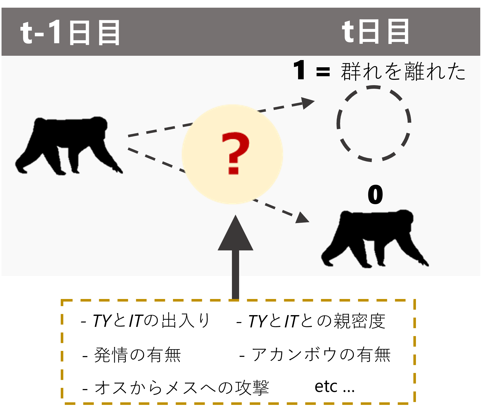

# メスが群れを離れるメカニズム {#c10}    
前章までの分析により、*TY*と*IT*が群れを出入りすることが群れ本体における確認メス割合に影響している可能背うが高いことが分かった。それでは、実際にそれぞれのメスはどのようなメカニズムで群れを出るか否かを決めているのだろうか?  

以下では、メスの毎日の確認状況のデータからメスが群れを離れる要因を探る(図\@ref(fig:female-out))。オスの出入りの他、彼らとの親密度、アカンボウの有無、発情の有無、オスの攻撃などの要因を検討する。  

```{r female-out, out.width = "40%", fig.align = "center", echo = FALSE, fig.cap = "メスの確認状況に影響する要因"}

```
<br/>  

## データの加工  
### オスが群れを離れた日の特定  
まず、TYとITが群れを離れたと考えられる日にちについての列のあるデータフレームを作成する。ここでは、**「1時間以上確認された翌日に群れ本体で一度も確認できないとき」**に群れを離れたとみなす。  

```{r}
## 群れ本体でかつ240分以上追跡した日のデータとオスの確認状況のデータを結合
no_female_over0.5 %>% 
  left_join(TYIT_presence, by = c("date", "groupID")) %>% 
  mutate(date = as_date(date)) %>% 
  select(date, groupID, study_period, TY, IT) -> TYIT_presence_over0.5

## 前日の確認状況の列を作成
TYIT_presence_over0.5 %>% 
  mutate(date_pre = date - 1) %>% 
  select(date, date_pre, groupID) %>% 
  left_join(TYIT_presence_over0.5 %>% 
              select(-groupID, -study_period), by = c("date_pre" = "date")) %>% 
  rename(TY_pre = TY, IT_pre = IT) %>% 
  left_join(TYIT_presence, by = c("date", "groupID")) -> TYIT_presence_pre

## TYとITが「群れを離れた」か否かの列を作成  
TYIT_presence_pre %>% 
  mutate(TY_out = ifelse(is.na(TY_pre), NA,
                         ifelse(TY_pre == 1 & TY == 0,1,0)),
         IT_out = ifelse(is.na(TY_pre), NA,
                         ifelse(IT_pre == 1 & IT == 0,1,0))) -> male_out
```

データは以下の通り。  
```{r}
datatable(male_out)
```

### メスが群れを離れた日の同定  
続いて、各メスが群れを離れたか否かを記したデータフレームを作成する。また、前日のアカンボウの有無や発情の有無などの情報も結合する。      

```{r}
## メスのアカンボウの有無  
infant <- read_csv("../Data/data/others/female_infant.csv")

infant %>% 
  pivot_longer(Kur:Cur,
               names_to = "femaleID",
               values_to = "infant") %>% 
  mutate(date = as_date(date)) -> infant_long

# 群れ本体でかつ240分以上追跡した日のデータとメスの確認状況のデータを結合
no_female_over0.5 %>% 
  select(groupID) %>% 
  left_join(group_all %>% select(-c(TY,IT,KR,LK,KM,TG))) %>% 
  select(-(start:fin)) %>% 
  ## 縦型にする  
  pivot_longer(Kur:Yun,
               names_to = "femaleID",
               values_to = "presence") %>% 
  left_join(att, by = c("femaleID", "study_period")) %>% 
  ## 6歳以上のみ抽出  
  filter(age >= 6) %>% 
  left_join(female_time_long %>% 
              select(date, femaleID, presence) %>%
              rename(time = presence),
            by = c("date","femaleID")) %>% 
  ## 死亡個体は除く  
  filter(is.na(time)| time != "DD") %>% 
  select(-time) %>% 
  mutate(date = as_date(date)) -> female_pre_long

## 発情状態とアカンボウの有無を結合  
female_pre_long %>% 
  mutate(date_pre = date - 1) %>% 
  left_join(female_pre_long %>% 
              select(date, femaleID, presence) %>% 
              rename(presence_pre = presence),
            by = c("date_pre" = "date", "femaleID")) %>% 
  mutate(female_out = ifelse(is.na(presence_pre), NA,
                         ifelse(presence_pre == 1 & presence == 0,1,0))) %>% 
  left_join(female_all %>% 
              select(date, femaleID, rs2) %>% 
              mutate(date = date + 1) %>% 
              rename(rs_pre = rs2), by = c("date", "femaleID")) %>% 
  left_join(infant_long %>% 
              mutate(date = date + 1) %>% 
              rename(infant_pre = infant), by = c("date","femaleID")) %>% 
  ## 前日にメスがいる日のみを抽出
  filter(presence_pre == 1) %>% 
  ## オスの出入りがある期間のみを抽出  
  filter(study_period %in% c("m19", "m20", "m21", "nm20", "nm21")) -> female_out
```

### オスの攻撃頻度  
続いて、オスの攻撃についての情報を加工する。各観察日のそれぞれのメスが攻撃された頻度と、群れ全体で攻撃が確認された頻度について算出する。  

```{r}
### 6歳以上への攻撃のみ  
aggression_all %>% 
  mutate(femaleID = str_replace_all(femaleID, "\\?","")) %>% 
  left_join(att, by = c("femaleID", "study_period")) %>% 
  ## 確実に被攻撃個体が6歳以上であるものを抽出
  filter(age >= 6 | str_detect(femaleID,"multi|many|Multi|KunTrt|Ako,Kil")) %>% 
  group_by(date) %>% 
  summarise(no_agg = length(unique(no))) %>% 
  ungroup() %>% 
  right_join(no_female_over0.5) %>% 
  replace_na(list(no_agg = 0)) %>% 
  mutate(rate_agg_6yo = no_agg*60/dur) %>% 
  select(date, groupID, no_agg, rate_agg_6yo, dur) %>% 
  filter(!str_detect(groupID, "nm")) %>% 
  filter(date >= "2018-10-08") -> agg_rate_6yo

### 全攻撃  
aggression_all %>% 
  group_by(date) %>% 
  summarise(no_agg = length(unique(no))) %>% 
  ungroup() %>% 
  right_join(no_female_over0.5) %>% 
  replace_na(list(no_agg = 0)) %>% 
  mutate(rate_agg_all = no_agg*60/dur) %>% 
  select(date, groupID, no_agg, rate_agg_all, dur) %>% 
  filter(!str_detect(groupID, "nm")) %>% 
  filter(date >= "2018-10-08") -> agg_rate_all

### 個体ごとの被攻撃頻度  
aggression_all %>% 
  left_join(att, by = c("study_period", "femaleID")) %>% 
  filter(!is.na(age)) %>% 
  group_by(date, femaleID) %>% 
  summarise(no_agg = n()) %>% 
  ungroup() %>% 
  complete(date,femaleID) %>% 
  replace_na(list(no_agg = 0)) %>% 
  mutate(study_period = str_c("m",str_sub(year(date),3,4))) %>% 
  left_join(att, by = c("study_period", "femaleID")) %>% 
  ## 6歳以上を抽出  
  filter(!is.na(age)) %>% 
  right_join(no_female_over0.5 %>% select(date, groupID, dur)) %>% 
  filter(!str_detect(study_period,"nm")) %>% 
  mutate(rate_agg = no_agg*60/dur) %>% 
  left_join(group_all %>% 
              select(-c(TY,IT,KR,LK,KM,TG)) %>% 
              select(-c(start:fin)) %>% 
              pivot_longer(Kur:Yun,
                           names_to = "femaleID",
                           values_to = "presence"),
            by = c("date", "femaleID","study_period","groupID")) -> agg_rate_each
```

### 血縁個体が群れを出たか否か  
続いて、各観察日に血縁個体が離れたか否かを求める。ここでは、離れた個体の最大血縁度を算出する。  

```{r}
kin <- read_csv("../Data/data/others/kin.csv")

female_out %>% 
  select(groupID, date, study_period, femaleID, female_out, presence_pre) %>% 
  ## 他のメスのデータを結合  
  left_join(att %>% 
              filter(age >= 6) %>% 
              select(study_period, femaleID) %>% 
              rename(femaleID2 = femaleID),
            by = "study_period") %>% 
  filter(femaleID != femaleID2) %>% 
  ## 他のメスが群れを離れたか否かの列を作成
  left_join(female_out %>% 
              select(groupID, date, femaleID, female_out) %>% 
              rename(female_out2 = female_out,
                     femaleID2 = femaleID),
            by = c("groupID","date", "femaleID2")) %>% 
  replace_na(list(female_out2 = 0)) %>%
  ## 相手のメスとの血縁度を結合  
  left_join(kin, by = c("femaleID", "femaleID2")) %>% 
  filter(female_out2 == 1) %>% 
  ## それぞれの日で離れたメスの最大の血縁度を算出
  group_by(groupID, date, femaleID) %>% 
  summarise(max_kin = max(kin),
            ## 血縁カテゴリーも作成する  
            kin_cat = as.character(max(kin))) -> kin_female_out
```

### 群れ外オス数の算出  
続いて、各観察日の群れ外オス数を算出する。  
```{r}
no_ntm_m19 <- male_19m %>% 
  filter(!(maleID %in% c("TY", "IT", "KR", "LK"))) %>% 
  group_by(date) %>% 
  summarise(no_ntm = sum(presence, na.rm = TRUE))

no_ntm_m20 <- male_20m %>% 
  filter(!(maleID %in% c("TY", "IT", "KR", "LK", "KM", "TG"))) %>% 
  group_by(date) %>% 
  summarise(no_ntm = sum(presence, na.rm = TRUE))

no_ntm_m21 <- male_21m %>% 
  filter(!(maleID %in% c("TY", "IT", "KR", "LK", "KM", "TG"))) %>% 
  group_by(date) %>% 
  summarise(no_ntm = sum(presence, na.rm = TRUE))

sum_ntm <- bind_rows(no_ntm_m19, no_ntm_m20, no_ntm_m21)
```

### 全データの結合   
最後に、全データを結合する。  
```{r}
female_out %>% 
  left_join(no_female_over0.5 %>% 
              select(date, prop_female)  %>% 
              rename(date_pre = date),
            by = c("date_pre")) %>% 
  left_join(male_out %>% select(date, groupID, TY_out, IT_out),
            by = c("date", "groupID")) %>% 
  left_join(agg_rate_6yo %>% 
              select(date, rate_agg_6yo) %>% 
              mutate(date = date + 1) %>% 
              rename(rate_agg_6yo_pre = rate_agg_6yo), by = c("date")) %>% 
  left_join(agg_rate_all %>% 
              select(date, rate_agg_all) %>% 
              mutate(date = date + 1) %>% 
              rename(rate_agg_all_pre = rate_agg_all), by = c("date")) %>% 
  left_join(CSI_TY %>% 
              rename(femaleID = subject) %>% 
              select(femaleID, CSI_TY),
            by = "femaleID") %>% 
  left_join(CSI_IT %>% 
              rename(femaleID = subject) %>% 
              select(femaleID, CSI_IT),
            by = "femaleID") %>% 
  left_join(no_female_over0.5_b %>% 
              select(date, TY, IT) %>% 
              mutate(date = date + 1) %>% 
              rename(TY_pre = TY,
                     IT_pre = IT)) %>% 
  left_join(kin_female_out,
            by = c("groupID","date", "femaleID")) %>% 
  left_join(sum_ntm, by = c("date_pre" = "date")) %>% 
  replace_na(list(max_kin = 0,
                  kin_cat = "no")) %>% 
  mutate(kin_01 = ifelse(max_kin > 0, 1,0)) %>% 
  mutate(kin_cat = as.factor(kin_cat)) %>% 
  group_by(study_period) %>% 
  ## 相対順位を算出  
  mutate(max_rank = max(rank)) %>% 
  ungroup() %>% 
  mutate(rank_scaled = rank/max_rank) -> female_out_final
```

## 基本的な情報  
交尾期/非交尾期または、発情/非発情で群れを離れる頻度(回/10日)を図示すると以下のようになる。非交尾期 < 交尾期・非発情 < 交尾期・発情の順に高くなる。非交尾期にはほとんどないようだ。    
```{r}
female_out_summary <- female_out_final %>% 
  mutate(season = ifelse(str_detect(study_period, "nm"), "nonmating", "mating")) %>% 
  group_by(femaleID, season, rs_pre) %>% 
  summarise(n = n(),
            sum_out = sum(female_out)) %>% 
  replace_na(list(rs_pre = 0)) %>% 
  ungroup() %>% 
  mutate(rate_out = sum_out*10/n)

female_out_summary %>% 
  mutate(rs_pre2 = ifelse(season == "nonmating", "非交尾期",
                          ifelse(season == "mating" & rs_pre == 1, "発情", "非発情"))) %>% 
  mutate(rs_pre2 = as.factor(rs_pre2)) %>% 
  mutate(rs_pre2 = fct_relevel(rs_pre2, "非発情", "発情")) %>% 
  ggplot(aes(x = rs_pre2, y = rate_out))+
  geom_violin(bw = 0.25,
              scale = "width",
              aes(fill = season))+
  geom_beeswarm(shape = 21,
                cex = 1.7,
                alpha = 0.7,
                fill = "white",
                color = "black",
                size = 2)+
  theme_bw(base_size = 15)+
  scale_fill_manual(values = c("orange2", "green4"))+
  labs(x = "", y = "Frequency of leaving troop (times/10 days)") +
  theme(aspect.ratio = 1,
        axis.title.y = element_text(family = "Arial",
                                    size = 12),
        axis.title.x = element_text(family = "Yu Gothic",
                                    size = 15),
        axis.text.x = element_text(family = "Arial",
                                   size = 12),
        axis.text.y = element_text(family = "Arial")) -> p_female_out_rate
  
p_female_out_rate

# ggsave("figures/p_female_out_rate.png",
#        p_female_out_rate, dpi = 600, width = 140, height = 100,
#        units = "mm")
```


## 分析(モデリング)  
以下では、交尾期と非交尾期に分けて分析を行う。また、交尾期については発情メスと非発情メスを分けて分析を行う。分析に含まれるのは、6歳以上でかつTY、ITとのCSIが算出できる個体(= 2019年時点で6歳以上の個体)である。  

ITは2021年は群れから移出してしまっていた。これが結果に影響していないか確かめるため、以下のすべてのモデルについて、<u>2019~2021年の全期間のデータを用いたモデルと、2020年までのデータを用いたモデルの2つを実行する</u>。  

### 交尾期(非発情メス)  
#### データの加工  
まず、データの加工を行う。  
```{r}
female_out_an <- female_out_final %>% 
  filter(!str_detect(study_period, "nm")) %>% 
  filter(rs_pre == "0") %>% 
  ## TYとITとのCSIがないメスは除く  
  drop_na(CSI_TY) %>% 
  mutate(rate_agg_6yo_std = standardize(rate_agg_6yo_pre),
         rate_agg_all_std = standardize(rate_agg_all_pre)) %>% 
  mutate(CSI_TY_std = standardize(CSI_TY),
         CSI_IT_std = standardize(CSI_IT),
         rank_std = standardize(rank_scaled),
         age_std = standardize(age),
         kin_std = standardize(max_kin),
         ntm_std = standardize(no_ntm),
         prop_std = standardize(prop_female)) %>% 
  ## 2021年はIT_outを全て0とする 
  replace_na(list(IT_out = 0, IT_pre = 0)) %>% 
  mutate(date = as_date(date))
```

#### モデリング1    
モデル式は以下の通り。  

説明変数の説明は以下の通り。なお、$i, j, k$はそれぞれデータ番号、日付番号、メスIDの番号を表す。なお、連続変数は全て標準化している。      

- $TY\_out/IT\_out$: TY/ITが群れを離れたか否か  
- $CSI\_TY/CSI\_IT$: 各メスとTY/ITとの親密度  
- $rate\_agg\_all$: 前日の群れ内のオスの攻撃頻度  
- $no_ntm$: 前日の群れ外オス数  
- $infant$: アカンボウの有無    
- $age$: 年齢  
- $rank$: 0から1にスケール化された順位  
- $kin\_01$: 同じ日に群れを離れたメスがいたか否か  
- $study\_period(m19,m20,m21)$: 調査期間  

$$
\begin{aligned}
female\_out_i &\sim Bernoulli(p_i) \\
logit(p_i) = &\beta_0 + \beta_1 \times rate\_agg\_all_i + \beta_2 \times TY\_out_i + \beta_3 \times IT\_out_i + \beta_4 \times CSI\_TY_i + \beta_5 \times CSI\_IT_i + \\
&\beta_6 \times rank_i + \beta_7 \times age_i + \beta_8 \times infant_i + \beta_9 \times TY\_out_i \times CSI\_TY_i + \\
&\beta_{10} \times IT\_out_i \times CSI\_IT_i  + \beta_{11} \times no\_ntm_i + \beta_{12} \times kin_i + \beta_{13} \times m20_i + \beta_{13} \times m21_i +  r_j + \gamma_k\\
r_j &\sim Normal(0, \sigma_r)\\
\gamma_k &\sim Normal(0, \sigma_{\gamma})\\
\beta_0 &\sim student\_t(4,0,20)\\
\beta_{1,2,\dots,12} &\sim student_t(0,4,10)\\
\sigma_{r, \gamma} &\sim student_t(0,4,10)\\
\end{aligned}
$$

モデルは以下のように実行する。**2019~2021年  
```{r}
## 全個体への攻撃  
### 攻撃頻度とオスの出入りの交互作用なし    
m_female_out_an <-  brm(data = female_out_an %>% 
                               mutate(date = as.factor(date)),
                        female_out ~ rate_agg_all_std + TY_out*CSI_TY_std +
                         IT_out*CSI_IT_std + ntm_std + prop_std +
                         infant_pre + age_std + rank_std + kin_01 +
                         study_period + (1|femaleID) + (1|date),
                family = "bernoulli",
                prior = c(prior(student_t(4,0,20),class = Intercept),
                prior(student_t(4,0,10), class = b),
                prior(student_t(4,0,10), class = sd)),
  iter = 11000, warmup = 1000, seed = 223,
  control=list(adapt_delta = 0.999, max_treedepth = 15),
  backend = "cmdstanr",
  file = "model/m_female_out_an")

## 2021年交尾期を除く
female_out_an %>%
  filter(study_period != "m21") %>%
  mutate(CSI_TY_std = standardize(CSI_TY),
         CSI_IT_std = standardize(CSI_IT),
         rank_std = standardize(rank_scaled),
         age_std = standardize(age),
         kin_std = standardize(max_kin),
         ntm_std = standardize(no_ntm),
         prop_std = standardize(prop_female),
         rate_agg_all_std = standardize(rate_agg_all_pre)) %>%
  mutate(date = as.factor(date)) -> female_out_an_no21

m_female_out_an_no21 <-  brm(data = female_out_an_no21,
                       female_out ~ rate_agg_all_std + TY_out*CSI_TY_std +
                         IT_out*CSI_IT_std + ntm_std + prop_std +
                         infant_pre + age_std + rank_std + kin_01 +
                         study_period + (1|femaleID) + (1|date),
                family = "bernoulli",
                prior = c(prior(student_t(4,0,20),class = Intercept),
                prior(student_t(4,0,10), class = b),
                prior(student_t(4,0,10), class = sd)),
  iter = 11000, warmup = 1000, seed = 223,
  control=list(adapt_delta = 0.999, max_treedepth = 15),
  backend = "cmdstanr",
  file = "model/m_female_out_an_no21")
```

##### モデルチェック  
まず、DHARMaパッケージ[@Hartig2022]とDHARMa.helperパッケージ[@Francisco2023]でモデルの前提が満たされているかを確認する。いずれのモデルも特に問題はないよう。 
```{r, fig.height = 4}
## 全期間    
dh_female_out_an <- dh_check_brms(m_female_out_an, quantreg = TRUE)

## 2021年を除く  
dh_female_out_an_no21 <- dh_check_brms(m_female_out_an_no21, quantreg = TRUE)
```
<br/>  

bayesplotパッケージ[@Gabry2022]の`pp_check`関数で、事後分布からの予測分布と実測値の分布を比較しても大きな乖離はない。   
```{r, fig.height = 4.5}
## 全期間    
pp_check(m_female_out_an, ndraws = 100)+
  theme_bw()+
  theme(aspect.ratio = 0.9)

## 2021年を除く  
pp_check(m_female_out_an_no21, ndraws = 100)+
  theme_bw()+
  theme(aspect.ratio = 0.9)
```  
<br/>  

多重共線性のチェックもお個あったが、VIFに問題はない。  
```{r}
## 全期間  
check_collinearity(m_female_out_an)

## 2021年を除く  
check_collinearity(m_female_out_an_no21)
```
<br/>  

Rhatにも問題はなく、収束の問題はないよう。  
```{r, fig.dim = c(8,4)}
## 全期間  
data.frame(Rhat = brms::rhat(m_female_out_an)) %>% 
  ggplot(aes(x = Rhat))+
  geom_histogram(fill = "white",
                 color = "black")+
  theme_bw()+
  theme(aspect.ratio = 1)

## 2021年を除く  
data.frame(Rhat = brms::rhat(m_female_out_an_no21)) %>% 
  ggplot(aes(x = Rhat))+
  geom_histogram(fill = "white",
                 color = "black")+
  theme_bw()+
  theme(aspect.ratio = 1)

```
<br/>  

最後に残差の時系列相関のチェックを行う。  

まず1つ目のモデルについてチェックする。残差の自己相関をプロットすると、明確なパターンは見られなかった。また、Ljung-Box検定で5時点前までの残差との自己相関を検定したところ、有意な自己相関を示したのはMifとTenのみであった。    
```{r, fig.dim = c(10,10)}
res_female_out_an <- female_out_an %>% 
  mutate(resid = dh_female_out_an$scaledResiduals) %>% 
  mutate(date = as_date(date)) %>% 
  group_by(femaleID) %>% 
  complete(date = seq.Date(min(date), max(date), by = "1 day")) %>% 
  ungroup()

females <- unique(female_out_an$femaleID)
acf_female_out_an <- NULL

for(i in seq_along(females)){
  data <- res_female_out_an %>% 
    filter(femaleID == females[i])
  
  out.acf <- acf(data$resid,
                 lag.max = 5,
                 na.action = na.pass,
                 plot = F)
  
  box_test <- Box.test(data$resid, type = "Ljung-Box", lag = 5)
  
  out.df <- data.frame(Timelag = out.acf$lag,
                       Acf = out.acf$acf,
                       femaleID = females[i],
                       p = box_test$p.value)
  
  acf_female_out_an <- bind_rows(acf_female_out_an, out.df)
}

acf_female_out_an %>% 
  mutate(p = str_c("p = ",round(p,2))) %>% 
  ggplot(aes(x = Timelag,
             y = 0))+
  geom_segment(aes(xend = Timelag,
                   yend = Acf))+
  geom_text(aes(x = 4, y = 0.8,
                label = p),
            size = 3.5,
            family = "Arial")+
  theme_bw()+
  theme(aspect.ratio = 1)+
  facet_rep_wrap(~femaleID,
                 repeat.tick.labels = TRUE)
```
<br/>  

2020年までのデータを用いたモデルでは、有意な自己相関がみられたのはHotのみだった。  
```{r, fig.dim = c(10,10)}
res_female_out_an_no21 <- female_out_an_no21 %>% 
  mutate(resid = dh_female_out_an_no21$scaledResiduals) %>% 
  mutate(date = as_date(date)) %>% 
  group_by(femaleID) %>% 
  complete(date = seq.Date(min(date), max(date), by = "1 day")) %>% 
  ungroup()

females <- unique(female_out_an_no21$femaleID)
acf_female_out_an_no21 <- NULL

for(i in seq_along(females)){
  data <- res_female_out_an_no21 %>% 
    filter(femaleID == females[i])
  
  out.acf <- acf(data$resid,
                 lag.max = 5,
                 na.action = na.pass,
                 plot = F)
  
  box_test <- Box.test(data$resid, type = "Ljung-Box", lag = 5)
  
  out.df <- data.frame(Timelag = out.acf$lag,
                       Acf = out.acf$acf,
                       femaleID = females[i],
                       p = box_test$p.value)
  
  acf_female_out_an_no21 <- bind_rows(acf_female_out_an_no21, out.df)
}

acf_female_out_an_no21 %>% 
  mutate(p = str_c("p = ",round(p,2))) %>% 
  ggplot(aes(x = Timelag,
             y = 0))+
  geom_segment(aes(xend = Timelag,
                   yend = Acf))+
  geom_text(aes(x = 4, y = 0.8,
                label = p),
            size = 3.5,
            family = "Arial")+
  theme_bw()+
  theme(aspect.ratio = 1)+
  facet_rep_wrap(~femaleID,
                 repeat.tick.labels = TRUE)
```
<br/>  

`DHARMa`パッケージで調べても有意な時系列相関は検出されなかった。ただし、この分析ではLagが実際の日付をもとに算出されていない可能性が高い。    
```{r, fig.height = 4}
all_test_acf_an <- NULL

for(i in seq_along(females)){
  dh_female_out_an_b <- recalculateResiduals(dh_female_out_an, 
                                             sel = female_out_an$femaleID == females[i])

  test_acf_an <- testTemporalAutocorrelation(dh_female_out_an_b, 
                                             time = female_out_an %>% 
                                                     filter(femaleID == females[i]) %>% 
                                                     .$date,
                                             plot = FALSE)

  df_test_acf_an <- data.frame(femaleID = females[i],
                               p = test_acf_an$p.value)

  all_test_acf_an <- bind_rows(all_test_acf_an, df_test_acf_an)
}

all_test_acf_an
```
<br/>  

2020年までのデータでも同様。  
```{r, fig.height = 4}
all_test_acf_an_no21 <- NULL

for(i in seq_along(females)){
  dh_female_out_an_no21_b <- recalculateResiduals(dh_female_out_an_no21, 
                                                  sel = female_out_an_no21$femaleID == females[i])

  test_acf_an <- testTemporalAutocorrelation(dh_female_out_an_no21_b, 
                                             time = female_out_an_no21 %>% 
                                                     filter(femaleID == females[i]) %>% 
                                                     .$date,
                                             plot = FALSE)

  df_test_acf_an <- data.frame(femaleID = females[i],
                               p = test_acf_an$p.value)

  all_test_acf_an_no21 <- bind_rows(all_test_acf_an_no21, df_test_acf_an)
}

all_test_acf_an_no21
```

##### 結果の確認  
###### 推定された係数  
まずは、全期間のデータを用いたモデルについてみる。太字になっている変数は95%確信区間が0をまたいでおらず、有意な影響があるといえる。  
```{r, echo = FALSE}
model_parameters(m_female_out_an) %>% 
  data.frame() %>% 
  select(1,2,4,5,7,8) %>% 
  mutate("95%CI" = str_c("[",sprintf("%.2f",CI_low),",",sprintf("%.2f",CI_high),"]")) %>% 
  select(c(1,2,7), everything()) %>% 
  select(-CI_low, -CI_high) %>% 
  mutate(Parameter = fct_relevel(Parameter,
                                  "b_Intercept","b_TY_out",
                                  "b_CSI_TY_std","b_TY_out:CSI_TY_std",
                                  "b_IT_out","b_CSI_IT_std","b_IT_out:CSI_IT_std",
                                  "b_rate_agg_all_std", "b_ntm_std",
                                  "b_kin_01", 
                                  "b_rank_std", "b_age_std", "b_infant_pre",
                                  "b_prop_std",
                                  "b_study_periodm20","b_study_periodm21")) %>% 
  arrange(Parameter) %>% 
  mutate(Parameter = str_replace_all(Parameter, c("b_Intercept"="切片",
                                     "b_study_periodm20" = "調査期間(m20 vs m19)",
                                     "b_study_periodm21" = "調査期間(m21 vs m19)",
                                     "^b_TY_out$" = "TYが群れを離れたか \n (vs 否)",
                                     "^b_IT_out$" = "ITが群れを離れたか \n (vs 否)",
                                     "b_infant_pre" = "アカンボウの有無 \n (vs 無)",
                                     "b_rank_std" = "順位",
                                     "b_age_std" = "年齢",
                                     "b_prop_std" = "前日確認したメスの割合",
                                     "b_ntm_std" = "前日の群れ外オス数",
                                     "b_kin_01" = "血縁のメスが群れを離れたか\n(vs 否)",   
                                     "^b_rate_agg_all_std$" = "前日のオスからの攻撃頻度",
                                     "b_CSI_TY_std" = "TYとの親密度(CSI)",
                                     "b_CSI_IT_std" = "ITとの親密度(CSI)",
                                     "b_TY_out:CSI_TY_std" = "TYが群れを離れたか\n ×TYとの親密度",
                                     "b_IT_out:CSI_IT_std" = "ITが群れを離れたか\n ×ITとの親密度"
                                     ))) %>% 
  rename("Explanatory variables"="Parameter") %>% 
  flextable() %>% 
  colformat_double(digits=2) %>% 
  set_table_properties(layout="autofit",width = 0.9) %>% 
  font(part = "header", fontname = "Segoe UI") %>% 
  font(part = "body", j=2:5, fontname = "Segoe UI") %>% 
  font(part = "body", j=1, fontname = "Yu Gothic") %>% 
  bold(j=c(1,2,3),i = c(4,10, 13),bold = TRUE) %>% 
  theme_zebra() %>% 
  align(j=2:5,part = "all",align = "center") -> table_female_out_an

table_female_out_an

# save_as_image(table_female_out_an, "tables/table_female_out_an.tiff",
#               res = 600)
```
<br/>  

続いて、2021年のデータを除いたモデルについて確認する。少しの違いはあるが、ITがかかわる変数については変化がない。  
```{r, echo = FALSE}
model_parameters(m_female_out_an_no21) %>% 
  data.frame() %>% 
  select(1,2,4,5,7,8) %>% 
  mutate("95%CI" = str_c("[",sprintf("%.2f",CI_low),",",sprintf("%.2f",CI_high),"]")) %>% 
  select(c(1,2,7), everything()) %>% 
  select(-CI_low, -CI_high) %>% 
  mutate(Parameter = fct_relevel(Parameter,
                                  "b_Intercept","b_TY_out",
                                  "b_CSI_TY_std","b_TY_out:CSI_TY_std",
                                  "b_IT_out","b_CSI_IT_std","b_IT_out:CSI_IT_std",
                                  "b_rate_agg_all_std", "b_ntm_std",
                                  "b_kin_01", 
                                  "b_rank_std", "b_age_std", "b_infant_pre",
                                  "b_prop_std",
                                  "b_study_periodm20")) %>% 
  arrange(Parameter) %>% 
  mutate(Parameter = str_replace_all(Parameter, c("b_Intercept"="切片",
                                     "b_study_periodm20" = "調査期間(m20 vs m19)",
                                     "b_study_periodm21" = "調査期間(m21 vs m19)",
                                     "^b_TY_out$" = "TYが群れを離れたか \n (vs 否)",
                                     "^b_IT_out$" = "ITが群れを離れたか \n (vs 否)",
                                     "b_infant_pre" = "アカンボウの有無 \n (vs 無)",
                                     "b_rank_std" = "順位",
                                     "b_age_std" = "年齢",
                                     "b_prop_std" = "前日確認したメスの割合",
                                     "b_ntm_std" = "前日の群れ外オス数",
                                     "b_kin_01" = "血縁のメスが群れを離れたか\n(vs 否)",   
                                     "^b_rate_agg_all_std$" = "前日のオスからの攻撃頻度",
                                     "b_CSI_TY_std" = "TYとの親密度(CSI)",
                                     "b_CSI_IT_std" = "ITとの親密度(CSI)",
                                     "b_TY_out:CSI_TY_std" = "TYが群れを離れたか\n ×TYとの親密度",
                                     "b_IT_out:CSI_IT_std" = "ITが群れを離れたか\n ×ITとの親密度"
                                     ))) %>% 
  rename("Explanatory variables"="Parameter") %>% 
  flextable() %>% 
  colformat_double(digits=2) %>% 
  set_table_properties(layout="autofit",width = 0.9) %>% 
  font(part = "header", fontname = "Segoe UI") %>% 
  font(part = "body", j=2:5, fontname = "Segoe UI") %>% 
  font(part = "body", j=1, fontname = "Yu Gothic") %>% 
  bold(j=c(1,2,3),i = c(4, 8, 10),bold = TRUE) %>% 
  theme_zebra() %>% 
  align(j=2:5,part = "all",align = "center") -> table_female_out_an_no21

table_female_out_an_no21

# save_as_image(table_female_out_an_no21, "tables/table_female_out_an_no21.tiff",
#               res = 600)
```
<br/>  

###### 交互作用項の検討  
さらに交互作用項のある変数について検討を行う。  

**全期間のデータを含むモデル**  
以下は、*TY*とのCSIに応じて、*TY*が群れを離れた日に群れを離れる確率が、そうでない日に比べて有意に高いかを調べたものである。Differenceは、Level1とLevel2のログオッズの差(= ログオッズ比)を示す。0より大きければ、*TY*が群れを離れなかった日に比べて、*TY*が群れを離れた日にメスが群れを離れる確率が高かったことを表す。この結果から、おおよそCSIが1.1より大きいメスは*TY*が群れを離れるのと同じ日に群れを離れる確率が有意に上昇することが示された。    

```{r}
estimate_contrasts(m_female_out_an,
                   contrast = "TY_out = c(1,0)",
                   at = "CSI_TY_std = seq(-1,2.5, 0.2)",
                   transform = "none") %>% 
  data.frame() %>% 
  rename(CSI_TY = CSI_TY_std) %>% 
  mutate(CSI_TY = sd(female_out_an$CSI_TY)*CSI_TY + mean(female_out_an$CSI_TY)) %>% 
  select(1:6) %>% 
  mutate(across(where(is.numeric), ~round(.,2)))
```
<br/>  

*IT*についてはこのような傾向はなかった。  
```{r}
estimate_contrasts(m_female_out_an,
                   contrast = "IT_out = c(1,0)",
                   at = "CSI_IT_std = seq(-1,1, 0.2)",
                   transform = "response") %>% 
  data.frame() %>% 
  rename(CSI_IT = CSI_IT_std) %>% 
  mutate(CSI_IT = sd(female_out_an$CSI_IT)*CSI_IT + mean(female_out_an$CSI_IT)) %>% 
  select(1:6) %>% 
  mutate(across(where(is.numeric), ~round(.,2)))
```
<br/>  

**2021年のデータを除く含むモデル**  
CSIが高い個体では、*TY*が群れを離れなかった日に比べて、*TY*が群れを離れた日にメスが群れを離れる確率が高かった。有意なのはCSIが約1.3よりも大きいとき。  
```{r}
estimate_contrasts(m_female_out_an_no21,
                   contrast = "TY_out = c(1,0)",
                   at = "CSI_TY_std = seq(-0.67,3.56, 0.2)",
                   transform = "none") %>% 
  data.frame() %>% 
  rename(CSI_TY = CSI_TY_std) %>% 
  mutate(CSI_TY = sd(female_out_an_no21$CSI_TY)*CSI_TY + mean(female_out_an_no21$CSI_TY)) %>% 
  select(1:6) %>% 
  mutate(across(where(is.numeric), ~round(.,2)))
```
<br/>  

*IT*については、全期間のデータと同様にこのような傾向はなかった。   
```{r}
estimate_contrasts(m_female_out_an_no21,
                   contrast = "IT_out = c(1,0)",
                   at = "CSI_IT_std = seq(-0.664,1, 0.2)",
                   transform = "none") %>% 
  data.frame() %>% 
  rename(CSI_IT = CSI_IT_std) %>% 
  mutate(CSI_IT = sd(female_out_an_no21$CSI_IT)*CSI_IT + mean(female_out_an_no21$CSI_IT)) %>% 
  select(1:6) %>% 
  mutate(across(where(is.numeric), ~round(.,2)))
```
<br/>  

##### 結果の図示  
###### TYの群れへの出入り、CSIとの関連  
まず、*TY*とのCSIに応じてオッズ比(*TY*と同じ日に群れを離れるオッズ/そうでない日に離れるオッズ)の対数をとったものがどのように変わるかを図示する。先ほど示したように、およそCSIが1.3くらいあると同じ日に群れを離れる確率が有意に高くなる。    

```{r, fig.height = 4}
# cont_female_out_an_TYcsi <- estimate_contrasts(m_female_out_an,
#                                                contrast = "TY_out = c(1,0)",
#                                                at = "CSI_TY_std",
#                                                length = 100,
#                                                transform = "none")
# 
# saveRDS(cont_female_out_an_TYcsi, "model/cont_female_out_an_TYcsi.rds")
cont_female_out_an_TYcsi <- readRDS("model/cont_female_out_an_TYcsi.rds")

cont_female_out_an_TYcsi %>% 
  data.frame() %>% 
  rename(CSI_TY = CSI_TY_std) %>% 
  mutate(CSI_TY = sd(female_out_an$CSI_TY)*CSI_TY + mean(female_out_an$CSI_TY)) %>% 
  ggplot(aes(x = CSI_TY, y = Difference))+
  geom_segment(data = CSI_TY,
             aes(xend = CSI_TY, y=-1, yend = 0),
             color = "firebrick3",
             alpha = 0.8, size = 0.4,
             arrow = arrow(length = unit(11, "points"))) +
  geom_line()+
  geom_ribbon(aes(ymin = CI_low, ymax = CI_high),
              alpha = 0.2)+
  geom_hline(aes(yintercept = 0),
             linetype = "dashed",
             color = "grey30",
             linewidth = 1)+
  theme_bw(base_size = 18)+
  theme(aspect.ratio = 1) +
  labs(y = "Log odds ratio", x = expression(paste("CSI with ",italic("TY")))) +
  scale_x_continuous(breaks = seq(0,3.5,0.5))+
  theme(axis.title.y = element_text(family = "Arial"),
        axis.title.x = element_text(family = "Arial",
                                    size = 15),
        axis.text.x = element_text(family = "Arial"),
        axis.text.y = element_text(family = "Arial"),
        aspect.ratio = 1) -> p_female_out_an_TYcsi

p_female_out_an_TYcsi

# ggsave("figures/p_female_out_an_TYcsi.png",p_female_out_an_TYcsi, dpi = 600, units = "mm",
#         width = 100, height = 100)
```
<br/>  

###### ITの群れへの出入り、CSIとの関連  
*IT*とのCSIに応じてオッズ比(*IT*と同じ日に群れを離れるオッズ/そうでない日に離れるオッズ)の対数をとったものがどのように変わるかを図示する。こちらは、いずれのCSIでも有意な効果はないよう。 

```{r, fig.height = 4}
# cont_female_out_an_ITcsi <- estimate_contrasts(m_female_out_an,
#                                                contrast = "IT_out = c(1,0)",
#                                                at = "CSI_IT_std",
#                                                length = 100,
#                                                transform = "none")
# 
# saveRDS(cont_female_out_an_ITcsi, "model/cont_female_out_an_ITcsi.rds")
cont_female_out_an_ITcsi <- readRDS("model/cont_female_out_an_ITcsi.rds")

cont_female_out_an_ITcsi %>% 
  data.frame() %>% 
  rename(CSI_IT = CSI_IT_std) %>% 
  mutate(CSI_IT = sd(female_out_an$CSI_IT)*CSI_IT + mean(female_out_an$CSI_IT)) %>% 
  ggplot(aes(x = CSI_IT, y = Difference))+
  geom_segment(data = CSI_IT,
             aes(xend = CSI_IT, y=-1, yend = 0),
             color = "firebrick3",
             alpha = 0.8, size = 0.4,
             arrow = arrow(length = unit(11, "points"))) +
  geom_line()+
  geom_ribbon(aes(ymin = CI_low, ymax = CI_high),
              alpha = 0.2)+
  geom_hline(aes(yintercept = 0),
             linetype = "dashed",
             color = "grey30",
             linewidth = 1)+
  theme_bw(base_size = 18)+
  theme(aspect.ratio = 1) +
  labs(y = "Log odds ratio", x = expression(paste("CSI with ",italic("IT")))) +
  scale_x_continuous(breaks = seq(0,6,1))+
  scale_y_continuous(breaks = seq(-6,4,2)) +
  theme(axis.title.y = element_text(family = "Arial"),
        axis.title.x = element_text(family = "Arial",
                                    size = 15),
        axis.text.x = element_text(family = "Arial"),
        axis.text.y = element_text(family = "Arial"),
        aspect.ratio = 1) -> p_female_out_an_ITcsi

p_female_out_an_ITcsi

# ggsave("figures/p_female_out_an_ITcsi.png",p_female_out_an_ITcsi, dpi = 600, units = "mm",
#         width = 100, height = 100)
```
<br/>  

2021年を除いたモデルでも同様の傾向。  
```{r, fig.height = 4}
# cont_female_out_an_no21_ITcsi <- estimate_contrasts(m_female_out_an_no21,
#                                                contrast = "IT_out = c(1,0)",
#                                                at = "CSI_IT_std",
#                                                length = 100,
#                                                transform = "none")

# saveRDS(cont_female_out_an_no21_ITcsi, "model/cont_female_out_an_no21_ITcsi.rds")
cont_female_out_an_no21_ITcsi <- readRDS("model/cont_female_out_an_no21_ITcsi.rds")

cont_female_out_an_no21_ITcsi %>% 
  data.frame() %>% 
  rename(CSI_IT = CSI_IT_std) %>% 
  mutate(CSI_IT = sd(female_out_an_no21$CSI_IT)*CSI_IT + mean(female_out_an_no21$CSI_IT)) %>% 
  ggplot(aes(x = CSI_IT, y = Difference))+
  geom_segment(data = CSI_IT,
             aes(xend = CSI_IT, y=-1, yend = 0),
             color = "firebrick3",
             alpha = 0.8, size = 0.4,
             arrow = arrow(length = unit(11, "points"))) +
  geom_line()+
  geom_ribbon(aes(ymin = CI_low, ymax = CI_high),
              alpha = 0.2)+
  geom_hline(aes(yintercept = 0),
             linetype = "dashed",
             color = "grey30",
             linewidth = 1)+
  theme_bw(base_size = 18)+
  theme(aspect.ratio = 1) +
  labs(y = "Log odds ratio", x = expression(paste("CSI with ",italic("IT")))) +
  scale_x_continuous(breaks = seq(0,6,1))+
  scale_y_continuous(breaks = seq(-6,4,2)) +
  theme(axis.title.y = element_text(family = "Arial"),
        axis.title.x = element_text(family = "Arial",
                                    size = 15),
        axis.text.x = element_text(family = "Arial"),
        axis.text.y = element_text(family = "Arial"),
        aspect.ratio = 1) -> p_female_out_an_no21_ITcsi

p_female_out_an_no21_ITcsi

# ggsave("figures/p_female_out_an_no21_ITcsi.png",p_female_out_an_no21_ITcsi, dpi = 600, units = "mm",
#         width = 100, height = 100)
```
<br/>  

###### メス同士の血縁度との関連  
最後に、血縁のメスが群れを離れたか否かとメスが離れる確率についての結果を図示する。血縁のメスが群れを離れるほど、同じ日に群れを離れる確率が高くなることが分かる。  

```{r, fig.height = 4}
emm_female_out_an_kin <- estimate_means(m_female_out_an,
                                        at = "kin_01 = c(0,1)") %>%
  mutate(kin_01 = as.factor(kin_01))

female_out_an %>% 
  mutate(kin_01 = as.factor(kin_01)) %>% 
  group_by(kin_01, femaleID) %>% 
  summarise(prop = mean(female_out)) %>% 
  ungroup() %>% 
  ggplot(aes(x = kin_01, y = prop))+
  geom_count(alpha = 0.5)+
  geom_line(aes(group = femaleID))+
  scale_size(range = c(2,8))+
  theme_bw(base_size = 13)+
  labs(x = "If kin females left the group",
       y = "Probability of female leaving main group",
       color = "Study period",
       fill = "Study period")+
  coord_cartesian(xlim = c(1.2,1.7),
                  ylim = c(0,1))+
  scale_x_discrete(labels = c("No", "Yes")) +
  theme(axis.title.y = element_text(family = "YArial",
                                    size = 12),
        axis.title.x = element_text(family = "Arial", size =12),
        axis.text = element_text(family = "Arial",
                                 size = 12),
        legend.title = element_text(family = "Arial"),
        legend.text = element_text(family = "Arial"),
        aspect.ratio = 0.9) +
  geom_signif(xmin = 1, xmax = 2,
              y_position = 0.95, annotation = "***",
              vjust = 0.01,
              textsize = 5) -> p_female_out_an_kin

p_female_out_an_kin

# ggsave("figures/p_female_out_an_kin.png",p_female_out_an_kin, dpi = 600, units = "mm",
#          width = 120, height = 100)
```
<br/>  

```{r, fig.dim = c(10,8)}
p_female_out_an_TYcsi + p_female_out_an_ITcsi +  p_female_out_an_kin + plot_layout(ncol = 2)
```

#### モデリング2    
先ほどのモデルでは*TY*と*IT*が群れを離れたか否かにだけ注目したが、*TY*と*IT*が群れを離れなかったときには、大きく分けて2つのパターンがある。  

1. 前日にそもそも群れにいなかった(`TY_absent`)    
2. 前日に群れにいて、翌日も群れで確認された(`TY_stay`)    

ここでは、これらの2つも区別したモデルを考える。モデルでは*TY*と*IT*が群れを離れた(`TY/IT_out`)、`TY/IT_absent`、`TY/IT_stay`の3つの水準を持つ変数`TY/IT_state`を作成し、先ほどのモデルの`TY_out`の代わりに入れる。  

以下のように変数を作成する。  
```{r}
female_out_an_b <- female_out_an %>% 
  mutate(TY_state = ifelse(TY_pre == 1 & TY_out == 1, "TY_out",
                           ifelse(TY_pre == 1 & TY_out == 0, "TY_stay",
                                  ifelse(TY_pre == 0, "TY_absent", NA)))) %>% 
  mutate(TY_state = fct_relevel(TY_state, "TY_stay", "TY_absent")) %>%
  mutate(IT_state = ifelse(IT_pre == 1 & IT_out == 1, "IT_out",
                           ifelse(IT_pre == 1 & IT_out == 0, "IT_stay",
                                  ifelse(IT_pre == 0, "IT_absent", NA)))) %>% 
  mutate(IT_state = fct_relevel(IT_state, "IT_stay", "IT_absent"))
```

モデル式と説明変数の説明は以下の通り。なお、$i, j, k$はそれぞれデータ番号、日付番号、メスIDの番号を表す。なお、連続変数は全て標準化している。      

- $TY\_state(TY\_stay, TY\_absent, TY\_out)/IT\_state(IT\_stay, IT\_absent, IT\_out))$: TY/ITの動向   
- $CSI\_TY/CSI\_IT$: 各メスとTY/ITとの親密度  
- $rate\_agg\_all$: 前日の群れ内のオスの攻撃頻度  
- $no_ntm$: 前日の群れ外オス数  
- $infant$: アカンボウの有無    
- $age$: 年齢  
- $rank$: 0から1にスケール化された順位  
- $kin\_01$: 同じ日に群れを離れたメスがいたか否か  
- $study\_period(m19,m20,m21)$: 調査期間  

$$
\begin{aligned}
female\_out_i &\sim Bernoulli(p_i) \\
logit(p_i) = &\beta_0 + \beta_1 \times TY\_out_i + \beta_2 \times TY\_absent_i +  \beta_3 \times CSI\_TY_i + \beta_4 \times TY\_out_i \times CSI\_TY_i + \beta_5 \times TY\_absent_i \times CSI\_TY_i +\\
&\beta_6 \times IT\_out_i + \beta_7 \times IT\_absent_i +  \beta_8 \times CSI\_IT_i + \beta_9 \times IT\_out_i \times CSI\_IT_i + \beta_{10} \times IT\_absent_i \times CSI\_IT_i \\
&\beta_{11} \times age_i + \beta_{12} \times rank_i + \beta_{13} \times rate\_agg\_all_i + \beta_{14} \times no\_ntm_i + \beta_{14} \times infant_i + \beta_{15} \times kin\_01 + \\
&\beta_{16} \times m20_i + \beta_{17} \times m21_i +  r_j + \gamma_k\\
r_j &\sim Normal(0, \sigma_r)\\
\gamma_k &\sim Normal(0, \sigma_{\gamma})\\
\beta_0 &\sim student\_t(4,0,20)\\
\beta_{1,2,\dots,12} &\sim student_t(0,4,10)\\
\sigma_{r, \gamma} &\sim student_t(0,4,10)\\
\end{aligned}
$$

モデルは以下のように実行する。  
```{r}
## オスの攻撃との交互作用なし
m_female_out_an_TYstate <-  brm(data = female_out_an_b %>% 
                                  mutate(date = as.factor(date)),
                         female_out ~ rate_agg_all_std + TY_state*CSI_TY_std +
                         IT_state*CSI_IT_std + ntm_std +  prop_std +
                         infant_pre + age_std + rank_std + kin_01 +
                          study_period + (1|femaleID) + (1|date),
                family = "bernoulli",
                prior = c(prior(student_t(4,0,10),class = Intercept),
                prior(student_t(4,0,10), class = b),
                prior(student_t(4,0,5), class = sd, lb = 0)),
  iter = 11000, warmup = 1000, seed = 223,
  control=list(adapt_delta = 0.999, max_treedepth = 15),
  backend = "cmdstanr",
  file = "model/m_female_out_an_TYstate")

# 2021年を除外
female_out_an_b %>%
  filter(study_period != "m21") %>% 
  mutate(CSI_TY_std = standardize(CSI_TY),
         CSI_IT_std = standardize(CSI_IT),
         rank_std = standardize(rank_scaled),
         age_std = standardize(age),
         kin_std = standardize(max_kin),
         ntm_std = standardize(no_ntm),
         prop_std = standardize(prop_female),
         rate_agg_all_std = standardize(rate_agg_all_pre)) -> female_out_an_b_no21

## TY_stateとCSI_TY_stdのVIFが10以上だったので交互作用を除く  
m_female_out_an_TYstate_no21 <-  brm(data = female_out_an_b_no21 %>% 
                                       mutate(date = as.factor(date)),
                         female_out ~ rate_agg_all_std + TY_state + CSI_TY_std +
                         IT_state*CSI_IT_std + ntm_std +  prop_std + 
                         infant_pre + age_std + rank_std +  + kin_01 +
                          study_period + (1|femaleID) + (1|date),
                family = "bernoulli",
                prior = c(prior(student_t(4,0,20),class = Intercept),
                prior(student_t(4,0,10), class = b),
                prior(student_t(4,0,10), class = sd)),
  iter = 11000, warmup = 1000, seed = 223,
  control=list(adapt_delta = 0.999, max_treedepth = 15),
  backend = "cmdstanr",
  file = "model/m_female_out_an_TYstate_no21")
```

##### モデルチェック  
まず、DHARMaパッケージ[@Hartig2022]とDHARMa.helperパッケージ[@Francisco2023]でモデルの前提が満たされているかを確認する。いずれのモデルでも特に問題はないよう。 
```{r, fig.height = 4}
## 全期間
dh_female_out_an_TYstate <- dh_check_brms(m_female_out_an_TYstate, quantreg = T)

## 2021年を除く  
dh_female_out_an_TYstate_no21 <- dh_check_brms(m_female_out_an_TYstate_no21, quantreg = T)
```
<br/>  

bayesplotパッケージ[@Gabry2022]の`pp_check`関数で、事後分布からの予測分布と実測値の分布を比較しても大きな乖離はない。   
```{r, fig.height = 4.5}
## 全期間
pp_check(m_female_out_an_TYstate, ndraws = 100)+
  theme_bw()+
  theme(aspect.ratio = 0.9)

## 2021年を除く  
pp_check(m_female_out_an_TYstate_no21, ndraws = 100)+
  theme_bw()+
  theme(aspect.ratio = 0.9)
```  
<br/>  

多重共線性のチェックも行ったが、VIFに問題はない。   
```{r}
## 全期間  
check_collinearity(m_female_out_an_TYstate)

## 2021年を除く  
check_collinearity(m_female_out_an_TYstate_no21)
```
<br/>  

Rhatにも問題はなく、収束の問題はないよう。  
```{r, fig.dim = c(8,4)}
data.frame(Rhat = brms::rhat(m_female_out_an_TYstate)) %>% 
  ggplot(aes(x = Rhat))+
  geom_histogram(fill = "white",
                 color = "black")+
  theme_bw()+
  theme(aspect.ratio = 1) 

data.frame(Rhat = brms::rhat(m_female_out_an_TYstate_no21)) %>% 
  ggplot(aes(x = Rhat))+
  geom_histogram(fill = "white",
                 color = "black")+
  theme_bw()+
  theme(aspect.ratio = 1) 
```
<br/>  

最後に残差の時系列相関のチェックを行う。  

まず全期間のデータを用いたモデルでは、残差の自己相関をプロットすると明確なパターンは見られなかった。また、Ljung-Box検定で5時点前までの残差との自己相関を検定したところ、有意な自己相関を示した個体はMifとTenだけだった。  

```{r, fig.dim = c(10,10)}
res_female_out_an_TYstate <- female_out_an_b %>% 
  mutate(resid = dh_female_out_an_TYstate$scaledResiduals) %>% 
  mutate(date = as_date(date)) %>% 
  group_by(femaleID) %>% 
  complete(date = seq.Date(min(date), max(date), by = "1 day")) %>% 
  ungroup()

females <- unique(female_out_an_b$femaleID)
acf_female_out_an_TYstate <- NULL

for(i in seq_along(females)){
  data <- res_female_out_an_TYstate %>% 
    filter(femaleID == females[i])
  
  out.acf <- acf(data$resid,
                 lag.max = 5,
                 na.action = na.pass,
                 plot = F)
  
  box_test <- Box.test(data$resid, type = "Ljung-Box", lag = 5)
  
  out.df <- data.frame(Timelag = out.acf$lag,
                       Acf = out.acf$acf,
                       femaleID = females[i],
                       p = box_test$p.value)
  
  acf_female_out_an_TYstate <- bind_rows(acf_female_out_an_TYstate, out.df)
}

acf_female_out_an_TYstate %>% 
  mutate(p = str_c("p = ",round(p,2))) %>% 
  ggplot(aes(x = Timelag,
             y = 0))+
  geom_segment(aes(xend = Timelag,
                   yend = Acf))+
  geom_text(aes(x = 4, y = 0.8,
                label = p),
            size = 3.5,
            family = "Arial")+
  theme_bw()+
  theme(aspect.ratio = 1)+
  facet_rep_wrap(~femaleID,
                 repeat.tick.labels = TRUE)
```
<br/>  

2021年のデータを除いたモデルでは、AkaとHotのみで自己相関が有意になった。    
```{r, fig.dim = c(10,10)}
res_female_out_an_TYstate_no21 <- female_out_an_b_no21 %>% 
  mutate(resid = dh_female_out_an_TYstate_no21$scaledResiduals) %>% 
  mutate(date = as_date(date)) %>% 
  group_by(femaleID) %>% 
  complete(date = seq.Date(min(date), max(date), by = "1 day")) %>% 
  ungroup()

females <- unique(female_out_an_b_no21$femaleID)
acf_female_out_an_TYstate_no21 <- NULL

for(i in seq_along(females)){
  data <- res_female_out_an_TYstate_no21 %>% 
    filter(femaleID == females[i])
  
  out.acf <- acf(data$resid,
                 lag.max = 5,
                 na.action = na.pass,
                 plot = F)
  
  box_test <- Box.test(data$resid, type = "Ljung-Box", lag = 5)
  
  out.df <- data.frame(Timelag = out.acf$lag,
                       Acf = out.acf$acf,
                       femaleID = females[i],
                       p = box_test$p.value)
  
  acf_female_out_an_TYstate_no21 <- bind_rows(acf_female_out_an_TYstate_no21, out.df)
}

acf_female_out_an_TYstate_no21 %>% 
  mutate(p = str_c("p = ",round(p,2))) %>% 
  ggplot(aes(x = Timelag,
             y = 0))+
  geom_segment(aes(xend = Timelag,
                   yend = Acf))+
  geom_text(aes(x = 4, y = 0.8,
                label = p),
            size = 3.5,
            family = "Arial")+
  theme_bw()+
  theme(aspect.ratio = 1)+
  facet_rep_wrap(~femaleID,
                 repeat.tick.labels = TRUE)
```

##### 結果の確認  
###### 推定された係数  
結果は以下の通り。まずは全期間を含むデータについて確認する。  
```{r, echo = FALSE}
model_parameters(m_female_out_an_TYstate) %>% 
  data.frame() %>% 
  select(1,2,4,5,7,8) %>% 
  mutate("95%CI" = str_c("[",sprintf("%.2f",CI_low),",",sprintf("%.2f",CI_high),"]")) %>%
  select(c(1,2,7), everything()) %>% 
  select(-CI_low, -CI_high) %>% 
  mutate(Parameter = fct_relevel(Parameter, "b_Intercept","b_TY_stateTY_absent",
                                  "b_TY_stateTY_out","b_CSI_TY_std",
                                  "b_TY_stateTY_absent:CSI_TY_std",
                                  "b_TY_stateTY_out:CSI_TY_std",
                                  "b_IT_stateIT_absent","b_IT_stateIT_out",
                                  "b_CSI_IT_std",
                                  "b_IT_stateIT_absent:CSI_IT_std",
                                  "b_IT_stateIT_out:CSI_IT_std",
                                  "b_rate_agg_all_std", "b_ntm_std",
                                  "b_kin_01", 
                                  "b_rank_std", "b_age_std", "b_infant_pre",
                                  "b_prop_std",
                                  "b_study_periodm20","b_study_periodm21")) %>% 
  arrange(Parameter) %>% 
  mutate(Parameter = str_replace_all(Parameter, c("b_Intercept"="切片",
                                     "b_study_periodm20" = "調査期間(m20 vs m19)",
                                     "b_study_periodm21" = "調査期間(m21 vs m19)",
                                      "^b_TY_stateTY_out$"="TY(leave vs stay)",
                                     "^b_TY_stateTY_absent$"="TY(absent vs stay)",
                                     "^b_IT_stateIT_out$"="IT(leave vs stay)",
                                     "^b_IT_stateIT_absent$"="IT(absent vs stay)",
                                     "b_infant_pre" = "アカンボウの有無 \n (vs 無)",
                                     "b_rank_std" = "順位",
                                     "b_age_std" = "年齢",
                                     "b_prop_std" = "前日確認したメスの割合",
                                     "b_ntm_std" = "前日の群れ外オス数",
                                     "b_kin_01" = "血縁のメスが群れを離れたか\n(vs 否)",   
                                     "^b_rate_agg_all_std$" = "前日のオスからの攻撃頻度",
                                    "b_CSI_TY_std" = "TYとの親密度(CSI)",
                                     "b_CSI_IT_std" = "ITとの親密度(CSI)",
                                     "b_TY_stateTY_out:CSI_TY_std" =
                                       "TY(leave vs stay) \n ×TYとの親密度",
                                     "b_TY_stateTY_absent:CSI_TY_std" = 
                                       "TY(absent vs stay) \n ×TYとの親密度",
                                     "b_IT_stateIT_out:CSI_IT_std" =
                                       "IT(leave vs stay) \n ×ITとの親密度",
                                     "b_IT_stateIT_absent:CSI_IT_std" = 
                                       "IT(absent vs stay) \n ×ITとの親密度"))) %>% 
  rename("Explanatory variables"="Parameter") %>% 
  flextable() %>% 
  colformat_double(digits=2) %>% 
  set_table_properties(layout="autofit",width = 1) %>% 
  autofit(add_w = 0.2) %>% 
  font(part = "header", fontname = "Segoe UI") %>% 
  font(part = "body", j=2:5, fontname = "Segoe UI") %>% 
  font(part = "body", j=1, fontname = "Yu Gothic") %>% 
  bold(j=c(1,2,3),i = c(2,3,6,7,14),bold = TRUE) %>% 
  theme_zebra() %>% 
  align(j=2:5,part = "all",align = "center") -> table_female_out_an_TYstate

table_female_out_an_TYstate

# save_as_image(table_female_out_an_TYstate,
#               "tables/table_female_out_an_TYstate.tiff",
#               res = 600)
```
<br/>  

続いて、2021年を除いたモデルの結果を確認する。結果はほとんど変わらず。    
```{r, echo = FALSE}
model_parameters(m_female_out_an_TYstate_no21) %>% 
  data.frame() %>% 
  select(1,2,4,5,7,8) %>% 
  mutate("95%CI" = str_c("[",sprintf("%.2f",CI_low),",",sprintf("%.2f",CI_high),"]")) %>%
  select(c(1,2,7), everything()) %>% 
  select(-CI_low, -CI_high) %>% 
  mutate(Parameter = fct_relevel(Parameter, "b_Intercept","b_TY_stateTY_absent",
                                  "b_TY_stateTY_out","b_CSI_TY_std",
                                  "b_IT_stateIT_absent","b_IT_stateIT_out",
                                  "b_CSI_IT_std",
                                  "b_IT_stateIT_absent:CSI_IT_std",
                                  "b_IT_stateIT_out:CSI_IT_std",
                                  "b_rate_agg_all_std", "b_ntm_std",
                                  "b_kin_01", 
                                  "b_rank_std", "b_age_std", "b_infant_pre",
                                  "b_prop_std",
                                  "b_study_periodm20")) %>% 
  arrange(Parameter) %>% 
  mutate(Parameter = str_replace_all(Parameter, c("b_Intercept"="切片",
                                     "b_study_periodm20" = "調査期間(m20 vs m19)",
                                     "b_study_periodm21" = "調査期間(m21 vs m19)",
                                      "^b_TY_stateTY_out$"="TY(leave vs stay)",
                                     "^b_TY_stateTY_absent$"="TY(absent vs stay)",
                                     "^b_IT_stateIT_out$"="IT(leave vs stay)",
                                     "^b_IT_stateIT_absent$"="IT(absent vs stay)",
                                     "b_infant_pre" = "アカンボウの有無 \n (vs 無)",
                                     "b_rank_std" = "順位",
                                     "b_age_std" = "年齢",
                                     "b_prop_std" = "前日確認したメスの割合",
                                     "b_ntm_std" = "前日の群れ外オス数",
                                     "b_kin_01" = "血縁のメスが群れを離れたか\n(vs 否)",   
                                     "^b_rate_agg_all_std$" = "前日のオスからの攻撃頻度",
                                    "b_CSI_TY_std" = "TYとの親密度(CSI)",
                                     "b_CSI_IT_std" = "ITとの親密度(CSI)",
                                     "b_TY_stateTY_out:CSI_TY_std" =
                                       "TY(leave vs stay) \n ×TYとの親密度",
                                     "b_TY_stateTY_absent:CSI_TY_std" = 
                                       "TY(absent vs stay) \n ×TYとの親密度",
                                     "b_IT_stateIT_out:CSI_IT_std" =
                                       "IT(leave vs stay) \n ×ITとの親密度",
                                     "b_IT_stateIT_absent:CSI_IT_std" = 
                                       "IT(absent vs stay) \n ×ITとの親密度"))) %>% 
  rename("Explanatory variables"="Parameter") %>% 
  flextable() %>% 
  colformat_double(digits=2) %>% 
  set_table_properties(layout="autofit",width = 1) %>% 
  autofit(add_w = 0.2) %>% 
  font(part = "header", fontname = "Segoe UI") %>% 
  font(part = "body", j=2:5, fontname = "Segoe UI") %>% 
  font(part = "body", j=1, fontname = "Yu Gothic") %>% 
  bold(j=c(1,2,3),i = c(2,3,5,12),bold = TRUE) %>% 
  theme_zebra() %>% 
  align(j=2:5,part = "all",align = "center") -> table_female_out_an_TYstate_no21

table_female_out_an_TYstate_no21

# save_as_image(table_female_out_an_TYstate_no21,
#               "tables/table_female_out_an_TYstate_no21.tiff",
#               res = 600)
```
<br/>  

###### 交互作用項の推定  
さらに交互作用項のある変数について検討を行う。  

**全期間を含むモデル**  
以下は、*TY*/*IT*とのCSIの値によって、`TY/IT_state`の各水準のときにおいてメスが群れを離れる確率がどのように違うかを調べたものである。`Difference`はログオッズの差を表している。  

```{r}
cont_female_out_an_TYstate <- estimate_contrasts(
  m_female_out_an_TYstate,
  contrast = "TY_state = c('TY_out','TY_absent','TY_stay')",
  at = "CSI_TY_std = seq(-1,2.5, 0.2)",
  transform = "none") %>% 
  rename(CSI_TY = CSI_TY_std) %>% 
  mutate(CSI_TY = sd(female_out_an_b$CSI_TY)*CSI_TY + mean(female_out_an_b$CSI_TY))
```

<u>*TY*が群れにいなかったときは、*TY*が群れにとどまったときよりメスが群れを離れる確率がおおむね高い</u>。ただし、*TY*とのCSIが高いときと低いときには95%確信区間が0をまたいでしまっている。これは、CSIが低いところと高いところはデータ数が少ないからだと思われる。  

```{r}
### absent vs stay
cont_female_out_an_TYstate %>% 
  data.frame() %>% 
  filter(Level1 == "TY_absent", Level2 == "TY_stay") %>% 
  select(1:6) %>% 
  mutate(across(where(is.numeric), ~round(.,2)))
```
<br/>  

続いて、<u>*TY*が群れを離れたときは、*TY*が群れにとどまったときより、CSIがおよそ**0.6**より高ければメスが群れを離れる確率が有意に高い</u>。  
```{r}
### out vs stay
cont_female_out_an_TYstate %>% 
  data.frame() %>% 
  filter(Level1 == "TY_out", Level2 == "TY_stay") %>% 
  select(1:6) %>% 
  mutate(across(where(is.numeric), ~round(.,2)))
```
<br/>  

最後に、<u>*TY*が群れを離れたときは、*TY*が群れにとどまったときより、CSIがおよそ**1.4**より高ければメスが群れを離れる確率が有意に高い</u>。 
```{r}
### out vs absent 
cont_female_out_an_TYstate %>% 
  data.frame() %>% 
  filter(Level1 == "TY_out", Level2 == "TY_absent") %>% 
  select(1:6) %>% 
  mutate(across(where(is.numeric), ~round(.,2)))
```
<br/>  

続いて、*IT*についても調べる。  
```{r}
cont_female_out_an_ITstate <- estimate_contrasts(
  m_female_out_an_TYstate,
  contrast = "IT_state = c('IT_out','IT_absent','IT_stay')",
  at = "CSI_IT_std = seq(-0.67,3.56, 0.2)",
  transform = "none") %>% 
  rename(CSI_IT = CSI_IT_std) %>% 
  mutate(CSI_IT = sd(female_out_an_b$CSI_IT)*CSI_IT + mean(female_out_an_b$CSI_IT))
```

<u>*IT*が群れにいなかったときは、*IT*が群れにとどまったときよりメスが群れを離れる確率がおおむね高い</u>。   
```{r}
### absent vs stay
cont_female_out_an_ITstate %>% 
  data.frame() %>% 
  filter(Level1 == "IT_absent", Level2 == "IT_stay") %>% 
  select(1:6) %>% 
  mutate(across(where(is.numeric), ~round(.,2)))
```
<br/>  

続いて、<u>*IT*が群れを離れたときと*IT*が群れにいないときは、メスが群れを離れる確率に違いはなかった。</u>  
```{r}
### out vs stay
cont_female_out_an_ITstate %>% 
  data.frame() %>% 
  filter(Level1 == "IT_out", Level2 == "IT_stay") %>% 
  select(1:6) %>% 
  mutate(across(where(is.numeric), ~round(.,2)))
```
<br/>  

最後に、<u>*IT*が群れを離れたときと*IT*が群れにとどまったときは、メスが群れを離れる確率に違いはなかった。</u>  
```{r}
### out vs stay 
cont_female_out_an_ITstate %>% 
  data.frame() %>% 
  filter(Level1 == "IT_out", Level2 == "IT_stay") %>% 
  select(1:6) %>% 
  mutate(across(where(is.numeric), ~round(.,2)))
```
<br/>  

**2021年を除くモデル**  
続いて、2021年を除く結果について調べる。  
```{r}
cont_female_out_an_ITstate_no21 <- estimate_contrasts(
  m_female_out_an_TYstate_no21,
  contrast = "IT_state = c('IT_out','IT_absent','IT_stay')",
  at = "CSI_IT_std = seq(-0.66,3.59, 0.2)",
  transform = "none") %>% 
  rename(CSI_IT = CSI_IT_std) %>% 
  mutate(CSI_IT = sd(female_out_an_b_no21$CSI_IT)*CSI_IT + mean(female_out_an_b_no21$CSI_IT))
```

<u>CSIにかからわず、*IT*が群れにいなかったときは、*IT*が群れにとどまったときよりメスが群れを離れる確率が高い</u>。   
```{r}
### absent vs stay
cont_female_out_an_ITstate_no21 %>% 
  data.frame() %>% 
  filter(Level1 == "IT_absent", Level2 == "IT_stay") %>% 
  select(1:6) %>% 
  mutate(across(where(is.numeric), ~round(.,2)))
```
<br/>  

続いて、<u>*IT*が群れを離れたときと*IT*が群れにいないときは、メスが群れを離れる確率に違いはなかった。</u>   
```{r}
### out vs stay
cont_female_out_an_ITstate_no21 %>% 
  data.frame() %>% 
  filter(Level1 == "IT_out", Level2 == "IT_stay") %>% 
  select(1:6) %>% 
  mutate(across(where(is.numeric), ~round(.,2)))
```
<br/>  

最後に、<u>*IT*が群れを離れたときと*IT*が群れにとどまったときは、メスが群れを離れる確率に違いはなかった。</u>  
```{r}
### out vs stay 
cont_female_out_an_ITstate_no21 %>% 
  data.frame() %>% 
  filter(Level1 == "IT_out", Level2 == "IT_stay") %>% 
  select(1:6) %>% 
  mutate(across(where(is.numeric), ~round(.,2)))
```
<br/>   

##### 結果の図示  
###### TYの動向・ CSIとメスが群れを出る確率の関連  
まずは、`estimate_contrasts`関数を用いて、*TY*とのCSIに応じてオッズ比の対数をとったものがどのように変わるかを図示する。  

```{r, fig.dim = c(12,5)}
# cont_female_out_an_TYstate_b <- estimate_contrasts(m_female_out_an_TYstate,
#                                                    contrast =
#                                             "TY_state = c('TY_out','TY_absent','TY_stay')",
#                                                    at = "CSI_TY_std",
#                                                    length = 70)
# 
# saveRDS(cont_female_out_an_TYstate_b, "model/cont_female_out_an_TYstate_b.rds")
cont_female_out_an_TYstate_b <- readRDS("model/cont_female_out_an_TYstate_b.rds")

cont_female_out_an_TYstate_b %>% 
  data.frame() %>% 
  mutate(type = str_c(Level1, " vs ", Level2)) %>% 
  mutate(type = str_replace_all(type, "TY_", "")) %>% 
  mutate(type = str_replace_all(type, "out", "leave")) %>% 
  mutate(type = fct_relevel(type, "absent vs stay",
                            "leave vs stay", "leave vs absent")) %>% 
  rename(CSI_TY = CSI_TY_std) %>% 
  mutate(CSI_TY = sd(female_out_an$CSI_TY)*CSI_TY + mean(female_out_an$CSI_TY)) %>% 
  ggplot(aes(x = CSI_TY, y = Difference)) +
  geom_hline(aes(yintercept = 0),
             linetype = "dashed",
             color = "grey30",
             linewidth = 0.7)+
  geom_segment(data = CSI_TY %>%
                 expand(data.frame(type = c("absent vs stay",
                                            "leave vs absent",
                                            "leave vs stay")) %>%
                           mutate(type = fct_relevel(type,
                                                     "absent vs stay",
                                                     "leave vs stay",
                                                     "leave vs absent")),
                        nesting(subject, CSI_TY)) %>%
                 mutate(y = c(rep(-0.8,18),
                              rep(-1.35, 18),
                              rep(-1,18))),
             aes(xend = CSI_TY, y= y, yend = -0.02),
             color = "firebrick3",
             alpha = 0.8, size = 0.4,
             arrow = arrow(length = unit(9, "points"))) +
  geom_line(aes(group = type))+
  geom_ribbon(aes(ymin = CI_low, ymax = CI_high, 
                  group = type),
              alpha = 0.2)+
  theme_bw(base_size = 18)+
  theme(aspect.ratio = 1) +
  labs(y = "Log odds ratio", x = expression(paste("CSI with ",italic("TY")))) +
  scale_x_continuous(breaks = seq(0,3.5,0.5))+
  theme(axis.title.y = element_text(family = "Arial"),
        axis.title.x = element_text(family = "Arial",
                                    size = 15),
        axis.text.x = element_text(family = "Arial",
                                   size = 12),
        axis.text.y = element_text(family = "Arial"),
        aspect.ratio = 1,
        strip.background = element_blank(),
        strip.text = element_text(hjust = 0))+
  scale_y_continuous(breaks = seq(-6,12,2))+
  facet_rep_wrap(~type,
                 repeat.tick.labels = TRUE,
                 scales = "free_y") -> p_female_out_an_TYstate_csi

p_female_out_an_TYstate_csi

# ggsave("figures/p_female_out_an_TYstate_csi.png",
#        p_female_out_an_TYstate_csi, dpi = 1000, units = "mm",
#          width = 280, height = 100)

# ggsave("figures/p_female_out_an_TYstate_csi_noarrow.png",
#        p_female_out_an_TYstate_csi, dpi = 1000, units = "mm",
#          width = 280, height = 100)
```
<br/>  

###### ITの動向・ CSIとメスが群れを出る確率の関連  
続いて、`estimate_contrasts`関数を用いて、*IT*とのCSIに応じてオッズ比の対数をとったものがどのように変わるかを図示する。  

```{r, fig.dim = c(12,5)}
# cont_female_out_an_ITstate_b <- estimate_contrasts(
#   m_female_out_an_TYstate,
#   contrast = "IT_state = c('IT_out','IT_absent','IT_stay')",
#   at = "CSI_IT_std",
#   length = 70)
# 
# saveRDS(cont_female_out_an_ITstate_b, "model/cont_female_out_an_ITstate_b.rds")

cont_female_out_an_ITstate_b <- readRDS("model/cont_female_out_an_ITstate_b.rds")

cont_female_out_an_ITstate_b %>% 
  data.frame() %>% 
  mutate(type = str_c(Level1, " vs ", Level2)) %>% 
  mutate(type = str_replace_all(type, "IT_", "")) %>% 
  mutate(type = str_replace_all(type, "out", "leave")) %>% 
  mutate(type = fct_relevel(type, "absent vs stay",
                            "leave vs stay", "leave vs absent")) %>% 
  rename(CSI_IT = CSI_IT_std) %>% 
  mutate(CSI_IT = sd(female_out_an$CSI_IT)*CSI_IT + mean(female_out_an$CSI_IT)) %>% 
  ggplot(aes(x = CSI_IT, y = Difference)) +
  geom_segment(data = CSI_IT %>%
                  expand(data.frame(type = c("absent vs stay",
                                            "leave vs absent",
                                            "leave vs stay")) %>%
                           mutate(type = fct_relevel(type,
                                                     "absent vs stay",
                                                     "leave vs stay",
                                                     "leave vs absent")),
                        nesting(subject, CSI_IT)) %>%
                 mutate(y = c(rep(-0.8,18),
                              rep(-1, 18),
                              rep(-1,18))),
             aes(xend = CSI_IT, y= y, yend = -0.02),
             color = "firebrick3",
             alpha = 0.8, size = 0.4,
             arrow = arrow(length = unit(9, "points"))) +
  geom_line(aes(group = type))+
  geom_ribbon(aes(ymin = CI_low, ymax = CI_high, 
                  group = type),
              alpha = 0.2)+
  geom_hline(aes(yintercept = 0),
             linetype = "dashed",
             color = "grey30",
             linewidth = 1)+
  theme_bw(base_size = 18)+
  theme(aspect.ratio = 1) +
  labs(y = "Log odds ratio", x = expression(paste("CSI with ",italic("IT")))) +
  scale_x_continuous(breaks = seq(0,7,1))+
  theme(axis.title.y = element_text(family = "Arial"),
        axis.title.x = element_text(family = "Arial",
                                    size = 15),
        axis.text.x = element_text(family = "Arial",
                                   size = 12),
        axis.text.y = element_text(family = "Arial"),
        aspect.ratio = 1,
        strip.background = element_blank(),
        strip.text = element_text(hjust = 0))+
  scale_y_continuous(breaks = seq(-6,12,2))+
  facet_rep_wrap(~type,
                 repeat.tick.labels = TRUE,
                 scales = "free_y") -> p_female_out_an_ITstate_csi

p_female_out_an_ITstate_csi

# ggsave("figures/p_female_out_an_ITstate_csi.png",
#        p_female_out_an_ITstate_csi, dpi = 1000, units = "mm",
#          width = 280, height = 100)

# ggsave("figures/p_female_out_an_ITstate_csi_noarrow.png",
#        p_female_out_an_ITstate_csi, dpi = 1000, units = "mm",
#          width = 280, height = 100)
```
<br/>  

2021年を除いたモデルについて図示すると以下のようになる。  
```{r, fig.dim = c(12,5)}
# cont_female_out_an_ITstate_no21_b <- estimate_contrasts(
#   m_female_out_an_TYstate_no21,
#   contrast = "IT_state = c('IT_out','IT_absent','IT_stay')",
#   at = "CSI_IT_std",
#   length = 70)

# saveRDS(cont_female_out_an_ITstate_no21_b, "model/cont_female_out_an_ITstate_no21_b.rds")

cont_female_out_an_ITstate_no21_b <- readRDS("model/cont_female_out_an_ITstate_no21_b.rds")

cont_female_out_an_ITstate_no21_b %>% 
  data.frame() %>% 
  mutate(type = str_c(Level1, " vs ", Level2)) %>% 
  mutate(type = str_replace_all(type, "IT_", "")) %>% 
  mutate(type = str_replace_all(type, "out", "leave")) %>% 
  mutate(type = fct_relevel(type, "absent vs stay",
                            "leave vs stay", "leave vs absent")) %>% 
  rename(CSI_IT = CSI_IT_std) %>% 
  mutate(CSI_IT = sd(female_out_an_b_no21$CSI_IT)*CSI_IT + mean(female_out_an_b_no21$CSI_IT)) %>% 
  ggplot(aes(x = CSI_IT, y = Difference)) +
  geom_segment(data = CSI_IT %>%
                  expand(data.frame(type = c("absent vs stay",
                                            "leave vs absent",
                                            "leave vs stay")) %>%
                           mutate(type = fct_relevel(type,
                                                     "absent vs stay",
                                                     "leave vs stay",
                                                     "leave vs absent")),
                        nesting(subject, CSI_IT)) %>%
                 mutate(y = c(rep(-0.8,18),
                              rep(-1, 18),
                              rep(-1,18))),
             aes(xend = CSI_IT, y= y, yend = -0.02),
             color = "firebrick3",
             alpha = 0.8, size = 0.4,
             arrow = arrow(length = unit(9, "points"))) +
  geom_line(aes(group = type))+
  geom_ribbon(aes(ymin = CI_low, ymax = CI_high, 
                  group = type),
              alpha = 0.2)+
  geom_hline(aes(yintercept = 0),
             linetype = "dashed",
             color = "grey30",
             linewidth = 1)+
  theme_bw(base_size = 18)+
  theme(aspect.ratio = 1) +
  labs(y = "Log odds ratio", x = expression(paste("CSI with ",italic("IT")))) +
  scale_x_continuous(breaks = seq(0,7,1))+
  theme(axis.title.y = element_text(family = "Arial"),
        axis.title.x = element_text(family = "Arial",
                                    size = 15),
        axis.text.x = element_text(family = "Arial",
                                   size = 12),
        axis.text.y = element_text(family = "Arial"),
        aspect.ratio = 1,
        strip.background = element_blank(),
        strip.text = element_text(hjust = 0))+
  scale_y_continuous(breaks = seq(-6,12,2))+
  facet_rep_wrap(~type,
                 repeat.tick.labels = TRUE,
                 scales = "free_y") -> p_female_out_an_no21_ITstate_csi

p_female_out_an_no21_ITstate_csi

# ggsave("figures/p_female_out_an_no21_ITstate_csi.png",
#        p_female_out_an_no21_ITstate_csi, dpi = 1000, units = "mm",
#          width = 280, height = 100)
# 
# ggsave("figures/p_female_out_an_no21_ITstate_csi_noarrow.png",
#        p_female_out_an_no21_ITstate_csi, dpi = 1000, units = "mm",
#          width = 280, height = 100)
```
<br/>  

#### モデリング3 {#s10-2-1-3}     
先ほどのモデルでは*TY*と*IT*が*TY*と*IT*が前日群れにいなかったとき、翌日に彼らが戻ったか否かにかかわらず`absent`に分類していた。以下では、これを更に2つに分類する。  

1. 前日に群れにおらず、翌日もいない(`TY_absent`)     
2. 前日に群れにおらず、翌日に群れで確認された(`TY_return`)      

以下のように変数を作成する。  
```{r}
female_out_an_c <- female_out_an_b %>% 
  mutate(date = as_date(date)) %>% 
  left_join(TYIT_presence_over0.5, by = c("date","groupID","study_period")) %>% 
  replace_na(list(IT = 0)) %>% 
  mutate(TY_state4 = ifelse(TY_pre == 1 & TY == 1, "TY_stay",
                           ifelse(TY_pre == 1 & TY == 0, "TY_out",
                                  ifelse(TY_pre == 0 & TY == 1, "TY_return",
                                         ifelse(TY_pre == 0 & TY == 0, "TY_absent", NA))))) %>% 
  mutate(TY_state4 = fct_relevel(TY_state4, "TY_stay", "TY_absent","TY_return")) %>%
  mutate(IT_state4 = ifelse(IT_pre == 1 & IT == 1, "IT_stay",
                           ifelse(IT_pre == 1 & IT == 0, "IT_out",
                                  ifelse(IT_pre == 0 & IT == 0, "IT_absent",
                                         ifelse(IT_pre == 0 & IT == 1, "IT_return", NA))))) %>% 
  mutate(IT_state4 = fct_relevel(IT_state4, "IT_stay", "IT_absent","IT_return")) 
```

モデルは以下のように実行する。  
```{r}
## オスの攻撃との交互作用なし
m_female_out_an_TY4cat <-  brm(data = female_out_an_c %>% 
                                 mutate(date = as.factor(date)),
                         female_out ~ rate_agg_all_std + TY_state4*CSI_TY_std +
                         IT_state4*CSI_IT_std + ntm_std +  prop_std +
                         infant_pre + age_std + rank_std + kin_01 +
                          study_period + (1|femaleID) + (1|date),
                family = "bernoulli",
                prior = c(prior(student_t(4,0,20),class = Intercept),
                prior(student_t(4,0,10), class = b),
                prior(student_t(4,0,10), class = sd)),
  iter = 11000, warmup = 1000, seed = 223,
  control=list(adapt_delta = 0.999, max_treedepth = 15),
  backend = "cmdstanr",
  file = "model/m_female_out_an_TY4cat")

# 2021年を除外
female_out_an_c %>%
  filter(study_period != "m21") %>% 
  mutate(CSI_TY_std = standardize(CSI_TY),
         CSI_IT_std = standardize(CSI_IT),
         rank_std = standardize(rank_scaled),
         age_std = standardize(age),
         kin_std = standardize(max_kin),
         ntm_std = standardize(no_ntm),
         prop_std = standardize(prop_female),
         rate_agg_all_std = standardize(rate_agg_all_pre)) -> female_out_an_c_no21

## TYstate4とCSI_TY_stdのVIFが高いので交互作用は除く  
m_female_out_an_TY4cat_no21 <-  brm(data = female_out_an_c_no21 %>% 
                                       mutate(date = as.factor(date)),
                         female_out ~ rate_agg_all_std + TY_state4 + CSI_TY_std +
                         IT_state4*CSI_IT_std + ntm_std +  prop_std +
                         infant_pre + age_std + rank_std + kin_01 +
                          study_period + (1|femaleID) + (1|date),
                family = "bernoulli",
                prior = c(prior(student_t(4,0,20),class = Intercept),
                prior(student_t(4,0,10), class = b),
                prior(student_t(4,0,10), class = sd)),
  iter = 11000, warmup = 1000, seed = 223,
  control=list(adapt_delta = 0.999, max_treedepth = 15),
  backend = "cmdstanr",
  file = "model/m_female_out_an_TY4cat_no21")
```

##### モデルチェック  
まず、DHARMaパッケージ[@Hartig2022]とDHARMa.helperパッケージ[@Francisco2023]でモデルの前提が満たされているかを確認する。特に問題はないよう。 
```{r, fig.height = 4}
## 全期間を含む  
dh_female_out_an_TY4cat <- dh_check_brms(m_female_out_an_TY4cat, quantreg = T)

## 2021年を除く  
dh_female_out_an_TY4cat_no21 <- dh_check_brms(m_female_out_an_TY4cat_no21, quantreg = T)
```
<br/>  

bayesplotパッケージ[@Gabry2022]の`pp_check`関数で、事後分布からの予測分布と実測値の分布を比較しても大きな乖離はない。   
```{r, fig.height = 4.5}
## 全期間を含む    
pp_check(m_female_out_an_TY4cat, ndraws = 100)+
  theme_bw()+
  theme(aspect.ratio = 0.9)

## 2021年を除く  
pp_check(m_female_out_an_TY4cat_no21, ndraws = 100)+
  theme_bw()+
  theme(aspect.ratio = 0.9)
```  
<br/>  

多重共線性のチェックもお個あったが、VIFに大きな問題はない。  
```{r}
## 全期間を含む  
check_collinearity(m_female_out_an_TY4cat)

## 2021年を除く  
check_collinearity(m_female_out_an_TY4cat_no21)
```
<br/>  

Rhatにも問題はなく、収束の問題はないよう。  
```{r, fig.dim = c(8,4)}
## 全期間
data.frame(Rhat = brms::rhat(m_female_out_an_TY4cat)) %>% 
  ggplot(aes(x = Rhat))+
  geom_histogram(fill = "white",
                 color = "black")+
  theme_bw()+
  theme(aspect.ratio = 1) 

## 2021年を除く  
data.frame(Rhat = brms::rhat(m_female_out_an_TY4cat_no21)) %>% 
  ggplot(aes(x = Rhat))+
  geom_histogram(fill = "white",
                 color = "black")+
  theme_bw()+
  theme(aspect.ratio = 1) 
```
<br/>  

最後に残差の時系列相関のチェックを行う。  

全期間を含むモデルについて残差の自己相関をプロットすると、明確なパターンは見られなかった。また、Ljung-Box検定で5時点前までの残差との自己相関を検定したところ、有意な自己相関を示した個体はMifとTenのみだった。      
```{r, fig.dim = c(10,10)}
res_female_out_an_TY4cat <- female_out_an_c %>% 
  mutate(resid = dh_female_out_an_TY4cat$scaledResiduals) %>% 
  mutate(date = as_date(date)) %>% 
  group_by(femaleID) %>% 
  complete(date = seq.Date(min(date), max(date), by = "1 day")) %>% 
  ungroup()

females <- unique(female_out_an_c$femaleID)
acf_female_out_an_TY4cat <- NULL

for(i in seq_along(females)){
  data <- res_female_out_an_TY4cat %>% 
    filter(femaleID == females[i])
  
  out.acf <- acf(data$resid,
                 lag.max = 5,
                 na.action = na.pass,
                 plot = F)
  
  box_test <- Box.test(data$resid, type = "Ljung-Box", lag = 5)
  
  out.df <- data.frame(Timelag = out.acf$lag,
                       Acf = out.acf$acf,
                       femaleID = females[i],
                       p = box_test$p.value)
  
  
  acf_female_out_an_TY4cat <- bind_rows(acf_female_out_an_TY4cat, out.df)
}

acf_female_out_an_TY4cat %>% 
  mutate(p = str_c("p = ",round(p,2))) %>% 
  ggplot(aes(x = Timelag,
             y = 0))+
  geom_segment(aes(xend = Timelag,
                   yend = Acf))+
  geom_text(aes(x = 4, y = 0.8,
                label = p),
            size = 3.5,
            family = "Arial")+
  theme_bw()+
  theme(aspect.ratio = 1)+
  facet_rep_wrap(~femaleID,
                 repeat.tick.labels = TRUE)
```
<br/>  

2021年を除くモデルについては、有意な自己相関はAkaとHotのみで見られた。      
```{r, fig.dim = c(10,10)}
res_female_out_an_TY4cat_no21 <- female_out_an_c_no21 %>% 
  mutate(resid = dh_female_out_an_TY4cat_no21$scaledResiduals) %>% 
  mutate(date = as_date(date)) %>% 
  group_by(femaleID) %>% 
  complete(date = seq.Date(min(date), max(date), by = "1 day")) %>% 
  ungroup()

females <- unique(female_out_an_c_no21$femaleID)
acf_female_out_an_TY4cat_no21 <- NULL

for(i in seq_along(females)){
  data <- res_female_out_an_TY4cat_no21 %>% 
    filter(femaleID == females[i])
  
  out.acf <- acf(data$resid,
                 lag.max = 5,
                 na.action = na.pass,
                 plot = F)
  
  box_test <- Box.test(data$resid, type = "Ljung-Box", lag = 5)
  
  out.df <- data.frame(Timelag = out.acf$lag,
                       Acf = out.acf$acf,
                       femaleID = females[i],
                       p = box_test$p.value)
  
  
  acf_female_out_an_TY4cat_no21 <- bind_rows(acf_female_out_an_TY4cat_no21, out.df)
}

acf_female_out_an_TY4cat_no21 %>% 
  mutate(p = str_c("p = ",round(p,2))) %>% 
  ggplot(aes(x = Timelag,
             y = 0))+
  geom_segment(aes(xend = Timelag,
                   yend = Acf))+
  geom_text(aes(x = 4, y = 0.8,
                label = p),
            size = 3.5,
            family = "Arial")+
  theme_bw()+
  theme(aspect.ratio = 1)+
  facet_rep_wrap(~femaleID,
                 repeat.tick.labels = TRUE)
```
<br/>  

###### 推定された係数  
結果は以下の通り。まずは全期間を含むデータについて確認する。  
```{r, echo = FALSE}
model_parameters(m_female_out_an_TY4cat) %>% 
  data.frame() %>% 
  select(1,2,4,5,7,8) %>% 
  mutate("95%CI" = str_c("[",sprintf("%.2f",CI_low),",",sprintf("%.2f",CI_high),"]")) %>%
  select(c(1,2,7), everything()) %>% 
  select(-CI_low, -CI_high) %>% 
  mutate(Parameter = fct_relevel(Parameter, "b_Intercept","b_TY_state4TY_absent",
                                  "b_TY_state4TY_return","b_TY_state4TY_out",
                                  "b_CSI_TY_std",
                                  "b_TY_state4TY_absent:CSI_TY_std",
                                  "b_TY_state4TY_return:CSI_TY_std",
                                  "b_TY_state4TY_out:CSI_TY_std", 
                                  "b_IT_state4IT_absent","b_IT_state4IT_return",
                                  "b_IT_state4IT_out", 
                                  "b_CSI_IT_std",
                                  "b_IT_state4IT_absent:CSI_IT_std",
                                  "b_IT_state4IT_return:CSI_IT_std",
                                  "b_IT_state4IT_out:CSI_IT_std",
                                  "b_rate_agg_all_std", "b_ntm_std",
                                  "b_kin_01", 
                                  "b_rank_std", "b_age_std", "b_infant_pre",
                                  "b_prop_std",
                                  "b_study_periodm20","b_study_periodm21")) %>% 
  arrange(Parameter) %>% 
  mutate(Parameter = str_replace_all(Parameter, c("b_Intercept"="切片",
                                     "b_study_periodm20" = "調査期間(m20 vs m19)",
                                     "b_study_periodm21" = "調査期間(m21 vs m19)",
                                     "^b_TY_state4TY_absent$"="TY(absent vs stay)",
                                     "^b_TY_state4TY_return$"="TY(return vs stay)",
                                     "^b_TY_state4TY_out$"="TY(leave vs stay)",
                                     "^b_IT_state4IT_absent$"="IT(absent vs stay)",
                                     "^b_IT_state4IT_return$"="IT(return vs stay)",
                                     "^b_IT_state4IT_out$"="IT(leave vs stay)",
                                     "b_TY_state4TY_absent:CSI_TY_std" = 
                                       "TY(absent vs stay) \n ×TYとの親密度",
                                     "b_TY_state4TY_return:CSI_TY_std" = 
                                       "TY(return vs stay) \n ×TYとの親密度",
                                     "b_TY_state4TY_out:CSI_TY_std" = 
                                       "TY(leave vs stay) \n ×TYとの親密度",
                                     "b_IT_state4IT_absent:CSI_IT_std" = 
                                       "IT(absent vs stay) \n ×ITとの親密度",
                                     "b_IT_state4IT_return:CSI_IT_std" = 
                                       "IT(return vs stay) \n ×ITとの親密度",
                                     "b_IT_state4IT_out:CSI_IT_std" = 
                                       "IT(leave vs stay) \n ×ITとの親密度",
                                     "b_infant_pre" = "アカンボウの有無 \n (vs 無)",
                                     "b_rank_std" = "順位",
                                     "b_age_std" = "年齢",
                                     "b_prop_std" = "前日確認したメスの割合",
                                     "b_ntm_std" = "前日の群れ外オス数",
                                     "b_kin_01" = "血縁のメスが群れを離れたか\n(vs 否)",   
                                     "^b_rate_agg_all_std$" = "前日のオスからの攻撃頻度",
                                    "b_CSI_TY_std" = "TYとの親密度(CSI)",
                                     "b_CSI_IT_std" = "ITとの親密度(CSI)"))) %>% 
  rename("Explanatory variables"="Parameter") %>% 
  flextable() %>% 
  colformat_double(digits=2) %>% 
  set_table_properties(layout="autofit",width = 1) %>% 
  autofit(add_w = 0.2) %>% 
  font(part = "header", fontname = "Segoe UI") %>% 
  font(part = "body", j=2:5, fontname = "Segoe UI") %>% 
  font(part = "body", j=1, fontname = "Yu Gothic") %>% 
  bold(j=c(1,2,3),i = c(2,4,8, 9, 18),bold = TRUE) %>% 
  theme_zebra() %>% 
  align(j=2:5,part = "all",align = "center") -> table_female_out_an_TY4cat

table_female_out_an_TY4cat

save_as_image(table_female_out_an_TY4cat,
              "tables/table_female_out_an_TY4cat.tiff",
              res = 600)
```
<br/>  

続いて、2021年を除いたモデルの結果を確認する。ITに関する推定結果にわずかな違いがあるよう。ITが群れに戻った時にもメスが群れを離れる確率が有意に増加するよう。      
```{r, echo = FALSE}
model_parameters(m_female_out_an_TY4cat_no21) %>% 
  data.frame() %>% 
  select(1,2,4,5,7,8) %>% 
  mutate("95%CI" = str_c("[",sprintf("%.2f",CI_low),",",sprintf("%.2f",CI_high),"]")) %>%
  select(c(1,2,7), everything()) %>% 
  select(-CI_low, -CI_high) %>% 
  mutate(Parameter = fct_relevel(Parameter, "b_Intercept","b_TY_state4TY_absent",
                                  "b_TY_state4TY_return","b_TY_state4TY_out",
                                  "b_CSI_TY_std",
                                  "b_IT_state4IT_absent","b_IT_state4IT_return",
                                  "b_IT_state4IT_out", 
                                  "b_CSI_IT_std",
                                  "b_IT_state4IT_absent:CSI_IT_std",
                                  "b_IT_state4IT_return:CSI_IT_std",
                                  "b_IT_state4IT_out:CSI_IT_std",
                                  "b_rate_agg_all_std", "b_ntm_std",
                                  "b_kin_01", 
                                  "b_rank_std", "b_age_std", "b_infant_pre",
                                  "b_prop_std",
                                  "b_study_periodm20")) %>% 
  arrange(Parameter) %>% 
  mutate(Parameter = str_replace_all(Parameter, c("b_Intercept"="切片",
                                     "b_study_periodm20" = "調査期間(m20 vs m19)",
                                     "^b_TY_state4TY_absent$"="TY(absent vs stay)",
                                     "^b_TY_state4TY_return$"="TY(return vs stay)",
                                     "^b_TY_state4TY_out$"="TY(leave vs stay)",
                                     "^b_IT_state4IT_absent$"="IT(absent vs stay)",
                                     "^b_IT_state4IT_return$"="IT(return vs stay)",
                                     "^b_IT_state4IT_out$"="IT(leave vs stay)",
                                     "b_TY_state4TY_absent:CSI_TY_std" = 
                                       "TY(absent vs stay) \n ×TYとの親密度",
                                     "b_TY_state4TY_return:CSI_TY_std" = 
                                       "TY(return vs stay) \n ×TYとの親密度",
                                     "b_TY_state4TY_out:CSI_TY_std" = 
                                       "TY(leave vs stay) \n ×TYとの親密度",
                                     "b_IT_state4IT_absent:CSI_IT_std" = 
                                       "IT(absent vs stay) \n ×ITとの親密度",
                                     "b_IT_state4IT_return:CSI_IT_std" = 
                                       "IT(return vs stay) \n ×ITとの親密度",
                                     "b_IT_state4IT_out:CSI_IT_std" = 
                                       "IT(leave vs stay) \n ×ITとの親密度",
                                     "b_infant_pre" = "アカンボウの有無 \n (vs 無)",
                                     "b_rank_std" = "順位",
                                     "b_age_std" = "年齢",
                                     "b_prop_std" = "前日確認したメスの割合",
                                     "b_ntm_std" = "前日の群れ外オス数",
                                     "b_kin_01" = "血縁のメスが群れを離れたか\n(vs 否)",   
                                     "^b_rate_agg_all_std$" = "前日のオスからの攻撃頻度",
                                     "b_CSI_TY_std" = "TYとの親密度(CSI)",
                                     "b_CSI_IT_std" = "ITとの親密度(CSI)"))) %>% 
  rename("Explanatory variables"="Parameter") %>% 
  flextable() %>% 
  colformat_double(digits=2) %>% 
  set_table_properties(layout="autofit",width = 1) %>% 
  autofit(add_w = 0.2) %>% 
  font(part = "header", fontname = "Segoe UI") %>% 
  font(part = "body", j=2:5, fontname = "Segoe UI") %>% 
  font(part = "body", j=1, fontname = "Yu Gothic") %>% 
  bold(j=c(1,2,3),i = c(2,4,6, 7, 13, 15),bold = TRUE) %>% 
  theme_zebra() %>% 
  align(j=2:5,part = "all",align = "center") -> table_female_out_an_TY4cat_no21

table_female_out_an_TY4cat_no21

save_as_image(table_female_out_an_TY4cat_no21,
              "tables/table_female_out_an_TY4cat_no21.tiff",
              res = 600)
```
<br/>  

##### 結果の図示  
###### TYの動向・ CSIとメスが群れを出る確率の関連  
まずは、`estimate_contrasts`関数を用いて、*TY*とのCSIに応じてオッズ比の対数をとったものがどのように変わるかを図示する。  

```{r, fig.dim = c(12,5)}
# cont_female_out_an_TY4cat <- estimate_contrasts(m_female_out_an_TY4cat,
#                                                    at = "CSI_TY_std",
#                                                    length = 50)

# saveRDS(cont_female_out_an_TY4cat, "model/cont_female_out_an_TY4cat.rds")
cont_female_out_an_TY4cat <- readRDS("model/cont_female_out_an_TY4cat.rds")

## メモリの調整  
breaks_fun <- function(x) {
  if (max(abs(x)) > 15) {
    seq(-32, 32, 4)
  } else {
    seq(-14, 14, 2)
  }
}

cont_female_out_an_TY4cat %>% 
  rename(Level1 = Level2, Level2 = Level1) %>% 
  mutate(Difference = -Difference) %>% 
  data.frame() %>% 
  mutate(type = str_c(Level1, " vs ", Level2)) %>% 
  mutate(type = str_replace_all(type, "TY_", "")) %>% 
  mutate(type = str_replace_all(type, "out", "leave"))  %>% 
  rename(CSI_TY = CSI_TY_std) %>% 
  mutate(CSI_TY = sd(female_out_an_c$CSI_TY)*CSI_TY + mean(female_out_an$CSI_TY)) %>% 
  ggplot(aes(x = CSI_TY, y = Difference)) +
  geom_hline(aes(yintercept = 0),
             linetype = "dashed",
             color = "grey30",
             linewidth = 1)+
  geom_segment(data = CSI_TY %>%
                  expand(data.frame(type = c("absent vs stay",
                                            "leave vs absent",
                                            "leave vs stay",
                                            "leave vs return",
                                            "return vs absent",
                                            "return vs stay")) %>%
                           mutate(type = fct_relevel(type,
                                                     "absent vs stay",
                                            "leave vs absent",
                                            "leave vs stay",
                                            "leave vs return",
                                            "return vs absent",
                                            "return vs stay")),
                        nesting(subject, CSI_TY)) %>%
                 mutate(y = c(rep(-0.8,18),
                              rep(-1, 18),
                              rep(-1.3,18),
                              rep(-3,18),
                              rep(-3, 18),
                              rep(-3,18))),
             aes(xend = CSI_TY, y= y, yend = -0.02),
             color = "firebrick3",
             alpha = 0.8, size = 0.4,
             arrow = arrow(length = unit(9, "points"))) +
  geom_line(aes(group = type))+
  geom_ribbon(aes(ymin = -CI_low, ymax = -CI_high, 
                  group = type),
              alpha = 0.2)+
  theme_bw(base_size = 18)+
  theme(aspect.ratio = 1) +
  labs(y = "Log odds ratio", x = expression(paste("CSI with ",italic("TY")))) +
  scale_x_continuous(breaks = seq(0,3.5,0.5))+
  theme(axis.title.y = element_text(family = "Arial"),
        axis.title.x = element_text(family = "Arial",
                                    size = 15),
        axis.text.x = element_text(family = "Arial",
                                   size = 12),
        axis.text.y = element_text(family = "Arial"),
        aspect.ratio = 1,
        strip.background = element_blank(),
        strip.text = element_text(hjust = 0))+
  scale_y_continuous(breaks = breaks_fun)+
  facet_rep_wrap(~type,
                 repeat.tick.labels = TRUE,
                 scales = "free_y") -> p_female_out_an_TY4cat_csi

p_female_out_an_TY4cat_csi

# ggsave("figures/p_female_out_an_TY4cat_csi.png",
#        p_female_out_an_TY4cat_csi, dpi = 1000, units = "mm",
#          width = 280, height = 200)

# ggsave("figures/p_female_out_an_TY4cat_csi_noarrow.png",
#        p_female_out_an_TYstate_csi, dpi = 1000, units = "mm",
#          width = 280, height = 100)
```
<br/>  

###### ITの動向・ CSIとメスが群れを出る確率の関連  
続いて、`estimate_contrasts`関数を用いて、*IT*とのCSIに応じてオッズ比の対数をとったものがどのように変わるかを図示する。  

```{r, fig.dim = c(12,5)}
# cont_female_out_an_IT4cat <- estimate_contrasts(m_female_out_an_TY4cat,
#                                                 contrast = "IT_state4",
#                                                 at = "CSI_IT_std",
#                                                 length = 50)

# saveRDS(cont_female_out_an_IT4cat, "model/cont_female_out_an_IT4cat.rds")

cont_female_out_an_IT4cat <- readRDS("model/cont_female_out_an_IT4cat.rds")

cont_female_out_an_IT4cat %>% 
  data.frame() %>% 
  rename(Level1 = Level2, Level2 = Level1) %>% 
  mutate(Difference = -Difference) %>%
  mutate(type = str_c(Level1, " vs ", Level2)) %>% 
  mutate(type = str_replace_all(type, "IT_", "")) %>% 
  mutate(type = str_replace_all(type, "out", "leave")) %>% 
  rename(CSI_IT = CSI_IT_std) %>% 
  mutate(CSI_IT = sd(female_out_an_c$CSI_IT)*CSI_IT + mean(female_out_an_c$CSI_IT)) %>% 
  ggplot(aes(x = CSI_IT, y = Difference)) +
  geom_segment(data = CSI_IT %>%
                  expand(data.frame(type = c("absent vs stay",
                                            "leave vs absent",
                                            "leave vs stay",
                                            "leave vs return",
                                            "return vs absent",
                                            "return vs stay")) %>%
                           mutate(type = fct_relevel(type,
                                                     "absent vs stay",
                                            "leave vs absent",
                                            "leave vs stay",
                                            "leave vs return",
                                            "return vs absent",
                                            "return vs stay")),
                        nesting(subject, CSI_IT)) %>%
                 mutate(y = c(rep(-0.8,18),
                              rep(-1, 18),
                              rep(-1.3,18),
                              rep(-1.3,18),
                              rep(-1.3, 18),
                              rep(-1.3,18))),
             aes(xend = CSI_IT, y= y, yend = 0),
             color = "firebrick3",
             alpha = 0.8, size = 0.4,
             arrow = arrow(length = unit(9, "points"))) +
  geom_line(aes(group = type))+
  geom_ribbon(aes(ymin = -CI_low, ymax = -CI_high, 
                  group = type),
              alpha = 0.2)+
  geom_hline(aes(yintercept = 0),
             linetype = "dashed",
             color = "grey30",
             linewidth = 1)+
  theme_bw(base_size = 18)+
  theme(aspect.ratio = 1) +
  labs(y = "Log odds ratio", x = expression(paste("CSI with ",italic("IT")))) +
  scale_x_continuous(breaks = seq(0,7,1))+
  theme(axis.title.y = element_text(family = "Arial"),
        axis.title.x = element_text(family = "Arial",
                                    size = 15),
        axis.text.x = element_text(family = "Arial",
                                   size = 12),
        axis.text.y = element_text(family = "Arial"),
        aspect.ratio = 1,
        strip.background = element_blank(),
        strip.text = element_text(hjust = 0))+
  scale_y_continuous(breaks = seq(-6,12,2))+
  facet_rep_wrap(~type,
                 repeat.tick.labels = TRUE,
                 scales = "free_y") -> p_female_out_an_IT4cat_csi

p_female_out_an_IT4cat_csi

# ggsave("figures/p_female_out_an_IT4cat_csi.png",
#        p_female_out_an_IT4cat_csi, dpi = 1000, units = "mm",
#        width = 280, height = 200)

# ggsave("figures/p_female_out_an_IT4cat_csi_noarrow.png",
#        p_female_out_an_IT4cat_csi, dpi = 1000, units = "mm",
#          width = 280, height = 200)
```
<br/>  

2021年のデータを除いたものは以下のようになる。  
```{r, fig.dim = c(12,5)}
# cont_female_out_an_IT4cat_no21 <- estimate_contrasts(m_female_out_an_TY4cat_no21,
#                                                      contrast = "IT_state4",
#                                                      at = "CSI_IT_std",
#                                                      length = 50)

# saveRDS(cont_female_out_an_IT4cat_no21, "model/cont_female_out_an_IT4cat_no21.rds")

cont_female_out_an_IT4cat_no21 <- readRDS("model/cont_female_out_an_IT4cat_no21.rds")

cont_female_out_an_IT4cat_no21 %>% 
  data.frame() %>% 
  rename(Level1 = Level2, Level2 = Level1) %>% 
  mutate(Difference = -Difference) %>%
  mutate(type = str_c(Level1, " vs ", Level2)) %>% 
  mutate(type = str_replace_all(type, "IT_", "")) %>% 
  mutate(type = str_replace_all(type, "out", "leave")) %>% 
  rename(CSI_IT = CSI_IT_std) %>% 
  mutate(CSI_IT = sd(female_out_an_c$CSI_IT)*CSI_IT + mean(female_out_an_c$CSI_IT)) %>% 
  ggplot(aes(x = CSI_IT, y = Difference)) +
  geom_segment(data = CSI_IT %>%
                  expand(data.frame(type = c("absent vs stay",
                                            "leave vs absent",
                                            "leave vs stay",
                                            "leave vs return",
                                            "return vs absent",
                                            "return vs stay")) %>%
                           mutate(type = fct_relevel(type,
                                                     "absent vs stay",
                                            "leave vs absent",
                                            "leave vs stay",
                                            "leave vs return",
                                            "return vs absent",
                                            "return vs stay")),
                        nesting(subject, CSI_IT)) %>%
                 mutate(y = c(rep(-0.8,18),
                              rep(-1, 18),
                              rep(-1.3,18),
                              rep(-1.3,18),
                              rep(-1.3, 18),
                              rep(-1.3,18))),
             aes(xend = CSI_IT, y= y, yend = 0),
             color = "firebrick3",
             alpha = 0.8, size = 0.4,
             arrow = arrow(length = unit(9, "points"))) +
  geom_line(aes(group = type))+
  geom_ribbon(aes(ymin = -CI_low, ymax = -CI_high, 
                  group = type),
              alpha = 0.2)+
  geom_hline(aes(yintercept = 0),
             linetype = "dashed",
             color = "grey30",
             linewidth = 1)+
  theme_bw(base_size = 18)+
  theme(aspect.ratio = 1) +
  labs(y = "Log odds ratio", x = expression(paste("CSI with ",italic("IT")))) +
  scale_x_continuous(breaks = seq(0,7,1))+
  theme(axis.title.y = element_text(family = "Arial"),
        axis.title.x = element_text(family = "Arial",
                                    size = 15),
        axis.text.x = element_text(family = "Arial",
                                   size = 12),
        axis.text.y = element_text(family = "Arial"),
        aspect.ratio = 1,
        strip.background = element_blank(),
        strip.text = element_text(hjust = 0))+
  scale_y_continuous(breaks = seq(-6,12,2))+
  facet_rep_wrap(~type,
                 repeat.tick.labels = TRUE,
                 scales = "free_y") -> p_female_out_an_IT4cat_csi_no21

p_female_out_an_IT4cat_csi_no21

# ggsave("figures/p_female_out_an_IT4cat_csi_no21.png",
#        p_female_out_an_IT4cat_csi_no21, dpi = 1000, units = "mm",
#        width = 280, height = 200)
# 
# ggsave("figures/p_female_out_an_IT4cat_csi_no21_noarrow.png",
#        p_female_out_an_IT4cat_csi_no21, dpi = 1000, units = "mm",
#          width = 280, height = 200)
```


### 交尾期(発情メス)  
続いて、発情メスについて分析を行う。  

#### データの加工  
```{r}
female_out_es <- female_out_final %>% 
  filter(!str_detect(study_period, "nm")) %>% 
  filter(rs_pre == "1") %>% 
  ## TYとITとのCSIがないメスは除く  
  drop_na(CSI_TY) %>% 
  mutate(rate_agg_6yo_std = standardize(rate_agg_6yo_pre),
         rate_agg_all_std = standardize(rate_agg_all_pre)) %>% 
  mutate(CSI_TY_std = standardize(CSI_TY),
         CSI_IT_std = standardize(CSI_IT),
         rank_std = standardize(rank_scaled),
         age_std = standardize(age),
         kin_std = standardize(max_kin),
         ntm_std = standardize(no_ntm),
         prop_std = standardize(prop_female)) %>% 
  mutate(date = as.factor(date)) %>% 
  ## 2021年はIT_outを全て0とする 
  replace_na(list(IT_out = 0, IT_pre = 0))
```

#### モデリング1    
モデル式は非発情メスと同様である。  

モデルは以下のように実行する。  
```{r} 
m_female_out_es <-  brm(data = female_out_es,
                        female_out ~ rate_agg_all_std + TY_out*CSI_TY_std + prop_std + 
                         IT_out*CSI_IT_std  + age_std + rank_std + kin_01 + ntm_std + 
                          study_period + (1|femaleID) + (1|date),
                family = "bernoulli",
                prior = c(prior(student_t(4,0,20),class = Intercept),
                prior(student_t(4,0,10), class = b),
                prior(student_t(4,0,10), class = sd)),
  iter = 11000, warmup = 1000, seed = 223,
  control=list(adapt_delta = 0.999, max_treedepth = 15),
  backend = "cmdstanr",
  file = "model/m_female_out_es")

## 2021交尾期を除く  
female_out_es %>%
  filter(study_period != "m21") %>%
  mutate(CSI_TY_std = standardize(CSI_TY),
         CSI_IT_std = standardize(CSI_IT),
         rank_std = standardize(rank_scaled),
         age_std = standardize(age),
         kin_std = standardize(max_kin),
         ntm_std = standardize(no_ntm),
         prop_std = standardize(prop_female),
         rate_agg_all_std = standardize(rate_agg_all_pre),
         ntm_std = standardize(no_ntm)) %>%
  mutate(date = as.factor(date)) -> female_out_es_no21

m_female_out_es_bf21 <-  brm(data = female_out_es_no21,
                        female_out ~ rate_agg_all_std + TY_out*CSI_TY_std + prop_std +
                         IT_out*CSI_IT_std  + age_std + rank_std + kin_01 + ntm_std +
                          study_period + (1|femaleID) + (1|date),
                family = "bernoulli",
                prior = c(prior(student_t(4,0,40),class = Intercept),
                prior(student_t(4,0,10), class = b),
                prior(student_t(4,0,10), class = sd)),
  iter = 11000, warmup = 1000, seed = 124,
  control=list(adapt_delta = 0.999, max_treedepth = 15),
  backend = "cmdstanr",
  file = "model/m_female_out_es_bf21")
```

##### モデルチェック  
まず、DHARMaパッケージ[@Hartig2022]とDHARMa.helperパッケージ[@Francisco2023]でモデルの前提が満たされているかを確認する。特に問題はないよう。 
```{r, fig.height = 4}
## 全期間   
dh_female_out_es <- dh_check_brms(m_female_out_es)

## 2021年を除く  
dh_female_out_es_bf21 <- dh_check_brms(m_female_out_es_bf21)
```
<br/>  

bayesplotパッケージ[@Gabry2022]の`pp_check`関数で、事後分布からの予測分布と実測値の分布を比較しても大きな乖離はない。   
```{r, fig.height = 4.5}
## 全期間   
pp_check(m_female_out_es, ndraws = 100)+
  theme_bw()+
  theme(aspect.ratio = 0.9)

## 2021年を除く  
pp_check(m_female_out_es_bf21, ndraws = 100)+
  theme_bw()+
  theme(aspect.ratio = 0.9)
```  
<br/>  

多重共線性のチェックもお個あったが、VIFに問題はない。  
```{r}
## 全期間  
check_collinearity(m_female_out_es)

## 2021年を除く  
check_collinearity(m_female_out_es_bf21)
```
<br/>  

Rhatにも問題はなく、収束の問題はないよう。  
```{r, fig.dim = c(8,4)}
## 全期間   
data.frame(Rhat = brms::rhat(m_female_out_es)) %>% 
  ggplot(aes(x = Rhat))+
  geom_histogram(fill = "white",
                 color = "black")+
  theme_bw()+
  theme(aspect.ratio = 1) 

## 2021年を除く  
data.frame(Rhat = brms::rhat(m_female_out_es_bf21)) %>% 
  ggplot(aes(x = Rhat))+
  geom_histogram(fill = "white",
                 color = "black")+
  theme_bw()+
  theme(aspect.ratio = 1) 
```
<br/>  

最後に残差の時系列相関のチェックを行う。  


まず全期間のデータを調べた。残差の自己相関をプロットすると、明確なパターンは見られなかった。また、Ljung-Box検定で3時点前(発情時のデータは少ないため、4時点以降だとデータがない個体が多い)までの残差との自己相関を検定したところ、有意な自己相関を示した個体はKit,Meiのみだった。    
```{r, fig.dim = c(10,10)}
res_female_out_es <- female_out_es %>% 
  mutate(resid = dh_female_out_es$scaledResiduals) %>% 
  mutate(date = as_date(date)) %>% 
  group_by(femaleID) %>% 
  complete(date = seq.Date(min(date), max(date), by = "1 day")) %>% 
  ungroup()

females <- unique(female_out_es$femaleID)
acf_female_out_es <- NULL

for(i in seq_along(females)){
  data <- res_female_out_es %>% 
    filter(femaleID == females[i])
  
   out.acf <- acf(data$resid,
                 lag.max = 5,
                 na.action = na.pass,
                 plot = F)
  
  box_test <- Box.test(data$resid, type = "Ljung-Box", lag = 3)
  
  out.df <- data.frame(Timelag = out.acf$lag,
                       Acf = out.acf$acf,
                       femaleID = females[i],
                       p = box_test$p.value)
  
  acf_female_out_es <- bind_rows(acf_female_out_es, out.df)
}

acf_female_out_es %>% 
  mutate(p = str_c("p = ",round(p,2))) %>% 
  ggplot(aes(x = Timelag,
             y = 0))+
  geom_segment(aes(xend = Timelag,
                   yend = Acf))+
  geom_text(aes(x = 4, y = 0.8,
                label = p),
            size = 3.5,
            family = "Arial")+
  theme_bw()+
  theme(aspect.ratio = 1)+
  facet_rep_wrap(~femaleID,
                 repeat.tick.labels = TRUE)
```
<br/>  

2021年を除いたモデルについても見てみる。有意な自己相関を示した個体はMif,Malだけだった。   
```{r, fig.dim = c(10,10)}
res_female_out_es_bf21 <- female_out_es_no21 %>% 
  mutate(resid = dh_female_out_es_bf21$scaledResiduals) %>% 
  mutate(date = as_date(date)) %>% 
  group_by(femaleID) %>% 
  complete(date = seq.Date(min(date), max(date), by = "1 day")) %>% 
  ungroup()

females <- unique(female_out_es_no21$femaleID)
acf_female_out_es_bf21 <- NULL

for(i in seq_along(females)){
  data <- res_female_out_es_bf21 %>% 
    filter(femaleID == females[i])
  
   out.acf <- acf(data$resid,
                 lag.max = 5,
                 na.action = na.pass,
                 plot = F)
  
  box_test <- Box.test(data$resid, type = "Ljung-Box", lag = 3)
  
  out.df <- data.frame(Timelag = out.acf$lag,
                       Acf = out.acf$acf,
                       femaleID = females[i],
                       p = box_test$p.value)
  
  acf_female_out_es_bf21 <- bind_rows(acf_female_out_es_bf21, out.df)
}

acf_female_out_es_bf21 %>% 
  mutate(p = str_c("p = ",round(p,2))) %>% 
  ggplot(aes(x = Timelag,
             y = 0))+
  geom_segment(aes(xend = Timelag,
                   yend = Acf))+
  geom_text(aes(x = 4, y = 0.8,
                label = p),
            size = 3.5,
            family = "Arial")+
  theme_bw()+
  theme(aspect.ratio = 1)+
  facet_rep_wrap(~femaleID,
                 repeat.tick.labels = TRUE)
```
<br/>  


##### 結果の確認  
###### 推定された係数  
結果は以下の通り。有意な変数は一つもなかった。  
```{r, echo = FALSE}
model_parameters(m_female_out_es) %>% 
  data.frame() %>% 
  select(1,2,4,5,7,8) %>% 
  mutate("95%CI" = str_c("[",sprintf("%.2f",CI_low),",",sprintf("%.2f",CI_high),"]")) %>% 
  select(c(1,2,7), everything()) %>% 
  select(-CI_low, -CI_high) %>% 
  mutate(Parameter = fct_relevel(Parameter,
                                  "b_Intercept","b_TY_out",
                                  "b_CSI_TY_std","b_TY_out:CSI_TY_std",
                                  "b_IT_out","b_CSI_IT_std","b_IT_out:CSI_IT_std",
                                  "b_rate_agg_all_std", "b_ntm_std",
                                  "b_kin_01", 
                                  "b_rank_std", "b_age_std", "b_prop_std",
                                  "b_study_periodm20","b_study_periodm21")) %>% 
  arrange(Parameter) %>% 
  mutate(Parameter = str_replace_all(Parameter, c("b_Intercept"="切片",
                                     "b_study_periodm20" = "調査期間(m20 vs m19)",
                                     "b_study_periodm21" = "調査期間(m21 vs m19)",
                                     "^b_TY_out$" = "TYが群れを離れたか \n (vs 否)",
                                     "^b_IT_out$" = "ITが群れを離れたか \n (vs 否)",
                                     "b_infant_pre" = "アカンボウの有無 \n (vs 無)",
                                     "b_ntm_std" = "前日の群れ外オス数",
                                     "b_rank_std" = "順位",
                                     "b_age_std" = "年齢",
                                     "b_kin_01" = "血縁のメスが群れを離れたか", 
                                     "^b_rate_agg_all_std$" = "前日のオスからの攻撃頻度",
                                     "b_prop_std" = "前日に確認されたメスの割合", 
                                     "b_CSI_TY_std" = "TYとの親密度(CSI)",
                                     "b_CSI_IT_std" = "ITとの親密度(CSI)",
                                     "b_TY_out:CSI_TY_std" = "TYが群れを離れたか\n ×TYとの親密度",
                                     "b_IT_out:CSI_IT_std" = "ITが群れを離れたか\n ×ITとの親密度"
                                     ))) %>% 
  rename("Explanatory variables"="Parameter") %>% 
  flextable() %>% 
  colformat_double(digits=2) %>% 
  set_table_properties(layout="autofit",width = 0.9) %>% 
  font(part = "header", fontname = "Segoe UI") %>% 
  font(part = "body", j=2:5, fontname = "Segoe UI") %>% 
  font(part = "body", j=1, fontname = "Yu Gothic") %>% 
  theme_zebra() %>% 
  align(j=2:5,part = "all",align = "center") -> table_female_out_es

table_female_out_es
 
# save_as_image(table_female_out_es, "tables/table_female_out_es.tiff",
#               res = 600)
```
<br/>  

2021年を除いたモデルでも同様。ただし、かなりデータの推定幅が大きいようだ。  
```{r, echo = FALSE}
model_parameters(m_female_out_es_bf21) %>% 
  data.frame() %>% 
  select(1,2,4,5,7,8) %>% 
  mutate("95%CI" = str_c("[",sprintf("%.2f",CI_low),",",sprintf("%.2f",CI_high),"]")) %>% 
  select(c(1,2,7), everything()) %>% 
  select(-CI_low, -CI_high) %>% 
  mutate(Parameter = fct_relevel(Parameter,
                                  "b_Intercept","b_TY_out",
                                  "b_CSI_TY_std","b_TY_out:CSI_TY_std",
                                  "b_IT_out","b_CSI_IT_std","b_IT_out:CSI_IT_std",
                                  "b_rate_agg_all_std", "b_ntm_std",
                                  "b_kin_01", 
                                  "b_rank_std", "b_age_std", "b_prop_std",
                                  "b_study_periodm20")) %>% 
  arrange(Parameter) %>% 
  mutate(Parameter = str_replace_all(Parameter, c("b_Intercept"="切片",
                                     "b_study_periodm20" = "調査期間(m20 vs m19)",
                                     "b_study_periodm21" = "調査期間(m21 vs m19)",
                                     "^b_TY_out$" = "TYが群れを離れたか \n (vs 否)",
                                     "^b_IT_out$" = "ITが群れを離れたか \n (vs 否)",
                                     "b_infant_pre" = "アカンボウの有無 \n (vs 無)",
                                     "b_ntm_std" = "前日の群れ外オス数",
                                     "b_rank_std" = "順位",
                                     "b_age_std" = "年齢",
                                     "b_kin_01" = "血縁のメスが群れを離れたか", 
                                     "^b_rate_agg_all_std$" = "前日のオスからの攻撃頻度",
                                     "b_CSI_TY_std" = "TYとの親密度(CSI)",
                                     "b_CSI_IT_std" = "ITとの親密度(CSI)",
                                     "b_prop_std" = "前日に確認されたメスの割合", 
                                     "b_TY_out:CSI_TY_std" = "TYが群れを離れたか\n ×TYとの親密度",
                                     "b_IT_out:CSI_IT_std" = "ITが群れを離れたか\n ×ITとの親密度"
                                     ))) %>% 
  rename("Explanatory variables"="Parameter") %>% 
  flextable() %>% 
  colformat_double(digits=2) %>% 
  set_table_properties(layout="autofit",width = 0.9) %>% 
  font(part = "header", fontname = "Segoe UI") %>% 
  font(part = "body", j=2:5, fontname = "Segoe UI") %>% 
  font(part = "body", j=1, fontname = "Yu Gothic") %>% 
  theme_zebra() %>% 
  align(j=2:5,part = "all",align = "center") -> table_female_out_es_bf21

table_female_out_es_bf21

# save_as_image(table_female_out_es, "tables/table_female_out_es.tiff",
#               res = 600)
```
<br/>  

###### 交互作用項の検討  
**全期間を含むモデル**  
さらに交互作用項のある変数について検討を行う。以下は、*TY*とのCSIに応じて、*TY*が群れを離れた日に群れを離れる確率が、そうでない日に比べて有意に高いかを調べたものである。Differenceはログオッズ比を示し、0より大きければ、*TY*が群れを離れなかった日に比べて、*TY*が群れを離れた日にメスが群れを離れる確率が高かったことを表す。この結果から、いずれのCSIでも有意な差はなかったことが分かった。      

```{r}
estimate_contrasts(m_female_out_es,
                   contrast = "TY_out = c(1,0)",
                   at = "CSI_TY_std = seq(-0.85,2.70, 0.2)",
                   transform = "none") %>% 
  data.frame() %>% 
  rename(CSI_TY = CSI_TY_std) %>% 
  mutate(CSI_TY = sd(female_out_es$CSI_TY)*CSI_TY + mean(female_out_es$CSI_TY)) %>% 
  select(1:6) %>% 
  mutate(across(where(is.numeric), ~round(.,2)))
```
<br/>  

*IT*については、CSIが高い個体(> 1.5くらい)はITが群れから離れない日の方がそうでない日よりもメスが群れを離れる可能性が有意に高くなることが分かった。    
```{r}
estimate_contrasts(m_female_out_es,
                   contrast = "IT_out = c(1,0)",
                   at = "CSI_IT_std = seq(-0.67,3.08, 0.2)",
                   transform = "none") %>% 
  data.frame() %>% 
  rename(CSI_IT = CSI_IT_std) %>% 
  mutate(CSI_IT = sd(female_out_es$CSI_IT)*CSI_IT + mean(female_out_es$CSI_IT)) %>% 
  select(1:6) %>% 
  mutate(across(3:6, ~round(.,2)))
```
<br/>  

**2021年を除くモデル**   
2021年を除いたモデルでも、*TY*については同様。  
```{r}
estimate_contrasts(m_female_out_es_bf21,
                   contrast = "TY_out = c(1,0)",
                   at = "CSI_TY_std = seq(-1.34,7.02, 0.2)",
                   transform = "none") %>% 
  data.frame() %>% 
  rename(CSI_TY = CSI_TY_std) %>% 
  mutate(CSI_TY = sd(female_out_es$CSI_TY)*CSI_TY + mean(female_out_es$CSI_TY)) %>% 
  select(1:6) %>% 
  mutate(across(where(is.numeric), ~round(.,2)))
```
<br/>  

*IT*についても有意な結果は得られなかった。    
```{r}
estimate_contrasts(m_female_out_es_bf21,
                   contrast = "IT_out = c(1,0)",
                   at = "CSI_IT_std = seq(-0.66,2.74,0.2)",
                   transform = "none") %>% 
  data.frame() %>% 
  rename(CSI_IT = CSI_IT_std) %>% 
  mutate(CSI_IT = sd(female_out_es$CSI_IT)*CSI_IT + mean(female_out_es$CSI_IT)) %>% 
  select(1:6) %>% 
  mutate(across(3:6, ~round(.,2)))
```
<br/>  


##### 結果の図示  
###### TYの群れへの出入り、CSIとの関連  
まず、*TY*とのCSIに応じてオッズ比(*TY*と同じ日に群れを離れるオッズ/そうでない日に離れるオッズ)の対数をとったものがどのように変わるかを図示する。特に有意な効果はない。  

```{r, fig.height = 4}
# cont_female_out_es_TYcsi <- estimate_contrasts(m_female_out_es,
#                                                contrast = "TY_out = c(1,0)",
#                                                at = "CSI_TY_std",
#                                                length = 50,
#                                                transform = "none")
# 
# saveRDS(cont_female_out_es_TYcsi, "model/cont_female_out_es_TYcsi.rds")
cont_female_out_es_TYcsi <- readRDS("model/cont_female_out_es_TYcsi.rds")

cont_female_out_es_TYcsi %>% 
  data.frame() %>% 
  rename(CSI_TY = CSI_TY_std) %>% 
  mutate(CSI_TY = sd(female_out_es$CSI_TY)*CSI_TY + mean(female_out_es$CSI_TY)) %>% 
  ggplot(aes(x = CSI_TY, y = Difference))+
  geom_segment(data = CSI_TY,
             aes(xend = CSI_TY, y=-2, yend = 0),
             color = "firebrick3",
             alpha = 0.8, size = 0.6,
             arrow = arrow(length = unit(11, "points"))) +
  geom_line()+
  geom_ribbon(aes(ymin = CI_low, ymax = CI_high),
              alpha = 0.1)+
  geom_hline(aes(yintercept = 0),
             linetype = "dashed",
             color = "grey30",
             linewidth = 1)+
  theme_bw(base_size = 18)+
  theme(aspect.ratio = 1) +
  labs(y = "Log odds ratio", x = expression(paste("CSI with ",italic("TY")))) +
  scale_x_continuous(breaks = seq(0,3.5,0.5))+
  theme(axis.title.y = element_text(family = "Arial"),
        axis.title.x = element_text(family = "Arial",
                                    size = 15),
        axis.text.x = element_text(family = "Arial"),
        axis.text.y = element_text(family = "Arial"),
        aspect.ratio = 1) -> p_female_out_es_TYcsi

p_female_out_es_TYcsi

# ggsave("figures/p_female_out_es_TYcsi.png",p_female_out_es_TYcsi, dpi = 600, units = "mm",
#         width = 100, height = 100)
```
<br/>  

###### ITの群れへの出入り、CSIとの関連  
続いて、*IT*とのCSIに応じてオッズ比(*IT*と同じ日に群れを離れるオッズ/そうでない日に離れるオッズ)の対数をとったものがどのように変わるかを図示する。こちらはCSIが大きいメスは逆にITが群れを離れた日にメスが群れを離れる確率の方が低くなることが示唆された。ただし、これはおそらく2021年交尾期の`IT_out`が全て0になっていることによると思われる?      

```{r, fig.height = 4}
# cont_female_out_es_ITcsi <- estimate_contrasts(m_female_out_es,
#                                                contrast = "IT_out = c(1,0)",
#                                                at = "CSI_IT_std",
#                                                length = 50,
#                                                transform = "none")
# 
# saveRDS(cont_female_out_es_ITcsi, "model/cont_female_out_es_ITcsi.rds")
cont_female_out_es_ITcsi <- readRDS("model/cont_female_out_es_ITcsi.rds")

cont_female_out_es_ITcsi %>% 
  data.frame() %>% 
  rename(CSI_IT = CSI_IT_std) %>% 
  mutate(CSI_IT = sd(female_out_es$CSI_IT)*CSI_IT + mean(female_out_es$CSI_IT)) %>% 
  ggplot(aes(x = CSI_IT, y = Difference))+
  geom_segment(data = CSI_IT,
             aes(xend = CSI_IT, y=-10, yend = 0),
             color = "firebrick3",
             alpha = 0.8, size = 0.6,
             arrow = arrow(length = unit(11, "points"))) +
  geom_line()+
  geom_ribbon(aes(ymin = CI_low, ymax = CI_high),
              alpha = 0.1)+
  geom_hline(aes(yintercept = 0),
             linetype = "dashed",
             color = "grey30",
             linewidth = 1)+
  theme_bw(base_size = 18)+
  theme(aspect.ratio = 1) +
  labs(y = "Log odds ratio", x = expression(paste("CSI with ",italic("IT")))) +
  scale_x_continuous(breaks = seq(0,6,1))+
  scale_y_continuous(breaks = seq(-130,30,10)) +
  theme(axis.title.y = element_text(family = "Arial"),
        axis.title.x = element_text(family = "Arial",
                                    size = 15),
        axis.text.x = element_text(family = "Arial"),
        axis.text.y = element_text(family = "Arial"),
        aspect.ratio = 1) -> p_female_out_es_ITcsi

p_female_out_es_ITcsi

# ggsave("figures/p_female_out_es_ITcsi.png",p_female_out_es_ITcsi, dpi = 600, units = "mm",
#         width = 100, height = 100)
```
<br/>  

2021年を除いたモデルについても図示する。やはり2021を除くとそのような傾向は見られない。    
```{r, fig.height = 4}
# cont_female_out_es_ITcsi_bf21 <- estimate_contrasts(m_female_out_es_bf21,
#                                                contrast = "IT_out = c(1,0)",
#                                                at = "CSI_IT_std",
#                                                length = 50,
#                                                transform = "none")
# 
# saveRDS(cont_female_out_es_ITcsi_bf21, "model/cont_female_out_es_ITcsi_bf21.rds")
cont_female_out_es_ITcsi_bf21 <- readRDS("model/cont_female_out_es_ITcsi_bf21.rds")


cont_female_out_es_ITcsi_bf21 %>% 
  data.frame() %>% 
  rename(CSI_IT = CSI_IT_std) %>% 
  mutate(CSI_IT = sd(female_out_es_no21$CSI_IT)*CSI_IT + mean(female_out_es_no21$CSI_IT)) %>% 
  ggplot(aes(x = CSI_IT, y = Difference))+
  geom_segment(data = CSI_IT,
             aes(xend = CSI_IT, y=-10, yend = 0),
             color = "firebrick3",
             alpha = 0.8, size = 0.6,
             arrow = arrow(length = unit(11, "points"))) +
  geom_line()+
  geom_ribbon(aes(ymin = CI_low, ymax = CI_high),
              alpha = 0.1)+
  geom_hline(aes(yintercept = 0),
             linetype = "dashed",
             color = "grey30",
             linewidth = 1)+
  theme_bw(base_size = 18)+
  theme(aspect.ratio = 1) +
  labs(y = "Log odds ratio", x = expression(paste("CSI with ",italic("IT")))) +
  scale_x_continuous(breaks = seq(0,6,1))+
  scale_y_continuous(breaks = seq(-130,30,10)) +
  theme(axis.title.y = element_text(family = "Arial"),
        axis.title.x = element_text(family = "Arial",
                                    size = 15),
        axis.text.x = element_text(family = "Arial"),
        axis.text.y = element_text(family = "Arial"),
        aspect.ratio = 1) -> p_female_out_es_ITcsi_bf21

p_female_out_es_ITcsi_bf21

# ggsave("figures/p_female_out_es_ITcsi_bf21.png",p_female_out_es_ITcsi_bf21, dpi = 600, units = "mm",
#         width = 100, height = 100)
```
<br/>  


#### モデリング2  
モデル式は非発情メスと同様。以下のように変数を作成する。  
```{r}
female_out_es_b <- female_out_es %>% 
  mutate(TY_state = ifelse(TY_pre == 1 & TY_out == 1, "TY_out",
                           ifelse(TY_pre == 1 & TY_out == 0, "TY_stay",
                                  ifelse(TY_pre == 0, "TY_absent", NA)))) %>% 
  mutate(TY_state = fct_relevel(TY_state, "TY_stay", "TY_absent")) %>% 
  mutate(IT_state = ifelse(IT_pre == 1 & IT_out == 1, "IT_out",
                           ifelse(IT_pre == 1 & IT_out == 0, "IT_stay",
                                  ifelse(IT_pre == 0, "IT_absent", NA)))) %>% 
  mutate(IT_state = fct_relevel(IT_state, "IT_stay", "IT_absent"))
```

モデルは以下のように実行する。  
```{r}
## オスの攻撃との交互作用なし
### IT_stateちCSI_IT_stdの交互作用はVIFが高いため除外  
m_female_out_es_TYstate <-  brm(data = female_out_es_b %>% 
                                  mutate(date = as.factor(date)),
                         female_out ~ rate_agg_all_std + TY_state*CSI_TY_std +
                         IT_state + CSI_IT_std + ntm_std + prop_std + 
                         age_std + rank_std + kin_01 +
                          study_period + (1|femaleID) + (1|date),
                family = "bernoulli",
                prior = c(prior(student_t(4,0,10),class = Intercept),
                          prior(student_t(4,0,10),class = b),
                prior(student_t(4,0,5), class = sd)),
  iter = 11000, warmup = 1000, seed = 223,
  control=list(adapt_delta = 0.999, max_treedepth = 15),
  backend = "cmdstanr",
  file = "model/m_female_out_es_TYstate")

## 2021交尾期を除く  
female_out_es_b %>%
  filter(study_period != "m21") %>% 
  mutate(CSI_TY_std = standardize(CSI_TY),
         CSI_IT_std = standardize(CSI_IT),
         rank_std = standardize(rank_scaled),
         age_std = standardize(age),
         kin_std = standardize(max_kin),
         ntm_std = standardize(no_ntm),
         prop_std = standardize(prop_female),
         rate_agg_all_std = standardize(rate_agg_all_pre)) -> female_out_es_b_no21

m_female_out_es_TYstate_bf21 <-  brm(data = female_out_es_b_no21 %>% 
                                       mutate(date = as.factor(date)),
                         female_out ~ rate_agg_all_std + TY_state*CSI_TY_std +
                         IT_state*CSI_IT_std + ntm_std + prop_std + 
                         age_std + rank_std + kin_01 +
                          study_period + (1|femaleID) + (1|date),
                family = "bernoulli",
                prior = c(prior(student_t(4,0,50),class = Intercept),
                          prior(student_t(4,0,10),class = b),
                prior(student_t(4,0,10), class = sd)),
  iter = 11000, warmup = 1000, seed = 121,
  control=list(adapt_delta = 0.999, max_treedepth = 20),
  backend = "cmdstanr",
  file = "model/m_female_out_es_TYstate_bf21")
```

##### モデルチェック  
まず、DHARMaパッケージ[@Hartig2022]とDHARMa.helperパッケージ[@Francisco2023]でモデルの前提が満たされているかを確認する。
```{r, fig.height = 4}
## 全期間    
dh_female_out_es_TYstate <- dh_check_brms(m_female_out_es_TYstate)

## 2021年を除く  
dh_female_out_es_TYstate_bf21 <- dh_check_brms(m_female_out_es_TYstate_bf21)
```
<br/>  

bayesplotパッケージ[@Gabry2022]の`pp_check`関数で、事後分布からの予測分布と実測値の分布を比較しても大きな乖離はない。   
```{r, fig.height = 4.5}
## 全期間  
pp_check(m_female_out_es_TYstate, ndraws = 100)+
  theme_bw()+
  theme(aspect.ratio = 0.9)

##  2021年を除く
pp_check(m_female_out_es_TYstate_bf21, ndraws = 100)+
  theme_bw()+
  theme(aspect.ratio = 0.9)
```  
<br/>  

多重共線性のチェックも行ったが、VIFに問題はない。  
```{r}
## 全期間  
check_collinearity(m_female_out_es_TYstate)

## 2021年を除く  
check_collinearity(m_female_out_es_TYstate_bf21)
```
<br/>  

Rhatにも問題はなく、収束の問題はないよう。  
```{r, fig.dim = c(8,4)}
## 全期間  
data.frame(Rhat = brms::rhat(m_female_out_es_TYstate)) %>% 
  ggplot(aes(x = Rhat))+
  geom_histogram(fill = "white",
                 color = "black")+
  theme_bw()+
  theme(aspect.ratio = 1) 

## 2021年を除く  
data.frame(Rhat = brms::rhat(m_female_out_es_TYstate_bf21)) %>% 
  ggplot(aes(x = Rhat))+
  geom_histogram(fill = "white",
                 color = "black")+
  theme_bw()+
  theme(aspect.ratio = 1) 
```
<br/>  

最後に残差の時系列相関のチェックを行う。  

残差の自己相関をプロットする。  

全期間のデータを用いたモデルでは、多くの個体では明確なパターンは見られなかった。また、Ljung-Box検定で3時点前(発情時のデータは少ないため、4時点以降だとデータがない個体がいる)までの残差との自己相関を検定したところ、有意な自己相関を示した個体はKitとMeiのみだった。   
```{r, fig.dim = c(10,10)}
res_female_out_es_TYstate <- female_out_es_b %>% 
  mutate(resid = dh_female_out_es_TYstate$scaledResiduals) %>% 
  mutate(date = as_date(date)) %>% 
  group_by(femaleID) %>% 
  complete(date = seq.Date(min(date), max(date), by = "1 day")) %>% 
  ungroup()

females <- unique(female_out_es_b$femaleID)
acf_female_out_es_TYstate <- NULL

for(i in seq_along(females)){
  data <- res_female_out_es_TYstate %>% 
    filter(femaleID == females[i])
  
  out.acf <- acf(data$resid,
                 lag.max = 5,
                 na.action = na.pass,
                 plot = F)
  
  box_test <- Box.test(data$resid, type = "Ljung-Box", lag = 3)
  
  out.df <- data.frame(Timelag = out.acf$lag,
                       Acf = out.acf$acf,
                       femaleID = females[i],
                       p = box_test$p.value)
  
  acf_female_out_es_TYstate <- bind_rows(acf_female_out_es_TYstate, out.df)
}

acf_female_out_es_TYstate %>% 
  mutate(p = str_c("p = ",round(p,2))) %>% 
  ggplot(aes(x = Timelag,
             y = 0))+
  geom_segment(aes(xend = Timelag,
                   yend = Acf))+
  geom_text(aes(x = 4, y = 0.8,
                label = p),
            size = 3.5,
            family = "Arial")+
  theme_bw()+
  theme(aspect.ratio = 1)+
  facet_rep_wrap(~femaleID,
                 repeat.tick.labels = TRUE)
```
<br/>  

2021年ではAkoのみで有意な自己相関がみられた。  
```{r, fig.dim = c(10,10)}
res_female_out_es_TYstate_bf21 <- female_out_es_b_no21 %>% 
  mutate(resid = dh_female_out_es_TYstate_bf21$scaledResiduals) %>% 
  mutate(date = as_date(date)) %>% 
  group_by(femaleID) %>% 
  complete(date = seq.Date(min(date), max(date), by = "1 day")) %>% 
  ungroup()

females <- unique(female_out_es_b_no21$femaleID)
acf_female_out_es_TYstate_bf21 <- NULL

for(i in seq_along(females)){
  data <- res_female_out_es_TYstate_bf21 %>% 
    filter(femaleID == females[i])
  
  out.acf <- acf(data$resid,
                 lag.max = 5,
                 na.action = na.pass,
                 plot = F)
  
  box_test <- Box.test(data$resid, type = "Ljung-Box", lag = 3)
  
  out.df <- data.frame(Timelag = out.acf$lag,
                       Acf = out.acf$acf,
                       femaleID = females[i],
                       p = box_test$p.value)
  
  acf_female_out_es_TYstate_bf21 <- bind_rows(acf_female_out_es_TYstate_bf21, out.df)
}

acf_female_out_es_TYstate_bf21 %>% 
  mutate(p = str_c("p = ",round(p,2))) %>% 
  ggplot(aes(x = Timelag,
             y = 0))+
  geom_segment(aes(xend = Timelag,
                   yend = Acf))+
  geom_text(aes(x = 4, y = 0.8,
                label = p),
            size = 3.5,
            family = "Arial")+
  theme_bw()+
  theme(aspect.ratio = 1)+
  facet_rep_wrap(~femaleID,
                 repeat.tick.labels = TRUE)
```
<br/>  

##### 結果の確認  
###### 推定された係数  
結果は以下の通り。
```{r, echo = FALSE}
model_parameters(m_female_out_es_TYstate) %>% 
  data.frame() %>% 
  select(1,2,4,5,7,8) %>% 
  mutate("95%CI" = str_c("[",sprintf("%.2f",CI_low),",",sprintf("%.2f",CI_high),"]")) %>%
  select(c(1,2,7), everything()) %>% 
  select(-CI_low, -CI_high) %>% 
  mutate(Parameter = fct_relevel(Parameter,
                                  "b_Intercept","b_TY_stateTY_absent",
                                  "b_TY_stateTY_out","b_CSI_TY_std",
                                  "b_TY_stateTY_absent:CSI_TY_std",
                                  "b_TY_stateTY_out:CSI_TY_std",
                                  "b_IT_stateIT_absent","b_IT_stateIT_out",
                                  "b_CSI_IT_std",
                                  "b_rate_agg_all_std", "b_ntm_std",
                                  "b_kin_01", 
                                  "b_rank_std", "b_age_std", 
                                  "b_prop_std",
                                  "b_study_periodm20","b_study_periodm21")) %>% 
  arrange(Parameter) %>% 
  mutate(Parameter = str_replace_all(Parameter, c("b_Intercept"="切片",
                                     "b_study_periodm20" = "調査期間(m20 vs m19)",
                                     "b_study_periodm21" = "調査期間(m21 vs m19)",
                                     "^b_TY_stateTY_out$"="TY(leave vs stay)",
                                     "^b_TY_stateTY_absent$"="TY(absent vs stay)",
                                     "^b_IT_stateIT_out$"="IT(leave vs stay)",
                                     "^b_IT_stateIT_absent$"="IT(absent vs stay)",
                                     "b_rank_std" = "順位",
                                     "b_ntm_std" = "前日の群れ外オス数",
                                     "b_age_std" = "年齢",
                                     "b_prop_std"= "前日確認したメスの割合", 
                                     "b_infant_pre" = "赤ん坊の有無(vs 無)",
                                     "b_kin_01" = "血縁のメスが群れを離れたか", 
                                     "^b_rate_agg_all_std$" = "前日のオスからの\n攻撃頻度",
                                     "b_CSI_TY_std" = "TYとの親密度(CSI)",
                                     "b_CSI_IT_std" = "ITとの親密度(CSI)",
                                     "b_TY_stateTY_out:CSI_TY_std" =
                                       "TY(leave vs stay) \n ×TYとの親密度",
                                     "b_TY_stateTY_absent:CSI_TY_std" = 
                                       "TY(absent vs stay) \n ×TYとの親密度"))) %>% 
  rename("Explanatory variables"="Parameter") %>% 
  flextable() %>% 
  colformat_double(digits=2) %>% 
  set_table_properties(layout="autofit",width = 1) %>% 
  autofit(add_w = 0.2) %>% 
  font(part = "header", fontname = "Segoe UI") %>% 
  font(part = "body", j=2:5, fontname = "Segoe UI") %>% 
  font(part = "body", j=1, fontname = "Yu Gothic") %>% 
  theme_zebra() %>% 
  align(j=2:5,part = "all",align = "center") -> table_female_out_es_TYstate

table_female_out_es_TYstate

# save_as_image(table_female_out_es_TYstate,
#               "tables/table_female_out_es_TYstate.tiff",
#               res = 600)
```
<br/>  

2021を除いたモデルの結果は以下の通り。明らかに推定の幅が大きすぎる。以後、このモデルの結果は用いないものとする。    
```{r, echo = FALSE}
model_parameters(m_female_out_es_TYstate_bf21) %>% 
  data.frame() %>% 
  select(1,2,4,5,7,8) %>% 
  mutate("95%CI" = str_c("[",sprintf("%.2f",CI_low),",",sprintf("%.2f",CI_high),"]")) %>%
  select(c(1,2,7), everything()) %>% 
  select(-CI_low, -CI_high) %>% 
  mutate(Parameter = fct_relevel(Parameter, "b_Intercept","b_TY_stateTY_absent",
                                  "b_TY_stateTY_out","b_CSI_TY_std",
                                  "b_TY_stateTY_absent:CSI_TY_std",
                                  "b_TY_stateTY_out:CSI_TY_std",
                                  "b_IT_stateIT_absent","b_IT_stateIT_out",
                                  "b_CSI_IT_std",
                                  "b_IT_stateIT_absent:CSI_IT_std",
                                  "b_IT_stateIT_out:CSI_IT_std",
                                  "b_rate_agg_all_std", "b_ntm_std",
                                  "b_kin_01", 
                                  "b_rank_std", "b_age_std", 
                                  "b_prop_std",
                                  "b_study_periodm20")) %>% 
  arrange(Parameter) %>% 
  mutate(Parameter = str_replace_all(Parameter, c("b_Intercept"="切片",
                                     "b_study_periodm20" = "調査期間(m20 vs m19)",
                                     "b_study_periodm21" = "調査期間(m21 vs m19)",
                                      "^b_TY_stateTY_out$"="TY(leave vs stay)",
                                     "^b_TY_stateTY_absent$"="TY(absent vs stay)",
                                     "^b_IT_stateIT_out$"="IT(leave vs stay)",
                                     "^b_IT_stateIT_absent$"="IT(absent vs stay)",
                                     "b_infant_pre" = "アカンボウの有無 \n (vs 無)",
                                     "b_rank_std" = "順位",
                                     "b_age_std" = "年齢",
                                     "b_prop_std" = "前日確認したメスの割合",
                                     "b_ntm_std" = "前日の群れ外オス数",
                                     "b_kin_01" = "血縁のメスが群れを離れたか\n(vs 否)",   
                                     "^b_rate_agg_all_std$" = "前日のオスからの攻撃頻度",
                                    "b_CSI_TY_std" = "TYとの親密度(CSI)",
                                     "b_CSI_IT_std" = "ITとの親密度(CSI)",
                                     "b_TY_stateTY_out:CSI_TY_std" =
                                       "TY(leave vs stay) \n ×TYとの親密度",
                                     "b_TY_stateTY_absent:CSI_TY_std" = 
                                       "TY(absent vs stay) \n ×TYとの親密度",
                                     "b_IT_stateIT_out:CSI_IT_std" =
                                       "IT(leave vs stay) \n ×ITとの親密度",
                                     "b_IT_stateIT_absent:CSI_IT_std" = 
                                       "IT(absent vs stay) \n ×ITとの親密度"))) %>% 
  rename("Explanatory variables"="Parameter") %>% 
  flextable() %>% 
  colformat_double(digits=2) %>% 
  set_table_properties(layout="autofit",width = 1) %>% 
  autofit(add_w = 0.2) %>% 
  font(part = "header", fontname = "Segoe UI") %>% 
  font(part = "body", j=2:5, fontname = "Segoe UI") %>% 
  font(part = "body", j=1, fontname = "Yu Gothic") %>% 
  bold(j=c(1,2,3),i = c(10),bold = TRUE) %>% 
  theme_zebra() %>% 
  align(j=2:5,part = "all",align = "center") -> table_female_out_es_TYstate_bf21

table_female_out_es_TYstate_bf21

# save_as_image(table_female_out_es_TYstate,
#               "tables/table_female_out_es_TYstate.tiff",
#               res = 600)
```
<br/>  

###### 交互作用項の推定  
さらに交互作用項のある変数について検討を行う。以下は、*TY*/*IT*とのCSIの値によって、`TY/IT_state`の各水準のときにおいてメスが群れを離れる確率がどのように違うかを調べたものである。`Difference`はログオッズの差を表している。  

```{r}
cont_female_out_es_TYstate <- estimate_contrasts(
  m_female_out_es_TYstate,
  contrast = "TY_state = c('TY_out','TY_absent','TY_stay')",
  at = "CSI_TY_std = seq(-0.85,2.70, 0.2)",
  transform = "none") %>% 
  rename(CSI_TY = CSI_TY_std) %>% 
  mutate(CSI_TY = sd(female_out_es_b$CSI_TY)*CSI_TY + mean(female_out_es_b$CSI_TY))
```

<u>*TY*が群れにいなかったときも*TY*が群れにとどまったときもメスが群れを離れる確率に有意な違いはない</u>。  
```{r}
### absent vs stay
cont_female_out_es_TYstate %>% 
  data.frame() %>% 
  filter(Level1 == "TY_absent", Level2 == "TY_stay") %>% 
  select(1:6) %>% 
  mutate(across(where(is.numeric), ~round(.,2)))
```
<br/>  

続いて、<u>*TY*が群れを離れたときも*TY*が群れにとどまったときと比べて有意な差はない</u>。  
```{r}
### out vs stay
cont_female_out_es_TYstate %>% 
  data.frame() %>% 
  filter(Level1 == "TY_out", Level2 == "TY_stay") %>% 
  select(1:6) %>% 
  mutate(across(where(is.numeric), ~round(.,2)))
```
<br/>  

<u>*TY*が群れを離れたときと*TY*が群れにとどまったときも有意な差はなし</u>。  
```{r}
### out vs absent 
cont_female_out_es_TYstate %>% 
  data.frame() %>% 
  filter(Level1 == "TY_out", Level2 == "TY_absent") %>% 
  select(1:6) %>% 
  mutate(across(where(is.numeric), ~round(.,2)))
```
<br/>  

##### 結果の図示  
###### TYの動向・ CSIとメスが群れを出る確率の関連  
まずは、`estimate_contrasts`関数を用いて、*TY*とのCSIに応じてオッズ比の対数をとったものがどのように変わるかを図示する。先ほど見たように、いずれの組み合わせでも有意な差はない。    

```{r, fig.dim = c(12,5)}
# cont_female_out_es_TYstate_b <- estimate_contrasts(
#   m_female_out_es_TYstate,
#   contrast = "TY_state = c('TY_out','TY_absent','TY_stay')",
#   at = "CSI_TY_std",
#   length = 50)

# saveRDS(cont_female_out_es_TYstate_b, "model/cont_female_out_es_TYstate_b.rds")

cont_female_out_es_TYstate_b <- readRDS("model/cont_female_out_es_TYstate_b.rds")

cont_female_out_es_TYstate_b %>% 
  data.frame() %>% 
  mutate(type = str_c(Level1, " vs ", Level2)) %>% 
  mutate(type = str_replace_all(type, "TY_", "")) %>% 
  mutate(type = str_replace_all(type, "out", "leave")) %>% 
  mutate(type = fct_relevel(type, "absent vs stay",
                            "leave vs stay", "leave vs absent")) %>% 
  rename(CSI_TY = CSI_TY_std) %>% 
  mutate(CSI_TY = sd(female_out_es$CSI_TY)*CSI_TY + mean(female_out_es$CSI_TY)) %>% 
  ggplot(aes(x = CSI_TY, y = Difference)) +
  geom_segment(data = CSI_TY %>%
                 expand(data.frame(type = c("absent vs stay",
                                            "leave vs absent",
                                            "leave vs stay")) %>%
                           mutate(type = fct_relevel(type,
                                                     "absent vs stay",
                                                     "leave vs stay",
                                                     "leave vs absent")),
                        nesting(subject, CSI_TY)) %>%
                 mutate(y = c(rep(-0.6,18),
                              rep(-1.8, 18),
                              rep(-1.8,18))),
             aes(xend = CSI_TY, y= y, yend = 0),
             color = "firebrick3",
             alpha = 0.8, size = 0.4,
             arrow = arrow(length = unit(9, "points"))) +
  geom_line(aes(group = type))+
  geom_ribbon(aes(ymin = CI_low, ymax = CI_high, 
                  group = type),
              alpha = 0.2)+
  geom_hline(aes(yintercept = 0),
             linetype = "dashed",
             color = "grey30",
             linewidth = 1)+
  theme_bw(base_size = 18)+
  theme(aspect.ratio = 1) +
  labs(y = "Log odds ratio", x = expression(paste("CSI with ",italic("TY")))) +
  scale_x_continuous(breaks = seq(0,3.5,0.5))+
  theme(axis.title.y = element_text(family = "Arial"),
        axis.title.x = element_text(family = "Arial",
                                    size = 15),
        axis.text.x = element_text(family = "Arial",
                                   size = 12),
        axis.text.y = element_text(family = "Arial"),
        aspect.ratio = 1,
        strip.background = element_blank(),
        strip.text = element_text(hjust = 0))+
  scale_y_continuous(breaks = seq(-16,12,2))+
  facet_rep_wrap(~type,
                 repeat.tick.labels = TRUE,
                 scales = "free_y") -> p_female_out_es_TYstate_csi

p_female_out_es_TYstate_csi

# ggsave("figures/p_female_out_es_TYstate_csi.png",
#        p_female_out_es_TYstate_csi, dpi = 1000, units = "mm",
#          width = 280, height = 100)
# 
# ggsave("figures/p_female_out_es_TYstate_csi_noarrow.png",
#        p_female_out_es_TYstate_csi, dpi = 600, units = "mm",
#          width = 280, height = 100)
```
<br/>   

2021年交尾期以後のデータを除いたモデルで*IT*についても図示を行う。  
```{r, fig.dim = c(12,5)}
# cont_female_out_es_ITstate_b <- estimate_contrasts(
#   m_female_out_es_TYstate_bf21,
#   contrast = "IT_state = c('IT_out','IT_absent','IT_stay')",
#   at = "CSI_IT_std",
#   length = 50)
# 
# saveRDS(cont_female_out_es_ITstate_b, "model/cont_female_out_es_ITstate_b.rds")

cont_female_out_es_ITstate_b <- readRDS("model/cont_female_out_es_ITstate_b.rds")

cont_female_out_es_ITstate_b %>% 
  data.frame() %>% 
  mutate(type = str_c(Level1, " vs ", Level2)) %>% 
  mutate(type = str_replace_all(type, "IT_", "")) %>% 
  mutate(type = str_replace_all(type, "out", "leave")) %>% 
  mutate(type = fct_relevel(type, "absent vs stay",
                            "leave vs stay", "leave vs absent")) %>% 
  rename(CSI_IT = CSI_IT_std) %>% 
  mutate(CSI_IT = sd(female_out_es_b_no21$CSI_IT)*CSI_IT + mean(female_out_es_b_no21$CSI_IT)) %>% 
  ggplot(aes(x = CSI_IT, y = Difference)) +
  geom_segment(data = CSI_IT %>%
                 expand(data.frame(type = c("absent vs stay",
                                            "leave vs absent",
                                            "leave vs stay")) %>%
                           mutate(type = fct_relevel(type,
                                                     "absent vs stay",
                                                     "leave vs stay",
                                                     "leave vs absent")),
                        nesting(subject, CSI_IT)) %>%
                 mutate(y = c(rep(-18,18),
                              rep(-12, 18),
                              rep(-19,18))),
             aes(xend = CSI_IT, y= y, yend = 0),
             color = "firebrick3",
             alpha = 0.8, size = 0.4,
             arrow = arrow(length = unit(9, "points"))) +
  geom_line(aes(group = type))+
  geom_ribbon(aes(ymin = CI_low, ymax = CI_high, 
                  group = type),
              alpha = 0.2)+
  geom_hline(aes(yintercept = 0),
             linetype = "dashed",
             color = "grey30",
             linewidth = 1)+
  theme_bw(base_size = 18)+
  theme(aspect.ratio = 1) +
  labs(y = "Log odds ratio", x = expression(paste("CSI with ",italic("IT")))) +
  scale_x_continuous(breaks = seq(0,7,1))+
  theme(axis.title.y = element_text(family = "Arial"),
        axis.title.x = element_text(family = "Arial",
                                    size = 15),
        axis.text.x = element_text(family = "Arial",
                                   size = 12),
        axis.text.y = element_text(family = "Arial"),
        aspect.ratio = 1,
        strip.background = element_blank(),
        strip.text = element_text(hjust = 0))+
  scale_y_continuous(breaks = seq(-500,500,20))+
  facet_rep_wrap(~type,
                 repeat.tick.labels = TRUE,
                 scales = "free_y") -> p_female_out_es_ITstate_csi

p_female_out_es_ITstate_csi

# ggsave("figures/p_female_out_es_ITstate_csi.png",
#        p_female_out_es_ITstate_csi, dpi = 1000, units = "mm",
#          width = 280, height = 100)
# 
# ggsave("figures/p_female_out_es_ITstate_csi_noarrow.png",
#        p_female_out_es_ITstate_csi, dpi = 600, units = "mm",
#          width = 280, height = 100)
```
<br/>   

### 非交尾期    
続いて、非交尾期について分析を行う。  

#### データの加工  
```{r}
female_out_nm <- female_out_final %>% 
  ## 非交尾期のデータのみを抽出  
  filter(str_detect(study_period, "nm")) %>% 
  ## TYとITとのCSIがないメスは除く  
  drop_na(CSI_TY) %>% 
  mutate(rate_agg_6yo_std = standardize(rate_agg_6yo_pre),
         rate_agg_all_std = standardize(rate_agg_all_pre)) %>% 
  mutate(CSI_TY_std = standardize(CSI_TY),
         CSI_IT_std = standardize(CSI_IT),
         rank_std = standardize(rank_scaled),
         age_std = standardize(age),
         kin_std = standardize(max_kin)) %>% 
  mutate(date = as.factor(date)) %>% 
  ## 2021年はIT_outを全て0とする 
  replace_na(list(IT_out = 0, IT_pre = 0))
```

データを確認すると、メスが群れを離れた日は1日だけで、TYやITとのCSIのデータがある個体は4個体のみである(データ数は643)。なお、これらの個体は*IT*と同じ日に群れを離れた。    
```{r}
female_out_nm %>% 
  filter(female_out == 1) %>% 
  select(date, femaleID, female_out, TY_out, IT_out)
```
<br/>  

よって非交尾期については分析を行わないものとする。  
