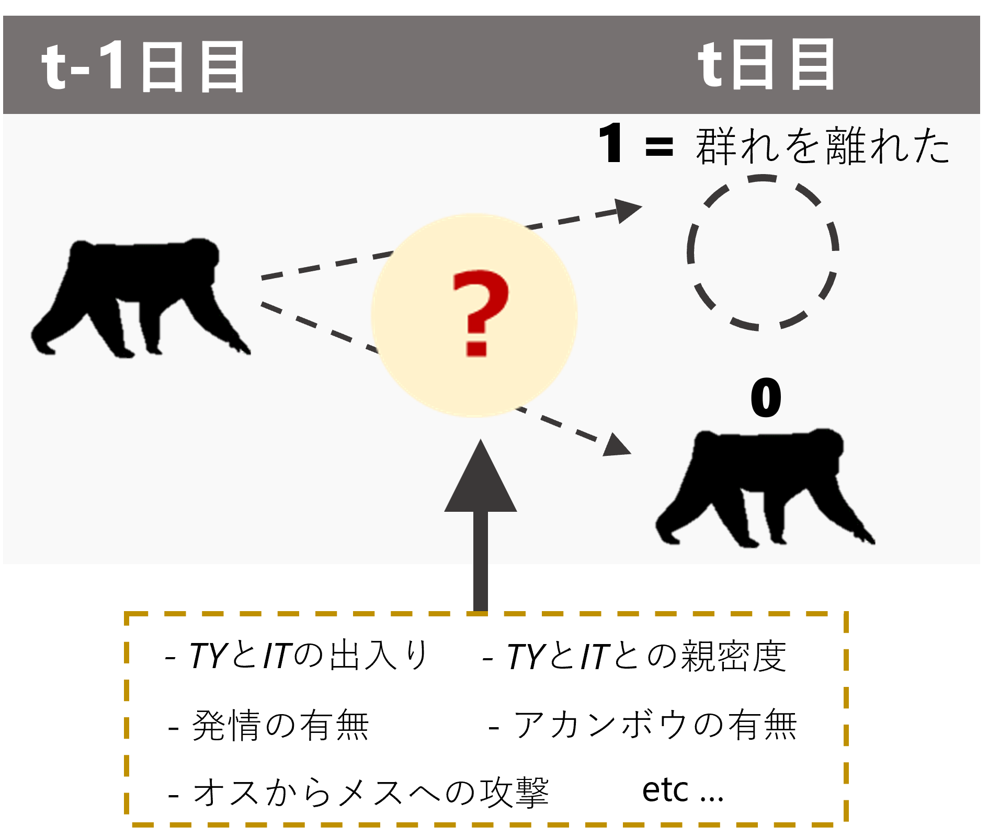
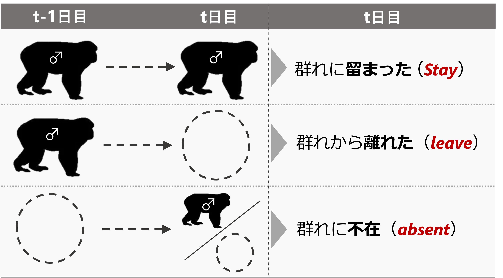

# メスが群れを離れるメカニズム {#c10}    
前章までの分析により、*TY*と*IT*が群れを出入りすることが群れ本体における確認メス割合に影響している可能性が高いことが分かった。それでは、実際にそれぞれのメスはどのようなメカニズムで群れを出るか否かを決めているのだろうか?  

以下では、メスの毎日の確認状況のデータからメスが群れを離れる要因を探る(図\@ref(fig:female-out))。オスの出入りの他、彼らとの親密度、アカンボウの有無、発情の有無、オスの攻撃などの要因を検討する。  

```{r female-out, out.width = "40%", fig.align = "center", echo = FALSE, fig.cap = "メスの確認状況に影響する要因"}

```
<br/>  

## データの加工  
### オスが群れを離れた日の特定   
まず、彼らの確認時間帯が記されたデータシートを読み込み、60分以上確認できたか否かの列を作成する。出入りがあった期間以外は、群れ本体にいた場合は終日確認されたので`group_all`からデータを引っ張ってくる。    

```{r}
male_time_18m <- group_all %>% 
  filter(study_period == "m18") %>% 
  select(date, groupID, TY, IT)  

male_time_19nm <- group_all %>% 
  filter(study_period == "nm19") %>% 
  select(date, groupID, TY, IT)  

male_time_19m <- read_excel("../Data/data/2019mating/2019mating_raw.xlsx",
                            sheet =　"male_presence_long") %>% 
  mutate(study_period = "m19") %>% 
  mutate(groupID = str_c(study_period,"_", groupID)) %>% 
  ## 確認時間の算出
  mutate(dur = ifelse(is.na(first), 0,
                      difftime(last, first, units = "mins"))) %>% 
  mutate(presence = ifelse(dur > 0, 1, 0)) %>% 
  select(maleID, date, groupID, presence) %>% 
  pivot_wider(names_from = maleID,
              values_from = presence)  

male_time_20m <- read_excel("../Data/data/2020mating/2020mating_raw.xlsx",
                            sheet =　"male_presence_long") %>% 
  mutate(study_period = "m20") %>% 
  mutate(groupID = str_c(study_period,"_", groupID)) %>% 
  ## 確認時間の算出
  mutate(dur = ifelse(is.na(first), 0,
                      difftime(last, first, units = "mins"))) %>% 
  mutate(presence = ifelse(dur > 0, 1, 0)) %>% 
  select(maleID, date, groupID, presence) %>% 
  pivot_wider(names_from = maleID,
              values_from = presence)

male_time_21m <- read_excel("../Data/data/2021mating/2021mating_raw.xlsx",
                            sheet =　"male_presence_long") %>% 
  mutate(study_period = "m21") %>% 
  mutate(groupID = str_c(study_period,"_", groupID)) %>% 
  ## 確認時間の算出
  mutate(dur = ifelse(is.na(first), 0,
                      difftime(last, first, units = "mins"))) %>% 
  mutate(presence = ifelse(dur > 0, 1, 0)) %>% 
  select(maleID, date, groupID, presence) %>% 
  pivot_wider(names_from = maleID,
              values_from = presence)

male_time_20nm <- read_excel("../Data/data/2020nonmating/2020nonmating_raw.xlsx",
                             sheet =　"male_presence_long") %>% 
  mutate(study_period = "nm20") %>% 
  mutate(groupID = str_c(study_period,"_", groupID)) %>% 
  ## 確認時間の算出
  mutate(dur = ifelse(is.na(first), 0,
                      difftime(last, first, units = "mins"))) %>% 
  mutate(presence = ifelse(dur > 0, 1, 0)) %>% 
  select(maleID, date, groupID, presence) %>% 
  pivot_wider(names_from = maleID,
              values_from = presence)

male_time_21nm <- read_excel("../Data/data/2021nonmating/2021nonmating_raw.xlsx",
                             sheet =　"male_presence_long") %>% 
  mutate(study_period = "nm21") %>% 
  mutate(groupID = str_c(study_period,"_", groupID)) %>% 
  ## 確認時間の算出
  mutate(dur = ifelse(is.na(first), 0,
                      difftime(last, first, units = "mins"))) %>% 
  mutate(presence = ifelse(dur > 0, 1, 0)) %>% 
  select(maleID, date, groupID, presence) %>% 
  pivot_wider(names_from = maleID,
              values_from = presence)

male_time_22nm <- group_all %>% 
  filter(study_period == "nm22") %>% 
  select(date, groupID, TY, IT)  

TYIT_presence <- bind_rows(male_time_18m, male_time_19m, male_time_20m, male_time_21m,
                           male_time_19nm, male_time_20nm, male_time_21nm, male_time_22nm)
```

続いて、群れ本体が240日以上確認できた日のデータに先ほどのデータを結合する。また、データのない日付の行も補完する。    
```{r}
no_female_over0.5_TYIT <- no_female_over0.5 %>% 
  left_join(TYIT_presence, by = c("date","groupID")) %>% 
  mutate(date = as_date(date)) %>% 
  complete(date = seq.Date(min(date), max(date), by ="1 day")) %>% 
  mutate(m18 = ifelse(study_period == "m18",1,0),
         m19 = ifelse(study_period == "m19",1,0),
         m20 = ifelse(study_period == "m20",1,0),
         m21 = ifelse(study_period == "m21",1,0),
         nm19 = ifelse(study_period == "nm19",1,0),
         nm20 = ifelse(study_period == "nm20",1,0),
         nm21 = ifelse(study_period == "nm21",1,0),
         nm22 = ifelse(study_period == "nm22",1,0))
```

データは以下の通り。  
```{r}
datatable(no_female_over0.5_TYIT,
          filter = "top",
          options = list(scrollX = TRUE))
```
<br/>  

続いて、TYとITが群れを離れたと考えられる日にちについての列のあるデータフレームを作成する。ここでは、**「1分でも確認された翌日に群れ本体で一度も確認できないとき」**に群れを離れたとみなす。  
```{r}
## 群れ本体でかつ240分以上追跡した日のデータとオスの確認状況のデータを結合
no_female_over0.5 %>% 
  left_join(TYIT_presence, by = c("date", "groupID")) %>% 
  mutate(date = as_date(date)) %>% 
  select(date, groupID, study_period, TY, IT) -> TYIT_presence_over0.5

## 前日の確認状況の列を作成
TYIT_presence_over0.5 %>% 
  mutate(date_pre = date - 1) %>% 
  select(date, date_pre, groupID) %>% 
  left_join(TYIT_presence_over0.5 %>% 
              select(-groupID, -study_period), by = c("date_pre" = "date")) %>% 
  rename(TY_pre = TY, IT_pre = IT) %>% 
  left_join(TYIT_presence, by = c("date", "groupID")) -> TYIT_presence_pre

## TYとITが「群れを離れた」か否かの列を作成  
TYIT_presence_pre %>% 
  mutate(TY_out = ifelse(is.na(TY_pre), NA,
                         ifelse(TY_pre == 1 & TY == 0,1,0)),
         IT_out = ifelse(is.na(TY_pre), NA,
                         ifelse(IT_pre == 1 & IT == 0,1,0))) -> male_out
```

データは以下の通り。  
```{r}
datatable(male_out,
          filter = "top",
          options = list(scrollX = TRUE))
```

### メスが群れを離れた日の同定  
続いて、各メスが群れを離れたか否かを記したデータフレームを作成する。また、前日のアカンボウの有無や発情の有無などの情報も結合する。      

```{r}
## メスのアカンボウの有無  
infant <- read_csv("../Data/data/others/female_infant.csv")

infant %>% 
  pivot_longer(Kur:Cur,
               names_to = "femaleID",
               values_to = "infant") %>% 
  mutate(date = as_date(date)) -> infant_long

# 群れ本体でかつ240分以上追跡した日のデータとメスの確認状況のデータを結合
no_female_over0.5 %>% 
  select(groupID) %>% 
  left_join(group_all %>% select(-c(TY,IT,KR,LK,KM,TG))) %>% 
  select(-(start:fin)) %>% 
  ## 縦型にする  
  pivot_longer(Kur:Yun,
               names_to = "femaleID",
               values_to = "presence") %>% 
  left_join(att, by = c("femaleID", "study_period")) %>% 
  ## 6歳以上のみ抽出  
  filter(age >= 6) %>% 
  left_join(female_time_long %>% 
              select(date, femaleID, presence) %>%
              rename(time = presence),
            by = c("date","femaleID")) %>% 
  ## 死亡個体は除く  
  filter(is.na(time)| time != "DD") %>% 
  select(-time) %>% 
  mutate(date = as_date(date)) -> female_pre_long

## 発情状態とアカンボウの有無を結合  
female_pre_long %>% 
  mutate(date_pre = date - 1) %>% 
  left_join(female_pre_long %>% 
              select(date, femaleID, presence) %>% 
              rename(presence_pre = presence),
            by = c("date_pre" = "date", "femaleID")) %>% 
  mutate(female_out = ifelse(is.na(presence_pre), NA,
                             ifelse(presence_pre == 1 & presence == 0,1,0))) %>% 
  left_join(female_all %>% 
              select(date, femaleID, rs2) %>% 
              mutate(date = date + 1) %>% 
              rename(rs_pre = rs2), by = c("date", "femaleID")) %>% 
  left_join(infant_long %>% 
              mutate(date = date + 1) %>% 
              rename(infant_pre = infant), by = c("date","femaleID")) %>% 
  ## オスの出入りがある期間のみを抽出  
  # filter(study_period %in% c("m19", "m20", "m21", "nm20", "nm21")) %>% 
  ## 前日にメスがいる日のみを抽出
  filter(presence_pre == 1) -> female_out
```

### オスの攻撃頻度  
続いて、オスの攻撃についての情報を加工する。各観察日のそれぞれのメスが攻撃された頻度と、群れ全体で攻撃が確認された頻度について算出する。  

```{r}
### 6歳以上への攻撃のみ  
aggression_all %>% 
  mutate(femaleID = str_replace_all(femaleID, "\\?","")) %>% 
  left_join(att, by = c("femaleID", "study_period")) %>% 
  ## 確実に被攻撃個体が6歳以上であるものを抽出
  filter(age >= 6 | str_detect(femaleID,"multi|many|Multi|KunTrt|Ako,Kil")) %>% 
  group_by(date) %>% 
  summarise(no_agg = length(unique(no))) %>% 
  ungroup() %>% 
  right_join(no_female_over0.5) %>% 
  replace_na(list(no_agg = 0)) %>% 
  mutate(rate_agg_6yo = no_agg*60/dur) %>% 
  select(date, groupID, no_agg, rate_agg_6yo, dur) %>% 
  filter(!str_detect(groupID, "nm")) %>% 
  filter(date >= "2018-10-08") -> agg_rate_6yo

### 全攻撃  
aggression_all %>% 
  group_by(date) %>% 
  summarise(no_agg = length(unique(no))) %>% 
  ungroup() %>% 
  right_join(no_female_over0.5) %>% 
  replace_na(list(no_agg = 0)) %>% 
  mutate(rate_agg_all = no_agg*60/dur) %>% 
  select(date, groupID, no_agg, rate_agg_all, dur) %>% 
  filter(!str_detect(groupID, "nm")) %>% 
  filter(date >= "2018-10-08") -> agg_rate_all

### 個体ごとの被攻撃頻度  
aggression_all %>% 
  left_join(att, by = c("study_period", "femaleID")) %>% 
  filter(!is.na(age)) %>% 
  group_by(date, femaleID) %>% 
  summarise(no_agg = n()) %>% 
  ungroup() %>% 
  complete(date,femaleID) %>% 
  replace_na(list(no_agg = 0)) %>% 
  mutate(study_period = str_c("m",str_sub(year(date),3,4))) %>% 
  left_join(att, by = c("study_period", "femaleID")) %>% 
  ## 6歳以上を抽出  
  filter(!is.na(age)) %>% 
  right_join(no_female_over0.5 %>% select(date, groupID, dur)) %>% 
  filter(!str_detect(study_period,"nm")) %>% 
  mutate(rate_agg = no_agg*60/dur) %>% 
  left_join(group_all %>% 
              select(-c(TY,IT,KR,LK,KM,TG)) %>% 
              select(-c(start:fin)) %>% 
              pivot_longer(Kur:Yun,
                           names_to = "femaleID",
                           values_to = "presence"),
            by = c("date", "femaleID","study_period","groupID")) -> agg_rate_each
```

### 血縁個体が群れを出たか否か  
続いて、各観察日に血縁個体が離れたか否かを求める。ここでは、離れた個体の最大血縁度を算出する。なお、**離れた個体は相手の発情の有無によって分けます**。    

```{r}
kin <- read_csv("../Data/data/others/kin.csv")

female_out %>% 
  select(groupID, date, study_period, femaleID, female_out, presence_pre) %>% 
  ## 他のメスのデータを結合  
  left_join(att %>% 
              filter(age >= 6) %>% 
              select(study_period, femaleID) %>% 
              rename(femaleID2 = femaleID),
            by = "study_period") %>% 
  filter(femaleID != femaleID2) %>% 
  ## 他のメスが群れを離れたか否かの列を作成
  left_join(female_out %>% 
              select(groupID, date, femaleID, rs_pre, female_out) %>% 
              rename(female_out2 = female_out,
                     rs_pre2 = rs_pre,
                     femaleID2 = femaleID),
            by = c("groupID","date", "femaleID2")) %>% 
  replace_na(list(female_out2 = 0,
                  rs_pre2 = 0)) %>% 
  ## 相手のメスとの血縁度を結合  
  left_join(kin, by = c("femaleID", "femaleID2")) %>% 
  ## 相手のメスが離れた場合のみを抽出  
  filter(female_out2 == 1) %>% 
  ## それぞれの日で離れたメスの最大の血縁度を算出
  group_by(groupID, date, femaleID, rs_pre2) %>% 
  summarise(max_kin = max(kin)) %>% 
  ungroup() %>% 
  pivot_wider(names_from = rs_pre2,
              values_from = max_kin) %>% 
  replace_na(list(`1` = 0, `0` = 0)) %>% 
  rename(max_kin_est = `1`,
         max_kin_an = `0`) -> kin_female_out
```

### 群れ外オス数の算出  
続いて、各観察日の群れ外オス数を算出する。  
```{r}
no_ntm_m18 <- male_18m %>% 
  filter(!(maleID %in% c("TY", "IT", "KR", "LK"))) %>% 
  group_by(date) %>% 
  summarise(no_ntm = sum(presence, na.rm = TRUE))

no_ntm_m19 <- male_19m %>% 
  filter(!(maleID %in% c("TY", "IT", "KR", "LK"))) %>% 
  group_by(date) %>% 
  summarise(no_ntm = sum(presence, na.rm = TRUE))

no_ntm_m20 <- male_20m %>% 
  filter(!(maleID %in% c("TY", "IT", "KR", "LK", "KM", "TG"))) %>% 
  group_by(date) %>% 
  summarise(no_ntm = sum(presence, na.rm = TRUE))

no_ntm_m21 <- male_21m %>% 
  filter(!(maleID %in% c("TY", "IT", "KR", "LK", "KM", "TG"))) %>% 
  group_by(date) %>% 
  summarise(no_ntm = sum(presence, na.rm = TRUE))

sum_ntm <- bind_rows(no_ntm_m18, no_ntm_m19, no_ntm_m20, no_ntm_m21)
```

### 発情メス数の算出  
```{r}
sum_est <- female_pre_long %>% 
  left_join(female_all %>% select(date, femaleID, rs2),
            by = c("date", "femaleID")) %>% 
  ## 群れ本体で確認されたメスのみ  
  filter(presence == "1") %>% 
  group_by(date, groupID) %>% 
  summarise(no_est = sum(rs2)) %>% 
  ungroup()
```

### 全データの結合   
最後に、全データを結合する。  
```{r}
female_out %>% 
  left_join(no_female_over0.5 %>% 
              select(date, prop_female)  ,
            by = c("date_pre" = "date")) %>% 
  left_join(male_out %>% select(date, groupID, TY_out, IT_out),
            by = c("date", "groupID")) %>% 
  left_join(agg_rate_6yo %>% 
              select(date, rate_agg_6yo) %>% 
              mutate(date = date + 1) %>% 
              rename(rate_agg_6yo_pre = rate_agg_6yo), by = c("date")) %>% 
  left_join(sum_est %>% 
              select(date, no_est),
            by = c("date_pre" = "date")) %>% 
  left_join(agg_rate_all %>% 
              select(date, rate_agg_all) %>% 
              mutate(date = date + 1) %>% 
              rename(rate_agg_all_pre = rate_agg_all), by = c("date")) %>% 
  left_join(CSI_TY_combined %>% 
              rename(femaleID = subject) %>% 
              select(femaleID, CSI_TY),
            by = "femaleID") %>% 
  left_join(CSI_IT_combined %>% 
              rename(femaleID = subject) %>% 
              select(femaleID, CSI_IT),
            by = "femaleID") %>% 
  left_join(no_female_over0.5_TYIT %>% 
              select(date, TY, IT) %>% 
              mutate(date = date + 1) %>% 
              rename(TY_pre = TY,
                     IT_pre = IT)) %>% 
  left_join(kin_female_out,
            by = c("groupID","date", "femaleID")) %>% 
  left_join(sum_ntm, by = c("date_pre" = "date")) %>% 
  replace_na(list(max_kin_est = 0,
                  max_kin_an = 0)) %>% 
  mutate(kin_est_01 = ifelse(max_kin_est > 0, 1,0),
         kin_an_01 = ifelse(max_kin_an > 0, 1,0) ) %>% 
  group_by(study_period) %>% 
  ## 相対順位を算出  
  mutate(max_rank = max(rank)) %>% 
  ungroup() %>% 
  mutate(rank_scaled = rank/max_rank) %>% 
  ## 攻撃データが2018年10月8日以降しかないのでフィルター
  filter(date >= "2018-10-09") -> female_out_final
```

データは以下の通り。  
```{r}
datatable(female_out_final %>% mutate(across(where(is.numeric), ~round(.,2))),
          options = list(scrollX = 50),
          filter = "top")
```


## 基本的な情報  
### メスが群れを離れる頻度  
交尾期/非交尾期または、発情/非発情で群れを離れる頻度(回/10日)を図示すると以下のようになる。非交尾期 < 交尾期・非発情 < 交尾期・発情の順に高くなる。非交尾期にはほとんどないようだ。    
```{r}
female_out_summary <- female_out_final %>% 
  mutate(season = ifelse(str_detect(study_period, "nm"), "nonmating", "mating")) %>% 
  group_by(femaleID, season, rs_pre) %>% 
  summarise(n = n(),
            sum_out = sum(female_out)) %>% 
  replace_na(list(rs_pre = 0)) %>% 
  ungroup() %>% 
  mutate(rate_out = sum_out*10/n)

female_out_summary %>% 
  mutate(rs_pre2 = ifelse(season == "nonmating", "nonmating",
                          ifelse(season == "mating" & rs_pre == 1, "Estrous", "Anestrus"))) %>% 
  mutate(rs_pre2 = as.factor(rs_pre2)) %>% 
  mutate(rs_pre2 = fct_relevel(rs_pre2, "Anestrus", "Estrous")) %>% 
  ggplot(aes(x = rs_pre2, y = rate_out))+
  geom_violin(bw = 0.25,
              scale = "width",
              aes(fill = season))+
  geom_beeswarm(shape = 21,
                cex = 1.7,
                alpha = 0.7,
                fill = "white",
                color = "black",
                size = 2)+
  theme_bw(base_size = 15)+
  scale_fill_manual(values = c("orange2", "green4"))+
  labs(x = "", y = "Frequency of leaving troop (times/10 days)") +
  theme(aspect.ratio = 1,
        axis.title.y = element_text(family = "Times New Roman",
                                    size = 12),
        axis.title.x = element_text(family = "Yu Gothic",
                                    size = 15),
        axis.text.x = element_text(family = "Times New Roman",
                                   size = 12),
        axis.text.y = element_text(family = "Times New Roman")) -> p_female_out_rate

p_female_out_rate

ggsave("figures/p_female_out_rate.png",
       p_female_out_rate, dpi = 600, width = 140, height = 100,
       units = "mm")
```

### オスが群れを離れる    
オスはどのくらい一緒に群れを離れるかを算出する。  

2020年までの間、TYがITと同じ日に離れたのは3回で、全体の23.1%だった。  
```{r}
male_out %>% 
  drop_na() %>% 
  mutate(TYIT_out = ifelse(TY_out == "1" & IT_out == "1",1,0)) %>% 
  filter(TY_out == "1") %>% 
  summarise(N = n(),
            sum = sum(TYIT_out),
            prop = mean(TYIT_out))
```

一方で、*IT*の側から見ると12回中3回で、全体の25%だった。    
```{r}
male_out %>% 
  drop_na() %>% 
  mutate(TYIT_out = ifelse(TY_out == "1" & IT_out == "1",1,0)) %>% 
  filter(IT_out == "1") %>% 
  summarise(N = n(),
            sum = sum(TYIT_out),
            prop = mean(TYIT_out))
```

## 分析(モデリング)  
以下では、交尾期と非交尾期に分けて分析を行う。また、交尾期については発情メスと非発情メスを分けて分析を行う。分析に含まれるのは、6歳以上でかつTY、ITとのCSIが算出できる個体(= 2019年時点で6歳以上の個体)である。  

ITは2021年は群れから移出してしまっていた。これが結果に影響していないか確かめるため、以下のすべてのモデルについて、<u>2019~2021年の全期間のデータを用いたモデルと、2020年までのデータを用いたモデルの2つを実行する</u>。  

### 交尾期(非発情メス)  
#### データの加工  
まず、データの加工を行う。  
```{r}
female_out_an <- female_out_final %>% 
  filter(!str_detect(study_period, "nm")) %>% 
  filter(rs_pre == "0") %>% 
  ## TYとITとのCSIがないメスは除く  
  drop_na(CSI_TY) %>% 
  mutate(rate_agg_6yo_std = standardize(rate_agg_6yo_pre),
         rate_agg_all_std = standardize(rate_agg_all_pre)) %>% 
  mutate(CSI_TY_std = standardize(CSI_TY),
         CSI_IT_std = standardize(CSI_IT),
         rank_std = standardize(rank_scaled),
         age_std = standardize(age),
         ntm_std = standardize(no_ntm),
         est_std = standardize(no_est),
         prop_std = standardize(prop_female)) %>% 
  ## 2021年はIT_outを全て0とする 
  replace_na(list(IT_out = 0, IT_pre = 0)) %>% 
  mutate(date = as_date(date))
```

変数の組み合わせごとのデータ数は以下の通り。  
```{r}
female_out_an %>% 
  group_by(TY_out, IT_out) %>% 
  summarise(N = n())
```

#### モデリング1    
モデル式は以下の通り。  

説明変数の説明は以下の通り。なお、$i, j, k$はそれぞれデータ番号、日付番号、メスIDの番号を表す。なお、連続変数は全て標準化している。      

- $TY\_out/IT\_out$: TY/ITが群れを離れたか否か  
- $CSI\_TY/CSI\_IT$: 各メスとTY/ITとの親密度  
- $rate\_agg\_all$: 前日の群れ内のオスの攻撃頻度  
- $no_ntm$: 前日の群れ外オス数  
- $infant$: アカンボウの有無    
- $age$: 年齢  
- $rank$: 0から1にスケール化された順位  
- $kin\_01$: 同じ日に群れを離れたメスがいたか否か  
- $study\_period(m19,m20,m21)$: 調査期間  

$$
\begin{aligned}
female\_out_i &\sim Bernoulli(p_i) \\
logit(p_i) = &\beta_0 + \beta_1 \times rate\_agg\_all_i + \beta_2 \times TY\_out_i + \beta_3 \times IT\_out_i + \beta_4 \times CSI\_TY_i + \beta_5 \times CSI\_IT_i + \\
&\beta_6 \times rank_i + \beta_7 \times age_i + \beta_8 \times infant_i + \beta_9 \times TY\_out_i \times CSI\_TY_i + \\
&\beta_{10} \times IT\_out_i \times CSI\_IT_i  + \beta_{11} \times no\_ntm_i + \beta_{12} \times kin_i + \beta_{13} \times m20_i + \beta_{13} \times m21_i +  r_j + \gamma_k\\
r_j &\sim Normal(0, \sigma_r)\\
\gamma_k &\sim Normal(0, \sigma_{\gamma})\\
\beta_0 &\sim student\_t(4,0,20)\\
\beta_{1,2,\dots,12} &\sim student_t(0,4,10)\\
\sigma_{r, \gamma} &\sim student_t(0,4,10)\\
\end{aligned}
$$

モデルは以下のように実行する。**2019~2021年  
```{r}
## 全個体への攻撃  
### 攻撃頻度とオスの出入りの交互作用なし    
m_female_out_an_rv <-  brm(data = female_out_an %>% 
                             mutate(date = as.factor(date)),
                           female_out ~ rate_agg_6yo_std + TY_out*CSI_TY_std +
                             IT_out*CSI_IT_std +  prop_std +
                             infant_pre + age_std + rank_std + kin_est_01 + kin_an_01 +
                             study_period + (1|femaleID) + (1|date),
                           family = "bernoulli",
                           prior = c(prior(student_t(4,0,15),class = Intercept),
                                     prior(student_t(4,0,15), class = b),
                                     prior(student_t(4,0,10), class = sd)),
                           iter = 11000, warmup = 1000, seed = 223,
                           control=list(adapt_delta = 0.999, max_treedepth = 15),
                           backend = "cmdstanr",
                           file = "model/m_female_out_an_rv")

m_female_out_an_rv2 <-  brm(data = female_out_an %>% 
                              mutate(date = as.factor(date)),
                            female_out ~ TY_out*CSI_TY_std +
                              TY_out*rate_agg_6yo_std + IT_out*rate_agg_6yo_std +
                              IT_out*CSI_IT_std +  prop_std +
                              infant_pre + age_std + rank_std + kin_est_01 + kin_an_01 +
                              study_period + (1|femaleID) + (1|date),
                            family = "bernoulli",
                            prior = c(prior(student_t(4,0,15),class = Intercept),
                                      prior(student_t(4,0,15), class = b),
                                      prior(student_t(4,0,10), class = sd)),
                            iter = 11000, warmup = 1000, seed = 223,
                            control=list(adapt_delta = 0.999, max_treedepth = 15),
                            backend = "cmdstanr",
                            file = "model/m_female_out_an_rv2")

## 2021年交尾期を除く
female_out_an %>%
  filter(study_period != "m21") %>%
  mutate(CSI_TY_std = standardize(CSI_TY),
         CSI_IT_std = standardize(CSI_IT),
         rank_std = standardize(rank_scaled),
         age_std = standardize(age),
         ntm_std = standardize(no_ntm),
         est_std = standardize(no_est),
         prop_std = standardize(prop_female),
         rate_agg_all_std = standardize(rate_agg_all_pre),
         rate_agg_6yo_std = standardize(rate_agg_6yo_pre)) %>%
  mutate(date = as.factor(date)) -> female_out_an_no21

m_female_out_an_no21_rv <-  brm(data = female_out_an_no21,
                                female_out ~ rate_agg_6yo_std + TY_out*CSI_TY_std +
                                  IT_out*CSI_IT_std +  prop_std +
                                  infant_pre + age_std + rank_std + kin_est_01 + kin_an_01 +
                                  study_period + (1|femaleID) + (1|date),
                                family = "bernoulli",
                                prior = c(prior(student_t(4,0,15),class = Intercept),
                                          prior(student_t(4,0,15), class = b),
                                          prior(student_t(4,0,10), class = sd)),
                                iter = 11000, warmup = 1000, seed = 223,
                                control=list(adapt_delta = 0.999, max_treedepth = 15),
                                backend = "cmdstanr",
                                file = "model/m_female_out_an_no21_rv")
```

##### モデルチェック  
まず、DHARMaパッケージ[@Hartig2022]とDHARMa.helperパッケージ[@Francisco2023]でモデルの前提が満たされているかを確認する。いずれのモデルも特に問題はないよう。 
```{r, fig.height = 4}
## 全期間    
dh_female_out_an_rv <- dh_check_brms(m_female_out_an_rv, quantreg = TRUE)

## 2021年を除く  
dh_female_out_an_no21_rv <- dh_check_brms(m_female_out_an_no21_rv, quantreg = TRUE)
```
<br/>  

ゼロ過剰などの問題もない。  
```{r}
testZeroInflation(dh_female_out_an_rv)

testZeroInflation(dh_female_out_an_no21_rv)
```
<br/>  

bayesplotパッケージ[@Gabry2022]の`pp_check`関数で、事後分布からの予測分布と実測値の分布を比較しても大きな乖離はない。   
```{r, fig.height = 4.5}
## 全期間    
pp_check(m_female_out_an_rv, ndraws = 100)+
  theme_bw()+
  theme(aspect.ratio = 0.9)

## 2021年を除く  
pp_check(m_female_out_an_no21_rv, ndraws = 100)+
  theme_bw()+
  theme(aspect.ratio = 0.9)
```  
<br/>  

多重共線性のチェックも行ったが、VIFに問題はない。  
```{r}
## 全期間  
check_collinearity(m_female_out_an_rv)

## 2021年を除く  
check_collinearity(m_female_out_an_no21_rv)
```
<br/>  

Rhatにも問題はなく、収束の問題はないよう。  
```{r, fig.dim = c(8,4)}
## 全期間  
data.frame(Rhat = brms::rhat(m_female_out_an_rv)) %>% 
  ggplot(aes(x = Rhat))+
  geom_histogram(fill = "white",
                 color = "black")+
  theme_bw()+
  theme(aspect.ratio = 1)

## 2021年を除く  
data.frame(Rhat = brms::rhat(m_female_out_an_no21_rv)) %>% 
  ggplot(aes(x = Rhat))+
  geom_histogram(fill = "white",
                 color = "black")+
  theme_bw()+
  theme(aspect.ratio = 1)
```
<br/>  

##### 結果の確認  
###### 推定された係数  
まずは、全期間のデータを用いたモデルについてみる。太字になっている変数は95%確信区間が0をまたいでおらず、有意な影響があるといえる。  
```{r, echo = FALSE}
summary_female_out_an_rv <- summary(m_female_out_an_rv)

model_parameters(m_female_out_an_rv, dispersion = TRUE, ci = 0.95,
                 centrality = "median", ci_method = "hdi") %>% 
  data.frame() %>% 
  dplyr::select(1,2,3,5,6, 7,8) %>% 
  mutate("Bulk ESS" = summary_female_out_an_rv$fixed$Bulk_ESS,
         "Tail ESS" = summary_female_out_an_rv$fixed$Tail_ESS) %>% 
  mutate("95%CI" = str_c("[",sprintf("%.2f",CI_low),",",sprintf("%.2f",CI_high),"]")) %>% 
  dplyr::select(c(1,2,3, 10), everything()) %>% 
  dplyr::select(-CI_low, -CI_high) %>% 
  mutate(pd = str_c(sprintf("%.2f",pd*100))) %>% 
  rename(PD = pd) %>% 
  mutate(Parameter = fct_relevel(Parameter,
                                 "b_Intercept","b_TY_out",
                                 "b_CSI_TY_std","b_TY_out:CSI_TY_std",
                                 "b_IT_out","b_CSI_IT_std","b_IT_out:CSI_IT_std",
                                 "b_kin_an_01","b_kin_est_01",
                                 "b_rate_agg_6yo_std", "b_prop_std",
                                 "b_rank_std", "b_age_std", "b_infant_pre",
                                 "b_study_periodm19", "b_study_periodm20","b_study_periodm21")) %>% 
  arrange(Parameter) %>% 
  mutate(Parameter = str_replace_all(Parameter, c("b_Intercept"="Intercept",
                                                  "b_study_periodm19" = "Study period(MS19 vs MS18)",              
                                                  "b_study_periodm20" = "Study period(MS20 vs MS18)",
                                                  "b_study_periodm21" = "Study period(MS21 vs MS18)",
                                                  "^b_TY_out$" = "TY left on day t\n (Yes cs No)",
                                                  "^b_IT_out$" = "IT left on day t\n (Yes cs No)",
                                                  "b_infant_pre" = "Presence of infant \n (Yes vs No)",
                                                  "b_rank_std" = "Ordinal dominance rank",
                                                  "b_age_std" = "Age",
                                                  "b_prop_std" = "Prop. of females on day t-1",
                                                  "b_kin_an_01" = "Anestrus kin females left on day t\n(Yes vs No)",  
                                                  "b_kin_est_01" = "Estrous kin females left on day t\n(Yes vs No)",   
                                                  "^b_rate_agg_6yo_std$" = "Aggression frequency on dat t-1",
                                                  "b_CSI_TY_std" = "CSI with TY",
                                                  "b_CSI_IT_std" = "CSI with IT",
                                                  "b_TY_out:CSI_TY_std" = "TY left x CSI with TY",
                                                  "b_IT_out:CSI_IT_std" = "IT left x CSI with IT"))) %>% 
  rename("Explanatory variables" = "Parameter") %>% 
  mutate(across(where(is.numeric), ~sprintf("%.2f", .))) -> table_female_out_an_rv

table_female_out_an_rv

write_csv(table_female_out_an_rv, "tables/table_female_out_an_rv.csv")
```
<br/>  

推定されたランダム効果の標準偏差は以下の通り。  
```{r}
random_parameters(m_female_out_an_rv)
```


続いて、2021年のデータを除いたモデルについて確認する。少しの違いはあるが、ITがかかわる変数については変化がない。  
```{r, echo = FALSE}
summary_female_out_an_no21_rv <- summary(m_female_out_an_no21_rv)

model_parameters(m_female_out_an_no21_rv, dispersion = TRUE, ci = 0.95,
                 centrality = "median", ci_method = "hdi") %>% 
  data.frame() %>% 
  dplyr::select(1,2,3,5,6, 7,8) %>% 
  mutate("Bulk ESS" = summary_female_out_an_no21_rv$fixed$Bulk_ESS,
         "Tail ESS" = summary_female_out_an_no21_rv$fixed$Tail_ESS) %>% 
  mutate("95%CI" = str_c("[",sprintf("%.2f",CI_low),",",sprintf("%.2f",CI_high),"]")) %>% 
  dplyr::select(c(1,2,3, 10), everything()) %>% 
  dplyr::select(-CI_low, -CI_high) %>% 
  mutate(pd = str_c(sprintf("%.2f",pd*100))) %>% 
  rename(PD = pd) %>% 
  mutate(Parameter = fct_relevel(Parameter,
                                 "b_Intercept","b_TY_out",
                                 "b_CSI_TY_std","b_TY_out:CSI_TY_std",
                                 "b_IT_out","b_CSI_IT_std","b_IT_out:CSI_IT_std",
                                 "b_kin_an_01","b_kin_est_01",
                                 "b_rate_agg_6yo_std", "b_prop_std",
                                 "b_rank_std", "b_age_std", "b_infant_pre",
                                 "b_study_periodm19", "b_study_periodm20")) %>% 
  arrange(Parameter) %>% 
  mutate(Parameter = str_replace_all(Parameter, c("b_Intercept"="Intercept",
                                                  "b_study_periodm19" = "Study period(MS19 vs MS18)",              
                                                  "b_study_periodm20" = "Study period(MS20 vs MS18)",
                                                  "b_study_periodm21" = "Study period(MS21 vs MS18)",
                                                  "^b_TY_out$" = "TY left on day t\n (Yes cs No)",
                                                  "^b_IT_out$" = "IT left on day t\n (Yes cs No)",
                                                  "b_infant_pre" = "Presence of infant \n (Yes vs No)",
                                                  "b_rank_std" = "Ordinal dominance rank",
                                                  "b_age_std" = "Age",
                                                  "b_prop_std" = "Prop. of females on day t-1",
                                                  "b_kin_an_01" = "Anestrus kin females left on day t\n(Yes vs No)",  
                                                  "b_kin_est_01" = "Estrous kin females left on day t\n(Yes vs No)",   
                                                  "^b_rate_agg_all_std$" = "Aggression frequency on dat t-1",
                                                  "b_CSI_TY_std" = "CSI with TY",
                                                  "b_CSI_IT_std" = "CSI with IT",
                                                  "b_TY_out:CSI_TY_std" = "TY left x CSI with TY",
                                                  "b_IT_out:CSI_IT_std" = "IT left x CSI with IT"))) %>% 
  rename("Explanatory variables" = "Parameter") %>% 
  mutate(across(where(is.numeric), ~sprintf("%.2f", .))) -> table_female_out_an_no21_rv

table_female_out_an_no21_rv

write_csv(table_female_out_an_no21_rv, "tables/table_female_out_an_no21_rv.csv")
```
<br/>  

推定されたランダム効果の標準偏差は以下の通り。  
```{r}
random_parameters(m_female_out_an_no21_rv)
```

##### 結果の図示  
###### TYの群れへの出入り、CSIとの関連  
まず、*TY*とのCSIに応じてオッズ比(*TY*と同じ日に群れを離れるオッズ/そうでない日に離れるオッズ)の対数をとったものがどのように変わるかを図示する。先ほど示したように、およそCSIが1.5くらいあると同じ日に群れを離れる確率が有意に高くなる。    

```{r, fig.height = 4}
cont_female_out_an_TYcsi_rv <- posterior_samples(m_female_out_an_rv) %>% 
  select(3, 16) %>% 
  rename(b_out = 1,
         b_int = 2) %>% 
  expand(CSI_TY_std = seq(-1, 2.6, length = 500),
         nesting(b_out, b_int)) %>% 
  mutate(logodds = b_out + b_int*CSI_TY_std) %>% 
  group_by(CSI_TY_std) %>% 
  summarise(median = median(logodds),
            CI_low = quantile(logodds, 0.025),
            CI_high = quantile(logodds, 0.975)) %>% 
  ungroup()

cont_female_out_an_TYcsi_rv %>% 
  rename(CSI_TY = CSI_TY_std) %>% 
  mutate(CSI_TY = sd(female_out_an$CSI_TY)*CSI_TY + mean(female_out_an$CSI_TY)) %>% 
  mutate(significance = if_else(CI_low*CI_high > 0,
                                "Yes", "No")) %>% 
  ggplot(aes(x = CSI_TY, y = median))+
  geom_point(data = CSI_TY_combined,
               aes(x = CSI_TY, y = -2.4),
             shape = "|",
             color = "black",
             size = 3.5)+
  # geom_segment(data = CSI_TY_combined,
  #              aes(xend = CSI_TY, y=-0.8, yend = 0),
  #              color = "grey45",
  #              alpha = 0.8, size = 0.4,
  #              arrow = arrow(length = unit(11, "points"))) +
  geom_line(aes(color = significance))+
  geom_ribbon(aes(ymin = CI_low, ymax = CI_high,
                  fill = significance),
              alpha = 0.15)+
  scale_color_manual(values = c("black", "red3"),
                     labels = c("No", "Yes")) +
  scale_fill_manual(values = c("grey32", "red3"),
                    labels = c("No", "Yes")) +
  geom_hline(aes(yintercept = 0),
             linetype = "dashed",
             color = "grey30",
             linewidth = 0.5)+
  theme_bw(base_size = 12)+
  theme(aspect.ratio = 1) +
  labs(y = "Log odds ratio<br>(*TY* left on day *t* vs. otherwise)",
       x = "CSI with *TY*",
       color = "95% CI doesn't include zero", fill = "95% CI doesn't include zero",
       title = "a")+
  scale_x_continuous(breaks = seq(0,5.5,0.5))+
  scale_y_continuous(breaks = seq(-2, 8, 2))+
  theme(text = element_text(family = "Times New Roman"),
        axis.title = element_markdown(hjust = 0.5,
                                        lineheight = 1.2),
        axis.text = element_text(size = 12),
        aspect.ratio = 1,
        legend.position = "bottom",
        legend.title = element_text(size = 12),
        legend.text = element_text(size = 12),
        legend.margin=margin(0,0,0,0),
        legend.box.margin=margin(-10,-10,-10,-10)) -> p_female_out_an_TYcsi_rv

p_female_out_an_TYcsi_rv

ggsave("figures/p_female_out_an_TYcsi_rv.tif",p_female_out_an_TYcsi_rv,
       dpi = 2000, units = "mm",
       width = 100, height = 120)
```
<br/>  

実際に移出する可能性をプロットすると以下のようになる。  
```{r}
CSI_TY_q <- quantile(CSI_TY_combined$CSI_TY,
                     probs = c(0.1, 0.25, 0.5, 0.75, 0.9))[1:5]

CSI_TY_std_q <- (CSI_TY_q - mean(female_out_an$CSI_TY))/sd(female_out_an$CSI_TY)

emm_female_out_an_TYout_rv <- emmeans(m_female_out_an_rv,
                                      ~TY_out|CSI_TY_std,
                                      at = list(TY_out = c(0,1),
                                                CSI_TY_std = CSI_TY_std_q),
                                      type = "response") 

emm_female_out_an_TYout_rv %>% 
  data.frame() %>% 
  mutate(CSI_TY_cat = factor(CSI_TY_std,
                             labels = str_c(c("10%\n(", "25%\n(", "Median\n(",
                                              "75%\n(", "90%\n("),
                                            sprintf("%.2f", CSI_TY_q),")"))) %>% 
  mutate(TY_out = if_else(TY_out == "1", "Yes", "No")) %>% 
  ggplot(aes(x = CSI_TY_cat, y = response)) +
  geom_errorbar(aes(group = TY_out,
                    ymin = lower.HPD, ymax = upper.HPD),
                position = position_dodge(0.85),
                width = 0.5)+
  geom_point(aes(fill = TY_out),
             position = position_dodge(0.85),
             shape = 21,
             size = 2.5) +
  scale_fill_manual(values = c("white", "black")) +
  theme_bw(base_size = 12) +
  theme(aspect.ratio = 0.7,
        text = element_text(family = "Times New Roman"),
        axis.title = element_markdown(lineheight = 1.2,
                                      hjust = 0.5),
        legend.title = element_markdown()) +
  labs(x = "CSI with *TY*", y = "Probability of females<br> leaving the main group",
       fill = "*TY* left on day *t*?") -> p_emm_female_out_an_TYout_rv

p_emm_female_out_an_TYout_rv

ggsave("figures/p_emm_female_out_an_TYout_rv.tif",
       p_emm_female_out_an_TYout_rv,
       width = 180, height = 110, dpi = 2000, units = "mm")
```
<br/>  

`TY_out`の値ごとの`CSI_TY`の効果は以下のようになる。  
```{r}
posterior_samples(m_female_out_an_rv) %>% 
  select(4, 16) %>% 
  rename(b_CSI = 1,
         b_int = 2) %>% 
  expand(TY_out = c(0,1),
         nesting(b_CSI, b_int)) %>% 
  mutate(logodds = b_CSI + b_int*TY_out) %>% 
  group_by(TY_out) %>% 
  summarise(median = median(logodds),
            CI_low = hdi(logodds)[,2],
            CI_high = hdi(logodds)[,3]) %>% 
  ungroup()
```

###### ITの群れへの出入り、CSIとの関連  
*IT*とのCSIに応じてオッズ比(*IT*と同じ日に群れを離れるオッズ/そうでない日に離れるオッズ)の対数をとったものがどのように変わるかを図示する。こちらは、いずれのCSIでも有意な効果はないよう。 

```{r, fig.height = 4}
cont_female_out_an_ITcsi_rv <- posterior_samples(m_female_out_an_rv) %>% 
  select(5, 17) %>% 
  rename(b_out = 1,
         b_int = 2) %>% 
  expand(CSI_IT_std = seq(-0.7, 3.6, length = 500),
         nesting(b_out, b_int)) %>% 
  mutate(logodds = b_out + b_int*CSI_IT_std) %>% 
  group_by(CSI_IT_std) %>% 
  summarise(median = median(logodds),
            CI_low = quantile(logodds, 0.025),
            CI_high = quantile(logodds, 0.975)) %>% 
  ungroup()

cont_female_out_an_ITcsi_rv %>% 
  rename(CSI_IT = CSI_IT_std) %>% 
  mutate(CSI_IT = sd(female_out_an$CSI_IT)*CSI_IT + mean(female_out_an$CSI_IT)) %>% 
  mutate(significance = if_else(CI_low*CI_high > 0,
                                "Yes", "No")) %>% 
  ggplot(aes(x = CSI_IT, y = median))+
  geom_point(data = CSI_IT_combined,
               aes(x = CSI_IT, y = -1.95),
             shape = "|",
             color = "black",
             size = 3.5)+
  # geom_segment(data = CSI_IT_combined,
  #              aes(xend = CSI_IT, y=-0.6, yend = 0),
  #              color = "firebrick3",
  #              alpha = 0.8, size = 0.4,
  #              arrow = arrow(length = unit(11, "points"))) +
  geom_line(aes(color = significance))+
  geom_ribbon(aes(ymin = CI_low, ymax = CI_high,
                  fill = significance),
              alpha = 0.15)+
  scale_color_manual(values = c("grey32", "red3"),
                     labels = c("No", "Yes")) +
  scale_fill_manual(values = c("grey32", "red3"),
                    labels = c("No", "Yes")) +
  geom_hline(aes(yintercept = 0),
             linetype = "dashed",
             color = "grey30",
             linewidth = 0.5)+
  theme_bw(base_size = 12)+
  theme(aspect.ratio = 1) +
  labs(y = "Log odds ratio<br>(*IT* left on day *t* vs. otherwise)",
       x = "CSI with *IT*",
       color = "95% CI doesn't include zero", fill = "95% CI doesn't include zero",
       title = "b")+
  scale_x_continuous(breaks = seq(0,5.5,0.5))+
  scale_y_continuous(breaks = seq(-2,8,2))+
  theme(text = element_text(family = "Times New Roman"),
        axis.text = element_text(size = 12),
        axis.title = element_markdown(hjust = 0.5,
                                        lineheight = 1.2),
        aspect.ratio = 1,
        legend.position = "bottom",
        legend.title = element_text(size = 12),
        legend.text = element_text(size = 12),
        legend.margin = margin(0,0,0,0),
        legend.box.margin  =margin(-10,-10,-10,-10)) -> p_female_out_an_ITcsi_rv

p_female_out_an_ITcsi_rv

ggsave("figures/p_female_out_an_ITcsi_rv.tif",p_female_out_an_ITcsi_rv,
         dpi = 2000, units = "mm",
        width = 100, height = 120)
```
<br/>  

実際に移出する可能性をプロットすると以下のようになる。  
```{r}
CSI_IT_q <- quantile(CSI_IT_combined$CSI_IT,
                     probs = c(0.1, 0.25, 0.5, 0.75, 0.9))[1:5]

CSI_IT_std_q <- (CSI_IT_q - mean(female_out_an$CSI_IT))/sd(female_out_an$CSI_IT)

emm_female_out_an_ITout_rv <- emmeans(m_female_out_an_rv,
                                      ~IT_out|CSI_IT_std,
                                      at = list(IT_out = c(0,1),
                                                CSI_IT_std = CSI_IT_std_q),
                                      type = "response") 

emm_female_out_an_ITout_rv %>% 
  data.frame() %>% 
  mutate(CSI_IT_cat = factor(CSI_IT_std,
                             labels = str_c(c("10%\n(", "25%\n(", "Median\n(",
                                              "75%\n(", "90%\n("),
                                            sprintf("%.2f", CSI_IT_q),")"))) %>% 
  mutate(IT_out = if_else(IT_out == "1", "Yes", "No")) %>% 
  ggplot(aes(x = CSI_IT_cat, y = response)) +
  geom_errorbar(aes(group = IT_out,
                    ymin = lower.HPD, ymax = upper.HPD),
                position = position_dodge(0.85),
                width = 0.5)+
  geom_point(aes(fill = IT_out),
             position = position_dodge(0.85),
             shape = 21,
             size = 2.5) +
  scale_fill_manual(values = c("white", "black")) +
  theme_bw(base_size = 12) +
  theme(aspect.ratio = 0.7,
        text = element_text(family = "Times New Roman"),
        axis.title = element_markdown(lineheight = 1.2,
                                      hjust = 0.5),
        legend.title = element_markdown()) +
  labs(x = "CSI with *IT*", y = "Probability of females<br> leaving the main group",
       fill = "*IT* left on day *t*?") -> p_emm_female_out_an_ITout_rv

p_emm_female_out_an_ITout_rv

ggsave("figures/p_emm_female_out_an_ITout_rv.tif",
       p_emm_female_out_an_ITout_rv,
       width = 180, height = 110, dpi = 2000, units = "mm")
```
<br/>  

`IT_out`の値ごとの`CSI_IT`の効果は以下のようになる。  
```{r}
estimate_slopes(m_female_out_an_rv,
                trend = "CSI_IT_std",
                by = "IT_out = c(0,1)",
                ci_method = "hdi",
                centrality = "median")
```
<br/>  

2021年を除いたモデルでも同様の傾向。  
```{r, fig.height = 4}
cont_female_out_an_ITcsi_no21_rv <- posterior_samples(m_female_out_an_no21_rv) %>% 
  select(5, 16) %>% 
  rename(b_out = 1,
         b_int = 2) %>% 
  expand(CSI_IT_std = seq(-0.7, 3.5, length = 500),
         nesting(b_out, b_int)) %>% 
  mutate(logodds = b_out + b_int*CSI_IT_std) %>% 
  group_by(CSI_IT_std) %>% 
  summarise(median = median(logodds),
            CI_low = quantile(logodds, 0.025),
            CI_high = quantile(logodds, 0.975)) %>% 
  ungroup()

cont_female_out_an_ITcsi_no21_rv %>% 
  rename(CSI_IT = CSI_IT_std) %>% 
  mutate(CSI_IT = sd(female_out_an_no21$CSI_IT)*CSI_IT + mean(female_out_an_no21$CSI_IT)) %>% 
  mutate(significance = if_else(CI_low*CI_high > 0,
                                "Yes", "No")) %>% 
  ggplot(aes(x = CSI_IT, y = median))+
  geom_point(data = CSI_IT_combined,
               aes(x = CSI_IT, y = -1.85),
             shape = "|",
             color = "black",
             size = 3.5)+
  # geom_segment(data = CSI_IT_combined,
  #              aes(xend = CSI_IT, y=-0.8, yend = 0),
  #              color = "firebrick3",
  #              alpha = 0.8, size = 0.4,
  #              arrow = arrow(length = unit(11, "points"))) +
  geom_line(aes(color = significance))+
  geom_ribbon(aes(ymin = CI_low, ymax = CI_high,
                  fill = significance),
              alpha = 0.15)+
  scale_color_manual(values = c("grey32", "red3"),
                     labels = c("No", "Yes")) +
  scale_fill_manual(values = c("grey32", "red3"),
                    labels = c("No", "Yes")) +
  geom_hline(aes(yintercept = 0),
             linetype = "dashed",
             color = "grey30",
             linewidth = 0.5)+
  theme_bw(base_size = 12)+
  theme(aspect.ratio = 1) +
  labs(y = "Log odds ratio<br>(*IT* left on day *t* vs. otherwise)",
       x = "CSI with *IT*",
       color = "95% CI doesn't include zero", fill = "95% CI doesn't include zero")+
  scale_x_continuous(breaks = seq(0,5.5,0.5))+
  scale_y_continuous(breaks = seq(-2,8,2))+
  theme(text = element_text(family = "Times New Roman"),
        axis.text = element_text(size = 13),
        axis.title = element_markdown(hjust = 0.5,
                                      lineheight = 1.2),
        aspect.ratio = 1,
        legend.position = "bottom",
        legend.title = element_text(size = 12),
        legend.text = element_text(size = 12),
        legend.margin=margin(0,0,0,0),
        legend.box.margin=margin(-10,-10,-10,-10)) -> p_female_out_an_ITcsi_no21_rv

p_female_out_an_ITcsi_no21_rv

ggsave("figures/p_female_out_an_ITcsi_no21_rv.tif",p_female_out_an_ITcsi_no21_rv,
       dpi = 2000, units = "mm",
        width = 100, height = 120)
```
<br/>  

実際に移出する可能性をプロットすると以下のようになる。  
```{r}
CSI_IT_no21_q <- quantile(CSI_IT_combined$CSI_IT,
                           probs = c(0.1, 0.25, 0.5, 0.75, 0.9))[1:5] 

CSI_IT_std_no21_q <- (CSI_IT_no21_q - mean(female_out_an_no21$CSI_IT))/sd(female_out_an_no21$CSI_IT)

emm_female_out_an_ITout_no21_rv <- emmeans(m_female_out_an_no21_rv,
                                           ~IT_out|CSI_IT_std,
                                           at = list(IT_out = c(0,1),
                                                     CSI_IT_std = CSI_IT_std_no21_q),
                                           type = "response") 

emm_female_out_an_ITout_no21_rv %>% 
  data.frame() %>% 
  mutate(CSI_IT_cat = factor(CSI_IT_std,
                             labels = str_c(c("10%\n(", "25%\n(", "Median\n(",
                                              "75%\n(", "90%\n("),
                                            sprintf("%.2f", CSI_IT_no21_q),")"))) %>% 
  mutate(IT_out = if_else(IT_out == "1", "Yes", "No")) %>% 
  ggplot(aes(x = CSI_IT_cat, y = response)) +
  geom_errorbar(aes(group = IT_out,
                    ymin = lower.HPD, ymax = upper.HPD),
                position = position_dodge(0.85),
                width = 0.5)+
  geom_point(aes(fill = IT_out),
             position = position_dodge(0.85),
             shape = 21,
             size = 2.5) +
  scale_fill_manual(values = c("white", "black")) +
  theme_bw(base_size = 12) +
  theme(aspect.ratio = 0.7,
        text = element_text(family = "Times New Roman"),
        axis.title = element_markdown(lineheight = 1.2,
                                      hjust = 0.5),
        legend.title = element_markdown()) +
  labs(x = "CSI with *IT*", y = "Probability of females<br> leaving the main group",
       fill = "*IT* left on day *t*?") -> p_emm_female_out_an_ITout_no21_rv

p_emm_female_out_an_ITout_no21_rv

ggsave("figures/p_emm_female_out_an_ITout_no21_rv.tif",
       p_emm_female_out_an_ITout_no21_rv,
       width = 180, height = 120, dpi = 2000, units = "mm")
```
<br/>  

`IT_out`の値ごとの`CSI_IT`の効果は以下のようになる。  
```{r}
estimate_slopes(m_female_out_an_no21_rv,
                trend = "CSI_IT_std",
                by = "IT_out = c(0,1)",
                ci_method = "hdi",
                centrality = "median")
```
<br/>  

###### 血縁個体が群れを離れたか否か  
血縁個体が群れを離れたのと同じ日に群れを離れたか否かを図示します。  

まずは、血縁個体が発情していないとき。  
```{r}
## 非発情  
mean_kin_an_out_an <- emmeans(m_female_out_an_rv,
                              ~ kin_an_01,
                              type = "response") %>% 
  data.frame() %>% 
  mutate(kin_an_01 = as.factor(kin_an_01)) %>% 
  mutate(kin_an_01 = fct_relevel(kin_an_01, "0","1")) 

female_out_an %>% 
  mutate(kin_an_01 = as.factor(kin_an_01)) %>% 
  mutate(kin_an_01 = fct_relevel(kin_an_01, "0","1")) %>% 
  group_by(kin_an_01, femaleID) %>% 
  summarise(prop = mean(female_out),
            n = n()) %>% 
  ungroup() %>% 
  filter(n >= 2) %>% 
  ggplot(aes(x = kin_an_01, y = prop))+
  geom_line(aes(group = femaleID),
            linewidth = 0.6,
            alpha = 0.3)+
  geom_count(alpha = 0.8,
             shape = 1,
             stroke = 0.5) +
  geom_point(data = mean_kin_an_out_an %>% 
               filter(kin_an_01 == "0"),
             aes(y = response),
             position = position_nudge(x = -0.15),
             size = 3,
             shape = 16)+
  geom_errorbar(data = mean_kin_an_out_an %>% 
                  filter(kin_an_01 == "0"),
                aes(y = response,
                    ymin = lower.HPD, ymax = upper.HPD),
                position = position_nudge(x = -0.15),
                width = 0.08)+
  geom_point(data = mean_kin_an_out_an %>% 
               filter(kin_an_01 == "1"),
             aes(y = response),
             position = position_nudge(x = 0.15),
             size = 3,
             shape = 16)+
  geom_errorbar(data = mean_kin_an_out_an %>% 
                  filter(kin_an_01 == "1"),
                aes(y = response,
                    ymin = lower.HPD, ymax = upper.HPD),
                position = position_nudge(x = 0.15),
                width = 0.08)+
  scale_size(range = c(1,5))+
  theme_bw(base_size = 12)+
  labs(x = "Did anestrus kin females left on day *t*?",
       y = "Probability of females leaving on day *t*")+
  coord_cartesian(xlim = c(1.2,1.7),
                  ylim = c(0,1))+
  scale_x_discrete(labels = c("No", "Yes"),
                   expand = c(0.4, 0.3, 0.6, 0.3)) +
  theme(text = element_text(family = "Times New Roman"),
        axis.title = element_markdown(hjust = 0.5,
                                      lineheight = 1.2),
        aspect.ratio = 0.9) -> p_female_out_an_kin_an

p_female_out_an_kin_an

ggsave("figures/p_female_out_an_kin_an.tif", p_female_out_an_kin_an,
       height = 120, width = 120, dpi = 2000, units = "mm")
```
<br/>  

続いて、発情していた血縁個体について。  
```{r}
## 非発情  
mean_kin_est_out_an <- emmeans(m_female_out_an_rv,
                               ~ kin_est_01,
                               type = "response") %>% 
  data.frame() %>% 
  mutate(kin_est_01 = as.factor(kin_est_01)) %>% 
  mutate(kin_est_01 = fct_relevel(kin_est_01, "0","1")) 

female_out_an %>% 
  mutate(kin_est_01 = as.factor(kin_est_01)) %>% 
  mutate(kin_est_01 = fct_relevel(kin_est_01, "0","1")) %>% 
  group_by(kin_est_01, femaleID) %>% 
  summarise(prop = mean(female_out),
            n = n()) %>% 
  ungroup() %>% 
  filter(n >= 2) %>% 
  ggplot(aes(x = kin_est_01, y = prop))+
  geom_line(aes(group = femaleID),
            linewidth = 0.6,
            alpha = 0.3)+
  geom_count(alpha = 0.8,
             shape = 1,
             stroke = 0.5) +
  geom_point(data = mean_kin_est_out_an  %>% 
               filter(kin_est_01 == "0"),
             aes(y = response),
             position = position_nudge(x = -0.15),
             size = 3,
             shape = 16)+
  geom_errorbar(data = mean_kin_est_out_an  %>% 
                  filter(kin_est_01 == "0"),
                aes(y = response,
                    ymin = lower.HPD, ymax = upper.HPD),
                position = position_nudge(x = -0.15),
                width = 0.08)+
  geom_point(data = mean_kin_est_out_an  %>% 
               filter(kin_est_01 == "1"),
             aes(y = response),
             position = position_nudge(x = 0.15),
             size = 3,
             shape = 16)+
  geom_errorbar(data = mean_kin_est_out_an  %>% 
                  filter(kin_est_01 == "1"),
                aes(y = response,
                    ymin = lower.HPD, ymax = upper.HPD),
                position = position_nudge(x = 0.15),
                width = 0.08)+
  scale_size(range = c(1,5))+
  theme_bw(base_size = 12)+
  labs(x = "Did estrous kin females left on day *t*?",
       y = "Probability of females leaving on day *t*")+
  coord_cartesian(xlim = c(1.2,1.7),
                  ylim = c(0,0.5))+
  scale_x_discrete(labels = c("No", "Yes"),
                   expand = c(0.4, 0.3, 0.6, 0.3)) +
  theme(text = element_text(family = "Times New Roman"),
        axis.title = element_markdown(hjust = 0.5,
                                      lineheight = 1.2),
        aspect.ratio = 0.9) -> p_female_out_an_kin_est

p_female_out_an_kin_est

ggsave("figures/p_female_out_an_kin_est.tif", p_female_out_an_kin_est,
       height = 120, width = 120, dpi = 2000, units = "mm")
```

###### TYとITの図を合わせる  
論文のために*TY*と*IT*の図を合わせたものが以下になります。  

```{r}
(p_female_out_an_TYcsi_rv +
  guides(color = "none", fill = "none")) +
  p_female_out_an_ITcsi_rv +
  plot_layout(guides = 'collect') &
  theme(legend.position = 'bottom') -> p_female_out_an_TYIT_rv

p_female_out_an_TYIT_rv

# ggsave("figures/p_female_out_an_TYIT_rv.tif", p_female_out_an_TYIT_rv,
#        width = 200, height = 110, units = "mm", dpi = 2000)
```


#### モデリング2    
##### データの加工  
先ほどのモデルでは*TY*と*IT*が群れを離れたか否かにだけ注目したが、*TY*と*IT*が群れを離れなかったときには、大きく分けて2つのパターンがある。  

1. 前日にそもそも群れにいなかった(`TY_absent`)    
2. 前日に群れにいて、翌日も群れで確認された(`TY_stay`)    

ここでは、これらの2つも区別したモデルを考える。モデルでは*TY*と*IT*が群れを離れた(`TY/IT_out`)、`TY/IT_absent`、`TY/IT_stay`の3つの水準を持つ変数`TY/IT_state`を作成し、先ほどのモデルの`TY_out`の代わりに入れる(図\@ref(fig:TYITstate))。  

```{r TYITstate, out.width = "40%", fig.align = "center", echo = FALSE, fig.cap = "3つに分けたオスの動向"}  

```
<br/>  

以下のように変数を作成する。  
```{r}
female_out_an_b <- female_out_an %>% 
  mutate(TY_state = ifelse(TY_pre == 1 & TY_out == 1, "TY_out",
                           ifelse(TY_pre == 1 & TY_out == 0, "TY_stay",
                                  ifelse(TY_pre == 0, "TY_absent", NA)))) %>% 
  mutate(TY_state = fct_relevel(TY_state, "TY_stay", "TY_absent")) %>%
  mutate(IT_state = ifelse(IT_pre == 1 & IT_out == 1, "IT_out",
                           ifelse(IT_pre == 1 & IT_out == 0, "IT_stay",
                                  ifelse(IT_pre == 0, "IT_absent", NA)))) %>% 
  mutate(IT_state = fct_relevel(IT_state, "IT_stay", "IT_absent"))
```

変数の組み合わせごとのデータ数は以下の通り。十分にデータ数がありそう。    
```{r}
female_out_an_b %>% 
  group_by(TY_state, IT_state) %>% 
  summarise(N = n())
```
<br/>   

それぞれ*TY*と*IT*については以下の通り。  
```{r}
table(female_out_an_b$TY_state)
table(female_out_an_b$IT_state)
```

##### モデリング   
モデル式と説明変数の説明は以下の通り。なお、$i, j, k$はそれぞれデータ番号、日付番号、メスIDの番号を表す。なお、連続変数は全て標準化している。      

- $TY\_state(TY\_stay, TY\_absent, TY\_out)/IT\_state(IT\_stay, IT\_absent, IT\_out))$: TY/ITの動向   
- $CSI\_TY/CSI\_IT$: 各メスとTY/ITとの親密度  
- $rate\_agg\_all$: 前日の群れ内のオスの攻撃頻度  
- $no_ntm$: 前日の群れ外オス数  
- $infant$: アカンボウの有無    
- $age$: 年齢  
- $rank$: 0から1にスケール化された順位  
- $kin\_01$: 同じ日に群れを離れたメスがいたか否か  
- $study\_period(m19,m20,m21)$: 調査期間  

$$
\begin{aligned}
female\_out_i &\sim Bernoulli(p_i) \\
logit(p_i) = &\beta_0 + \beta_1 \times TY\_out_i + \beta_2 \times TY\_absent_i +  \beta_3 \times CSI\_TY_i + \beta_4 \times TY\_out_i \times CSI\_TY_i + \beta_5 \times TY\_absent_i \times CSI\_TY_i +\\
&\beta_6 \times IT\_out_i + \beta_7 \times IT\_absent_i +  \beta_8 \times CSI\_IT_i + \beta_9 \times IT\_out_i \times CSI\_IT_i + \beta_{10} \times IT\_absent_i \times CSI\_IT_i \\
&\beta_{11} \times age_i + \beta_{12} \times rank_i + \beta_{13} \times rate\_agg\_all_i + \beta_{14} \times no\_ntm_i + \beta_{14} \times infant_i + \beta_{15} \times kin\_01 + \\
&\beta_{16} \times m20_i + \beta_{17} \times m21_i +  r_j + \gamma_k\\
r_j &\sim Normal(0, \sigma_r)\\
\gamma_k &\sim Normal(0, \sigma_{\gamma})\\
\beta_0 &\sim student\_t(4,0,15)\\
\beta_{1,2,\dots,12} &\sim student_t(0,4,10)\\
\sigma_{r, \gamma} &\sim student_t(0,4,5)\\
\end{aligned}
$$

モデルは以下のように実行する。  
```{r}
## オスの攻撃との交互作用なし
m_female_out_an_TYstate_rv <-  brm(data = female_out_an_b %>% 
                                     mutate(date = as.factor(date)),
                                   female_out ~ rate_agg_6yo_std + TY_state*CSI_TY_std +
                                     IT_state*CSI_IT_std + prop_std +
                                     infant_pre + age_std + rank_std + kin_est_01 + kin_an_01 +
                                     study_period + (1|femaleID) + (1|date),
                                   family = "bernoulli",
                                   prior = c(prior(student_t(4,0,15),class = Intercept),
                                             prior(student_t(4,0,10), class = b),
                                             prior(student_t(4,0,5), class = sd, lb = 0)),
                                   iter = 11000, warmup = 1000, seed = 223,
                                   control=list(adapt_delta = 0.999, max_treedepth = 15),
                                   backend = "cmdstanr",
                                   file = "model/m_female_out_an_TYstate_rv")

# 2021年を除外
female_out_an_b %>%
  filter(study_period != "m21") %>% 
  mutate(CSI_TY_std = standardize(CSI_TY),
         CSI_IT_std = standardize(CSI_IT),
         rank_std = standardize(rank_scaled),
         age_std = standardize(age),
         ntm_std = standardize(no_ntm),
         est_std = standardize(no_est), 
         prop_std = standardize(prop_female),
         rate_agg_all_std = standardize(rate_agg_all_pre),
         rate_agg_6yo_std = standardize(rate_agg_6yo_pre)) -> female_out_an_b_no21

m_female_out_an_TYstate_no21_rv <-  brm(data = female_out_an_b_no21 %>% 
                                          mutate(date = as.factor(date)),
                                        female_out ~ rate_agg_6yo_std + TY_state*CSI_TY_std +
                                          IT_state*CSI_IT_std + prop_std +
                                          infant_pre + age_std + rank_std + kin_est_01 + kin_an_01 +
                                          study_period + (1|femaleID) + (1|date),
                                        family = "bernoulli",
                                        prior = c(prior(student_t(4,0,15),class = Intercept),
                                                  prior(student_t(4,0,10), class = b),
                                                  prior(student_t(4,0,5), class = sd)),
                                        iter = 11000, warmup = 1000, seed = 223,
                                        control=list(adapt_delta = 0.999, max_treedepth = 15),
                                        backend = "cmdstanr",
                                        file = "model/m_female_out_an_TYstate_no21_rv")

## TYとCSI_TYの交互作用はVIFが10異常なので除く
m_female_out_an_TYstate_no21_rv2 <-  brm(data = female_out_an_b_no21 %>% 
                                           mutate(date = as.factor(date)),
                                         female_out ~ rate_agg_6yo_std + TY_state + CSI_TY_std +
                                           IT_state*CSI_IT_std + prop_std +
                                           infant_pre + age_std + rank_std + kin_est_01 + kin_an_01 +
                                           study_period + (1|femaleID) + (1|date),
                                         family = "bernoulli",
                                         prior = c(prior(student_t(4,0,15),class = Intercept),
                                                   prior(student_t(4,0,10), class = b),
                                                   prior(student_t(4,0,5), class = sd)),
                                         iter = 11000, warmup = 1000, seed = 223,
                                         control=list(adapt_delta = 0.999, max_treedepth = 15),
                                         backend = "cmdstanr",
                                         file = "model/m_female_out_an_TYstate_no21_rv2")
```

##### モデルチェック  
まず、DHARMaパッケージ[@Hartig2022]とDHARMa.helperパッケージ[@Francisco2023]でモデルの前提が満たされているかを確認する。いずれのモデルでも特に問題はないよう。 
```{r, fig.height = 4}
## 全期間
dh_female_out_an_TYstate_rv <- dh_check_brms(m_female_out_an_TYstate_rv, quantreg = T)

## 2021年を除く  
dh_female_out_an_TYstate_no21_rv <- dh_check_brms(m_female_out_an_TYstate_no21_rv2, quantreg = T)
```
<br/>  

ゼロ過剰などの問題もない。  
```{r}
testZeroInflation(dh_female_out_an_TYstate_rv)

testZeroInflation(dh_female_out_an_TYstate_no21_rv)
```
<br/>  

bayesplotパッケージ[@Gabry2022]の`pp_check`関数で、事後分布からの予測分布と実測値の分布を比較しても大きな乖離はない。   
```{r, fig.height = 4.5}
## 全期間
pp_check(m_female_out_an_TYstate_rv, ndraws = 100)+
  theme_bw()+
  theme(aspect.ratio = 0.9)

## 2021年を除く  
pp_check(m_female_out_an_TYstate_no21_rv2, ndraws = 100)+
  theme_bw()+
  theme(aspect.ratio = 0.9)
```  
<br/>  

多重共線性のチェックも行ったが、VIFに問題はない。   
```{r}
## 全期間  
check_collinearity(m_female_out_an_TYstate_rv)

## 2021年を除く  
check_collinearity(m_female_out_an_TYstate_no21_rv2)
```
<br/>  

Rhatにも問題はなく、収束の問題はないよう。  
```{r, fig.dim = c(8,4)}
data.frame(Rhat = brms::rhat(m_female_out_an_TYstate_rv)) %>% 
  ggplot(aes(x = Rhat))+
  geom_histogram(fill = "white",
                 color = "black")+
  theme_bw()+
  theme(aspect.ratio = 1) 

data.frame(Rhat = brms::rhat(m_female_out_an_TYstate_no21_rv2)) %>% 
  ggplot(aes(x = Rhat))+
  geom_histogram(fill = "white",
                 color = "black")+
  theme_bw()+
  theme(aspect.ratio = 1) 
```
<br/>  

##### 結果の確認  
###### 推定された係数  
結果は以下の通り。まずは全期間を含むデータについて確認する。  
```{r, echo = FALSE}
summary_female_out_an_TYstate_rv <- summary(m_female_out_an_TYstate_rv)

model_parameters(m_female_out_an_TYstate_rv, dispersion = TRUE, ci = 0.95,
                 centrality = "median") %>% 
  data.frame() %>% 
  dplyr::select(1,2,3,5,6, 7,8) %>% 
  mutate("Bulk ESS" = summary_female_out_an_TYstate_rv$fixed$Bulk_ESS,
         "Tail ESS" = summary_female_out_an_TYstate_rv$fixed$Tail_ESS) %>% 
  mutate("95%CI" = str_c("[",sprintf("%.2f",CI_low),",",sprintf("%.2f",CI_high),"]")) %>% 
  dplyr::select(c(1,2,3, 10), everything()) %>% 
  dplyr::select(-CI_low, -CI_high) %>% 
  mutate(pd = str_c(sprintf("%.2f",pd*100))) %>% 
  rename(PD = pd) %>% 
  mutate(Parameter = fct_relevel(Parameter, "b_Intercept","b_TY_stateTY_absent",
                                 "b_TY_stateTY_out","b_CSI_TY_std",
                                 "b_TY_stateTY_absent:CSI_TY_std",
                                 "b_TY_stateTY_out:CSI_TY_std",
                                 "b_IT_stateIT_absent","b_IT_stateIT_out",
                                 "b_CSI_IT_std",
                                 "b_IT_stateIT_absent:CSI_IT_std",
                                 "b_IT_stateIT_out:CSI_IT_std",
                                 "b_kin_an_01","b_kin_est_01",
                                 "b_rate_agg_6yo_std", "b_prop_std",
                                 "b_rank_std", "b_age_std", "b_infant_pre",
                                 "b_study_periodm19", "b_study_periodm20","b_study_periodm21")) %>% 
  arrange(Parameter) %>% 
  mutate(Parameter = str_replace_all(Parameter, c("b_Intercept"="切片",
                                                  "b_study_periodm19" = "Study period (MS19 vs MS18)",              
                                                  "b_study_periodm20" = "Study period (MS20 vs MS18)",
                                                  "b_study_periodm21" = "Study period (MS21 vs MS18)",
                                                  "^b_TY_stateTY_out$"="TY status (leave vs stay)",
                                                  "^b_TY_stateTY_absent$"="TY status(absent vs stay)",
                                                  "^b_IT_stateIT_out$"="IT status (leave vs stay)",
                                                  "^b_IT_stateIT_absent$"="IT status (absent vs stay)",
                                                  "b_infant_pre" = "Presence of infant \n (Yes vs No)",
                                                  "b_rank_std" = "Ordinal dominance rank",
                                                  "b_age_std" = "Age",
                                                  "b_prop_std" = "Prop. of females on day t-1",
                                                  "b_kin_an_01" = "Anestrus kin females left on day t\n(Yes vs No)",  
                                                  "b_kin_est_01" = "Estrous kin females left on day t\n(Yes vs No)",   
                                                  "^b_rate_agg_6yo_std$" = "Aggression frequency on dat t-1",
                                                  "b_CSI_TY_std" = "CSI with TY",
                                                  "b_CSI_IT_std" = "CSI with IT",
                                                  "b_TY_stateTY_out:CSI_TY_std" =
                                                    "TY(leave vs stay) \n ×TYとの親密度",
                                                  "b_TY_stateTY_absent:CSI_TY_std" = 
                                                    "TY(absent vs stay) \n ×TYとの親密度",
                                                  "b_IT_stateIT_out:CSI_IT_std" =
                                                    "IT(leave vs stay) \n ×ITとの親密度",
                                                  "b_IT_stateIT_absent:CSI_IT_std" = 
                                                    "IT(absent vs stay) \n ×ITとの親密度"))) %>% 
  rename("Explanatory variables"="Parameter") %>% 
  mutate(across(where(is.numeric), ~sprintf("%.2f", .))) -> table_female_out_an_TYstate_rv

table_female_out_an_TYstate_rv

write_csv(table_female_out_an_TYstate_rv, "tables/table_female_out_an_TYstate_rv.csv")
```
<br/>  

ランダム効果の標準偏差は以下の通り。  
```{r}
random_parameters(m_female_out_an_TYstate_rv)
```

続いて、2021年を除いたモデルの結果を確認する。結果はほとんど変わらず。    
```{r, echo = FALSE}
summary_female_out_an_TYstate_no21_rv <- summary(m_female_out_an_TYstate_no21_rv2)

model_parameters(m_female_out_an_TYstate_no21_rv2, dispersion = TRUE, ci = 0.95,
                 centrality = "median") %>% 
  data.frame() %>% 
  dplyr::select(1,2,3,5,6, 7,8) %>% 
  mutate("Bulk ESS" = summary_female_out_an_TYstate_no21_rv$fixed$Bulk_ESS,
         "Tail ESS" = summary_female_out_an_TYstate_no21_rv$fixed$Tail_ESS) %>% 
  mutate("95%CI" = str_c("[",sprintf("%.2f",CI_low),",",sprintf("%.2f",CI_high),"]")) %>% 
  dplyr::select(c(1,2,3, 10), everything()) %>% 
  dplyr::select(-CI_low, -CI_high) %>% 
  mutate(pd = str_c(sprintf("%.2f",pd*100))) %>% 
  rename(PD = pd) %>% 
  mutate(Parameter = fct_relevel(Parameter, "b_Intercept","b_TY_stateTY_absent",
                                 "b_TY_stateTY_out","b_CSI_TY_std",
                                 "b_IT_stateIT_absent","b_IT_stateIT_out",
                                 "b_CSI_IT_std",
                                 "b_IT_stateIT_absent:CSI_IT_std",
                                 "b_IT_stateIT_out:CSI_IT_std",
                                 "b_kin_an_01","b_kin_est_01",
                                 "b_rate_agg_6yo_std", "b_prop_std",
                                 "b_rank_std", "b_age_std", "b_infant_pre",
                                 "b_study_periodm19", "b_study_periodm20")) %>% 
  arrange(Parameter) %>% 
  mutate(Parameter = str_replace_all(Parameter, c("b_Intercept"="切片",
                                                  "b_study_periodm19" = "Study period (MS19 vs MS18)",              
                                                  "b_study_periodm20" = "Study period (MS20 vs MS18)",
                                                  "^b_TY_stateTY_out$"="TY status (leave vs stay)",
                                                  "^b_TY_stateTY_absent$"="TY status(absent vs stay)",
                                                  "^b_IT_stateIT_out$"="IT status (leave vs stay)",
                                                  "^b_IT_stateIT_absent$"="IT status (absent vs stay)",
                                                  "b_infant_pre" = "Presence of infant \n (Yes vs No)",
                                                  "b_rank_std" = "Ordinal dominance rank",
                                                  "b_age_std" = "Age",
                                                  "b_prop_std" = "Prop. of females on day t-1",
                                                  "b_kin_an_01" = "Anestrus kin females left on day t\n(Yes vs No)",  
                                                  "b_kin_est_01" = "Estrous kin females left on day t\n(Yes vs No)",   
                                                  "^b_rate_agg_6yo_std$" = "Aggression frequency on dat t-1",
                                                  "b_CSI_TY_std" = "CSI with TY",
                                                  "b_CSI_IT_std" = "CSI with IT",
                                                  "b_TY_stateTY_out:CSI_TY_std" =
                                                    "TY(leave vs stay) \n ×TYとの親密度",
                                                  "b_TY_stateTY_absent:CSI_TY_std" = 
                                                    "TY(absent vs stay) \n ×TYとの親密度",
                                                  "b_IT_stateIT_out:CSI_IT_std" =
                                                    "IT(leave vs stay) \n ×ITとの親密度",
                                                  "b_IT_stateIT_absent:CSI_IT_std" = 
                                                    "IT(absent vs stay) \n ×ITとの親密度"))) %>% 
  rename("Explanatory variables"="Parameter") %>% 
  mutate(across(where(is.numeric), ~sprintf("%.2f", .))) -> table_female_out_an_TYstate_no21_rv

table_female_out_an_TYstate_no21_rv

write_csv(table_female_out_an_TYstate_no21_rv, "tables/table_female_out_an_TYstate_no21_rv.csv")
```
<br/>  

ランダム効果の標準偏差は以下の通り。  
```{r}
random_parameters(m_female_out_an_TYstate_no21_rv2)
```

##### 結果の図示  
###### TYの動向・ CSIとメスが群れを出る確率の関連  
まずは、*TY*とのCSIに応じてオッズ比の対数をとったものがどのように変わるかを図示する。  
```{r}
cont_female_out_an_TYstate_rv <- posterior_samples(m_female_out_an_TYstate_rv) %>% 
  select(3, 4, 18, 19) %>% 
  rename(b_abs = 1,
         b_out = 2,
         b_int_abs = 3,
         b_int_out = 4) %>% 
  expand(CSI_TY_std = seq(-1, 2.6, length = 300),
         nesting(b_abs, b_out, b_int_abs, b_int_out)) %>% 
  mutate("absent vs stay" = b_abs + b_int_abs*CSI_TY_std,
         "leave vs stay" = b_out + b_int_out*CSI_TY_std) %>% 
  mutate("leave vs absent" = `leave vs stay` - `absent vs stay`) %>% 
  pivot_longer(`absent vs stay`:`leave vs absent`,
               names_to = "type",
               values_to = "logodds") %>% 
  group_by(type, CSI_TY_std) %>% 
  summarise(median = median(logodds),
            CI_low = quantile(logodds, 0.025),
            CI_high = quantile(logodds, 0.975)) %>% 
  ungroup() 

cont_female_out_an_TYstate_rv %>% 
  mutate(type = fct_relevel(type, "absent vs stay",
                            "leave vs stay", "leave vs absent")) %>% 
  mutate(significance = if_else(CI_low*CI_high > 0, "Yes", "No")) %>% 
  rename(CSI_TY = CSI_TY_std) %>% 
  mutate(CSI_TY = sd(female_out_an_b$CSI_TY)*CSI_TY + mean(female_out_an_b$CSI_TY)) %>% 
  ggplot(aes(x = CSI_TY, y = median)) +
  geom_hline(aes(yintercept = 0),
             linetype = "dashed",
             linewidth = 0.7)+
  scale_color_manual(values = c("grey32", "red3"),
                     labels = c("No", "Yes")) +
  scale_fill_manual(values = c("grey32", "red3"),
                    labels = c("No", "Yes")) +
  # scale_color_manual(labels = c("Yes", "No"),
  #                    values = c("grey", "red3")) +
  # geom_segment(data = CSI_TY_combined %>%
  #                expand(data.frame(type = c("absent vs stay",
  #                                           "leave vs absent",
  #                                           "leave vs stay")) %>%
  #                          mutate(type = fct_relevel(type,
  #                                                    "absent vs stay",
  #                                                    "leave vs stay",
  #                                                    "leave vs absent")),
  #                       nesting(subject, CSI_TY)) %>%
  #                mutate(y = c(rep(-0.8,18),
  #                             rep(-1.35, 18),
  #                             rep(-1,18))),
  #            aes(xend = CSI_TY, y= y, yend = -0.02),
  #            color = "firebrick3",
  #            alpha = 0.8, size = 0.4,
  #            arrow = arrow(length = unit(9, "points"))) +
  geom_line(aes(group = type,
                color = significance == "Yes"))+
  geom_ribbon(data = . %>% filter(type != "absent vs stay"),
              aes(ymin = CI_low, ymax = CI_high, 
                  fill = significance == "Yes"),
              alpha = 0.2) +
  geom_ribbon(data = . %>% filter(type == "absent vs stay" & CSI_TY < 0.87),
              aes(ymin = CI_low, ymax = CI_high),
              alpha = 0.2) +
  geom_ribbon(data = . %>% filter(type == "absent vs stay" & CSI_TY > 1.90),
              aes(ymin = CI_low, ymax = CI_high),
              alpha = 0.2)+
  geom_ribbon(data = . %>% filter(type == "absent vs stay" & 
                                    CSI_TY >= 0.87 & CSI_TY <= 1.90),
              aes(ymin = CI_low, ymax = CI_high),
              alpha = 0.2,
              fill = "red3")+
  theme_bw(base_size = 18)+
  theme(aspect.ratio = 1) +
  labs(y = "Log odds ratio", x = expression(paste("CSI with ",italic("TY"))),
       color = "95% CI doesn't include zero", fill = "95% CI doesn't include zero") +
  scale_x_continuous(breaks = seq(0,5.5,0.5))+
  theme(text = element_text(family = "Times New Roman"),
        axis.title.x = element_text(size = 15),
        axis.text.x = element_text(size = 12),
        aspect.ratio = 1,
        strip.background = element_blank(),
        strip.text = element_text(hjust = 0),
        legend.position = "bottom",
        legend.title = element_text(size = 12),
        legend.text = element_text(size = 12),
        legend.margin=margin(0,0,0,0),
        legend.box.margin=margin(-15,-15,-15,-15))+
  scale_y_continuous(breaks = seq(-6,12,2))+
  facet_rep_wrap(~type,
                 repeat.tick.labels = TRUE,
                 scales = "free_y") -> p_female_out_an_TYstate_csi_rv

p_female_out_an_TYstate_csi_rv

ggsave("figures/p_female_out_an_TYstate_csi_rv.png",
       p_female_out_an_TYstate_csi_rv, dpi = 2000, units = "mm",
       width = 280, height = 120)
```


###### ITの動向・ CSIとメスが群れを出る確率の関連  
続いて、*IT*とのCSIに応じてオッズ比の対数をとったものがどのように変わるかを図示する。  
```{r}
cont_female_out_an_ITstate_rv <- posterior_samples(m_female_out_an_TYstate_rv) %>%
  select(6, 7, 20, 21) %>% 
  rename(b_abs = 1,
         b_out = 2,
         b_int_abs = 3,
         b_int_out = 4) %>% 
  expand(CSI_IT_std = seq(-0.7, 3.5, length = 300),
         nesting(b_abs, b_out, b_int_abs, b_int_out)) %>% 
  mutate("absent vs stay" = b_abs + b_int_abs*CSI_IT_std,
         "leave vs stay" = b_out + b_int_out*CSI_IT_std) %>% 
  mutate("leave vs absent" = `leave vs stay` - `absent vs stay`) %>% 
  pivot_longer(`absent vs stay`:`leave vs absent`,
               names_to = "type",
               values_to = "logodds") %>% 
  group_by(type, CSI_IT_std) %>% 
  summarise(median = median(logodds),
            CI_low = quantile(logodds, 0.025),
            CI_high = quantile(logodds, 0.975)) %>% 
  ungroup() 

cont_female_out_an_ITstate_rv %>% 
  mutate(type = fct_relevel(type, "absent vs stay",
                            "leave vs stay", "leave vs absent")) %>% 
  mutate(significance = if_else(CI_low*CI_high > 0, "Yes", "No")) %>% 
  rename(CSI_IT = CSI_IT_std) %>% 
  mutate(CSI_IT = sd(female_out_an_b$CSI_IT)*CSI_IT + mean(female_out_an_b$CSI_IT)) %>% 
  ggplot(aes(x = CSI_IT, y = median)) +
  geom_hline(aes(yintercept = 0),
             linetype = "dashed",
             linewidth = 0.7)+
  scale_color_manual(values = c("grey32", "red3"),
                     labels = c("No", "Yes")) +
  scale_fill_manual(values = c("grey32", "red3"),
                    labels = c("No", "Yes")) +
  # scale_color_manual(labels = c("Yes", "No"),
  #                    values = c("grey", "red3")) +
  # geom_segment(data = CSI_TY_combined %>%
  #                expand(data.frame(type = c("absent vs stay",
  #                                           "leave vs absent",
  #                                           "leave vs stay")) %>%
  #                          mutate(type = fct_relevel(type,
  #                                                    "absent vs stay",
  #                                                    "leave vs stay",
  #                                                    "leave vs absent")),
  #                       nesting(subject, CSI_TY)) %>%
  #                mutate(y = c(rep(-0.8,18),
  #                             rep(-1.35, 18),
  #                             rep(-1,18))),
  #            aes(xend = CSI_TY, y= y, yend = -0.02),
  #            color = "firebrick3",
  #            alpha = 0.8, size = 0.4,
  #            arrow = arrow(length = unit(9, "points"))) +
  geom_line(aes(group = type,
                color = significance == "Yes"))+
  geom_ribbon(aes(ymin = CI_low, ymax = CI_high, 
                  fill = significance == "Yes"),
              alpha = 0.2) +
  theme_bw(base_size = 18)+
  theme(aspect.ratio = 1) +
  labs(y = "Log odds ratio", x = expression(paste("CSI with ",italic("IT"))),
       color = "95% CI doesn't include zero", fill = "95% CI doesn't include zero") +
  scale_x_continuous(breaks = seq(0,5.5,0.5))+
  theme(text = element_text(family = "Times New Roman"),
        axis.title.x = element_text(size = 15),
        axis.text.x = element_text(size = 12),
        aspect.ratio = 1,
        strip.background = element_blank(),
        strip.text = element_text(hjust = 0),
        legend.position = "bottom",
        legend.title = element_text(size = 12),
        legend.text = element_text(size = 12),
        legend.margin=margin(0,0,0,0),
        legend.box.margin=margin(-15,-15,-15,-15))+
  scale_y_continuous(breaks = seq(-6,12,2))+
  facet_rep_wrap(~type,
                 repeat.tick.labels = TRUE,
                 scales = "free_y") -> p_female_out_an_ITstate_csi_rv

p_female_out_an_ITstate_csi_rv

ggsave("figures/p_female_out_an_ITstate_csi_rv.png",
       p_female_out_an_ITstate_csi_rv, dpi = 1000, units = "mm",
         width = 280, height = 120)
```

2021年を除いたモデルについて図示すると以下のようになる。  
```{r, fig.dim = c(12,5)}
cont_female_out_an_ITstate_no21_rv <- posterior_samples(m_female_out_an_TYstate_no21_rv2) %>%
  select(6, 7, 17, 18) %>% 
  rename(b_abs = 1,
         b_out = 2,
         b_int_abs = 3,
         b_int_out = 4) %>% 
  expand(CSI_IT_std = seq(-0.7, 3.5, length = 300),
         nesting(b_abs, b_out, b_int_abs, b_int_out)) %>% 
  mutate("absent vs stay" = b_abs + b_int_abs*CSI_IT_std,
         "leave vs stay" = b_out + b_int_out*CSI_IT_std) %>% 
  mutate("leave vs absent" = `leave vs stay` - `absent vs stay`) %>% 
  pivot_longer(`absent vs stay`:`leave vs absent`,
               names_to = "type",
               values_to = "logodds") %>% 
  group_by(type, CSI_IT_std) %>% 
  summarise(median = median(logodds),
            CI_low = quantile(logodds, 0.025),
            CI_high = quantile(logodds, 0.975)) %>% 
  ungroup() 

cont_female_out_an_ITstate_no21_rv %>% 
  mutate(type = fct_relevel(type, "absent vs stay",
                            "leave vs stay", "leave vs absent")) %>% 
  mutate(significance = if_else(CI_low*CI_high > 0, "Yes", "No")) %>% 
  rename(CSI_IT = CSI_IT_std) %>% 
  mutate(CSI_IT = sd(female_out_an_b_no21$CSI_IT)*CSI_IT + mean(female_out_an_b_no21$CSI_IT)) %>% 
  ggplot(aes(x = CSI_IT, y = median)) +
  geom_hline(aes(yintercept = 0),
             linetype = "dashed",
             linewidth = 0.7)+
  scale_color_manual(values = c("grey32", "red3"),
                     labels = c("No", "Yes")) +
  scale_fill_manual(values = c("grey32", "red3"),
                    labels = c("No", "Yes")) +
  # scale_color_manual(labels = c("Yes", "No"),
  #                    values = c("grey", "red3")) +
  # geom_segment(data = CSI_TY_combined %>%
  #                expand(data.frame(type = c("absent vs stay",
  #                                           "leave vs absent",
  #                                           "leave vs stay")) %>%
  #                          mutate(type = fct_relevel(type,
  #                                                    "absent vs stay",
  #                                                    "leave vs stay",
  #                                                    "leave vs absent")),
  #                       nesting(subject, CSI_TY)) %>%
  #                mutate(y = c(rep(-0.8,18),
  #                             rep(-1.35, 18),
  #                             rep(-1,18))),
  #            aes(xend = CSI_TY, y= y, yend = -0.02),
  #            color = "firebrick3",
  #            alpha = 0.8, size = 0.4,
  #            arrow = arrow(length = unit(9, "points"))) +
  geom_line(aes(group = type,
                color = significance == "Yes"))+
  geom_ribbon(aes(ymin = CI_low, ymax = CI_high, 
                  fill = significance == "Yes"),
              alpha = 0.2) +
  theme_bw(base_size = 18)+
  theme(aspect.ratio = 1) +
  labs(y = "Log odds ratio", x = expression(paste("CSI with ",italic("IT"))),
       color = "95% CI doesn't include zero", fill = "95% CI doesn't include zero") +
  scale_x_continuous(breaks = seq(0,5.5,0.5))+
  theme(text = element_text(family = "Times New Roman"),
        axis.title.x = element_text(size = 15),
        axis.text.x = element_text(size = 12),
        aspect.ratio = 1,
        strip.background = element_blank(),
        strip.text = element_text(hjust = 0),
        legend.position = "bottom",
        legend.title = element_text(size = 12),
        legend.text = element_text(size = 12),
        legend.margin=margin(0,0,0,0),
        legend.box.margin=margin(-15,-15,-15,-15))+
  scale_y_continuous(breaks = seq(-6,12,2))+
  facet_rep_wrap(~type,
                 repeat.tick.labels = TRUE,
                 scales = "free_y") -> p_female_out_an_ITstate_no21_csi_rv

p_female_out_an_ITstate_no21_csi_rv

ggsave("figures/p_female_out_an_ITstate_no21_csi_rv.png",
       p_female_out_an_ITstate_no21_csi_rv, dpi = 1000, units = "mm",
         width = 280, height = 120)
```
<br/>  


#### モデリング3 {#s10-2-1-3}     
##### データの加工  
先ほどのモデルでは*TY*と*IT*が*TY*と*IT*が前日群れにいなかったとき、翌日に彼らが戻ったか否かにかかわらず`absent`に分類していた。以下では、これを更に2つに分類する。  

1. 前日に群れにおらず、翌日もいない(`TY_absent`)     
2. 前日に群れにおらず、翌日に群れで確認された(`TY_return`)      

以下のように変数を作成する。  
```{r}
female_out_an_c <- female_out_an_b %>% 
  mutate(date = as_date(date)) %>% 
  left_join(TYIT_presence_over0.5, by = c("date","groupID","study_period")) %>% 
  replace_na(list(IT = 0)) %>% 
  mutate(TY_state4 = ifelse(TY_pre == 1 & TY == 1, "TY_stay",
                            ifelse(TY_pre == 1 & TY == 0, "TY_out",
                                   ifelse(TY_pre == 0 & TY == 1, "TY_return",
                                          ifelse(TY_pre == 0 & TY == 0, "TY_absent", NA))))) %>% 
  mutate(TY_state4 = fct_relevel(TY_state4, "TY_stay", "TY_absent","TY_return")) %>%
  mutate(IT_state4 = ifelse(IT_pre == 1 & IT == 1, "IT_stay",
                            ifelse(IT_pre == 1 & IT == 0, "IT_out",
                                   ifelse(IT_pre == 0 & IT == 0, "IT_absent",
                                          ifelse(IT_pre == 0 & IT == 1, "IT_return", NA))))) %>% 
  mutate(IT_state4 = fct_relevel(IT_state4, "IT_stay", "IT_absent","IT_return")) 
```

変数の組み合わせごとのデータ数は以下の通り。十分にデータ数がありそう。    
```{r}
female_out_an_c %>% 
  group_by(TY_state4, IT_state4) %>% 
  summarise(N = n())
```
<br/>   

それぞれ*TY*と*IT*については以下の通り。  
```{r}
table(female_out_an_c$TY_state4)
table(female_out_an_c$IT_state4)
```

##### モデリング  
モデルは以下のように実行する。  
```{r}
## 全期間  
m_female_out_an_TY4cat_rv <-  brm(data = female_out_an_c %>% 
                                    mutate(date = as.factor(date)),
                                  female_out ~ rate_agg_6yo_std + TY_state4*CSI_TY_std +
                                    IT_state4*CSI_IT_std + ntm_std + 
                                    infant_pre + age_std + rank_std + kin_est_01 + kin_an_01 +
                                    study_period + (1|femaleID) + (1|date),
                                  family = "bernoulli",
                                  prior = c(prior(student_t(4,0,20),class = Intercept),
                                            prior(student_t(4,0,10), class = b),
                                            prior(student_t(4,0,10), class = sd)),
                                  iter = 11000, warmup = 1000, seed = 223,
                                  control=list(adapt_delta = 0.999, max_treedepth = 15),
                                  backend = "cmdstanr",
                                  file = "model/m_female_out_an_TY4cat_rv")

# 2021年を除外
female_out_an_c %>%
  filter(study_period != "m21") %>% 
  mutate(CSI_TY_std = standardize(CSI_TY),
         CSI_IT_std = standardize(CSI_IT),
         rank_std = standardize(rank_scaled),
         age_std = standardize(age),
         ntm_std = standardize(no_ntm),
         prop_std = standardize(prop_female),
         rate_agg_6yo_std = standardize(rate_agg_6yo_pre)) -> female_out_an_c_no21

## TYstate4とCSI_TY_stdのVIFが高いので交互作用は除く  
m_female_out_an_TY4cat_no21_rv <-  brm(data = female_out_an_c_no21 %>% 
                                         mutate(date = as.factor(date)),
                                       female_out ~ rate_agg_all_std + TY_state4 + CSI_TY_std +
                                         IT_state4*CSI_IT_std + ntm_std +  prop_std + est_std + 
                                         infant_pre + age_std + rank_std + kin_est_01 + kin_an_01 +
                                         study_period + (1|femaleID) + (1|date),
                                       family = "bernoulli",
                                       prior = c(prior(student_t(4,0,20),class = Intercept),
                                                 prior(student_t(4,0,10), class = b),
                                                 prior(student_t(4,0,10), class = sd)),
                                       iter = 11000, warmup = 1000, seed = 223,
                                       control=list(adapt_delta = 0.999, max_treedepth = 15),
                                       backend = "cmdstanr",
                                       file = "model/m_female_out_an_TY4cat_no21_rv")
```

##### モデルチェック  
まず、DHARMaパッケージ[@Hartig2022]とDHARMa.helperパッケージ[@Francisco2023]でモデルの前提が満たされているかを確認する。特に問題はないよう。 
```{r, fig.height = 4}
## 全期間を含む  
dh_female_out_an_TY4cat_rv <- dh_check_brms(m_female_out_an_TY4cat_rv, quantreg = T)

## 2021年を除く  
dh_female_out_an_TY4cat_no21_rv <- dh_check_brms(m_female_out_an_TY4cat_no21_rv, quantreg = T)
```
<br/>  

bayesplotパッケージ[@Gabry2022]の`pp_check`関数で、事後分布からの予測分布と実測値の分布を比較しても大きな乖離はない。   
```{r, fig.height = 4.5}
## 全期間を含む    
pp_check(m_female_out_an_TY4cat_rv, ndraws = 100)+
  theme_bw()+
  theme(aspect.ratio = 0.9)

## 2021年を除く  
pp_check(m_female_out_an_TY4cat_no21_rv, ndraws = 100)+
  theme_bw()+
  theme(aspect.ratio = 0.9)
```  
<br/>  

多重共線性のチェックも行うと多重共線性の問題があるよう。   
```{r}
## 全期間を含む  
check_collinearity(m_female_out_an_TY4cat_rv)

## 2021年を除く  
check_collinearity(m_female_out_an_TY4cat_no21_rv)
```
<br/>  

### 交尾期(発情メス)  
続いて、発情メスについて分析を行う。  

#### データの加工  
以下のように変数を作成する。  
```{r}
female_out_es <- female_out_final %>% 
  filter(!str_detect(study_period, "nm")) %>% 
  filter(rs_pre == "1") %>% 
  ## TYとITとのCSIがないメスは除く  
  drop_na(CSI_TY) %>% 
  mutate(rate_agg_6yo_std = standardize(rate_agg_6yo_pre),
         rate_agg_all_std = standardize(rate_agg_all_pre)) %>% 
  mutate(CSI_TY_std = standardize(CSI_TY),
         CSI_IT_std = standardize(CSI_IT),
         rank_std = standardize(rank_scaled),
         age_std = standardize(age),
         ntm_std = standardize(no_ntm),
         est_std = standardize(no_est), 
         prop_std = standardize(prop_female)) %>% 
  mutate(date = as.factor(date)) %>% 
  ## 2021年はIT_outを全て0とする 
  replace_na(list(IT_out = 0, IT_pre = 0))
```

変数の組み合わせごとのデータ数は以下の通り。*IT*が群れを離れたというデータが全部で4個しかない。  
```{r}
female_out_es %>% 
  group_by(TY_out, IT_out) %>% 
  summarise(N = n())
```

#### モデリング1    
モデル式は非発情メスと同様である。  

モデルは以下のように実行する。    
```{r} 
m_female_out_es_rv <-  brm(data = female_out_es,
                           female_out ~ rate_agg_6yo_std + TY_out*CSI_TY_std + prop_std + 
                             IT_out*CSI_IT_std  + age_std + rank_std + kin_an_01 + kin_est_01 +
                             study_period + (1|femaleID) + (1|date),
                           family = "bernoulli",
                           prior = c(prior(student_t(4,0,15),class = Intercept),
                                     prior(student_t(4,0,15), class = b),
                                     prior(student_t(4,0,10), class = sd)),
                           iter = 11000, warmup = 1000, seed = 223,
                           control=list(adapt_delta = 0.999, max_treedepth = 15),
                           backend = "cmdstanr",
                           file = "model/m_female_out_es_rv")

## 2021交尾期を除く  
female_out_es %>%
  filter(study_period != "m21") %>%
  mutate(CSI_TY_std = standardize(CSI_TY),
         CSI_IT_std = standardize(CSI_IT),
         rank_std = standardize(rank_scaled),
         age_std = standardize(age),
         ntm_std = standardize(no_ntm),
         prop_std = standardize(prop_female),
         est_std = standardize(no_est), 
         rate_agg_6yo_std = standardize(rate_agg_6yo_pre),
         ntm_std = standardize(no_ntm)) %>%
  mutate(date = as.factor(date)) -> female_out_es_no21

m_female_out_es_bf21_rv <-  brm(data = female_out_es_no21,
                                female_out ~ rate_agg_6yo_std + TY_out*CSI_TY_std + prop_std + 
                                  IT_out*CSI_IT_std  + age_std + rank_std + kin_an_01 + kin_est_01 +
                                  study_period + (1|femaleID) + (1|date),
                                family = "bernoulli",
                                prior = c(prior(student_t(4,0,15),class = Intercept),
                                          prior(student_t(4,0,15), class = b),
                                          prior(student_t(4,0,10), class = sd)),
                                iter = 11000, warmup = 1000, seed = 123,
                                control=list(adapt_delta = 0.999, max_treedepth = 15),
                                backend = "cmdstanr",
                                file = "model/m_female_out_es_bf21_rv")
```

##### モデルチェック  
まず、DHARMaパッケージ[@Hartig2022]とDHARMa.helperパッケージ[@Francisco2023]でモデルの前提が満たされているかを確認する。特に問題はないよう。 
```{r, fig.height = 4}
## 全期間   
dh_female_out_es_rv <- dh_check_brms(m_female_out_es_rv)

## 2021年を除く  
dh_female_out_es_bf21_rv <- dh_check_brms(m_female_out_es_bf21_rv)
```
<br/>  

ゼロ過剰などの問題もない。  
```{r}
testZeroInflation(dh_female_out_es_rv)

testZeroInflation(dh_female_out_es_bf21_rv)
```
<br/>  

bayesplotパッケージ[@Gabry2022]の`pp_check`関数で、事後分布からの予測分布と実測値の分布を比較しても大きな乖離はない。   
```{r, fig.height = 4.5}
## 全期間   
pp_check(m_female_out_es_rv, ndraws = 100)+
  theme_bw()+
  theme(aspect.ratio = 0.9)

## 2021年を除く  
pp_check(m_female_out_es_bf21_rv, ndraws = 100)+
  theme_bw()+
  theme(aspect.ratio = 0.9)
```  
<br/>  

多重共線性のチェックも行ったが、VIFに問題はない。  
```{r}
## 全期間  
check_collinearity(m_female_out_es_rv)

## 2021年を除く  
check_collinearity(m_female_out_es_bf21_rv)
```
<br/>  

Rhatにも問題はなく、収束の問題はないよう。  
```{r, fig.dim = c(8,4)}
## 全期間   
data.frame(Rhat = brms::rhat(m_female_out_es_rv)) %>% 
  ggplot(aes(x = Rhat))+
  geom_histogram(fill = "white",
                 color = "black")+
  theme_bw()+
  theme(aspect.ratio = 1) 

## 2021年を除く  
data.frame(Rhat = brms::rhat(m_female_out_es_bf21_rv)) %>% 
  ggplot(aes(x = Rhat))+
  geom_histogram(fill = "white",
                 color = "black")+
  theme_bw()+
  theme(aspect.ratio = 1) 
```
<br/>  


##### 結果の確認  
###### 推定された係数  
結果は以下の通り。有意な変数は一つもなかった。  
```{r, echo = FALSE}
summary_female_out_es_rv <- summary(m_female_out_es_rv)

model_parameters(m_female_out_es_rv, dispersion = TRUE, ci = 0.95,
                 centrality = "median") %>% 
  data.frame() %>% 
  dplyr::select(1,2,3,5,6, 7,8) %>% 
  mutate("Bulk ESS" = summary_female_out_es_rv$fixed$Bulk_ESS,
         "Tail ESS" = summary_female_out_es_rv$fixed$Tail_ESS) %>% 
  mutate("95%CI" = str_c("[",sprintf("%.2f",CI_low),",",sprintf("%.2f",CI_high),"]")) %>% 
  dplyr::select(c(1,2,3, 10), everything()) %>% 
  dplyr::select(-CI_low, -CI_high) %>% 
  mutate(pd = str_c(sprintf("%.2f",pd*100))) %>% 
  rename(PD = pd) %>% 
  mutate(Parameter = fct_relevel(Parameter,
                                 "b_Intercept","b_TY_out",
                                 "b_CSI_TY_std","b_TY_out:CSI_TY_std",
                                 "b_IT_out","b_CSI_IT_std","b_IT_out:CSI_IT_std",
                                 "b_kin_an_01","b_kin_est_01",
                                 "b_rate_agg_6yo_std", "b_prop_std",
                                 "b_rank_std", "b_age_std", 
                                 "b_study_periodm19", "b_study_periodm20","b_study_periodm21")) %>% 
  arrange(Parameter) %>% 
  mutate(Parameter = str_replace_all(Parameter, c("b_Intercept"="Intercept",
                                                  "b_study_periodm19" = "Study period(MS19 vs MS18)",              
                                                  "b_study_periodm20" = "Study period(MS20 vs MS18)",
                                                  "b_study_periodm21" = "Study period(MS21 vs MS18)",
                                                  "^b_TY_out$" = "TY left on day t\n (Yes cs No)",
                                                  "^b_IT_out$" = "IT left on day t\n (Yes cs No)",
                                                  "b_infant_pre" = "Presence of infant \n (Yes vs No)",
                                                  "b_rank_std" = "Ordinal dominance rank",
                                                  "b_age_std" = "Age",
                                                  "b_prop_std" = "Prop. of females on day t-1",
                                                  "b_kin_an_01" = "Anestrus kin females left on day t\n(Yes vs No)",  
                                                  "b_kin_est_01" = "Estrous kin females left on day t\n(Yes vs No)",   
                                                  "^b_rate_agg_6yo_std$" = "Aggression frequency on dat t-1",
                                                  "b_CSI_TY_std" = "CSI with TY",
                                                  "b_CSI_IT_std" = "CSI with IT",
                                                  "b_TY_out:CSI_TY_std" = "TY left x CSI with TY",
                                                  "b_IT_out:CSI_IT_std" = "IT left x CSI with IT"))) %>% 
  rename("Explanatory variables" = "Parameter") %>% 
  mutate(across(where(is.numeric), ~sprintf("%.2f", .))) -> table_female_out_es_rv

table_female_out_es_rv

write_csv(table_female_out_es_rv, "tables/table_female_out_es_rv.csv")
```
<br/>  

推定されたランダム効果の標準偏差は以下の通り。  
```{r}
random_parameters(m_female_out_es_rv)
```


続いて、2021年のデータを除いたモデルについて確認する。少しの違いはあるが、ITがかかわる変数については変化がない。  
```{r, echo = FALSE}
summary_female_out_es_bf21_rv <- summary(m_female_out_es_bf21_rv)

model_parameters(m_female_out_es_bf21_rv, dispersion = TRUE, ci = 0.95,
                 centrality = "median") %>% 
  data.frame() %>% 
  dplyr::select(1,2,3,5,6, 7,8) %>% 
  mutate("Bulk ESS" = summary_female_out_es_bf21_rv$fixed$Bulk_ESS,
         "Tail ESS" = summary_female_out_es_bf21_rv$fixed$Tail_ESS) %>% 
  mutate("95%CI" = str_c("[",sprintf("%.2f",CI_low),",",sprintf("%.2f",CI_high),"]")) %>% 
  dplyr::select(c(1,2,3, 10), everything()) %>% 
  dplyr::select(-CI_low, -CI_high) %>% 
  mutate(pd = str_c(sprintf("%.2f",pd*100))) %>% 
  rename(PD = pd) %>% 
  mutate(Parameter = fct_relevel(Parameter,
                                 "b_Intercept","b_TY_out",
                                 "b_CSI_TY_std","b_TY_out:CSI_TY_std",
                                 "b_IT_out","b_CSI_IT_std","b_IT_out:CSI_IT_std",
                                 "b_kin_an_01","b_kin_est_01",
                                 "b_rate_agg_6yo_std", "b_prop_std",
                                 "b_rank_std", "b_age_std", 
                                 "b_study_periodm19", "b_study_periodm20")) %>% 
  arrange(Parameter) %>% 
  mutate(Parameter = str_replace_all(Parameter, c("b_Intercept"="Intercept",
                                                  "b_study_periodm19" = "Study period(MS19 vs MS18)",              
                                                  "b_study_periodm20" = "Study period(MS20 vs MS18)",
                                                  "b_study_periodm21" = "Study period(MS21 vs MS18)",
                                                  "^b_TY_out$" = "TY left on day t\n (Yes cs No)",
                                                  "^b_IT_out$" = "IT left on day t\n (Yes cs No)",
                                                  "b_infant_pre" = "Presence of infant \n (Yes vs No)",
                                                  "b_rank_std" = "Ordinal dominance rank",
                                                  "b_age_std" = "Age",
                                                  "b_prop_std" = "Prop. of females on day t-1",
                                                  "b_kin_an_01" = "Anestrus kin females left on day t\n(Yes vs No)",  
                                                  "b_kin_est_01" = "Estrous kin females left on day t\n(Yes vs No)",   
                                                  "^b_rate_agg_all_std$" = "Aggression frequency on dat t-1",
                                                  "b_CSI_TY_std" = "CSI with TY",
                                                  "b_CSI_IT_std" = "CSI with IT",
                                                  "b_TY_out:CSI_TY_std" = "TY left x CSI with TY",
                                                  "b_IT_out:CSI_IT_std" = "IT left x CSI with IT"))) %>% 
  rename("Explanatory variables" = "Parameter") %>% 
  mutate(across(where(is.numeric), ~sprintf("%.2f", .))) -> table_female_out_es_bf21_rv

table_female_out_es_bf21_rv

write_csv(table_female_out_es_bf21_rv, "tables/table_female_out_es_bf21_rv.csv")
```
<br/>  

推定されたランダム効果の標準偏差は以下の通り。  
```{r}
random_parameters(m_female_out_es_bf21_rv)
```

##### 結果の図示  
###### TYの群れへの出入り、CSIとの関連  
まず、*TY*とのCSIに応じてオッズ比(*TY*と同じ日に群れを離れるオッズ/そうでない日に離れるオッズ)の対数をとったものがどのように変わるかを図示する。特に有意な効果はない。  

```{r, fig.height = 4}
cont_female_out_es_TYcsi_rv <- posterior_samples(m_female_out_es_rv) %>% 
  select(3, 15) %>% 
  rename(b_out = 1,
         b_int = 2) %>% 
  expand(CSI_TY_std = seq(-0.87, 2.64, length = 500),
         nesting(b_out, b_int)) %>% 
  mutate(logodds = b_out + b_int*CSI_TY_std) %>% 
  group_by(CSI_TY_std) %>% 
  summarise(median = median(logodds),
            CI_low = quantile(logodds, 0.025),
            CI_high = quantile(logodds, 0.975)) %>% 
  ungroup()

cont_female_out_es_TYcsi_rv %>% 
  rename(CSI_TY = CSI_TY_std) %>% 
  mutate(CSI_TY = sd(female_out_es$CSI_TY)*CSI_TY + mean(female_out_es$CSI_TY)) %>% 
  mutate(significance = if_else(CI_low*CI_high > 0,
                                "Yes", "No")) %>% 
  ggplot(aes(x = CSI_TY, y = median))+
  geom_point(data = CSI_TY_combined,
               aes(x = CSI_TY, y = -19),
             shape = "|",
             color = "black",
             size = 3.5) +
  # geom_segment(data = CSI_TY_combined,
  #              aes(xend = CSI_TY, y=-2, yend = 0),
  #              color = "firebrick3",
  #              alpha = 0.8, size = 0.4,
  #              arrow = arrow(length = unit(11, "points"))) +
  geom_line(aes(color = significance))+
  geom_ribbon(aes(ymin = CI_low, ymax = CI_high,
                  fill = significance),
              alpha = 0.15)+
  scale_color_manual(values = c("grey32", "red3"),
                     labels = c("No", "Yes")) +
  scale_fill_manual(values = c("grey32", "red3"),
                    labels = c("No", "Yes")) +
  geom_hline(aes(yintercept = 0),
             linetype = "dashed",
             color = "grey30",
             linewidth = 0.5)+
  theme_bw(base_size = 12)+
  theme(aspect.ratio = 1) +
  labs(y = "Log odds ratio<br/>(*TY* left on day *t* vs. otherwise)",
       x = "CSI with *TY*",
       color = "95% CI doesn't include zero", fill = "95% CI doesn't include zero")+
  scale_x_continuous(breaks = seq(0,5.5,0.5))+
  scale_y_continuous(breaks = seq(-20, 10, 2))+
  theme(text = element_text(family = "Times New Roman"),
        axis.title = element_markdown(hjust = 0.5,
                                      lineheight = 1.2),
        axis.text = element_text(size = 12),
        aspect.ratio = 1,
        legend.position = "bottom",
        legend.title = element_text(size = 12),
        legend.text = element_text(size = 12),
        legend.margin=margin(0,0,0,0),
        legend.box.margin=margin(-10,-10,-10,-10)) -> p_female_out_es_TYcsi_rv

p_female_out_es_TYcsi_rv

ggsave("figures/p_female_out_es_TYcsi_rv.tiff",p_female_out_es_TYcsi_rv,
       dpi = 2000, units = "mm",
        width = 100, height = 120)
```
<br/>  


実際に移出する可能性をプロットすると以下のようになる。  
```{r}
CSI_TY_es_q <- quantile(CSI_TY_combined$CSI_TY,
                         probs = c(0.1, 0.25, 0.5, 0.75, 0.9))[1:5]

CSI_TY_std_es_q <- (CSI_TY_es_q - mean(female_out_es$CSI_TY))/sd(female_out_es$CSI_TY)

emm_female_out_es_TYout_rv <- emmeans(m_female_out_es_rv,
                                      ~TY_out|CSI_TY_std,
                                      at = list(TY_out = c(0,1),
                                                CSI_TY_std = CSI_TY_std_es_q),
                                      type = "response") 

emm_female_out_es_TYout_rv %>% 
  data.frame() %>% 
  mutate(CSI_TY_cat = factor(CSI_TY_std,
                             labels = str_c(c("10%\n(", "25%\n(", "Median\n(",
                                              "75%\n(", "90%\n("),
                                            sprintf("%.2f", CSI_TY_es_q),")"))) %>% 
  mutate(TY_out = if_else(TY_out == "1", "Yes", "No")) %>% 
  ggplot(aes(x = CSI_TY_cat, y = response)) +
  geom_errorbar(aes(group = TY_out,
                    ymin = lower.HPD, ymax = upper.HPD),
                position = position_dodge(0.85),
                width = 0.5)+
  geom_point(aes(fill = TY_out),
             position = position_dodge(0.85),
             shape = 21,
             size = 2.5) +
  scale_fill_manual(values = c("white", "black")) +
  theme_bw(base_size = 12) +
  theme(aspect.ratio = 0.7,
        text = ) +
  labs(x = "", y = "Probability of females\n leaving the main group",
       fill = expression(paste(italic("TY")," left the group?"))) -> p_emm_female_out_es_TYout_rv

p_emm_female_out_es_TYout_rv

ggsave("figures/p_emm_female_out_es_TYout_rv.png",
       p_emm_female_out_es_TYout_rv,
       width = 180, height = 110, dpi = 2000, units = "mm")
```
<br/>  

`TY_out`ごとの`CSI_TY_std`の効果は以下のようになります。  
```{r}
estimate_slopes(m_female_out_es_rv,
                trend = "CSI_TY_std",
                by = "TY_out = c(0,1)",
                ci_method = "hdi",
                centrality = "median")
```


###### ITの群れへの出入り、CSIとの関連  
次に、*IT*とのCSIに応じてオッズ比(*IT*と同じ日に群れを離れるオッズ/そうでない日に離れるオッズ)の対数をとったものがどのように変わるかを図示する。特に有意な効果はない。  

```{r, fig.height = 4}
cont_female_out_es_ITcsi_rv <- posterior_samples(m_female_out_es_rv) %>% 
  select(6, 16) %>% 
  rename(b_out = 1,
         b_int = 2) %>% 
  expand(CSI_IT_std = seq(-0.7, 2.83, length = 500),
         nesting(b_out, b_int)) %>% 
  mutate(logodds = b_out + b_int*CSI_IT_std) %>% 
  group_by(CSI_IT_std) %>% 
  summarise(median = median(logodds),
            CI_low = quantile(logodds, 0.025),
            CI_high = quantile(logodds, 0.975)) %>% 
  ungroup()

cont_female_out_es_ITcsi_rv %>% 
  rename(CSI_IT = CSI_IT_std) %>% 
  mutate(CSI_IT = sd(female_out_es$CSI_IT)*CSI_IT + mean(female_out_es$CSI_IT)) %>% 
  mutate(significance = if_else(CI_low*CI_high > 0,
                                "Yes", "No")) %>% 
  ggplot(aes(x = CSI_IT, y = median))+
  geom_point(data = CSI_IT_combined,
               aes(x = CSI_IT, y = -165),
             shape = "|",
             color = "black",
             size = 3.5) +
  # geom_segment(data = CSI_IT_combined,
  #              aes(xend = CSI_IT, y=10, yend = 0),
  #              color = "firebrick3",
  #              alpha = 0.8, size = 0.4,
  #              arrow = arrow(length = unit(11, "points"))) +
  geom_line(aes(color = significance))+
  geom_ribbon(aes(ymin = CI_low, ymax = CI_high,
                  fill = significance),
              alpha = 0.2)+
  scale_color_manual(values = c("grey32", "red3"),
                     labels = c("No", "Yes")) +
  scale_fill_manual(values = c("grey32", "red3"),
                    labels = c("No", "Yes")) +
  geom_hline(aes(yintercept = 0),
             linetype = "dashed",
             color = "grey30",
             linewidth = 1)+
  theme_bw(base_size = 12)+
  theme(aspect.ratio = 1) +
  labs(y = "Log odds ratio<br/>(*IT* left on day *t* vs. otherwise)",
       x = "CSI with *IT*",
       color = "95% CI doesn't include zero", fill = "95% CI doesn't include zero")+
  scale_x_continuous(breaks = seq(0,5.5,0.5))+
  scale_y_continuous(breaks = seq(-150,8,50))+
  theme(text = element_text(family = "Times New Roman"),
        axis.title = element_markdown(hjust = 0.5,
                                      lineheight = 1.2),
        aspect.ratio = 1,
        legend.position = "bottom",
        legend.title = element_text(size = 12),
        legend.text = element_text(size = 12),
        legend.margin=margin(0,0,0,0),
        legend.box.margin=margin(-10,-10,-10,-10)) -> p_female_out_es_ITcsi_rv

p_female_out_es_ITcsi_rv

ggsave("figures/p_female_out_es_ITcsi_rv.png",p_female_out_es_ITcsi_rv,
       dpi = 2000, units = "mm",
        width = 100, height = 120)
```
<br/>  

実際に移出する可能性をプロットすると以下のようになる。  
```{r}
CSI_IT_es_q <- quantile(CSI_IT_combined$CSI_IT,
                         probs = c(0.1, 0.25, 0.5, 0.75, 0.9))[1:5]

CSI_IT_std_es_q <- (CSI_IT_es_q - mean(female_out_es$CSI_IT))/sd(female_out_es$CSI_IT)

emm_female_out_es_ITout_rv <- emmeans(m_female_out_es_rv,
                                      ~IT_out|CSI_IT_std,
                                      at = list(IT_out = c(0,1),
                                                CSI_IT_std = CSI_IT_std_es_q),
                                      type = "response") 

emm_female_out_es_ITout_rv %>% 
  data.frame() %>% 
  mutate(CSI_IT_cat = factor(CSI_IT_std,
                             labels = str_c(c("10%\n(", "25%\n(", "Median\n(",
                                              "75%\n(", "90%\n("),
                                            sprintf("%.2f", CSI_IT_es_q),")"))) %>% 
  mutate(IT_out = if_else(IT_out == "1", "Yes", "No")) %>% 
  ggplot(aes(x = CSI_IT_cat, y = response)) +
  geom_errorbar(aes(group = IT_out,
                    ymin = lower.HPD, ymax = upper.HPD),
                position = position_dodge(0.85),
                width = 0.5)+
  geom_point(aes(fill = IT_out),
             position = position_dodge(0.85),
             shape = 21,
             size = 2.5) +
  scale_fill_manual(values = c("white", "black")) +
  theme_bw(base_size = 12) +
  theme(aspect.ratio = 0.7,
        text = ) +
  labs(x = "", y = "Probability of females\n leaving the main group",
       fill = expression(paste(italic("IT")," left the group?"))) -> p_emm_female_out_es_ITout_rv

p_emm_female_out_es_ITout_rv

ggsave("figures/p_emm_female_out_es_ITout_rv.png",
       p_emm_female_out_es_ITout_rv,
       width = 180, height = 110, dpi = 2000, units = "mm")
```
<br/>  

`IT_out`ごとの`CSI_IT_std`の効果は以下のようになります。  
```{r}
estimate_slopes(m_female_out_es_rv,
                trend = "CSI_IT_std",
                by = "IT_out = c(0,1)",
                ci_method = "hdi",
                centrality = "median")
```
<br/>  

2021年交尾期を除いた場合以下のようになる。  
```{r, fig.height = 4}
cont_female_out_es_ITcsi_bf21_rv <- posterior_samples(m_female_out_es_bf21_rv) %>% 
  select(6, 15) %>% 
  rename(b_out = 1,
         b_int = 2) %>% 
  expand(CSI_IT_std = seq(-0.7, 2.63, length = 500),
         nesting(b_out, b_int)) %>% 
  mutate(logodds = b_out + b_int*CSI_IT_std) %>% 
  group_by(CSI_IT_std) %>% 
  summarise(median = median(logodds),
            CI_low = quantile(logodds, 0.025),
            CI_high = quantile(logodds, 0.975)) %>% 
  ungroup()

cont_female_out_es_ITcsi_bf21_rv %>% 
  rename(CSI_IT = CSI_IT_std) %>% 
  mutate(CSI_IT = sd(female_out_es_no21$CSI_IT)*CSI_IT +
           mean(female_out_es_no21$CSI_IT)) %>% 
  mutate(significance = if_else(CI_low*CI_high > 0,
                                "Yes", "No")) %>% 
  ggplot(aes(x = CSI_IT, y = median))+
  geom_point(data = CSI_IT_combined,
               aes(x = CSI_IT, y = -115),
             shape = "|",
             color = "black",
             size = 3.5) +
  # geom_segment(data = CSI_IT_combined,
  #              aes(xend = CSI_IT, y=7, yend = 0),
  #              color = "firebrick3",
  #              alpha = 0.8, size = 0.4,
  #              arrow = arrow(length = unit(11, "points"))) +
  geom_line(aes(color = significance))+
  geom_ribbon(aes(ymin = CI_low, ymax = CI_high,
                  fill = significance),
              alpha = 0.2)+
  scale_color_manual(values = c("grey32", "red3"),
                     labels = c("No", "Yes")) +
  scale_fill_manual(values = c("grey32", "red3"),
                    labels = c("No", "Yes")) +
  geom_hline(aes(yintercept = 0),
             linetype = "dashed",
             color = "grey30",
             linewidth = 1)+
  theme_bw(base_size = 12)+
  theme(aspect.ratio = 1) +
  labs(y = "Log odds ratio<br/>(*IT* left on day *t* vs. otherwise)",
       x = "CSI with *IT*",
       color = "95% CI doesn't include zero", fill = "95% CI doesn't include zero")+
  scale_x_continuous(breaks = seq(0,5.5,0.5))+
  scale_y_continuous(breaks = seq(-160,20,20))+
  theme(text = element_text(family = "Times New Roman"),
        axis.title = element_markdown(hjust = 0.5,
                                      lineheight = 1.2),
        aspect.ratio = 1,
        legend.position = "bottom",
        legend.title = element_text(size = 12),
        legend.text = element_text(size = 12),
        legend.margin=margin(0,0,0,0),
        legend.box.margin=margin(-10,-10,-10,-10)) -> p_female_out_es_ITcsi_bf21_rv

p_female_out_es_ITcsi_bf21_rv

ggsave("figures/p_female_out_es_ITcsi_bf21_rv.png",p_female_out_es_ITcsi_bf21_rv,
       dpi = 2000, units = "mm",
        width = 100, height = 120)
```
<br/>  

実際に移出する可能性をプロットすると以下のようになる。  
```{r}
CSI_IT_es_no21_q <- quantile(CSI_IT_combined$CSI_IT,
                              probs = c(0.1, 0.25, 0.5, 0.75, 0.9))[1:5]

CSI_IT_std_es_no21_q <- (CSI_IT_es_no21_q - mean(female_out_es_no21$CSI_IT))/sd(female_out_es_no21$CSI_IT)

emm_female_out_es_ITout_no21_rv <- emmeans(m_female_out_es_bf21_rv,
                                           ~IT_out|CSI_IT_std,
                                           at = list(IT_out = c(0,1),
                                                     CSI_IT_std = CSI_IT_std_es_no21_q),
                                           type = "response") 

emm_female_out_es_ITout_no21_rv %>% 
  data.frame() %>% 
  mutate(CSI_IT_cat = factor(CSI_IT_std,
                             labels = str_c(c("10%\n(", "25%\n(", "Median\n(",
                                              "75%\n(", "90%\n("),
                                            sprintf("%.2f", CSI_IT_es_no21_q),")"))) %>% 
  mutate(IT_out = if_else(IT_out == "1", "Yes", "No")) %>% 
  ggplot(aes(x = CSI_IT_cat, y = response)) +
  geom_errorbar(aes(group = IT_out,
                    ymin = lower.HPD, ymax = upper.HPD),
                position = position_dodge(0.85),
                width = 0.5)+
  geom_point(aes(fill = IT_out),
             position = position_dodge(0.85),
             shape = 21,
             size = 2.5) +
  scale_fill_manual(values = c("white", "black")) +
  theme_bw(base_size = 12) +
  theme(aspect.ratio = 0.7,
        text = ) +
  labs(x = "", y = "Probability of females\n leaving the main group",
       fill = expression(paste(italic("IT")," left the group?"))) -> p_emm_female_out_es_ITout_no21_rv

p_emm_female_out_es_ITout_no21_rv

ggsave("figures/p_emm_female_out_es_ITout_no21_rv.png",
       p_emm_female_out_es_ITout_no21_rv,
       width = 180, height = 110, dpi = 2000, units = "mm")
```
<br/>  

###### 血縁個体が群れを離れたか否か  
血縁個体が群れを離れたのと同じ日に群れを離れたか否かを図示します。  

まずは、血縁個体が発情していないとき。  
```{r}
## 非発情  
mean_kin_an_out_es <- emmeans(m_female_out_es_rv,
                              ~ kin_an_01,
                              type = "response") %>% 
  data.frame() %>% 
  mutate(kin_an_01 = as.factor(kin_an_01)) %>% 
  mutate(kin_an_01 = fct_relevel(kin_an_01, "0","1")) 

female_out_es %>% 
  mutate(kin_an_01 = as.factor(kin_an_01)) %>% 
  mutate(kin_an_01 = fct_relevel(kin_an_01, "0","1")) %>% 
  group_by(kin_an_01, femaleID) %>% 
  summarise(prop = mean(female_out),
            n = n()) %>% 
  ungroup() %>% 
  ggplot(aes(x = kin_an_01, y = prop))+
  geom_line(aes(group = femaleID),
            linewidth = 0.6,
            alpha = 0.3)+
  geom_count(alpha = 0.5,
             shape = 1,
             stroke = 1) +
  geom_point(data = mean_kin_an_out_es %>% 
               filter(kin_an_01 == "0"),
             aes(y = response),
             position = position_nudge(x = -0.15),
             size = 3,
             shape = 16)+
  geom_errorbar(data = mean_kin_an_out_es %>% 
                  filter(kin_an_01 == "0"),
                aes(y = response,
                    ymin = lower.HPD, ymax = upper.HPD),
                position = position_nudge(x = -0.15),
                width = 0.08)+
  geom_point(data = mean_kin_an_out_es %>% 
               filter(kin_an_01 == "1"),
             aes(y = response),
             position = position_nudge(x = 0.15),
             size = 3,
             shape = 16)+
  geom_errorbar(data = mean_kin_an_out_es %>% 
                  filter(kin_an_01 == "1"),
                aes(y = response,
                    ymin = lower.HPD, ymax = upper.HPD),
                position = position_nudge(x = 0.15),
                width = 0.08)+
  scale_size(range = c(1,5))+
  theme_bw(base_size = 13)+
  theme_bw(base_size = 12)+
  labs(x = "Did anestrus kin females left on day *t*?",
       y = "Probability of females leaving on day *t*")+
  coord_cartesian(xlim = c(1.2,1.7),
                  ylim = c(0,0.5))+
  scale_x_discrete(labels = c("No", "Yes"),
                   expand = c(0.4, 0.3, 0.6, 0.3)) +
  theme(text = element_text(family = "Times New Roman"),
        axis.title = element_markdown(hjust = 0.5,
                                      lineheight = 1.2),
        aspect.ratio = 0.9) -> p_female_out_es_kin_an

p_female_out_es_kin_an

ggsave("figures/p_female_out_es_kin_an.tif", p_female_out_es_kin_an,
       height = 100, width = 100, dpi = 2000, units = "mm")
```
<br/>  

続いて、発情していた血縁個体について。  
```{r}
## 非発情  
mean_kin_est_out_es <- emmeans(m_female_out_es_rv,
                               ~ kin_est_01,
                               type = "response") %>% 
  data.frame() %>% 
  mutate(kin_est_01 = as.factor(kin_est_01)) %>% 
  mutate(kin_est_01 = fct_relevel(kin_est_01, "0","1")) 

female_out_es %>% 
  mutate(kin_est_01 = as.factor(kin_est_01)) %>% 
  mutate(kin_est_01 = fct_relevel(kin_est_01, "0","1")) %>% 
  group_by(kin_est_01, femaleID) %>% 
  summarise(prop = mean(female_out),
            n = n()) %>% 
  ungroup() %>% 
  ggplot(aes(x = kin_est_01, y = prop))+
  geom_line(aes(group = femaleID),
            linewidth = 0.6,
            alpha = 0.3)+
  geom_count(alpha = 0.5,
             shape = 1,
             stroke = 1) +
  geom_point(data = mean_kin_est_out_es %>% 
               filter(kin_est_01 == "0"),
             aes(y = response),
             position = position_nudge(x = -0.15),
             size = 3,
             shape = 16)+
  geom_errorbar(data = mean_kin_est_out_es %>% 
                  filter(kin_est_01 == "0"),
                aes(y = response,
                    ymin = lower.HPD, ymax = upper.HPD),
                position = position_nudge(x = -0.15),
                width = 0.08)+
  geom_point(data = mean_kin_est_out_es %>% 
               filter(kin_est_01 == "1"),
             aes(y = response),
             position = position_nudge(x = 0.15),
             size = 3,
             shape = 16)+
  geom_errorbar(data = mean_kin_est_out_es %>% 
                  filter(kin_est_01 == "1"),
                aes(y = response,
                    ymin = lower.HPD, ymax = upper.HPD),
                position = position_nudge(x = 0.15),
                width = 0.08)+
  scale_size(range = c(1,5))+
  theme_bw(base_size = 13)+
  theme_bw(base_size = 12)+
  labs(x = "Did anestrus kin females left on day *t*?",
       y = "Probability of females leaving on day *t*")+
  coord_cartesian(xlim = c(1.2,1.7),
                  ylim = c(0,0.35))+
  scale_x_discrete(labels = c("No", "Yes"),
                   expand = c(0.4, 0.3, 0.6, 0.3)) +
  theme(text = element_text(family = "Times New Roman"),
        axis.title = element_markdown(hjust = 0.5,
                                      lineheight = 1.2),
        aspect.ratio = 0.9) -> p_female_out_es_kin_est

p_female_out_es_kin_est

ggsave("figures/p_female_out_es_kin_est.tif", p_female_out_es_kin_est,
       height = 100, width = 100, dpi = 1000, units = "mm")
```

#### モデリング2  
##### データの加工  
モデル式は非発情メスと同様。以下のように変数を作成する。  
```{r}
female_out_es_b <- female_out_es %>% 
  mutate(TY_state = ifelse(TY_pre == 1 & TY_out == 1, "TY_out",
                           ifelse(TY_pre == 1 & TY_out == 0, "TY_stay",
                                  ifelse(TY_pre == 0, "TY_absent", NA)))) %>% 
  mutate(TY_state = fct_relevel(TY_state, "TY_stay", "TY_absent")) %>% 
  mutate(IT_state = ifelse(IT_pre == 1 & IT_out == 1, "IT_out",
                           ifelse(IT_pre == 1 & IT_out == 0, "IT_stay",
                                  ifelse(IT_pre == 0, "IT_absent", NA)))) %>% 
  mutate(IT_state = fct_relevel(IT_state, "IT_stay", "IT_absent"))
```

変数の組み合わせごとのデータ数は以下の通り。やはり*IT*が群れを離れるデータが少なすぎる。  
```{r}
female_out_es_b %>% 
  group_by(TY_state, IT_state) %>% 
  summarise(N = n())
```
<br/>   

それぞれ*TY*と*IT*については以下の通り。  
```{r}
table(female_out_es_b$TY_state)
table(female_out_es_b$IT_state)
```

##### モデリング  
モデルは以下のように実行する。  
```{r}
m_female_out_es_TYstate_rv <-  brm(data = female_out_es_b %>% 
                                     mutate(date = as.factor(date)),
                                   female_out ~ rate_agg_6yo_std + TY_state*CSI_TY_std +
                                     IT_state*CSI_IT_std +  prop_std +
                                     age_std + rank_std +  kin_an_01 + kin_est_01 +
                                     study_period + (1|femaleID) + (1|date),
                                   family = "bernoulli",
                                   prior = c(prior(student_t(4,0,15),class = Intercept),
                                             prior(student_t(4,0,10),class = b),
                                             prior(student_t(4,0,5), class = sd)),
                                   iter = 11000, warmup = 1000, seed = 223,
                                   control=list(adapt_delta = 0.999, max_treedepth = 15),
                                   backend = "cmdstanr",
                                   file = "model/m_female_out_es_TYstate_rv")

## IT_stateとCSI_ITの交互作用を抜く  
m_female_out_es_TYstate_rv2 <-  brm(data = female_out_es_b %>% 
                                      mutate(date = as.factor(date)),
                                    female_out ~ rate_agg_6yo_std + TY_state*CSI_TY_std +
                                      IT_state + CSI_IT_std +  prop_std +
                                      age_std + rank_std +  kin_an_01 + kin_est_01 +
                                      study_period + (1|femaleID) + (1|date),
                                    family = "bernoulli",
                                    prior = c(prior(student_t(4,0,15),class = Intercept),
                                              prior(student_t(4,0,10),class = b),
                                              prior(student_t(4,0,5), class = sd)),
                                    iter = 11000, warmup = 1000, seed = 223,
                                    control=list(adapt_delta = 0.999, max_treedepth = 15),
                                    backend = "cmdstanr",
                                    file = "model/m_female_out_es_TYstate_rv2")

## 2021交尾期を除く  
female_out_es_b %>%
  filter(study_period != "m21") %>% 
  mutate(CSI_TY_std = standardize(CSI_TY),
         CSI_IT_std = standardize(CSI_IT),
         rank_std = standardize(rank_scaled),
         age_std = standardize(age),
         ntm_std = standardize(no_ntm),
         est_std = standardize(no_est), 
         prop_std = standardize(prop_female),
         rate_agg_6yo_std = standardize(rate_agg_6yo_pre)) -> female_out_es_b_no21

m_female_out_es_TYstate_bf21_rv <-  brm(data = female_out_es_b_no21 %>% 
                                          mutate(date = as.factor(date)),
                                        female_out ~ rate_agg_6yo_std + TY_state*CSI_TY_std +
                                          IT_state*CSI_IT_std +  prop_std +
                                          age_std + rank_std +  kin_an_01 + kin_est_01 +
                                          study_period + (1|femaleID) + (1|date),
                                        family = "bernoulli",
                                        prior = c(prior(student_t(4,0,15),class = Intercept),
                                                  prior(student_t(4,0,10),class = b),
                                                  prior(student_t(4,0,5), class = sd)),
                                        iter = 11000, warmup = 1000, seed = 223,
                                        control=list(adapt_delta = 0.999, max_treedepth = 20),
                                        backend = "cmdstanr",
                                        file = "model/m_female_out_es_TYstate_bf21_rv")

## IT_stateとCSI_ITの交互作用項を抜く  
m_female_out_es_TYstate_bf21_rv2 <-  brm(data = female_out_es_b_no21 %>% 
                                           mutate(date = as.factor(date)),
                                         female_out ~ rate_agg_6yo_std + TY_state*CSI_TY_std +
                                           IT_state + CSI_IT_std +  prop_std +
                                           age_std + rank_std +  kin_an_01 + kin_est_01 +
                                           study_period + (1|femaleID) + (1|date),
                                         family = "bernoulli",
                                         prior = c(prior(student_t(4,0,15),class = Intercept),
                                                   prior(student_t(4,0,10),class = b),
                                                   prior(student_t(4,0,5), class = sd)),
                                         iter = 11000, warmup = 1000, seed = 223,
                                         control=list(adapt_delta = 0.999, max_treedepth = 20),
                                         backend = "cmdstanr",
                                         file = "model/m_female_out_es_TYstate_bf21_rv2")
```

##### モデルチェック  
まず、DHARMaパッケージ[@Hartig2022]とDHARMa.helperパッケージ[@Francisco2023]でモデルの前提が満たされているかを確認する。
```{r, fig.height = 4}
## 全期間    
dh_female_out_es_TYstate_rv <- dh_check_brms(m_female_out_es_TYstate_rv)

## 2021年を除く  
dh_female_out_es_TYstate_bf21_rv <- dh_check_brms(m_female_out_es_TYstate_bf21_rv)
```
<br/>  

bayesplotパッケージ[@Gabry2022]の`pp_check`関数で、事後分布からの予測分布と実測値の分布を比較しても大きな乖離はない。   
```{r, fig.height = 4.5}
## 全期間  
pp_check(m_female_out_es_TYstate_rv, ndraws = 100)+
  theme_bw()+
  theme(aspect.ratio = 0.9)

##  2021年を除く
pp_check(m_female_out_es_TYstate_bf21_rv, ndraws = 100)+
  theme_bw()+
  theme(aspect.ratio = 0.9)
```  
<br/>  

多重共線性のチェックも行ったが、VIFに問題はない。  
```{r}
## 全期間  
check_collinearity(m_female_out_es_TYstate_rv)

## 2021年を除く  
check_collinearity(m_female_out_es_TYstate_bf21_rv)
```
<br/>  

Rhatにも問題はなく、収束の問題はないよう。  
```{r, fig.dim = c(8,4)}
## 全期間  
data.frame(Rhat = brms::rhat(m_female_out_es_TYstate_rv)) %>% 
  ggplot(aes(x = Rhat))+
  geom_histogram(fill = "white",
                 color = "black")+
  theme_bw()+
  theme(aspect.ratio = 1) 

## 2021年を除く  
data.frame(Rhat = brms::rhat(m_female_out_es_TYstate_bf21_rv)) %>% 
  ggplot(aes(x = Rhat))+
  geom_histogram(fill = "white",
                 color = "black")+
  theme_bw()+
  theme(aspect.ratio = 1) 
```
<br/>  

##### 結果の確認  
###### 推定された係数  
結果は以下の通り。まずは全期間を含むデータについて確認する。  
```{r, echo = FALSE}
summary_female_out_es_TYstate_rv <- summary(m_female_out_es_TYstate_rv)

model_parameters(m_female_out_es_TYstate_rv, dispersion = TRUE, ci = 0.95,
                 centrality = "median") %>% 
  data.frame() %>% 
  dplyr::select(1,2,3,5,6, 7,8) %>% 
  mutate("Bulk ESS" = summary_female_out_es_TYstate_rv$fixed$Bulk_ESS,
         "Tail ESS" = summary_female_out_es_TYstate_rv$fixed$Tail_ESS) %>% 
  mutate("95%CI" = str_c("[",sprintf("%.2f",CI_low),",",sprintf("%.2f",CI_high),"]")) %>% 
  dplyr::select(c(1,2,3, 10), everything()) %>% 
  dplyr::select(-CI_low, -CI_high) %>% 
  mutate(pd = str_c(sprintf("%.2f",pd*100))) %>% 
  rename(PD = pd) %>% 
  mutate(Parameter = fct_relevel(Parameter, "b_Intercept","b_TY_stateTY_absent",
                                 "b_TY_stateTY_out","b_CSI_TY_std",
                                 "b_TY_stateTY_absent:CSI_TY_std",
                                 "b_TY_stateTY_out:CSI_TY_std",
                                 "b_IT_stateIT_absent","b_IT_stateIT_out",
                                 "b_CSI_IT_std",
                                 "b_IT_stateIT_absent:CSI_IT_std",
                                 "b_IT_stateIT_out:CSI_IT_std",
                                 "b_kin_an_01","b_kin_est_01",
                                 "b_rate_agg_6yo_std", "b_prop_std",
                                 "b_rank_std", "b_age_std", 
                                 "b_study_periodm19", "b_study_periodm20","b_study_periodm21")) %>% 
  arrange(Parameter) %>% 
  mutate(Parameter = str_replace_all(Parameter, c("b_Intercept"="切片",
                                                  "b_study_periodm19" = "Study period (MS19 vs MS18)",              
                                                  "b_study_periodm20" = "Study period (MS20 vs MS18)",
                                                  "b_study_periodm21" = "Study period (MS21 vs MS18)",
                                                  "^b_TY_stateTY_out$"="TY status (leave vs stay)",
                                                  "^b_TY_stateTY_absent$"="TY status(absent vs stay)",
                                                  "^b_IT_stateIT_out$"="IT status (leave vs stay)",
                                                  "^b_IT_stateIT_absent$"="IT status (absent vs stay)",
                                                  "b_infant_pre" = "Presence of infant \n (Yes vs No)",
                                                  "b_rank_std" = "Ordinal dominance rank",
                                                  "b_age_std" = "Age",
                                                  "b_prop_std" = "Prop. of females on day t-1",
                                                  "b_kin_an_01" = "Anestrus kin females left on day t\n(Yes vs No)",  
                                                  "b_kin_est_01" = "Estrous kin females left on day t\n(Yes vs No)",   
                                                  "^b_rate_agg_6yo_std$" = "Aggression frequency on dat t-1",
                                                  "b_CSI_TY_std" = "CSI with TY",
                                                  "b_CSI_IT_std" = "CSI with IT",
                                                  "b_TY_stateTY_out:CSI_TY_std" =
                                                    "TY(leave vs stay) \n ×TYとの親密度",
                                                  "b_TY_stateTY_absent:CSI_TY_std" = 
                                                    "TY(absent vs stay) \n ×TYとの親密度",
                                                  "b_IT_stateIT_out:CSI_IT_std" =
                                                    "IT(leave vs stay) \n ×ITとの親密度",
                                                  "b_IT_stateIT_absent:CSI_IT_std" = 
                                                    "IT(absent vs stay) \n ×ITとの親密度"))) %>% 
  rename("Explanatory variables"="Parameter") %>% 
  mutate(across(where(is.numeric), ~sprintf("%.2f", .))) -> table_female_out_es_TYstate_rv

table_female_out_es_TYstate_rv

write_csv(table_female_out_es_TYstate_rv, "tables/table_female_out_es_TYstate_rv.csv")
```
<br/>  

ランダム効果の標準偏差は以下の通り。  
```{r}
random_parameters(m_female_out_es_TYstate_rv)
```

続いて、2021年を除いたモデルの結果を確認する。結果はほとんど変わらず。    
```{r, echo = FALSE}
summary_female_out_es_TYstate_bf21_rv <- summary(m_female_out_es_TYstate_bf21_rv)

model_parameters(m_female_out_es_TYstate_bf21_rv, dispersion = TRUE, ci = 0.95,
                 centrality = "median") %>% 
  data.frame() %>% 
  dplyr::select(1,2,3,5,6, 7,8) %>% 
  mutate("Bulk ESS" = summary_female_out_es_TYstate_bf21_rv$fixed$Bulk_ESS,
         "Tail ESS" = summary_female_out_es_TYstate_bf21_rv$fixed$Tail_ESS) %>% 
  mutate("95%CI" = str_c("[",sprintf("%.2f",CI_low),",",sprintf("%.2f",CI_high),"]")) %>% 
  dplyr::select(c(1,2,3, 10), everything()) %>% 
  dplyr::select(-CI_low, -CI_high) %>% 
  mutate(pd = str_c(sprintf("%.2f",pd*100))) %>% 
  rename(PD = pd) %>% 
  mutate(Parameter = fct_relevel(Parameter, "b_Intercept","b_TY_stateTY_absent",
                                 "b_TY_stateTY_out","b_CSI_TY_std",
                                 "b_IT_stateIT_absent","b_IT_stateIT_out",
                                 "b_CSI_IT_std",
                                 "b_IT_stateIT_absent:CSI_IT_std",
                                 "b_IT_stateIT_out:CSI_IT_std",
                                 "b_kin_an_01","b_kin_est_01",
                                 "b_rate_agg_6yo_std", "b_prop_std",
                                 "b_rank_std", "b_age_std", 
                                 "b_study_periodm19", "b_study_periodm20")) %>% 
  arrange(Parameter) %>% 
  mutate(Parameter = str_replace_all(Parameter, c("b_Intercept"="切片",
                                                  "b_study_periodm19" = "Study period (MS19 vs MS18)",              
                                                  "b_study_periodm20" = "Study period (MS20 vs MS18)",
                                                  "^b_TY_stateTY_out$"="TY status (leave vs stay)",
                                                  "^b_TY_stateTY_absent$"="TY status(absent vs stay)",
                                                  "^b_IT_stateIT_out$"="IT status (leave vs stay)",
                                                  "^b_IT_stateIT_absent$"="IT status (absent vs stay)",
                                                  "b_infant_pre" = "Presence of infant \n (Yes vs No)",
                                                  "b_rank_std" = "Ordinal dominance rank",
                                                  "b_age_std" = "Age",
                                                  "b_prop_std" = "Prop. of females on day t-1",
                                                  "b_kin_an_01" = "Anestrus kin females left on day t\n(Yes vs No)",  
                                                  "b_kin_est_01" = "Estrous kin females left on day t\n(Yes vs No)",   
                                                  "^b_rate_agg_6yo_std$" = "Aggression frequency on dat t-1",
                                                  "b_CSI_TY_std" = "CSI with TY",
                                                  "b_CSI_IT_std" = "CSI with IT",
                                                  "b_TY_stateTY_out:CSI_TY_std" =
                                                    "TY(leave vs stay) \n ×TYとの親密度",
                                                  "b_TY_stateTY_absent:CSI_TY_std" = 
                                                    "TY(absent vs stay) \n ×TYとの親密度",
                                                  "b_IT_stateIT_out:CSI_IT_std" =
                                                    "IT(leave vs stay) \n ×ITとの親密度",
                                                  "b_IT_stateIT_absent:CSI_IT_std" = 
                                                    "IT(absent vs stay) \n ×ITとの親密度"))) %>% 
  rename("Explanatory variables"="Parameter") %>% 
  mutate(across(where(is.numeric), ~sprintf("%.2f", .))) -> table_female_out_es_TYstate_bf21_rv

table_female_out_es_TYstate_bf21_rv

write_csv(table_female_out_es_TYstate_bf21_rv, "tables/table_female_out_es_TYstate_bf21_rv.csv")
```
<br/>  

ランダム効果の標準偏差は以下の通り。  
```{r}
random_parameters(m_female_out_es_TYstate_bf21_rv)
```

##### 結果の図示  
###### TYの動向・ CSIとメスが群れを出る確率の関連  
まずは、*TY*とのCSIに応じてオッズ比の対数をとったものがどのように変わるかを図示する。手動で計算すると以下のようになる。  
```{r}
library(ggh4x)

cont_female_out_es_TYstate_rv <- posterior_samples(m_female_out_es_TYstate_rv) %>%
  select(3, 4, 17, 18) %>% 
  rename(b_abs = 1,
         b_out = 2,
         b_int_abs = 3,
         b_int_out = 4) %>% 
  expand(CSI_TY_std = seq(-0.86, 2.65, length = 300),
         nesting(b_abs, b_out, b_int_abs, b_int_out)) %>% 
  mutate("absent vs stay" = b_abs + b_int_abs*CSI_TY_std,
         "leave vs stay" = b_out + b_int_out*CSI_TY_std) %>% 
  mutate("leave vs absent" = `leave vs stay` - `absent vs stay`) %>% 
  pivot_longer(`absent vs stay`:`leave vs absent`,
               names_to = "type",
               values_to = "logodds") %>% 
  group_by(type, CSI_TY_std) %>% 
  summarise(median = median(logodds),
            CI_low = quantile(logodds, 0.025),
            CI_high = quantile(logodds, 0.975)) %>% 
  ungroup() 

cont_female_out_es_TYstate_rv %>% 
  mutate(type = fct_relevel(type, "absent vs stay",
                            "leave vs stay", "leave vs absent")) %>% 
  mutate(significance = if_else(CI_low*CI_high > 0, "Yes", "No")) %>% 
  rename(CSI_TY = CSI_TY_std) %>% 
  mutate(CSI_TY = sd(female_out_es_b$CSI_TY)*CSI_TY + mean(female_out_es_b$CSI_TY)) %>% 
  ggplot(aes(x = CSI_TY, y = median)) +
  geom_hline(aes(yintercept = 0),
             linetype = "dashed",
             linewidth = 0.7)+
  scale_color_manual(values = c("grey32", "red3"),
                     labels = c("No", "Yes")) +
  scale_fill_manual(values = c("grey32", "red3"),
                    labels = c("No", "Yes")) +
  # scale_color_manual(labels = c("Yes", "No"),
  #                    values = c("grey", "red3")) +
  # geom_segment(data = CSI_TY_combined %>%
  #                expand(data.frame(type = c("absent vs stay",
  #                                           "leave vs absent",
  #                                           "leave vs stay")) %>%
  #                          mutate(type = fct_relevel(type,
  #                                                    "absent vs stay",
  #                                                    "leave vs stay",
  #                                                    "leave vs absent")),
  #                       nesting(subject, CSI_TY)) %>%
  #                mutate(y = c(rep(-0.8,18),
  #                             rep(-1.35, 18),
  #                             rep(-1,18))),
  #            aes(xend = CSI_TY, y= y, yend = -0.02),
  #            color = "firebrick3",
  #            alpha = 0.8, size = 0.4,
  #            arrow = arrow(length = unit(9, "points"))) +
  geom_line(aes(group = type,
                color = significance == "Yes"))+
  geom_ribbon(aes(ymin = CI_low, ymax = CI_high, 
                  fill = significance == "Yes"),
              alpha = 0.2) +
  theme_bw(base_size = 18)+
  theme(aspect.ratio = 1) +
  labs(y = "Log odds ratio", x = expression(paste("CSI with ",italic("TY"))),
       color = "95% CI doesn't include zero", fill = "95% CI doesn't include zero") +
  scale_x_continuous(breaks = seq(0,5.5,0.5))+
  facet_rep_wrap(~type,
                 repeat.tick.labels = TRUE,
                 scales = "free_y") +
  theme(text = element_text(family = "Times New Roman"),
        axis.title.x = element_text(size = 15),
        axis.text.x = element_text(size = 12),
        aspect.ratio = 1,
        strip.background = element_blank(),
        strip.text = element_text(hjust = 0),
        legend.position = "bottom",
        legend.title = element_text(size = 12),
        legend.text = element_text(size = 12),
        legend.margin=margin(0,0,0,0),
        legend.box.margin=margin(-15,-15,-15,-15))+
  facetted_pos_scales(y = list(
    type == "absent vs stay" ~ scale_y_continuous(breaks = seq(-3,3,1)),
    type == "leave vs stay" ~  scale_y_continuous(breaks = seq(-16,4,by = 4)),
    type == "leave vs absent" ~  scale_y_continuous(breaks = seq(-16,4,by = 4))
  ))-> p_female_out_es_TYstate_csi_rv

p_female_out_es_TYstate_csi_rv

ggsave("figures/p_female_out_es_TYstate_csi_rv.png",
       p_female_out_es_TYstate_csi_rv, dpi = 1000, units = "mm",
         width = 280, height = 120)
```
<br/>  

###### ITの動向・ CSIとメスが群れを出る確率の関連  
続いて、*IT*とのCSIに応じてオッズ比の対数をとったものがどのように変わるかを図示する。  
```{r}
cont_female_out_es_ITstate_rv <- posterior_samples(m_female_out_es_TYstate_rv) %>%
  select(6, 7, 19, 20) %>% 
  rename(b_abs = 1,
         b_out = 2,
         b_int_abs = 3,
         b_int_out = 4) %>% 
  expand(CSI_IT_std = seq(-0.7, 2.79, length = 300),
         nesting(b_abs, b_out, b_int_abs, b_int_out)) %>% 
  mutate("absent vs stay" = b_abs + b_int_abs*CSI_IT_std,
         "leave vs stay" = b_out + b_int_out*CSI_IT_std) %>% 
  mutate("leave vs absent" = `leave vs stay` - `absent vs stay`) %>% 
  pivot_longer(`absent vs stay`:`leave vs absent`,
               names_to = "type",
               values_to = "logodds") %>% 
  group_by(type, CSI_IT_std) %>% 
  summarise(median = median(logodds),
            CI_low = quantile(logodds, 0.025),
            CI_high = quantile(logodds, 0.975)) %>% 
  ungroup() 

cont_female_out_es_ITstate_rv %>% 
  mutate(type = fct_relevel(type, "absent vs stay",
                            "leave vs stay", "leave vs absent")) %>% 
  mutate(significance = if_else(CI_low*CI_high > 0, "Yes", "No")) %>% 
  rename(CSI_IT = CSI_IT_std) %>% 
  mutate(CSI_IT = sd(female_out_es_b$CSI_IT)*CSI_IT + mean(female_out_es_b$CSI_IT)) %>% 
  ggplot(aes(x = CSI_IT, y = median)) +
  geom_hline(aes(yintercept = 0),
             linetype = "dashed",
             linewidth = 0.7)+
  scale_color_manual(values = c("grey32", "red3"),
                     labels = c("No", "Yes")) +
  scale_fill_manual(values = c("grey32", "red3"),
                    labels = c("No", "Yes")) +
  # scale_color_manual(labels = c("Yes", "No"),
  #                    values = c("grey", "red3")) +
  # geom_segment(data = CSI_IT_combined %>%
  #                expand(data.frame(type = c("absent vs stay",
  #                                           "leave vs absent",
  #                                           "leave vs stay")) %>%
  #                          mutate(type = fct_relevel(type,
  #                                                    "absent vs stay",
  #                                                    "leave vs stay",
  #                                                    "leave vs absent")),
  #                       nesting(subject, CSI_IT)) %>%
  #                mutate(y = c(rep(-0.8,18),
  #                             rep(-1.35, 18),
  #                             rep(-1,18))),
  #            aes(xend = CSI_IT, y= y, yend = -0.02),
  #            color = "firebrick3",
  #            alpha = 0.8, size = 0.4,
  #            arrow = arrow(length = unit(9, "points"))) +
  geom_line(aes(group = type,
                color = significance == "Yes")) +
  geom_ribbon(data = . %>% filter(type != "leave vs stay"),
              aes(ymin = CI_low, ymax = CI_high, 
                  fill = significance == "Yes"),
              alpha = 0.2) +
  geom_ribbon(data = . %>% filter(type == "leave vs stay" & CSI_IT < 0.46),
              aes(ymin = CI_low, ymax = CI_high),
              alpha = 0.2) +
  geom_ribbon(data = . %>% filter(type == "leave vs stay" & CSI_IT > 2.32),
              aes(ymin = CI_low, ymax = CI_high),
              alpha = 0.2)+
  geom_ribbon(data = . %>% filter(type == "leave vs stay" &
                                    CSI_IT >= 0.46 & CSI_IT <= 2.32),
              aes(ymin = CI_low, ymax = CI_high),
              alpha = 0.2,
              fill = "red3")+
  # geom_ribbon(data = . %>% filter(type == "leave vs absent" & CSI_IT < 0.55),
  #             aes(ymin = CI_low, ymax = CI_high),
  #             alpha = 0.2) +
  # geom_ribbon(data = . %>% filter(type == "leave vs absent" & CSI_IT > 3.90),
  #             aes(ymin = CI_low, ymax = CI_high),
  #             alpha = 0.2)+
  # geom_ribbon(data = . %>% filter(type == "leave vs absent" &
  #                                   CSI_IT >= 0.55 & CSI_IT <= 3.90),
  #             aes(ymin = CI_low, ymax = CI_high),
  #             alpha = 0.2,
  #             fill = "red3")+
  theme_bw(base_size = 18)+
  theme(aspect.ratio = 1) +
  labs(y = "Log odds ratio", x = expression(paste("CSI with ",italic("IT"))),
       color = "95% CI doesn't include zero", fill = "95% CI doesn't include zero")+
  scale_x_continuous(breaks = seq(0,5.5,0.5))+
  facet_rep_wrap(~type,
                 repeat.tick.labels = TRUE,
                 scales = "free_y") +
  theme(text = element_text(family = "Times New Roman"),
        axis.title.x = element_text(size = 15),
        axis.text.x = element_text(size = 12),
        aspect.ratio = 1,
        strip.background = element_blank(),
        strip.text = element_text(hjust = 0),
        legend.position = "bottom",
        legend.title = element_text(size = 12),
        legend.text = element_text(size = 12),
        legend.margin=margin(0,0,0,0),
        legend.box.margin = margin(-15,-15,-15,-15))  -> p_female_out_es_ITstate_csi_rv

p_female_out_es_ITstate_csi_rv

ggsave("figures/p_female_out_es_ITstate_csi_rv.png",
       p_female_out_es_ITstate_csi_rv, dpi = 1000, units = "mm",
         width = 280, height = 120)
```
<br/>  

2021年交尾期以前のデータのみを用いた場合は以下の通り。  
```{r}
cont_female_out_es_ITstate_bf21_rv <- posterior_samples(m_female_out_es_TYstate_bf21_rv) %>%
  select(6, 7, 18, 19) %>% 
  rename(b_abs = 1,
         b_out = 2,
         b_int_abs = 3,
         b_int_out = 4) %>% 
  expand(CSI_IT_std = seq(-0.7, 2.79, length = 300),
         nesting(b_abs, b_out, b_int_abs, b_int_out)) %>% 
  mutate("absent vs stay" = b_abs + b_int_abs*CSI_IT_std,
         "leave vs stay" = b_out + b_int_out*CSI_IT_std) %>% 
  mutate("leave vs absent" = `leave vs stay` - `absent vs stay`) %>% 
  pivot_longer(`absent vs stay`:`leave vs absent`,
               names_to = "type",
               values_to = "logodds") %>% 
  group_by(type, CSI_IT_std) %>% 
  summarise(median = median(logodds),
            CI_low = quantile(logodds, 0.025),
            CI_high = quantile(logodds, 0.975)) %>% 
  ungroup() 

cont_female_out_es_ITstate_bf21_rv %>% 
  mutate(type = fct_relevel(type, "absent vs stay",
                            "leave vs stay", "leave vs absent")) %>% 
  mutate(significance = if_else(CI_low*CI_high > 0, "Yes", "No")) %>% 
  rename(CSI_IT = CSI_IT_std) %>% 
  mutate(CSI_IT = sd(female_out_es_b_no21$CSI_IT)*CSI_IT + mean(female_out_es_b_no21$CSI_IT)) %>% 
  ggplot(aes(x = CSI_IT, y = median)) +
  geom_hline(aes(yintercept = 0),
             linetype = "dashed",
             linewidth = 0.7)+
  scale_color_manual(values = c("grey32", "red3"),
                     labels = c("No", "Yes")) +
  scale_fill_manual(values = c("grey32", "red3"),
                    labels = c("No", "Yes")) +
  # scale_color_manual(labels = c("Yes", "No"),
  #                    values = c("grey", "red3")) +
  # geom_segment(data = CSI_IT_combined %>%
  #                expand(data.frame(type = c("absent vs stay",
  #                                           "leave vs absent",
  #                                           "leave vs stay")) %>%
  #                          mutate(type = fct_relevel(type,
  #                                                    "absent vs stay",
  #                                                    "leave vs stay",
  #                                                    "leave vs absent")),
  #                       nesting(subject, CSI_IT)) %>%
  #                mutate(y = c(rep(-0.8,18),
  #                             rep(-1.35, 18),
  #                             rep(-1,18))),
  #            aes(xend = CSI_IT, y= y, yend = -0.02),
  #            color = "firebrick3",
  #            alpha = 0.8, size = 0.4,
  #            arrow = arrow(length = unit(9, "points"))) +
  geom_line(aes(group = type,
                color = significance == "Yes"))+
  geom_ribbon(aes(ymin = CI_low, ymax = CI_high, 
                  fill = significance == "Yes"),
              alpha = 0.2) +
  # geom_ribbon(data = . %>% filter(type == "leave vs stay" & CSI_IT < 0.46),
  #             aes(ymin = CI_low, ymax = CI_high),
  #             alpha = 0.2) +
  # geom_ribbon(data = . %>% filter(type == "leave vs stay" & CSI_IT > 2.32),
  #             aes(ymin = CI_low, ymax = CI_high),
  #             alpha = 0.2)+
  # geom_ribbon(data = . %>% filter(type == "leave vs stay" & 
  #                                   CSI_IT >= 0.46 & CSI_IT <= 2.32),
  #             aes(ymin = CI_low, ymax = CI_high),
  #             alpha = 0.2,
  #             fill = "red3")+
  theme_bw(base_size = 18)+
  theme(aspect.ratio = 1) +
  labs(y = "Log odds ratio", x = expression(paste("CSI with ",italic("IT"))),
       color = "95% CI doesn't include zero", fill = "95% CI doesn't include zero") +
  scale_x_continuous(breaks = seq(0,5.5,0.5))+
  facet_rep_wrap(~type,
                 repeat.tick.labels = TRUE,
                 scales = "free_y") +
  theme(text = element_text(family = "Times New Roman"),
        axis.title.x = element_text(size = 15),
        axis.text.x = element_text(size = 12),
        aspect.ratio = 1,
        strip.background = element_blank(),
        strip.text = element_text(hjust = 0),
        legend.position = "bottom",
        legend.title = element_text(size = 12),
        legend.text = element_text(size = 12),
        legend.margin=margin(0,0,0,0),
        legend.box.margin=margin(-15,-15,-15,-15))+
  facetted_pos_scales(y = list(
    type == "absent vs stay" ~ scale_y_continuous(breaks = seq(-100,100,20)),
    type == "leave vs stay" ~  scale_y_continuous(breaks = seq(-100, 20,by = 20)),
    type == "leave vs absent" ~  scale_y_continuous(breaks = seq(-100,100,by = 20))
  ))-> p_female_out_es_ITstate_csi_bf21_rv

p_female_out_es_ITstate_csi_bf21_rv

ggsave("figures/p_female_out_es_ITstate_csi_bf21_rv.png",
       p_female_out_es_ITstate_csi_bf21_rv, dpi = 1000, units = "mm",
         width = 280, height = 120)
```


### 非交尾期    
続いて、非交尾期について分析を行う。  

#### データの加工  
```{r}
female_out_nm <- female_out_final %>% 
  ## 非交尾期のデータのみを抽出  
  filter(str_detect(study_period, "nm")) %>% 
  ## TYとITとのCSIがないメスは除く  
  drop_na(CSI_TY) %>% 
  mutate(rate_agg_6yo_std = standardize(rate_agg_6yo_pre),
         rate_agg_all_std = standardize(rate_agg_all_pre)) %>% 
  mutate(CSI_TY_std = standardize(CSI_TY),
         CSI_IT_std = standardize(CSI_IT),
         rank_std = standardize(rank_scaled),
         age_std = standardize(age)) %>% 
  mutate(date = as.factor(date)) %>% 
  ## 2021年はIT_outを全て0とする 
  replace_na(list(IT_out = 0, IT_pre = 0))
```

データを確認すると、メスが群れを離れた日は3日だけで、TYやITとのCSIのデータがある個体は6個体のみである(データ数は643)。なお、これらの個体は*IT*と同じ日に群れを離れた。    
```{r}
female_out_nm %>% 
  filter(female_out == 1) %>% 
  select(date, femaleID, female_out, TY_out, IT_out)
```
<br/>  

```{r}
female_out_es_b_no21 %>% 
  group_by(IT_state) %>% 
  summarise(prop = mean(female_out))
```


よって非交尾期については分析を行わないものとする。  
