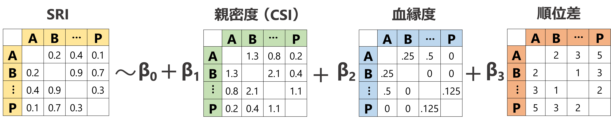

# メス間の社会関係と離合集散の関係(ネットワーク分析)  
以下では、メス同士が群れ本体で同じ日に確認された割合や、メス同士が同じ日に群れを離れた割合とメス同士の社会関係(血縁度、CSI、順位差など)をネットワーク分析を用いて検討する。  

分析には、MRQAP検定[@Dekker2007]を用いる。MRQAP検定は、簡単に言ってしまえばネットワークデータを用いた回帰分析である。MRQAP検定では、通常の**GLMやGLMMと同様に、複数の隣接行列を用いた回帰分析を行うことができる**(図\@ref(fig:fig-mrqap))。また、`aninet`パッケージ[@Weiss2023]の`glmqap`関数を用いれば、**応答変数となる隣接行列の分布として様々なもの(e.g.,正規分布、ポワソン分布、二項分布など)を仮定することができる**ので、データ形式に合った適切な分析を行うこともできる。    

```{r fig-mrqap, echo=FALSE, out.width="100%", fig.cap="MRQAP検定のイメージ図"}
  
```
<br/>  

## メス間の社会関係と同じ日に群れ本体にいた割合(SRI)の関連  
### データの加工  
まず、メス同士が群れ本体にいた割合(以後、SRI)を算出する。用いるのは、2018年時点で6歳以上で、全期間生存していた以下の15頭である。  
```{r}
femaleID <- sort(c("Kil","Mik","Koh","Aka","Ten","Ntr","Hen","Hot","Tot","Mei","Ako","Kol","Mal","Kit","Kun"))
```

以下のように算出し、オスの出入りがあった期間の群れ本体でのSRIのマトリックスを作成する。  
```{r}
no_female_over0.5 %>% 
  select(date, groupID) %>% 
  left_join(group_all, by = c("date", "groupID")) %>% 
  select(date, study_period, one_of(femaleID)) %>% 
  filter(study_period %in% c("m19", "m20","m21", "nm20", "nm21")) %>% 
  select(-date, -study_period) -> no_female_over0.5_gbi

## SRIの分子  
sri_denom <- get_denominator(no_female_over0.5_gbi,
                             index = "SRI",
                             return = "matrix")

diag(sri_denom) <- NA

## SROマトリックス  
sri_mat <- get_network(no_female_over0.5_gbi,
                       data_format = "GBI",
                       association_index = "SRI")

diag(sri_mat) <- NA
```

続いて、血縁と順位、年齢のマトリックスを作成する。  
```{r}
## 血縁マトリックス  
kin %>% 
  complete(femaleID, femaleID2) %>% 
  rename(fem1 = femaleID, fem2 = femaleID2) %>% 
  filter(fem1 %in% femaleID & fem2 %in% femaleID) %>% 
  replace_na(list(kin = 0)) %>% 
  pivot_wider(names_from = fem1,
              values_from = kin) %>% 
  datawizard::column_as_rownames(var = "fem2") %>% 
  as.matrix() -> kin_mat

rownames(kin_mat) <- femaleID
diag(kin_mat) <- NA

## 順位マトリックス  
rank <- read_csv("data/rank.csv")

kin %>% 
  complete(femaleID, femaleID2) %>% 
  left_join(rank, by = "femaleID") %>% 
  rename(rank1 = rank) %>% 
  left_join(rank, by = c("femaleID2" = "femaleID")) %>% 
  rename(rank2 = rank) %>% 
  rename(fem1 = femaleID, fem2 = femaleID2) %>% 
  filter(fem1 %in% femaleID & fem2 %in% femaleID) %>% 
  mutate(diff_rank = abs(rank1 - rank2)) %>% 
  select(fem1, fem2, diff_rank) %>% 
  replace_na(list(diff_rank = 0)) %>% 
  pivot_wider(names_from = fem1,
              values_from = diff_rank) %>% 
  datawizard::column_as_rownames(var = "fem2") %>% 
  as.matrix() -> rank_mat

rownames(rank_mat) <- femaleID
diag(rank_mat) <- NA

### 年齢マトリックス  
kin %>% 
  complete(femaleID, femaleID2) %>% 
  left_join(rank, by = "femaleID") %>% 
  rename(age1 = age) %>% 
  left_join(rank, by = c("femaleID2" = "femaleID")) %>% 
  rename(age2 = age) %>% 
  rename(fem1 = femaleID, fem2 = femaleID2) %>% 
  filter(fem1 %in% femaleID & fem2 %in% femaleID) %>% 
  mutate(diff_age = abs(age1 - age2)) %>% 
  select(fem1, fem2, diff_age) %>% 
  replace_na(list(diff_age = 0)) %>% 
  pivot_wider(names_from = fem1,
              values_from = diff_age) %>% 
  datawizard::column_as_rownames(var = "fem2") %>% 
  as.matrix() -> age_mat

rownames(age_mat) <- femaleID
diag(age_mat) <- NA
```

### GLMQAP検定  
#### モデリング  
それでは、分析を行う。SRIは0~1の間をとるため、応答変数の分布には二項分布を用いた。また、説明変数にはメス同士のCSI、血縁度、順位差を用いた。  

まず、説明変数に用いるマトリックスを標準化する。
```{r}
diag(CSI_female) <- NA

CSI_female_std <- (CSI_female - mean(CSI_female, na.rm = TRUE))/sd(CSI_female, na.rm = TRUE)
kin_mat_std <- (kin_mat - mean(kin_mat, na.rm = TRUE))/sd(kin_mat, na.rm = TRUE)
rank_mat_std <- (rank_mat - mean(rank_mat, na.rm = TRUE))/sd(rank_mat, na.rm = TRUE)
age_mat_std <- (age_mat - mean(age_mat, na.rm = TRUE))/sd(age_mat, na.rm = TRUE)
```

分析は以下のように実行する。  
```{r}
# sri_qap <- glmqap(sri_mat ~ CSI_female_std + kin_mat_std + rank_mat_std,
#                   weights = sri_denom,
#                   family = "binomial",
#                   nperm = 10000,
#                   permutation = "DSP")
# 
# saveRDS(sri_qap, "model/sri_qap.rds")
sri_qap <- readRDS("model/sri_qap.rds")
```

#### 結果の確認  
結果は以下の通り。いずれも有意な関連は見られなかった。
```{r}
sri_qap
```

#### ネットワークの確認   
SRIネットワークを図示すると以下のようになる。ノードの大きさはネットワーク内における固有ベクトル中心性を表す。    
```{r}
set.seed(1223)

diag(sri_mat) <- 0
att_sri <- met.eigen(sri_mat,
                     df = rank %>% mutate(rank_cat = ifelse(rank <= 5, "high",
                                                            ifelse(rank <= 10, "mid", "low"))),
                     dfid = 1)

sri_mat %>% 
  as_tbl_graph(directed = FALSE) %>% 
  ## 個体の属性を結合  
  left_join(att_sri %>% 
              mutate(rank_cat = fct_relevel(rank_cat,"high","mid")),
            by = c("name" = "femaleID")) %>% 
  ggraph(layout = "nicely")+
  geom_edge_link(start_cap = circle(0.5,"cm"),
                 end_cap = circle(0.5,"cm"),
                 color = "grey55",
                 aes(width = weight),
                 alpha = 0.6)+
  geom_node_point(aes(color = rank_cat,
                      size = eigen),shape = 19)+
  scale_edge_width(range = c(0.2,1.5))+
  geom_node_text(aes(label = name), color = "white")+
  scale_size(range = c(8,12))+
  theme_graph()+
  scale_color_nejm()+
  labs(color = "rank") +
  guides(size = "none") +
  theme(aspect.ratio = 0.9)+
  scale_x_continuous(expand = c(0.1,0.1))+
  scale_y_continuous(expand = c(0.12,0.11)) -> p_sri_mat

p_sri_mat

# ggsave("figures/p_sri_mat.png",p_sri_mat,
#         width = 140, height = 100, dpi = 600, units = "mm")
```

## メス間の社会関係と同じ日に群れを離れた割合の関連  
### データの加工  
まず、メス同士が群れを同じ日に出た割合を表すマトリックスを作成する。  
```{r}
tidyr::crossing(date = unique(female_out_final$date),
                femaleID1 = femaleID, 
                femaleID2 = femaleID) %>% 
  filter(!(femaleID1 == femaleID2)) %>% 
  left_join(female_out_final %>% select(date, femaleID, female_out, presence_pre),
            by = c("date", "femaleID1" = "femaleID")) %>% 
  rename(out1 = female_out, presence_pre1 = presence_pre) %>% 
  left_join(female_out_final %>% select(date, femaleID, female_out, presence_pre),
            by = c("date", "femaleID2" = "femaleID")) %>% 
  rename(out2 = female_out, presence_pre2 = presence_pre) %>% 
  filter(presence_pre1 == 1  & presence_pre2 == 1) %>% 
  mutate(co_out = ifelse(out1 == 1 & out2 == 1, 1, 0),
         out_a = ifelse(out1 == 1 & out2 == 0,1,0),
         out_b = ifelse(out1 == 0 & out2 == 1,1,0)) %>% 
  group_by(femaleID1, femaleID2) %>% 
  summarise(sum_co_out = sum(co_out),
            sum_out_a = sum(out_a),
            sum_out_b = sum(out_b)) %>% 
  ungroup() %>% 
  mutate(denom = sum_co_out + sum_out_a + sum_out_b) %>% 
  mutate(sri = sum_co_out/denom) -> female_out_sri

## 分母  
out_sri_denom <- female_out_sri %>% 
  select(femaleID1, femaleID2, denom) %>% 
  arrange(femaleID2) %>% 
  pivot_wider(names_from = femaleID2,
              values_from = denom) %>% 
  arrange(femaleID1) %>% 
  column_as_rownames(var = "femaleID1") %>% 
  as.matrix()

rownames(out_sri_denom) <- femaleID

## sri
out_sri_mat <- female_out_sri %>% 
  select(femaleID1, femaleID2, sri) %>% 
  arrange(femaleID2) %>% 
  pivot_wider(names_from = femaleID2,
              values_from = sri) %>% 
  arrange(femaleID1) %>% 
  column_as_rownames(var = "femaleID1") %>% 
  as.matrix()

rownames(out_sri_mat) <- femaleID
```

### GLMQAP検定  
#### モデリング  
それでは、分析を行う。SRIは先ほど同様に0~1の間をとるため、応答変数の分布には二項分布を用いた。また、説明変数にも先ほどと同じくメス同士のCSI、血縁度、順位差、年齢差を用いた。  

分析は以下のように実行する。  
```{r}
# out_sri_qap <- glmqap(out_sri_mat ~ CSI_female_std + kin_mat_std + rank_mat_std,
#                       weights = out_sri_denom,
#                       family = "binomial",
#                       nperm = 10000,
#                       permutation = "DSP")

# saveRDS(out_sri_qap, "model/out_sri_qap.rds")
out_sri_qap <- readRDS("model/out_sri_qap.rds")
```

#### 結果の確認  
結果は以下の通り。CSIと順位差と有意に関連していることが分かった。    

```{r}
out_sri_qap
```

CSIとSRIの関連を図示すると以下のようになる。  
```{r}
## モデルに基づく回帰曲線
coef <- coef(out_sri_qap)

fit_out_sri <- tidyr::crossing(CSI = seq(0,10.2,length = 100),
                        kin = mean(kin_mat_std, na.rm = TRUE),
                        rank = mean(rank_mat_std, na.rm = TRUE)) %>% 
  mutate(CSI_std = (CSI - mean(CSI_female, na.rm = TRUE))/sd(CSI_female, na.rm = TRUE)) %>% 
  mutate(Estimate = inv_logit_scaled(coef[1] + coef[2]*CSI_std + coef[3]*kin + coef[4]*rank))

## CSIマトリックスを縦型に  
CSI_female %>% 
  data.frame() %>% 
  rownames_as_column(var = "femaleID1") %>% 
  pivot_longer(2:16,
               names_to = "femaleID2",
               values_to = "CSI") %>% 
  filter(!(femaleID1 == femaleID2)) %>% 
  ## 重複を削除
  mutate(pair = ifelse(femaleID > femaleID2, str_c(femaleID1,"-",femaleID2),
                       str_c(femaleID2,"-",femaleID1))) %>% 
  distinct(pair, CSI) -> CSI_female_long

## SRIマトリックスを縦型に
out_sri_mat %>% 
  data.frame() %>% 
  rownames_as_column(var = "femaleID1") %>% 
  pivot_longer(2:16,
               names_to = "femaleID2",
               values_to = "SRI") %>% 
  filter(!(femaleID1 == femaleID2)) %>% 
  mutate(pair = ifelse(femaleID > femaleID2, str_c(femaleID1,"-",femaleID2),
                       str_c(femaleID2,"-",femaleID1))) %>% 
  distinct(pair, SRI) %>% 
  left_join(CSI_female_long) %>% 
  ## 図示
  ggplot(aes(x = CSI, y = SRI))+
  geom_point(size = 2, alpha = 0.8,
             shape = 1)+
  geom_line(data = fit_out_sri,
            aes(y = Estimate))+
  theme_bw(base_size = 15)
```

順位とSRIの関連を図示すると以下のようになる。  
```{r}
## モデルに基づく回帰曲線
coef <- coef(out_sri_qap)

fit_out_sri_b <- tidyr::crossing(CSI = mean(CSI_female_std, na.rm = TRUE),
                        kin = mean(kin_mat_std, na.rm = TRUE),
                        rank = seq(1,14, length = 100)) %>% 
  mutate(rank_std = (rank - mean(rank_mat, na.rm = TRUE))/sd(rank_mat, na.rm = TRUE)) %>% 
  mutate(Estimate = inv_logit_scaled(coef[1] + coef[2]*CSI + coef[3]*kin + coef[4]*rank_std))

## CSIマトリックスを縦型に  
rank_mat %>% 
  data.frame() %>% 
  rownames_as_column(var = "femaleID1") %>% 
  pivot_longer(2:16,
               names_to = "femaleID2",
               values_to = "rank") %>% 
  filter(!(femaleID1 == femaleID2)) %>% 
  ## 重複を削除
  mutate(pair = ifelse(femaleID > femaleID2, str_c(femaleID1,"-",femaleID2),
                       str_c(femaleID2,"-",femaleID1))) %>% 
  distinct(pair, rank) -> rank_female_long

## SRIマトリックスを縦型に
out_sri_mat %>% 
  data.frame() %>% 
  rownames_as_column(var = "femaleID1") %>% 
  pivot_longer(2:16,
               names_to = "femaleID2",
               values_to = "SRI") %>% 
  filter(!(femaleID1 == femaleID2)) %>% 
  mutate(pair = ifelse(femaleID > femaleID2, str_c(femaleID1,"-",femaleID2),
                       str_c(femaleID2,"-",femaleID1))) %>% 
  distinct(pair, SRI) %>% 
  left_join(rank_female_long) %>% 
  group_by(rank) %>% 
  summarise(mean = mean(SRI)) %>% 
  ## 図示
  ggplot(aes(x = rank, y = mean))+
  geom_count(alpha = 0.8,
             shape = 1)+
  geom_line(data = fit_out_sri_b,
            aes(y = Estimate))+
  theme_bw(base_size = 15)
```

### SRIマトリックスに関する分析  
#### 下位集団の検出  
モジュラリティ―が最大になるように、ネットワークを複数の下位集団に分類する。  
```{r}
diag(out_sri_mat) <- 0

graph_sri_out <- graph_from_adjacency_matrix(out_sri_mat,
                                             ## 有向グラフなら "directed"
                                             mode= "undirected", 
                                             ## 重みなしなら NULL
                                             weighted = TRUE) 

cluster_sri_out <- cluster_optimal(graph_sri_out,
                                   weights = E(graph_sri_out)$weight) 
```

結果は以下の通り。4つの集団に分類され、モジュラリティ―は0.33になった。  
```{r}
cluster_sri_out
```

図示すると以下のようになる。  
```{r}
att_out_sri <- met.eigen(out_sri_mat,
                         df = rank,
                         dfid = 1)

set.seed(123)
out_sri_mat %>% 
  as_tbl_graph(directed = FALSE) %>% 
  ## 個体の属性を結合  
  left_join(att_out_sri,
            by = c("name" = "femaleID")) %>% 
  mutate(member = as.factor(cluster_sri_out$membership)) %>% 
  ggraph(layout = "nicely")+
  geom_edge_link(start_cap = circle(0.2,"cm"),
                 end_cap = circle(0.2,"cm"),
                 color = "grey55",
                 aes(width = weight),
                 alpha = 0.6)+
  geom_node_point(aes(color = member,
                      size = eigen),
                  shape = 19)+
  scale_edge_width(range = c(0.2,1.5))+
  geom_node_text(aes(label = name), color = "white",
                 size = 2.5)+
  # geom_mark_hull(aes(x=x,y=y,group = member),
  #                concavity = 10)+
  scale_size(range = c(5,9))+
  theme_graph()+
  scale_color_nejm()+
  labs(color = "cluster id") +
  guides(size = "none") +
  theme(aspect.ratio = 0.9)+
  scale_x_continuous(expand = c(0.1,0.1))+
  scale_y_continuous(expand = c(0.12,0.11)) -> p_out_sri_mat

p_out_sri_mat

# ggsave("figures/p_out_sri_mat.png",p_out_sri_mat,
#         width = 140, height = 100, dpi = 600, units = "mm")
```


