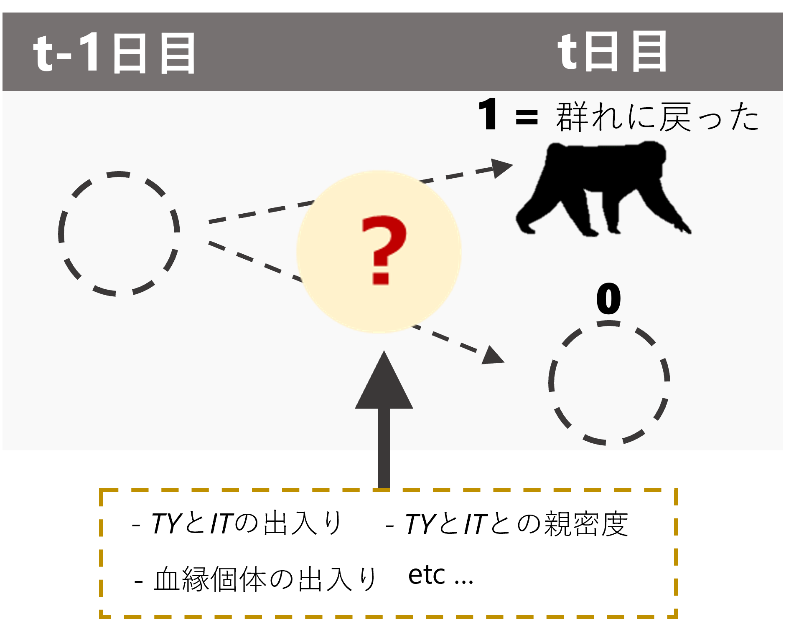
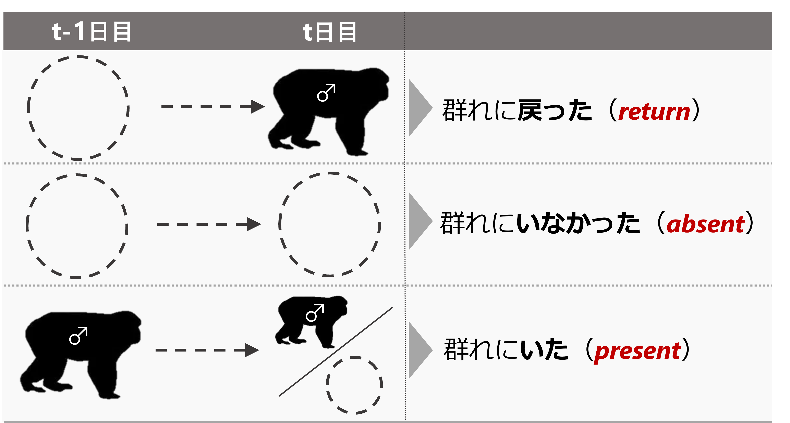

# メスが群れに戻るときのメカニズム  
本章では、メスが群れに戻るのはどのようなときなのかに関する分析を行う。以下では、メスの毎日の確認状況のデータからメスが群れに戻る要因を探る(図\@ref(fig:female-in))。

```{r female-in, out.width = "40%", fig.align = "center", echo = FALSE, fig.cap = "メスの確認状況に影響する要因"}

```
<br/>    

## データの加工  
### オスの出入り情報  
まず、オスの出入り情報について変数を作成する。第\@ref(c10)章と同様に、連続した2日間のオスの確認状況をもとに  
```{r}
TYIT_presence_pre %>% 
  mutate(TY_state4 = ifelse(TY_pre == 1 & TY == 1, "TY_stay",
                           ifelse(TY_pre == 1 & TY == 0, "TY_out",
                                  ifelse(TY_pre == 0 & TY == 1, "TY_return",
                                         ifelse(TY_pre == 0 & TY == 0, "TY_absent", NA))))) %>% 
  mutate(TY_state4 = fct_relevel(TY_state4, "TY_stay", "TY_absent","TY_return")) %>%
  mutate(IT_state4 = ifelse(IT_pre == 1 & IT == 1, "IT_stay",
                           ifelse(IT_pre == 1 & IT == 0, "IT_out",
                                  ifelse(IT_pre == 0 & IT == 0, "IT_absent",
                                         ifelse(IT_pre == 0 & IT == 1, "IT_return", NA))))) %>% 
  mutate(IT_state4 = fct_relevel(IT_state4, "IT_stay", "IT_absent","IT_return")) %>% 
  mutate(TY_state = ifelse(TY_pre == 0 & TY == 1, "TY_return",
                           ifelse(TY_pre == 0 & TY == 0, "TY_absent",
                                  ifelse(TY_pre == 1, "TY_present", NA)))) %>% 
  mutate(TY_state = fct_relevel(TY_state, "TY_present", "TY_absent","TY_return")) %>%
  mutate(IT_state = ifelse(IT_pre == 0 & IT == 1, "IT_return",
                           ifelse(IT_pre == 0 & IT == 0, "IT_absent",
                                  ifelse(IT_pre == 1, "IT_present", NA)))) %>% 
  mutate(IT_state = fct_relevel(IT_state, "IT_present", "IT_absent","IT_return")) %>% 
  mutate(TY_return = ifelse(TY_state4 == "TY_return", 1, 0),
         IT_return = ifelse(IT_state4 == "IT_return", 1, 0)) %>% 
  replace_na(list(IT_state4 = "IT_absent",
                  IT_state = "IT_absent",
                  IT_return = 0)) -> male_state
```

### メスが群れに戻った日の同定   
続いて、各メスが群れに戻ったか否かを記したデータフレームを作成する。  
```{r}
## 発情状態とアカンボウの有無を結合  
female_pre_long %>% 
  mutate(date_pre = date - 1) %>% 
  left_join(female_pre_long %>% 
              select(date, femaleID, presence) %>% 
              rename(presence_pre = presence),
            by = c("date_pre" = "date", "femaleID")) %>% 
  mutate(female_in = ifelse(is.na(presence_pre), NA,
                         ifelse(presence_pre == 0 & presence == 1,1,0))) %>% 
  ## 前日にメスがいない日のみを抽出
  filter(presence_pre == 0) %>% 
  ## オスの出入りがある期間のみを抽出  
  filter(study_period %in% c("m19", "m20", "m21", "nm20", "nm21")) %>% 
  left_join(female_all %>% 
              select(date,femaleID, rs2), by = c("date","femaleID")) -> female_in
```

### 血縁個体が群れに戻ったか否か   
続いて、各観察日に血縁個体が群れに戻ったか否かを算出する。  

```{r}
kin <- read_csv("../Data/data/others/kin.csv")

female_in %>% 
  select(groupID, date, study_period, femaleID, female_in, presence_pre) %>% 
  ## 他のメスのデータを結合  
  left_join(att %>% 
              filter(age >= 6) %>% 
              select(study_period, femaleID) %>% 
              rename(femaleID2 = femaleID),
            by = "study_period") %>% 
  filter(femaleID != femaleID2) %>% 
  ## 他のメスが群れを離れたか否かの列を作成
  left_join(female_in %>% 
              select(groupID, date, femaleID, female_in) %>% 
              rename(female_in2 = female_in,
                     femaleID2 = femaleID),
            by = c("groupID","date", "femaleID2")) %>% 
  replace_na(list(female_in2 = 0)) %>%
  ## 相手のメスとの血縁度を結合  
  left_join(kin, by = c("femaleID", "femaleID2")) %>% 
  filter(female_in2 == 1) %>% 
  ## それぞれの日で離れたメスの最大の血縁度を算出
  group_by(groupID, date, femaleID) %>% 
  summarise(max_kin = max(kin),
            ## 血縁カテゴリーも作成する  
            kin_cat = as.character(max(kin))) %>% 
  mutate(kin_01 = ifelse(max_kin > 0, 1,0)) -> kin_female_in
```

### 当日の確認メス割合、発情メス数    
当日メスが群れに戻れば確認されたメスの割合も増加する可能性が高い。そこで、その日戻ったメスの数を除いたメス割合を算出した。  

```{r}
## それぞれの日に戻ったメスを除いた確認メス割合    
prop_female <- female_in %>% 
  group_by(date) %>% 
  summarise(no_female_in = sum(female_in)) %>% 
  ungroup() %>% 
  right_join(no_female_over0.5) %>% 
  mutate(no_female_b = no_female - no_female_in) %>% 
  mutate(prop_female_b = no_female_b/max_female) 

## まず、戻った個体のうち発情して他個体の数
sum_est_in <- female_in %>% 
  filter(presence == "1") %>% 
  group_by(date) %>% 
  summarise(no_est_in = sum(rs2))

## それらを除いた発情メス数を算出  
sum_est_b <-  sum_est %>% 
  left_join(sum_est_in, by = "date") %>% 
  replace_na(list(no_est_in = 0)) %>% 
  mutate(no_est_b = no_est - no_est_in)
```

### 全データの結合   
最後に、全データを結合する。  
```{r}
female_in %>% 
  left_join(no_female_over0.5 %>% 
              select(date, prop_female)  %>% 
              rename(date_pre = date),
            by = c("date_pre")) %>% 
  left_join(male_state %>% select(date, groupID, TY_state4, IT_state4, TY_state, IT_state, TY_return, IT_return),
            by = c("date", "groupID")) %>% 
  left_join(CSI_TY %>% 
              rename(femaleID = subject) %>% 
              select(femaleID, CSI_TY),
            by = "femaleID") %>% 
  left_join(CSI_IT %>% 
              rename(femaleID = subject) %>% 
              select(femaleID, CSI_IT),
            by = "femaleID") %>% 
  left_join(no_female_over0.5_b %>% 
              select(date, TY, IT) %>% 
              mutate(date = date + 1) %>% 
              rename(TY_pre = TY,
                     IT_pre = IT)) %>% 
  left_join(kin_female_in,
            by = c("groupID","date", "femaleID")) %>% 
  left_join(sum_ntm, by = c("date")) %>% 
  left_join(sum_est_b %>% select(date, groupID, no_est_b), by = c("date","groupID")) %>% 
  left_join(prop_female %>% select(date, groupID, prop_female_b),
            by = c("date", "groupID")) %>% 
  replace_na(list(max_kin = 0,
                  kin_cat = "no")) %>% 
  mutate(kin_01 = ifelse(max_kin > 0, 1,0)) %>% 
  mutate(kin_cat = as.factor(kin_cat)) %>% 
  group_by(study_period) %>% 
  ## 相対順位を算出  
  mutate(max_rank = max(rank)) %>% 
  ungroup() %>% 
  mutate(rank_scaled = rank/max_rank) -> female_in_final
```

データはこちらの通り。  
```{r}
datatable(female_in_final %>% mutate(across(where(is.numeric),~round(.,2))),
          options = list(scrollX = 50))
```

## 分析  
以下では、交尾期と非交尾期に分けて分析を行う。分析に含まれるのは、6歳以上でかつTY、ITとのCSIが算出できる個体(= 2019年時点で6歳以上の個体)である。

### 交尾期  
#### データの加工  
まず、データの加工を行う。データ数が少ないのと、区別が難しいので発情/非発情は分けない。    
```{r}
female_in_m <- female_in_final %>% 
  filter(!str_detect(study_period, "nm")) %>% 
  drop_na(CSI_TY)  %>% 
  mutate(date = as_date(date)) %>% 
  ## 2019/9/27は発情のデータがないので除外  
  filter(date != "2019-09-27") %>% 
  mutate(CSI_TY_std = standardize(CSI_TY),
         CSI_IT_std = standardize(CSI_IT),
         ntm_std = standardize(no_ntm),
         prop_std = standardize(prop_female_b),
         est_std = standardize(no_est_b),
         rank_std = standardize(rank_scaled),
         age_std = standardize(age)) %>% 
  mutate(N = 1:n())
```

*TY*と*IT*の動向の組み合わせごとのN数は以下の通り。  
```{r}
female_in_m %>% 
  group_by(TY_return, IT_return) %>% 
  summarise(N = n())
```

戻ったメスの発情状態は以下の通り。だいたい2/3は非発情メス。  
```{r}
female_in_m %>%
  filter(female_in == "1") %>% 
  group_by(rs2) %>% 
  summarise(N = n())
```


#### モデリング1        
まず、*TY*と*IT*が群れに戻ったか否かという2水準の変数を用いてモデリングを行う。モデルの詳細は以下のとおりである。なお、連続変数はすべて標準化している。    

- 応答変数: メスが群れに戻ったか否か($female_in$)  
- 説明変数: TYが群れに戻ったか($TY_return$)、TYとの親密度($CSI_TY$)、これらの交互作用、ITが群れに戻ったか($IT_return$)、ITとの親密度($CSI_IT$)、これらの交互作用、年齢($age_std$)、順位$rank_std$、当日の確認メス割合$prop_std$、当日の発情メス数$est_std$、当日の群れ外オス数$ntm_std$  
- ランダム切片: メスID($femaleID$)、日付($date$)  
- 分布: ベルヌーイ分布  

モデルは以下のように実行する。  
```{r}
### ITとCSIの交互作用はVIFが高いので除く      
m_female_in_m <-  brm(data = female_in_m %>% 
                               mutate(date = as.factor(date)),
                        female_in ~ TY_return*CSI_TY_std + IT_return*CSI_IT_std + kin_01 +
                        rank_std + age_std + ntm_std + prop_std + est_std +
                         study_period + (1|femaleID) + (1|date),
                family = "bernoulli",
                prior = c(prior(student_t(4,0,10),class = Intercept),
                prior(student_t(4,0,10), class = b),
                prior(student_t(4,0,5), class = sd)),
  iter = 11000, warmup = 1000, seed = 112,
  control=list(adapt_delta = 0.999, max_treedepth = 15),
  backend = "cmdstanr",
  file = "model/m_female_in_m")

## 2021年を除く  
female_in_m_bf21 <- female_in_m %>% 
  filter(study_period != "m21") %>% 
   mutate(CSI_TY_std = standardize(CSI_TY),
          CSI_IT_std = standardize(CSI_IT),
          ntm_std = standardize(no_ntm),
          prop_std = standardize(prop_female_b),
          rank_std = standardize(rank_scaled),
          age_std = standardize(age),
          est_std = standardize(no_est_b))

## TYの動向とCSIの交互作用はVIFが高いので除外  
m_female_in_m_bf21 <-  brm(data = female_in_m_bf21 %>% 
                               mutate(date = as.factor(date)),
                        female_in ~ TY_return*CSI_TY_std + IT_return*CSI_IT_std + kin_01 +
                        rank_std + age_std + ntm_std + prop_std + est_std +
                         study_period + (1|femaleID) + (1|date),
                family = "bernoulli",
                prior = c(prior(student_t(4,0,10),class = Intercept),
                prior(student_t(4,0,10), class = b),
                prior(student_t(4,0,5), class = sd)),
  iter = 11000, warmup = 1000, seed = 124,
  control=list(adapt_delta = 0.999, max_treedepth = 15),
  backend = "cmdstanr",
  file = "model/m_female_in_m_bf21")
```

##### モデルチェック  
まず、DHARMaパッケージ[@Hartig2022]とDHARMa.helperパッケージ[@Francisco2023]でモデルの前提が満たされているかを確認する。特に問題はないよう。   
```{r, fig.height = 4}
## 全期間    
dh_female_in_m <- dh_check_brms(m_female_in_m, quantreg = TRUE)

## 2021年交尾期以後を除く 
dh_female_in_m_bf21 <- dh_check_brms(m_female_in_m_bf21, quantreg = TRUE)
```
<br/>  

bayesplotパッケージ[@Gabry2022]の`pp_check`関数で、事後分布からの予測分布と実測値の分布を比較しても大きな乖離はない。   
```{r, fig.height = 4.5}
## 全期間  
pp_check(m_female_in_m, ndraws = 100)+
  theme_bw()+
  theme(aspect.ratio = 0.9)

## 2021交尾期以後を除く  
pp_check(m_female_in_m_bf21, ndraws = 100)+
  theme_bw()+
  theme(aspect.ratio = 0.9)
```  
<br/>  

多重共線性のチェックもお個あったが、VIFに問題はない。  
```{r}
## 全期間
check_collinearity(m_female_in_m)

## 2021年交尾期以後を除く  
check_collinearity(m_female_in_m_bf21)
```
<br/>  

最後に残差の時系列相関のチェックを行う。  

まず、全期間のデータを用いたモデルについて。残差の自己相関をプロットすると、明確なパターンは見られなかった。また、Ljung-Box検定で3時点前までの残差との自己相関を検定したところ、有意な自己相関を示したのはAkaとTotだけだった。     

```{r, fig.dim = c(10,10)}
res_female_in_m <- female_in_m %>% 
  mutate(resid = dh_female_in_m$scaledResiduals) %>% 
  mutate(date = as_date(date)) %>% 
  group_by(femaleID) %>% 
  complete(date = seq.Date(min(date), max(date), by = "1 day")) %>% 
  ungroup()

females <- unique(female_in_m$femaleID)
acf_female_in_m <- NULL

for(i in seq_along(females)){
  data <- res_female_in_m %>% 
    filter(femaleID == females[i])
  
  out.acf <- acf(data$resid,
                 lag.max = 5,
                 na.action = na.pass,
                 plot = F)
  
  box_test <- Box.test(data$resid, type = "Ljung-Box", lag = 3)
  
  out.df <- data.frame(Timelag = out.acf$lag,
                       Acf = out.acf$acf,
                       femaleID = females[i],
                       p = box_test$p.value)
  
  acf_female_in_m <- bind_rows(acf_female_in_m, out.df)
}

acf_female_in_m %>% 
  mutate(p = str_c("p = ",round(p,2))) %>% 
  ggplot(aes(x = Timelag,
             y = 0))+
  geom_segment(aes(xend = Timelag,
                   yend = Acf))+
  geom_text(aes(x = 4, y = 0.8,
                label = p),
            size = 3.5,
            family = "Times New Roman")+
  theme_bw()+
  theme(aspect.ratio = 1)+
  facet_rep_wrap(~femaleID,
                 repeat.tick.labels = TRUE)
```
<br/>  

続いて、2021年交尾期以後を除いたモデルでも同様の分析を行う。有意な自己相関を示した個体はいなかった。    
```{r, fig.dim = c(10,10)}
res_female_in_m_bf21 <- female_in_m_bf21 %>% 
  mutate(resid = dh_female_in_m_bf21$scaledResiduals) %>% 
  mutate(date = as_date(date)) %>% 
  group_by(femaleID) %>% 
  complete(date = seq.Date(min(date), max(date), by = "1 day")) %>% 
  ungroup()

females <- unique(female_in_m_bf21$femaleID)
acf_female_in_m_bf21 <- NULL

for(i in seq_along(females)){
  data <- res_female_in_m_bf21 %>% 
    filter(femaleID == females[i])
  
  out.acf <- acf(data$resid,
                 lag.max = 5,
                 na.action = na.pass,
                 plot = F)
  
  box_test <- Box.test(data$resid, type = "Ljung-Box", lag = 3)
  
  out.df <- data.frame(Timelag = out.acf$lag,
                       Acf = out.acf$acf,
                       femaleID = females[i],
                       p = box_test$p.value)
  
  acf_female_in_m_bf21 <- bind_rows(acf_female_in_m_bf21, out.df)
}

acf_female_in_m_bf21 %>% 
  mutate(p = str_c("p = ",round(p,2))) %>% 
  ggplot(aes(x = Timelag,
             y = 0))+
  geom_segment(aes(xend = Timelag,
                   yend = Acf))+
  geom_text(aes(x = 4, y = 0.8,
                label = p),
            size = 3.5,
            family = "Times New Roman")+
  theme_bw()+
  theme(aspect.ratio = 1)+
  facet_rep_wrap(~femaleID,
                 repeat.tick.labels = TRUE)
```
<br/>  

##### 結果の確認   
まずは全期間のデータを用いたモデルについて。結果は以下の通り。
```{r, echo = FALSE}
model_parameters(m_female_in_m,
                 dispersion = TRUE, ci = 0.95) %>% 
  data.frame() %>% 
  select(1,2,3,5,6, 7,8,9) %>% 
  mutate("95%CI" = str_c("[",sprintf("%.2f",CI_low),",",sprintf("%.2f",CI_high),"]")) %>% 
  select(c(1,2,3, 9), everything()) %>% 
  select(-CI_low, -CI_high) %>% 
  mutate(pd = str_c(sprintf("%.2f",pd*100),"%")) %>% 
  rename(PD = pd) %>% 
  mutate(Parameter = fct_relevel(Parameter, "b_Intercept","b_TY_return","b_CSI_TY_std",
                                  "b_TY_return:CSI_TY_std",
                                  "b_IT_return","b_CSI_IT_std",
                                  "b_IT_return:CSI_IT_std",
                                  "b_kin_01", 
                                  "b_ntm_std", "b_est_std",
                                  "b_rank_std", "b_age_std",
                                  "b_prop_std",
                                  "b_study_periodm20","b_study_periodm21")) %>% 
  arrange(Parameter) %>% 
  mutate(Parameter = str_replace_all(Parameter, c("b_Intercept"="切片",
                                     "b_study_periodm20" = "調査期間(m20 vs m19)",
                                     "b_study_periodm21" = "調査期間(m21 vs m19)",
                                      "^b_TY_stateTY_return$"="TY(return vs present)",
                                     "^b_TY_return$"="TYが戻ったか(vs  否)",
                                     "^b_IT_return$"="ITが戻ったか(vs  否)",
                                     "b_rank_std" = "順位",
                                     "b_age_std" = "年齢",
                                     "b_est_std" = "当日の発情メス数", 
                                     "b_prop_std" = "当日確認したメスの割合",
                                     "b_ntm_std" = "当日の群れ外オス数",
                                     "b_kin_01" = "血縁のメスが群れに戻ったか\n(vs 否)",   
                                     "b_CSI_TY_std" = "TYとの親密度(CSI)",
                                     "b_CSI_IT_std" = "ITとの親密度(CSI)",
                                     "b_TY_return:CSI_TY_std" =
                                       "TYが戻ったか(vs 否) \n ×TYとの親密度",
                                     "b_IT_return:CSI_IT_std" =
                                       "ITが戻ったか(vs 否) \n ×ITとの親密度"))) %>% 
  rename("Explanatory variables"="Parameter") %>% 
  flextable() %>% 
  colformat_double(digits=2) %>% 
  set_table_properties(layout="autofit",width = 1) %>% 
  autofit(add_w = 0.2) %>% 
  font(part = "header", fontname = "Times New Roman") %>% 
  font(part = "body", j=2:7, fontname = "Times New Roman") %>% 
  font(part = "body", j=1, fontname = "Yu Gothic") %>% 
  bold(j=c(1,2,3,4,5),i = c(4,5, 10, 11, 13),bold = TRUE) %>% 
  theme_zebra() %>% 
  align(j=2:7,part = "all",align = "center") -> table_female_in_m

table_female_in_m

# save_as_image(table_female_in_m,
#               "tables/table_female_in_m.tiff",
#               res = 600)
```
<br/>  

続いて、2021年交尾期以後を除いたモデルの結果は以下の通り。
```{r, echo = FALSE}
model_parameters(m_female_in_m_bf21,
                 dispersion = TRUE, ci = 0.95) %>% 
  data.frame() %>% 
  select(1,2,3,5,6, 7,8,9) %>% 
  mutate("95%CI" = str_c("[",sprintf("%.2f",CI_low),",",sprintf("%.2f",CI_high),"]")) %>% 
  select(c(1,2,3, 9), everything()) %>% 
  select(-CI_low, -CI_high) %>% 
  mutate(pd = str_c(sprintf("%.2f",pd*100),"%")) %>% 
  rename(PD = pd) %>% 
  mutate(Parameter = fct_relevel(Parameter, "b_Intercept","b_TY_return","b_CSI_TY_std",
                                  "b_TY_return:CSI_TY_std",
                                  "b_IT_return","b_CSI_IT_std",
                                  "b_IT_return:CSI_IT_std",
                                  "b_kin_01", 
                                  "b_ntm_std", "b_est_std",
                                  "b_rank_std", "b_age_std",
                                  "b_prop_std",
                                  "b_study_periodm20")) %>% 
  arrange(Parameter) %>% 
  mutate(Parameter = str_replace_all(Parameter, c("b_Intercept"="切片",
                                     "b_study_periodm20" = "調査期間(m20 vs m19)",
                                     "b_study_periodm21" = "調査期間(m21 vs m19)",
                                      "^b_TY_stateTY_return$"="TY(return vs present)",
                                     "^b_TY_return$"="TYが戻ったか(vs  否)",
                                     "^b_IT_return$"="ITが戻ったか(vs  否)",
                                     "b_rank_std" = "順位",
                                     "b_age_std" = "年齢",
                                     "b_est_std" = "当日の発情メス数", 
                                     "b_prop_std" = "当日確認したメスの割合",
                                     "b_ntm_std" = "当日の群れ外オス数",
                                     "b_kin_01" = "血縁のメスが群れに戻ったか\n(vs 否)",   
                                     "^b_rate_agg_all_std$" = "前日のオスからの攻撃頻度",
                                     "b_CSI_TY_std" = "TYとの親密度(CSI)",
                                     "b_CSI_IT_std" = "ITとの親密度(CSI)",
                                     "b_TY_return:CSI_TY_std" =
                                       "TYが戻ったか(vs 否) \n ×TYとの親密度",
                                     "b_IT_return:CSI_IT_std" =
                                       "ITが戻ったか(vs 否) \n ×ITとの親密度"))) %>% 
  rename("Explanatory variables"="Parameter") %>% 
  flextable() %>% 
  colformat_double(digits=2) %>% 
  set_table_properties(layout="autofit",width = 1) %>% 
  autofit(add_w = 0.2) %>% 
  font(part = "header", fontname = "Times New Roman") %>% 
  font(part = "body", j=2:7, fontname = "Times New Roman") %>% 
  font(part = "body", j=1, fontname = "Yu Gothic") %>% 
  bold(j=c(1,2,3,4,5),i = c(4,5),bold = TRUE) %>% 
  theme_zebra() %>% 
  align(j=2:7,part = "all",align = "center") -> table_female_in_m_bf21

table_female_in_m_bf21

# save_as_image(table_female_in_m_bf21,
#               "tables/table_female_in_m_bf21.tiff",
#               res = 600)
```
<br/>  

##### 結果の図示  
###### TYの動向・ CSIとメスに戻る確率の関連  
まずは、`estimate_contrasts`関数を用いて、*TY*とのCSIに応じてオッズ比の対数をとったものがどのように変わるかを図示する。*TY*と親密度が高いメスは同じ日に群れに戻る確率が高いことが分かる。    

```{r, fig.dim = c(12,5)}
cont_female_in_m <- estimate_contrasts(m_female_in_m,
                                       contrast = "TY_return = c(0,1)",
                                       at = "CSI_TY_std",
                                       length = 50)

cont_female_in_m %>% 
  rename(Level1 = Level2, Level2 = Level1) %>% 
  mutate(Difference = -Difference) %>% 
  data.frame() %>% 
  rename(CSI_TY = CSI_TY_std) %>% 
  mutate(CSI_TY = sd(female_in_m$CSI_TY)*CSI_TY + mean(female_in_m$CSI_TY)) %>% 
  ggplot(aes(x = CSI_TY, y = Difference)) +
  geom_hline(aes(yintercept = 0),
             linetype = "dashed",
             color = "grey30",
             linewidth = 1)+
  geom_segment(data = CSI_TY,
             aes(xend = CSI_TY, y=-2, yend = 0),
             color = "firebrick3",
             alpha = 0.8, size = 0.6,
             arrow = arrow(length = unit(8, "points"))) +
  geom_line()+
  geom_ribbon(aes(ymin = -CI_low, ymax = -CI_high),
              alpha = 0.2)+
  theme_bw(base_size = 18)+
  theme(aspect.ratio = 1) +
  labs(y = "Log odds ratio", x = expression(paste("CSI with ",italic("TY")))) +
  scale_x_continuous(breaks = seq(0,3.5,0.5))+
  theme(axis.title.y = element_text(family = "Times New Roman"),
        axis.title.x = element_text(family = "Times New Roman",
                                    size = 15),
        axis.text.x = element_text(family = "Times New Roman",
                                   size = 12),
        axis.text.y = element_text(family = "Times New Roman"),
        aspect.ratio = 1,
        strip.background = element_blank(),
        strip.text = element_text(hjust = 0))+
  scale_y_continuous(breaks = seq(-20,20,2)) -> p_female_in_m_TYcsi

p_female_in_m_TYcsi

# ggsave("figures/p_female_in_m_TYcsi.png",
#        p_female_in_m_TYcsi, dpi = 900, units = "mm",
#          width = 100, height = 100)
```
<br/>  

###### ITの動向・ CSIとメスに戻る確率の関連  
続いて、*IT*とのCSIに応じてオッズ比の対数をとったものがどのように変わるかを図示する。

```{r, fig.dim = c(12,5)}
cont_female_in_m_IT <- estimate_contrasts(m_female_in_m,
                                          contrast = "IT_return = c(0,1)",
                                          at = "CSI_IT_std",
                                          length = 50)

cont_female_in_m_IT %>% 
  rename(Level1 = Level2, Level2 = Level1) %>% 
  mutate(Difference = -Difference) %>% 
  data.frame() %>% 
  rename(CSI_IT = CSI_IT_std) %>% 
  mutate(CSI_IT = sd(female_in_m$CSI_IT)*CSI_IT + mean(female_in_m$CSI_IT)) %>% 
  ggplot(aes(x = CSI_IT, y = Difference)) +
  geom_hline(aes(yintercept = 0),
             linetype = "dashed",
             color = "grey30",
             linewidth = 1)+
  geom_segment(data = CSI_IT,
             aes(xend = CSI_IT, y=-1.1, yend = 0),
             color = "firebrick3",
             alpha = 0.8, size = 0.6,
             arrow = arrow(length = unit(8, "points"))) +
  geom_line()+
  geom_ribbon(aes(ymin = -CI_low, ymax = -CI_high),
              alpha = 0.2)+
  theme_bw(base_size = 18)+
  theme(aspect.ratio = 1) +
  labs(y = "Log odds ratio", x = expression(paste("CSI with ",italic("IT")))) +
  scale_x_continuous(breaks = seq(0,7,0.5))+
  theme(axis.title.y = element_text(family = "Times New Roman"),
        axis.title.x = element_text(family = "Times New Roman",
                                    size = 15),
        axis.text.x = element_text(family = "Times New Roman",
                                   size = 12),
        axis.text.y = element_text(family = "Times New Roman"),
        aspect.ratio = 1,
        strip.background = element_blank(),
        strip.text = element_text(hjust = 0))+
  scale_y_continuous(breaks = seq(-40,100,2)) -> p_female_in_m_ITcsi

p_female_in_m_ITcsi

# ggsave("figures/p_female_in_m_ITcsi.png",
#        p_female_in_m_ITcsi, dpi = 900, units = "mm",
#          width = 100, height = 100)
```
<br/>  

2021年の交尾期を除いたモデルの結果は以下のとおりである。  
```{r, fig.dim = c(12,5)}
cont_female_in_m_IT_bf21 <- estimate_contrasts(m_female_in_m_bf21,
                                               contrast = "IT_return = c(0,1)",
                                               at = "CSI_IT_std",
                                               length = 50)

cont_female_in_m_IT_bf21 %>% 
  rename(Level1 = Level2, Level2 = Level1) %>% 
  mutate(Difference = -Difference) %>% 
  data.frame() %>% 
  rename(CSI_IT = CSI_IT_std) %>% 
  mutate(CSI_IT = sd(female_in_m_bf21$CSI_IT)*CSI_IT + mean(female_in_m_bf21$CSI_IT)) %>% 
  ggplot(aes(x = CSI_IT, y = Difference)) +
  geom_hline(aes(yintercept = 0),
             linetype = "dashed",
             color = "grey30",
             linewidth = 1)+
  geom_segment(data = CSI_IT,
             aes(xend = CSI_IT, y=-1.7, yend = 0),
             color = "firebrick3",
             alpha = 0.8, size = 0.6,
             arrow = arrow(length = unit(8, "points"))) +
  geom_line()+
  geom_ribbon(aes(ymin = -CI_low, ymax = -CI_high),
              alpha = 0.2)+
  theme_bw(base_size = 18)+
  theme(aspect.ratio = 1) +
  labs(y = "Log odds ratio", x = expression(paste("CSI with ",italic("IT")))) +
  scale_x_continuous(breaks = seq(0,7,0.5))+
  theme(axis.title.y = element_text(family = "Times New Roman"),
        axis.title.x = element_text(family = "Times New Roman",
                                    size = 15),
        axis.text.x = element_text(family = "Times New Roman",
                                   size = 12),
        axis.text.y = element_text(family = "Times New Roman"),
        aspect.ratio = 1,
        strip.background = element_blank(),
        strip.text = element_text(hjust = 0))+
  scale_y_continuous(breaks = seq(-40,100,2)) -> p_female_in_m_ITcsi_bf21

p_female_in_m_ITcsi_bf21

# ggsave("figures/p_female_in_m_ITcsi_bf21.png",
#        p_female_in_m_ITcsi_bf21, dpi = 900, units = "mm",
#          width = 100, height = 100)
```
<br/>   

###### メス同士の血縁度との関連  
続いて、血縁のメスと同じ日に群れに戻る確率を図示する。図示には、少なくとも機会が3回以上あった個体のデータのみを用いている。  
```{r}
female_in_m %>% 
  mutate(kin_01 = as.factor(kin_01)) %>% 
  group_by(kin_01, femaleID) %>% 
  summarise(prop = mean(female_in),
            n =  n()) %>% 
  ungroup() %>% 
  filter(n >= 3) %>% 
  ggplot(aes(x = kin_01, y = prop))+
  geom_count(alpha = 0.5)+
  geom_line(aes(group = femaleID))+
  scale_size(range = c(2,8))+
  theme_bw(base_size = 13)+
  labs(x = "If kin females returned the group",
       y = "Probability of returning to main group",
       color = "Study period",
       fill = "Study period")+
  coord_cartesian(xlim = c(1.2,1.7),
                  ylim = c(0,1.15))+
  scale_x_discrete(labels = c("No", "Yes")) +
  scale_y_continuous(breaks = seq(0,1,0.2)) +
  theme(axis.title.y = element_text(family = "Times New Roman",
                                    size = 12),
        axis.title.x = element_text(family = "Times New Roman", size =12),
        axis.text = element_text(family = "Times New Roman",
                                 size = 12),
        legend.title = element_text(family = "Times New Roman"),
        legend.text = element_text(family = "Times New Roman"),
        aspect.ratio = 0.9) +
  geom_signif(xmin = 1, xmax = 2,
              y_position = 1.1, annotation = "***",
              vjust = 0.01,
              textsize = 5) -> p_female_in_kin

p_female_in_kin

# ggsave("figures/p_female_in_kin.png",p_female_in_kin, dpi = 600, units = "mm",
#          width = 120, height = 100)
```

#### モデリング2   
##### データの加工  
続いて、*TY*と*IT*の動向をより細かくして調べてみる(図\@ref(fig:TYITstate2))。  
```{r TYITstate2, out.width = "40%", fig.align = "center", echo = FALSE, fig.cap = "3つに分けたオスの動向"}  

```
<br/>  

このとき、各オスの動向の組み合わせごとのデータ数は以下の通り。     
```{r}
female_in_m %>% 
  group_by(TY_state, IT_state) %>% 
  summarise(N = n())
```

それぞれの動向ごとのデータ数は以下の通り。  
```{r}
table(female_in_m$TY_state)
table(female_in_m$IT_state)
```

##### モデリング  

モデルは以下のように実行する。  
```{r}
### ITとCSIの交互作用はVIFが高いので除く      
m_female_in_m_TYstate <-  brm(data = female_in_m %>% 
                               mutate(date = as.factor(date)),
                        female_in ~ TY_state*CSI_TY_std + IT_state + CSI_IT_std + kin_01 +
                        rank_std + age_std + ntm_std + est_std + prop_std +
                         study_period + (1|femaleID) + (1|date),
                family = "bernoulli",
                prior = c(prior(student_t(4,0,10),class = Intercept),
                prior(student_t(4,0,10), class = b),
                prior(student_t(4,0,5), class = sd)),
  iter = 11000, warmup = 1000, seed = 123,
  control=list(adapt_delta = 0.999, max_treedepth = 15),
  backend = "cmdstanr",
  file = "model/m_female_in_m_TYstate")

## TYの動向とCSIの交互作用、ITの動向とCSIの交互作用はVIFが高いので除外  
m_female_in_m_TYstate_bf21 <-  brm(data = female_in_m_bf21 %>% 
                               mutate(date = as.factor(date)),
                        female_in ~ TY_state + CSI_TY_std + IT_state + CSI_IT_std + kin_01 +
                        rank_std + age_std + ntm_std + prop_std + est_std +
                         study_period + (1|femaleID) + (1|date),
                family = "bernoulli",
                prior = c(prior(student_t(4,0,10),class = Intercept),
                prior(student_t(4,0,10), class = b),
                prior(student_t(4,0,5), class = sd)),
  iter = 11000, warmup = 1000, seed = 124,
  control=list(adapt_delta = 0.999, max_treedepth = 15),
  backend = "cmdstanr",
  file = "model/m_female_in_m_TYstate_bf21")
```

##### モデルチェック  
まず、DHARMaパッケージ[@Hartig2022]とDHARMa.helperパッケージ[@Francisco2023]でモデルの前提が満たされているかを確認する。特に問題はないよう。   
```{r, fig.height = 4}
## 全期間    
dh_female_in_m_TYstate <- dh_check_brms(m_female_in_m_TYstate, quantreg = TRUE)

## 2021年交尾期以後を除く 
dh_female_in_m_TYstate_bf21 <- dh_check_brms(m_female_in_m_TYstate_bf21, quantreg = TRUE)
```
<br/>  

bayesplotパッケージ[@Gabry2022]の`pp_check`関数で、事後分布からの予測分布と実測値の分布を比較しても大きな乖離はない。   
```{r, fig.height = 4.5}
## 全期間  
pp_check(m_female_in_m_TYstate, ndraws = 100)+
  theme_bw()+
  theme(aspect.ratio = 0.9)

## 2021交尾期以後を除く  
pp_check(m_female_in_m_TYstate_bf21, ndraws = 100)+
  theme_bw()+
  theme(aspect.ratio = 0.9)
```  
<br/>  

多重共線性のチェックも行ったが、VIFに問題はない。  
```{r}
## 全期間
check_collinearity(m_female_in_m_TYstate)

## 2021年交尾期以後を除く  
check_collinearity(m_female_in_m_TYstate_bf21)
```
<br/>  

最後に残差の時系列相関のチェックを行う。  

まず、全期間のデータを用いたモデルについて。残差の自己相関をプロットすると、明確なパターンは見られなかった。また、Ljung-Box検定で3時点前までの残差との自己相関を検定したところ、有意な自己相関を示したのはAkaとTotだけだった。     
```{r, fig.dim = c(10,10)}
res_female_in_m_TYstate <- female_in_m %>% 
  mutate(resid = dh_female_in_m_TYstate$scaledResiduals) %>% 
  mutate(date = as_date(date)) %>% 
  group_by(femaleID) %>% 
  complete(date = seq.Date(min(date), max(date), by = "1 day")) %>% 
  ungroup()

females <- unique(female_in_m$femaleID)
acf_female_in_m_TYstate <- NULL

for(i in seq_along(females)){
  data <- res_female_in_m_TYstate %>% 
    filter(femaleID == females[i])
  
  out.acf <- acf(data$resid,
                 lag.max = 5,
                 na.action = na.pass,
                 plot = F)
  
  box_test <- Box.test(data$resid, type = "Ljung-Box", lag = 3)
  
  out.df <- data.frame(Timelag = out.acf$lag,
                       Acf = out.acf$acf,
                       femaleID = females[i],
                       p = box_test$p.value)
  
  acf_female_in_m_TYstate <- bind_rows(acf_female_in_m_TYstate, out.df)
}

acf_female_in_m_TYstate %>% 
  mutate(p = str_c("p = ",round(p,2))) %>% 
  ggplot(aes(x = Timelag,
             y = 0))+
  geom_segment(aes(xend = Timelag,
                   yend = Acf))+
  geom_text(aes(x = 4, y = 0.8,
                label = p),
            size = 3.5,
            family = "Times New Roman")+
  theme_bw()+
  theme(aspect.ratio = 1)+
  facet_rep_wrap(~femaleID,
                 repeat.tick.labels = TRUE)
```
<br/>  

続いて、2021年交尾期以後を除いたモデルでも同様の分析を行う。有意な自己相関を示した個体はいなかった。    
```{r, fig.dim = c(10,10)}
res_female_in_m_TYstate_bf21 <- female_in_m_bf21 %>% 
  mutate(resid = dh_female_in_m_TYstate_bf21$scaledResiduals) %>% 
  mutate(date = as_date(date)) %>% 
  group_by(femaleID) %>% 
  complete(date = seq.Date(min(date), max(date), by = "1 day")) %>% 
  ungroup()

females <- unique(female_in_m_bf21$femaleID)
acf_female_in_m_TYstate_bf21 <- NULL

for(i in seq_along(females)){
  data <- res_female_in_m_bf21 %>% 
    filter(femaleID == females[i])
  
  out.acf <- acf(data$resid,
                 lag.max = 5,
                 na.action = na.pass,
                 plot = F)
  
  box_test <- Box.test(data$resid, type = "Ljung-Box", lag = 3)
  
  out.df <- data.frame(Timelag = out.acf$lag,
                       Acf = out.acf$acf,
                       femaleID = females[i],
                       p = box_test$p.value)
  
  acf_female_in_m_TYstate_bf21 <- bind_rows(acf_female_in_m_TYstate_bf21, out.df)
}

acf_female_in_m_TYstate_bf21 %>% 
  mutate(p = str_c("p = ",round(p,2))) %>% 
  ggplot(aes(x = Timelag,
             y = 0))+
  geom_segment(aes(xend = Timelag,
                   yend = Acf))+
  geom_text(aes(x = 4, y = 0.8,
                label = p),
            size = 3.5,
            family = "Times New Roman")+
  theme_bw()+
  theme(aspect.ratio = 1)+
  facet_rep_wrap(~femaleID,
                 repeat.tick.labels = TRUE)
```
<br/>  

##### 結果の確認   
###### 推定された係数   
まずは全期間のデータを用いたモデルについて。結果は以下の通り。
```{r, echo = FALSE}
model_parameters(m_female_in_m_TYstate,
                 dispersion = TRUE, ci = 0.95) %>% 
  data.frame() %>% 
  select(1,2,3,5,6, 7,8,9) %>% 
  mutate("95%CI" = str_c("[",sprintf("%.2f",CI_low),",",sprintf("%.2f",CI_high),"]")) %>% 
  select(c(1,2,3, 9), everything()) %>% 
  select(-CI_low, -CI_high) %>% 
  mutate(pd = str_c(sprintf("%.2f",pd*100),"%")) %>% 
  rename(PD = pd) %>%
  mutate(Parameter = fct_relevel(Parameter, "b_Intercept","b_TY_stateTY_absent",
                                  "b_TY_stateTY_return", "b_CSI_TY_std",
                                  "b_TY_stateTY_absent:CSI_TY_std",
                                  "b_TY_stateTY_return:CSI_TY_std", 
                                  "b_IT_stateIT_absent",
                                  "b_IT_stateIT_return","b_CSI_IT_std",
                                  "b_kin_01", 
                                  "b_ntm_std", "b_est_std", 
                                  "b_prop_std",
                                  "b_rank_std", "b_age_std",
                                  "b_study_periodm20","b_study_periodm21")) %>% 
  arrange(Parameter) %>% 
  mutate(Parameter = str_replace_all(Parameter, c("b_Intercept"="切片",
                                     "b_study_periodm20" = "調査期間(m20 vs m19)",
                                     "b_study_periodm21" = "調査期間(m21 vs m19)",
                                     "^b_TY_stateTY_return$"="TY(return vs present)",
                                     "^b_TY_stateTY_absent$"="TY(absent vs present)",
                                     "b_TY_stateTY_absent:CSI_TY_std" =
                                       "TY(absent vs present) \n ×TYとの親密度",
                                     "b_TY_stateTY_return:CSI_TY_std" =
                                       "TY(return vs present) \n ×TYとの親密度",
                                     "^b_IT_stateIT_return$"="IT(return vs present)",
                                     "^b_IT_stateIT_absent$"="IT(absent vs present)",
                                     "b_rank_std" = "順位",
                                     "b_age_std" = "年齢",
                                     "b_est_std" = "当日の発情メス数", 
                                     "b_prop_std" = "当日確認したメスの割合",
                                     "b_ntm_std" = "当日の群れ外オス数",
                                     "b_kin_01" = "血縁のメスが群れに戻ったか\n(vs 否)", 
                                     "b_CSI_TY_std" = "TYとの親密度(CSI)",
                                     "b_CSI_IT_std" = "ITとの親密度(CSI)"))) %>% 
  rename("Explanatory variables"="Parameter") %>% 
  flextable() %>% 
  colformat_double(digits=2) %>% 
  set_table_properties(layout="autofit",width = 1) %>% 
  autofit(add_w = 0.2) %>% 
  font(part = "header", fontname = "Times New Roman") %>% 
  font(part = "body", j=2:7, fontname = "Times New Roman") %>% 
  font(part = "body", j=1, fontname = "Yu Gothic") %>% 
  bold(j=c(1,2,3,4,5),i = c(6, 7, 10, 14),bold = TRUE) %>% 
  theme_zebra() %>% 
  align(j=2:7,part = "all",align = "center") -> table_female_in_m_TYstate

table_female_in_m_TYstate

save_as_image(table_female_in_m_TYstate,
              "tables/table_female_in_m.tiff",
              res = 600)
```
<br/>  

続いて、2021年交尾期以後を除いたモデルの結果は以下の通り。
```{r, echo = FALSE}
model_parameters(m_female_in_m_TYstate_bf21,
                 dispersion = TRUE, ci = 0.95) %>% 
  data.frame() %>% 
  select(1,2,3,5,6, 7,8,9) %>% 
  mutate("95%CI" = str_c("[",sprintf("%.2f",CI_low),",",sprintf("%.2f",CI_high),"]")) %>% 
  select(c(1,2,3, 9), everything()) %>% 
  select(-CI_low, -CI_high) %>% 
  mutate(pd = str_c(sprintf("%.2f",pd*100),"%")) %>% 
  rename(PD = pd)  %>% 
  mutate(Parameter = fct_relevel(Parameter, "b_Intercept","b_TY_stateTY_absent",
                                  "b_TY_stateTY_return", "b_CSI_TY_std",
                                  "b_IT_stateIT_absent",
                                  "b_IT_stateIT_return","b_CSI_IT_std",
                                  "b_kin_01", 
                                  "b_ntm_std", "b_est_std", 
                                  "b_prop_std",
                                  "b_rank_std", "b_age_std",
                                  "b_study_periodm20")) %>% 
  arrange(Parameter) %>% 
  mutate(Parameter = str_replace_all(Parameter, c("b_Intercept"="切片",
                                     "b_study_periodm20" = "調査期間(m20 vs m19)",
                                     "b_study_periodm21" = "調査期間(m21 vs m19)",
                                     "^b_TY_stateTY_return$"="TY(return vs present)",
                                     "^b_TY_stateTY_absent$"="TY(absent vs present)",
                                     "^b_IT_stateIT_return$"="IT(return vs present)",
                                     "^b_IT_stateIT_absent$"="IT(absent vs present)",
                                     "b_rank_std" = "順位",
                                     "b_age_std" = "年齢",
                                     "b_est_std" = "当日の発情メス数", 
                                     "b_prop_std" = "当日確認したメスの割合",
                                     "b_ntm_std" = "当日の群れ外オス数",
                                     "b_kin_01" = "血縁のメスが群れに戻ったか\n(vs 否)",   
                                     "^b_rate_agg_all_std$" = "前日のオスからの攻撃頻度",
                                     "b_CSI_TY_std" = "TYとの親密度(CSI)",
                                     "b_CSI_IT_std" = "ITとの親密度(CSI)"))) %>% 
  rename("Explanatory variables"="Parameter") %>% 
  flextable() %>% 
  colformat_double(digits=2) %>% 
  set_table_properties(layout="autofit",width = 1) %>% 
  autofit(add_w = 0.2) %>% 
  font(part = "header", fontname = "Times New Roman") %>% 
  font(part = "body", j=2:7, fontname = "Times New Roman") %>% 
  font(part = "body", j=1, fontname = "Yu Gothic") %>% 
  bold(j=c(1,2,3,4,5),i = c(5),bold = TRUE) %>% 
  theme_zebra() %>% 
  align(j=2:7,part = "all",align = "center") -> table_female_in_m_TYstate_bf21

table_female_in_m_TYstate_bf21

# save_as_image(table_female_in_m_TYstate_bf21,
#               "tables/table_female_in_m_bf21.tiff",
#               res = 600)
```
<br/>  

###### 多重比較  
続いて、ITの動向の変数が3水準以上あるので、事後検定として多重比較を行う。*IT*が群れにいたとき(present)にはいなかったとき(absent)より、*IT*が群れに戻ったとき(return)にはいなかったとき(absent)よりもメスが群れに戻る確率が高い。  

```{r}
estimate_contrasts(m_female_in_m_TYstate,
                   contrast = "IT_state")
```

2021年交尾期を除いたモデルでも同じ結果が得られている。  
```{r}
estimate_contrasts(m_female_in_m_TYstate_bf21,
                   contrast = "IT_state")
```

##### 結果の図示  
###### TYの動向・ CSIとメスに戻る確率の関連  
まずは、`estimate_contrasts`関数を用いて、*TY*とのCSIに応じてオッズ比の対数をとったものがどのように変わるかを図示する。*TY*と親密度が高いメスは同じ日に群れに戻る確率が高いことが分かる。    

```{r, fig.dim = c(12,5)}
# cont_female_in_m_TYstate <- estimate_contrasts(m_female_in_m_TYstate,
#                                        contrast = "TY_state",
#                                        at = "CSI_TY_std",
#                                        length = 50)
# 
# saveRDS(cont_female_in_m_TYstate, "model/cont_female_in_m_TYstate.rds")

cont_female_in_m_TYstate <- readRDS("model/cont_female_in_m_TYstate.rds")

cont_female_in_m_TYstate %>% 
  mutate(type = str_c(Level2, " vs ", Level1)) %>% 
  mutate(type = str_replace_all(type, "TY_", "")) %>% 
  mutate(type = fct_relevel(type, "absent vs present",
                            "return vs absent", "return vs present")) %>%
  rename(CSI_TY = CSI_TY_std) %>% 
  mutate(CSI_TY = sd(female_in_m$CSI_TY)*CSI_TY + mean(female_in_m$CSI_TY)) %>% 
  ggplot(aes(x = CSI_TY, y = -Difference)) +
  geom_hline(aes(yintercept = 0),
             linetype = "dashed",
             color = "grey30",
             linewidth = 0.7)+
  geom_segment(data = CSI_TY %>%
                 expand(data.frame(type = c("absent vs present",
                                            "return vs absent",
                                            "return vs present")) %>%
                           mutate(type = fct_relevel(type,
                                            "absent vs present",
                                            "return vs absent",
                                            "return vs present")),
                        nesting(subject, CSI_TY)) %>%
                 mutate(y = c(rep(-0.5,18),
                              rep(-1.8, 18),
                              rep(-2,18))),
             aes(xend = CSI_TY, y= y, yend = -0.02),
             color = "firebrick3",
             alpha = 0.8, size = 0.4,
             arrow = arrow(length = unit(9, "points"))) +
  geom_line(aes(group = type))+
  geom_ribbon(aes(ymin = -CI_low, ymax = -CI_high, 
                  group = type),
              alpha = 0.2)+
  theme_bw(base_size = 18)+
  theme(aspect.ratio = 1) +
  labs(y = "Log odds ratio", x = expression(paste("CSI with ",italic("TY")))) +
  scale_x_continuous(breaks = seq(0,3.5,0.5))+
  theme(axis.title.y = element_text(family = "Times New Roman"),
        axis.title.x = element_text(family = "Times New Roman",
                                    size = 15),
        axis.text.x = element_text(family = "Times New Roman",
                                   size = 12),
        axis.text.y = element_text(family = "Times New Roman"),
        aspect.ratio = 1,
        strip.background = element_blank(),
        strip.text = element_text(hjust = 0))+
  scale_y_continuous(breaks = seq(-20,20,2))+
  facet_rep_wrap(~type,
                 repeat.tick.labels = TRUE,
                 scales = "free_y") -> p_female_in_m_TYstate_TYcsi

p_female_in_m_TYstate_TYcsi

# ggsave("figures/p_female_in_m_TYstate_TYcsi.png",
#        p_female_in_m_TYstate_TYcsi, dpi = 900, units = "mm",
#          width = 100, height = 100)
# 
# ggsave("figures/p_female_in_m_TYstate_TYcsi_noarrow.png",
#        p_female_in_m_TYstate_TYcsi, dpi = 900, units = "mm",
#          width = 100, height = 100)
```
<br/>  

#### モデリング3  
##### データの加工  
最後に、*TY*と*IT*の動向を4つに分けて調べてみる(`return`、`absent`、`leave`、`stay`)。  

このとき、各オスの動向の組み合わせごとのデータ数は以下の通り。    
```{r}
female_in_m %>% 
  group_by(TY_state4, IT_state4) %>% 
  summarise(N = n())
```

それぞれの動向ごとのデータ数は以下の通り。  
```{r}
table(female_in_m$TY_state4)
table(female_in_m$IT_state4)
```

##### モデリング  
モデルは以下のように実行する。  
```{r}
### ITとCSIの交互作用はVIFが高いので除く      
m_female_in_m_TYcat4 <-  brm(data = female_in_m %>% 
                               mutate(date = as.factor(date)),
                        female_in ~ TY_state4*CSI_TY_std + IT_state4 + CSI_IT_std + kin_01 +
                        rank_std + age_std + ntm_std + est_std + prop_std +
                         study_period + (1|femaleID) + (1|date),
                family = "bernoulli",
                prior = c(prior(student_t(4,0,10),class = Intercept),
                prior(student_t(4,0,10), class = b),
                prior(student_t(4,0,5), class = sd)),
  iter = 11000, warmup = 1000, seed = 123,
  control=list(adapt_delta = 0.999, max_treedepth = 15),
  backend = "cmdstanr",
  file = "model/m_female_in_m_TY4cat")

## TYの動向とCSIの交互作用もVIFが高いので除外  
m_female_in_m_TYcat4_bf21 <-  brm(data = female_in_m_bf21 %>% 
                               mutate(date = as.factor(date)),
                        female_in ~ TY_state4 + CSI_TY_std + IT_state4 + CSI_IT_std + kin_01 +
                        rank_std + age_std + ntm_std + prop_std + est_std +
                         study_period + (1|femaleID) + (1|date),
                family = "bernoulli",
                prior = c(prior(student_t(4,0,10),class = Intercept),
                prior(student_t(4,0,10), class = b),
                prior(student_t(4,0,5), class = sd)),
  iter = 11000, warmup = 1000, seed = 124,
  control=list(adapt_delta = 0.999, max_treedepth = 15),
  backend = "cmdstanr",
  file = "model/m_female_in_m_TY4cat_bf21")
```

##### モデルチェック  
まず、DHARMaパッケージ[@Hartig2022]とDHARMa.helperパッケージ[@Francisco2023]でモデルの前提が満たされているかを確認する。特に問題はないよう。   
```{r, fig.height = 4}
## 全期間    
dh_female_in_m_TYcat4 <- dh_check_brms(m_female_in_m_TYcat4, quantreg = TRUE)

## 2021年交尾期以後を除く 
dh_female_in_m_TYcat4_bf21 <- dh_check_brms(m_female_in_m_TYcat4_bf21, quantreg = TRUE)
```
<br/>  

bayesplotパッケージ[@Gabry2022]の`pp_check`関数で、事後分布からの予測分布と実測値の分布を比較しても大きな乖離はない。   
```{r, fig.height = 4.5}
## 全期間  
pp_check(m_female_in_m_TYcat4, ndraws = 100)+
  theme_bw()+
  theme(aspect.ratio = 0.9)

## 2021交尾期以後を除く  
pp_check(m_female_in_m_TYcat4_bf21, ndraws = 100)+
  theme_bw()+
  theme(aspect.ratio = 0.9)
```  
<br/>  

多重共線性のチェックもお個あったが、VIFに問題はない。  
```{r}
## 全期間
check_collinearity(m_female_in_m_TYcat4)

## 2021年交尾期以後を除く  
check_collinearity(m_female_in_m_TYcat4_bf21)
```
<br/>  

最後に残差の時系列相関のチェックを行う。  

まず、全期間のデータを用いたモデルについて。残差の自己相関をプロットすると、明確なパターンは見られなかった。また、Ljung-Box検定で3時点前までの残差との自己相関を検定したところ、有意な自己相関を示したのはAkaとTotだけだった。     
```{r, fig.dim = c(10,10)}
res_female_in_m_TYcat4 <- female_in_m %>% 
  mutate(resid = dh_female_in_m_TYcat4$scaledResiduals) %>% 
  mutate(date = as_date(date)) %>% 
  group_by(femaleID) %>% 
  complete(date = seq.Date(min(date), max(date), by = "1 day")) %>% 
  ungroup()

females <- unique(female_in_m$femaleID)
acf_female_in_m_TYcat4 <- NULL

for(i in seq_along(females)){
  data <- res_female_in_m_TYcat4 %>% 
    filter(femaleID == females[i])
  
  out.acf <- acf(data$resid,
                 lag.max = 5,
                 na.action = na.pass,
                 plot = F)
  
  box_test <- Box.test(data$resid, type = "Ljung-Box", lag = 3)
  
  out.df <- data.frame(Timelag = out.acf$lag,
                       Acf = out.acf$acf,
                       femaleID = females[i],
                       p = box_test$p.value)
  
  acf_female_in_m_TYcat4 <- bind_rows(acf_female_in_m_TYcat4, out.df)
}

acf_female_in_m_TYcat4 %>% 
  mutate(p = str_c("p = ",round(p,2))) %>% 
  ggplot(aes(x = Timelag,
             y = 0))+
  geom_segment(aes(xend = Timelag,
                   yend = Acf))+
  geom_text(aes(x = 4, y = 0.8,
                label = p),
            size = 3.5,
            family = "Times New Roman")+
  theme_bw()+
  theme(aspect.ratio = 1)+
  facet_rep_wrap(~femaleID,
                 repeat.tick.labels = TRUE)
```
<br/>  

続いて、2021年交尾期以後を除いたモデルでも同様の分析を行う。有意な自己相関を示した個体はいなかった。    
```{r, fig.dim = c(10,10)}
res_female_in_m_TYcat4_bf21 <- female_in_m_bf21 %>% 
  mutate(resid = dh_female_in_m_TYcat4_bf21$scaledResiduals) %>% 
  mutate(date = as_date(date)) %>% 
  group_by(femaleID) %>% 
  complete(date = seq.Date(min(date), max(date), by = "1 day")) %>% 
  ungroup()

females <- unique(female_in_m_bf21$femaleID)
acf_female_in_m_TYcat4_bf21 <- NULL

for(i in seq_along(females)){
  data <- res_female_in_m_bf21 %>% 
    filter(femaleID == females[i])
  
  out.acf <- acf(data$resid,
                 lag.max = 5,
                 na.action = na.pass,
                 plot = F)
  
  box_test <- Box.test(data$resid, type = "Ljung-Box", lag = 3)
  
  out.df <- data.frame(Timelag = out.acf$lag,
                       Acf = out.acf$acf,
                       femaleID = females[i],
                       p = box_test$p.value)
  
  acf_female_in_m_TYcat4_bf21 <- bind_rows(acf_female_in_m_TYcat4_bf21, out.df)
}

acf_female_in_m_TYcat4_bf21 %>% 
  mutate(p = str_c("p = ",round(p,2))) %>% 
  ggplot(aes(x = Timelag,
             y = 0))+
  geom_segment(aes(xend = Timelag,
                   yend = Acf))+
  geom_text(aes(x = 4, y = 0.8,
                label = p),
            size = 3.5,
            family = "Times New Roman")+
  theme_bw()+
  theme(aspect.ratio = 1)+
  facet_rep_wrap(~femaleID,
                 repeat.tick.labels = TRUE)
```
<br/>  

##### 結果の確認   
###### 推定された係数   
まずは全期間のデータを用いたモデルについて。結果は以下の通り。
```{r, echo = FALSE}
model_parameters(m_female_in_m_TYcat4,
                 dispersion = TRUE, ci = 0.95) %>% 
  data.frame() %>% 
  select(1,2,3,5,6, 7,8,9) %>% 
  mutate("95%CI" = str_c("[",sprintf("%.2f",CI_low),",",sprintf("%.2f",CI_high),"]")) %>% 
  select(c(1,2,3, 9), everything()) %>% 
  select(-CI_low, -CI_high) %>% 
  mutate(pd = str_c(sprintf("%.2f",pd*100),"%")) %>% 
  rename(PD = pd) %>%
  mutate(Parameter = fct_relevel(Parameter, "b_Intercept","b_TY_state4TY_absent",
                                  "b_TY_state4TY_return", "b_TY_state4TY_out",
                                  "b_CSI_TY_std",
                                  "b_TY_state4TY_absent:CSI_TY_std",
                                  "b_TY_state4TY_return:CSI_TY_std", 
                                  "b_TY_state4TY_out:CSI_TY_std",
                                  "b_IT_state4IT_absent",
                                  "b_IT_state4IT_return", 
                                  "b_IT_state4IT_out","b_CSI_IT_std",
                                  "b_kin_01", 
                                  "b_ntm_std", "b_est_std", 
                                  "b_prop_std",
                                  "b_rank_std", "b_age_std",
                                  "b_study_periodm20","b_study_periodm21")) %>% 
  arrange(Parameter) %>% 
  mutate(Parameter = str_replace_all(Parameter, c("b_Intercept"="切片",
                                     "b_study_periodm20" = "調査期間(m20 vs m19)",
                                     "b_study_periodm21" = "調査期間(m21 vs m19)",
                                     "^b_TY_state4TY_absent$"="TY(absent vs stay)",
                                     "^b_TY_state4TY_return$"="TY(return vs stay)",
                                     "^b_TY_state4TY_out$"="TY(leave vs stay)",
                                     "b_TY_state4TY_absent:CSI_TY_std" =
                                       "TY(absent vs stay) \n ×TYとの親密度",
                                     "b_TY_state4TY_return:CSI_TY_std" =
                                       "TY(return vs stay) \n ×TYとの親密度",
                                     "b_TY_state4TY_out:CSI_TY_std" =
                                       "TY(leave vs stay) \n ×TYとの親密度",
                                     "^b_IT_state4IT_return$"="IT(return vs stay)",
                                     "^b_IT_state4IT_absent$"="IT(absent vs stay)",
                                     "^b_IT_state4IT_out$"="IT(leave vs stay)",
                                     "b_rank_std" = "順位",
                                     "b_age_std" = "年齢",
                                     "b_est_std" = "当日の発情メス数", 
                                     "b_prop_std" = "当日確認したメスの割合",
                                     "b_ntm_std" = "当日の群れ外オス数",
                                     "b_kin_01" = "血縁のメスが群れに戻ったか\n(vs 否)",   
                                     "^b_rate_agg_all_std$" = "当日のオスからの攻撃頻度",
                                     "b_CSI_TY_std" = "TYとの親密度(CSI)",
                                     "b_CSI_IT_std" = "ITとの親密度(CSI)"))) %>% 
  rename("Explanatory variables"="Parameter") %>% 
  flextable() %>% 
  colformat_double(digits=2) %>% 
  set_table_properties(layout="autofit",width = 1) %>% 
  autofit(add_w = 0.2) %>% 
  font(part = "header", fontname = "Times New Roman") %>% 
  font(part = "body", j=2:7, fontname = "Times New Roman") %>% 
  font(part = "body", j=1, fontname = "Yu Gothic") %>% 
  bold(j=c(1,2,3,4,5),i = c(7,11,12,13, 17),bold = TRUE) %>% 
  theme_zebra() %>% 
  align(j=2:7,part = "all",align = "center") -> table_female_in_m_TYcat4

table_female_in_m_TYcat4

# save_as_image(table_female_in_m_TYcat4,
#               "tables/table_female_in_m_TYcat4.tiff",
#               res = 600)
```
<br/>  

続いて、2021年交尾期以後を除いたモデルの結果は以下の通り。
```{r, echo = FALSE}
model_parameters(m_female_in_m_TYcat4_bf21,
                 dispersion = TRUE, ci = 0.95) %>% 
  data.frame() %>% 
  select(1,2,3,5,6, 7,8,9) %>% 
  mutate("95%CI" = str_c("[",sprintf("%.2f",CI_low),",",sprintf("%.2f",CI_high),"]")) %>% 
  select(c(1,2,3, 9), everything()) %>% 
  select(-CI_low, -CI_high) %>% 
  mutate(pd = str_c(sprintf("%.2f",pd*100),"%")) %>% 
  rename(PD = pd) %>%
  mutate(Parameter = fct_relevel(Parameter, "b_Intercept","b_TY_state4TY_absent",
                                  "b_TY_state4TY_return", "b_TY_state4TY_out",
                                  "b_CSI_TY_std",
                                  "b_IT_state4IT_absent",
                                  "b_IT_state4IT_return", 
                                  "b_IT_state4IT_out","b_CSI_IT_std",
                                  "b_kin_01", 
                                  "b_ntm_std", "b_est_std", 
                                  "b_prop_std",
                                  "b_rank_std", "b_age_std",
                                  "b_study_periodm20")) %>% 
  arrange(Parameter) %>% 
  mutate(Parameter = str_replace_all(Parameter, c("b_Intercept"="切片",
                                     "b_study_periodm20" = "調査期間(m20 vs m19)",
                                     "b_study_periodm21" = "調査期間(m21 vs m19)",
                                     "^b_TY_state4TY_absent$"="TY(absent vs stay)",
                                     "^b_TY_state4TY_return$"="TY(return vs stay)",
                                     "^b_TY_state4TY_out$"="TY(leave vs stay)",
                                     "b_TY_state4TY_absent:CSI_TY_std" =
                                       "TY(absent vs stay) \n ×TYとの親密度",
                                     "b_TY_state4TY_return:CSI_TY_std" =
                                       "TY(return vs stay) \n ×TYとの親密度",
                                     "b_TY_stateTY4_out:CSI_TY_std" =
                                       "TY(leave vs stay) \n ×TYとの親密度",
                                     "^b_IT_state4IT_return$"="IT(return vs stay)",
                                     "^b_IT_state4IT_absent$"="IT(absent vs stay)",
                                     "^b_IT_state4IT_out$"="IT(leave vs stay)",
                                     "b_rank_std" = "順位",
                                     "b_age_std" = "年齢",
                                     "b_est_std" = "当日の発情メス数", 
                                     "b_prop_std" = "当日確認したメスの割合",
                                     "b_ntm_std" = "当日の群れ外オス数",
                                     "b_kin_01" = "血縁のメスが群れに戻ったか\n(vs 否)",   
                                     "^b_rate_agg_all_std$" = "前日のオスからの攻撃頻度",
                                     "b_CSI_TY_std" = "TYとの親密度(CSI)",
                                     "b_CSI_IT_std" = "ITとの親密度(CSI)"))) %>% 
  rename("Explanatory variables"="Parameter") %>% 
  flextable() %>% 
  colformat_double(digits=2) %>% 
  set_table_properties(layout="autofit",width = 1) %>% 
  autofit(add_w = 0.2) %>% 
  font(part = "header", fontname = "Times New Roman") %>% 
  font(part = "body", j=2:7, fontname = "Times New Roman") %>% 
  font(part = "body", j=1, fontname = "Yu Gothic") %>% 
  bold(j=c(1,2,3,4,5),i = c(8,11,16),bold = TRUE) %>% 
  theme_zebra() %>% 
  align(j=2:7,part = "all",align = "center") -> table_female_in_m_TYcat4

table_female_in_m_TYcat4

# save_as_image(table_female_in_m_TYcat4,
#               "tables/table_female_in_m_TYcat4.tiff",
#               res = 600)
```
<br/>  

###### 多重比較  
続いて、ITの動向の変数が3水準以上あるので、事後検定として多重比較を行う。

```{r}
estimate_contrasts(m_female_in_m_TYcat4,
                   contrast = "IT_state4")
```

2021年交尾期を除いたモデルでも同じ結果が得られている。  
```{r}
estimate_contrasts(m_female_in_m_TYcat4_bf21,
                   contrast = "IT_state4")

estimate_contrasts(m_female_in_m_TYcat4_bf21,
                   contrast = "TY_state4")
```

##### 結果の図示  
###### TYの動向・ CSIとメスに戻る確率の関連  
まずは、`estimate_contrasts`関数を用いて、*TY*とのCSIに応じてオッズ比の対数をとったものがどのように変わるかを図示する。*TY*と親密度が高いメスは同じ日に群れに戻る確率が高いことが分かる。    

```{r, fig.dim = c(12,5)}
# cont_female_in_m_TYcat4 <- estimate_contrasts(m_female_in_m_TYcat4,
#                                        contrast = "TY_state4",
#                                        at = "CSI_TY_std",
#                                        length = 50)
# 
# saveRDS(cont_female_in_m_TYcat4, "model/cont_female_in_m_TYcat4.rds")

cont_female_in_m_TYcat4 <- readRDS("model/cont_female_in_m_TYcat4.rds")

cont_female_in_m_TYcat4 %>% 
  mutate(type = str_c(Level2, " vs ", Level1)) %>% 
  mutate(type = str_replace_all(type, "TY_", "")) %>% 
  mutate(type = str_replace_all(type, "out", "leave")) %>% 
  mutate(type = fct_relevel(type, "return vs absent",
                            "return vs stay", "leave vs return",
                            "leave vs absent",
                            "leave vs stay",
                            "absent vs stay")) %>%
  rename(CSI_TY = CSI_TY_std) %>% 
  mutate(CSI_TY = sd(female_in_m$CSI_TY)*CSI_TY + mean(female_in_m$CSI_TY)) %>% 
  ggplot(aes(x = CSI_TY, y = -Difference)) +
  geom_hline(aes(yintercept = 0),
             linetype = "dashed",
             color = "grey30",
             linewidth = 0.7)+
  geom_segment(data = CSI_TY %>%
                 expand(data.frame(type = c("return vs absent",
                            "return vs stay", "leave vs return",
                            "leave vs absent",
                            "leave vs stay",
                            "absent vs stay")) %>%
                           mutate(type = fct_relevel(type,
                                            "return vs absent",
                            "return vs stay", "leave vs return",
                            "leave vs absent",
                            "leave vs stay",
                            "absent vs stay")),
                        nesting(subject, CSI_TY)) %>%
                 mutate(y = c(rep(-3,18),
                              rep(-3, 18),
                              rep(-6,18),
                              rep(-4.5,18),
                              rep(-4.5, 18),
                              rep(-1.1,18))),
             aes(xend = CSI_TY, y= y, yend = -0.02),
             color = "firebrick3",
             alpha = 0.8, size = 0.4,
             arrow = arrow(length = unit(9, "points"))) +
  geom_line(aes(group = type))+
  geom_ribbon(aes(ymin = -CI_low, ymax = -CI_high, 
                  group = type),
              alpha = 0.2)+
  theme_bw(base_size = 18)+
  theme(aspect.ratio = 1) +
  labs(y = "Log odds ratio", x = expression(paste("CSI with ",italic("TY")))) +
  scale_x_continuous(breaks = seq(0,3.5,0.5))+
  theme(axis.title.y = element_text(family = "Times New Roman"),
        axis.title.x = element_text(family = "Times New Roman",
                                    size = 15),
        axis.text.x = element_text(family = "Times New Roman",
                                   size = 12),
        axis.text.y = element_text(family = "Times New Roman"),
        aspect.ratio = 1,
        strip.background = element_blank(),
        strip.text = element_text(hjust = 0))+
  scale_y_continuous(breaks = seq(-50,20,5))+
  facet_rep_wrap(~type,
                 repeat.tick.labels = TRUE,
                 scales = "free_y")+
  facetted_pos_scales(y = list(
   type == "absent vs stay" ~ scale_y_continuous(breaks = seq(-6,6,2))
  )) -> p_female_in_m_TYcat4_TYcsi

p_female_in_m_TYcat4_TYcsi

# ggsave("figures/p_female_in_m_TYcat4_TYcsi.png",
#        p_female_in_m_TYcat4_TYcsi, dpi = 900, units = "mm",
#          width = 100, height = 100)
# 
# ggsave("figures/p_female_in_m_TYcat4_TYcsi_noarrow.png",
#        p_female_in_m_TYcat4_TYcsi, dpi = 900, units = "mm",
#          width = 100, height = 100)
```
<br/>  