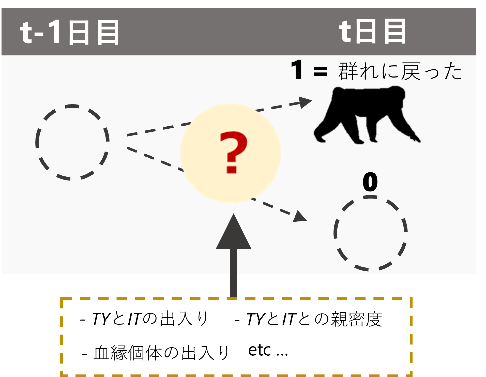

# メスが群れに戻るときのメカニズム  
本章では、メスが群れに戻るのはどのようなときなのかに関する分析を行う。以下では、メスの毎日の確認状況のデータからメスが群れに戻る要因を探る(図\@ref(fig:female-in))。

```{r female-in, out.width = "40%", fig.align = "center", echo = FALSE, fig.cap = "メスの確認状況に影響する要因"}

```
<br/>    

## データの加工  
### オスの出入り情報  
まず、オスの出入り情報について変数を作成する。第\@ref(c10)章と同様に、連続した2日間のオスの確認状況をもとにオスの動向について変数を作成する。    
```{r}
TYIT_presence_pre %>% 
  mutate(TY_state4 = ifelse(TY_pre == 1 & TY == 1, "TY_stay",
                            ifelse(TY_pre == 1 & TY == 0, "TY_out",
                                   ifelse(TY_pre == 0 & TY == 1, "TY_return",
                                          ifelse(TY_pre == 0 & TY == 0, "TY_absent", NA))))) %>% 
  mutate(TY_state4 = fct_relevel(TY_state4, "TY_stay", "TY_absent","TY_return")) %>%
  mutate(IT_state4 = ifelse(IT_pre == 1 & IT == 1, "IT_stay",
                            ifelse(IT_pre == 1 & IT == 0, "IT_out",
                                   ifelse(IT_pre == 0 & IT == 0, "IT_absent",
                                          ifelse(IT_pre == 0 & IT == 1, "IT_return", NA))))) %>% 
  mutate(IT_state4 = fct_relevel(IT_state4, "IT_stay", "IT_absent","IT_return")) %>% 
  mutate(TY_state = ifelse(TY_pre == 0 & TY == 1, "TY_return",
                           ifelse(TY_pre == 0 & TY == 0, "TY_absent",
                                  ifelse(TY_pre == 1, "TY_present", NA)))) %>% 
  mutate(TY_state = fct_relevel(TY_state, "TY_present", "TY_absent","TY_return")) %>%
  mutate(IT_state = ifelse(IT_pre == 0 & IT == 1, "IT_return",
                           ifelse(IT_pre == 0 & IT == 0, "IT_absent",
                                  ifelse(IT_pre == 1, "IT_present", NA)))) %>% 
  mutate(IT_state = fct_relevel(IT_state, "IT_present", "IT_absent","IT_return")) %>% 
  mutate(TY_return = ifelse(TY_state4 == "TY_return", 1, 0),
         IT_return = ifelse(IT_state4 == "IT_return", 1, 0)) %>% 
  replace_na(list(IT_state4 = "IT_absent",
                  IT_state = "IT_absent",
                  IT_return = 0)) -> male_state
```

### メスが群れに戻った日の同定   
続いて、各メスが群れに戻ったか否かを記したデータフレームを作成する。  
```{r}
## 発情状態とアカンボウの有無を結合  
female_pre_long %>% 
  mutate(date_pre = date - 1) %>% 
  left_join(female_pre_long %>% 
              select(date, femaleID, presence) %>% 
              rename(presence_pre = presence),
            by = c("date_pre" = "date", "femaleID")) %>% 
  mutate(female_in = ifelse(is.na(presence_pre), NA,
                            ifelse(presence_pre == 0 & presence == 1,1,0))) %>% 
  ## 前日にメスがいない日のみを抽出
  filter(presence_pre == 0) %>% 
  ## オスの出入りがある期間のみを抽出  
  filter(study_period %in% c("m18","m19", "m20", "m21", "nm20", "nm21")) %>% 
  left_join(female_all %>% 
              select(date,femaleID, rs2), by = c("date","femaleID")) -> female_in
```

### 血縁個体が群れに戻ったか否か   
続いて、各観察日に血縁個体が群れに戻ったか否かを算出する。  

```{r}
kin <- read_csv("../Data/data/others/kin.csv")

female_in %>% 
  select(groupID, date, study_period, femaleID, female_in, presence_pre) %>% 
  ## 他のメスのデータを結合  
  left_join(att %>% 
              filter(age >= 6) %>% 
              select(study_period, femaleID) %>% 
              rename(femaleID2 = femaleID),
            by = "study_period") %>% 
  filter(femaleID != femaleID2) %>% 
  ## 他のメスが群れを離れたか否かの列を作成
  left_join(female_in %>% 
              select(groupID, date, femaleID, female_in, rs2) %>% 
              rename(female_in2 = female_in,
                     femaleID2 = femaleID),
            by = c("groupID","date", "femaleID2")) %>% 
  replace_na(list(female_in2 = 0)) %>%
  ## 相手のメスとの血縁度を結合  
  left_join(kin, by = c("femaleID", "femaleID2")) %>% 
  filter(female_in2 == 1) %>% 
  ## それぞれの日で離れたメスの最大の血縁度を算出
  group_by(groupID, date, femaleID, rs2) %>% 
  summarise(max_kin = max(kin)) %>% 
  ungroup() %>% 
  replace_na(list(rs2 = 0)) %>% 
  pivot_wider(names_from = rs2,
              values_from = max_kin) %>% 
  replace_na(list(`1` = 0, `0` = 0)) %>% 
  rename(max_kin_est = `1`,
         max_kin_an = `0`) -> kin_female_in
```

### 当日の確認メス割合、発情メス数    
当日メスが群れに戻れば確認されたメスの割合も増加する可能性が高い。そこで、その日戻ったメスの数を除いたメス割合を算出した。  

```{r}
## それぞれの日に戻ったメスを除いた確認メス割合    
prop_female <- female_in %>% 
  group_by(date) %>% 
  summarise(no_female_in = sum(female_in)) %>% 
  ungroup() %>% 
  right_join(no_female_over0.5) %>% 
  mutate(no_female_b = no_female - no_female_in) %>% 
  mutate(prop_female_b = no_female_b/max_female) 

## まず、戻った個体のうち発情してた個体の数
sum_est_in <- female_in %>% 
  filter(presence == "1") %>% 
  group_by(date) %>% 
  summarise(no_est_in = sum(rs2))

## それらを除いた発情メス数を算出  
sum_est_b <-  sum_est %>% 
  left_join(sum_est_in, by = "date") %>% 
  replace_na(list(no_est_in = 0)) %>% 
  mutate(no_est_b = no_est - no_est_in)
```

### 全データの結合   
最後に、全データを結合する。  
```{r}
female_in %>% 
  left_join(no_female_over0.5 %>% 
              select(date, prop_female)  %>% 
              rename(date_pre = date),
            by = c("date_pre")) %>% 
  left_join(male_state %>% 
              select(date, groupID, TY_state4, IT_state4, TY_state, IT_state, TY_return, IT_return),
            by = c("date", "groupID")) %>% 
  left_join(CSI_TY_combined %>% 
              rename(femaleID = subject) %>% 
              select(femaleID, CSI_TY),
            by = "femaleID") %>% 
  left_join(CSI_IT_combined %>% 
              rename(femaleID = subject) %>% 
              select(femaleID, CSI_IT),
            by = "femaleID") %>% 
  left_join(no_female_over0.5_TYIT %>% 
              select(date, TY, IT) %>% 
              mutate(date = date + 1) %>% 
              rename(TY_pre = TY,
                     IT_pre = IT)) %>% 
  left_join(kin_female_in,
            by = c("groupID","date", "femaleID")) %>% 
  left_join(sum_ntm, by = c("date")) %>% 
  left_join(sum_est_b %>% select(date, groupID, no_est_b), by = c("date","groupID")) %>% 
  left_join(prop_female %>% select(date, groupID, prop_female_b),
            by = c("date", "groupID")) %>% 
  left_join(agg_rate_6yo %>% select(date, groupID, rate_agg_6yo),
            by = c("date", "groupID")) %>% 
  replace_na(list(max_kin_est = 0,
                  max_kin_an = 0)) %>% 
  mutate(kin_an_01 = ifelse(max_kin_an > 0, 1,0),
         kin_est_01 = ifelse(max_kin_est > 0, 1,0)) %>% 
  mutate(kin_01 = if_else(kin_an_01 + kin_est_01 >= 1, 1, 0)) %>% 
  group_by(study_period) %>% 
  ## 相対順位を算出  
  mutate(max_rank = max(rank)) %>% 
  ungroup() %>% 
  mutate(rank_scaled = rank/max_rank) %>% 
  filter(date >= "2018-10-08")-> female_in_final
```

データはこちらの通り。  
```{r}
datatable(female_in_final %>% mutate(across(where(is.numeric),~round(.,2))),
          options = list(scrollX = 50))
```

## 基本データの確認  
*TY*と*IT*はどのくらい同じ日に戻っていたかを確認する。  
```{r}
female_in_final %>% 
  mutate(season = ifelse(str_detect(study_period, "nm"), "nonmating", "mating")) %>% 
  group_by(femaleID, season) %>% 
  summarise(n = n(),
            sum_in = sum(female_in))
```


## 分析  
以下では、交尾期と非交尾期に分けて分析を行う。分析に含まれるのは、6歳以上でかつTY、ITとのCSIが算出できる個体(= 2019年時点で6歳以上の個体)である。

### 交尾期  
#### データの加工  
まず、データの加工を行う。データ数が少ないのと、区別が難しいので発情/非発情は分けない。    
```{r}
female_in_m <- female_in_final %>% 
  filter(!str_detect(study_period, "nm")) %>% 
  drop_na(CSI_TY)  %>% 
  mutate(date = as_date(date)) %>% 
  mutate(CSI_TY_std = standardize(CSI_TY),
         CSI_IT_std = standardize(CSI_IT),
         ntm_std = standardize(no_ntm),
         prop_std = standardize(prop_female_b),
         est_std = standardize(no_est_b),
         rank_std = standardize(rank_scaled),
         agg_rate_6yo_std = standardize(rate_agg_6yo),
         age_std = standardize(age)) %>% 
  mutate(N = 1:n())
```

*TY*と*IT*の動向の組み合わせごとのN数は以下の通り。同じ日に戻ることはなかった。    
```{r}
female_in_m %>% 
  group_by(TY_return, IT_return) %>% 
  summarise(N = n())
```

戻ったメスの発情状態は以下の通り。だいたい2/3は非発情メス。  
```{r}
female_in_m %>%
  group_by(rs2) %>% 
  summarise(N = n(),
            prop = mean(female_in),
            sum = sum(female_in))
```

#### モデリング1        
まず、*TY*と*IT*が群れに戻ったか否かという2水準の変数を用いてモデリングを行う。モデルの詳細は以下のとおりである。なお、連続変数はすべて標準化している。    

- 応答変数: メスが群れに戻ったか否か($female_in$)  
- 説明変数: TYが群れに戻ったか($TY_return$)、TYとの親密度($CSI_TY$)、これらの交互作用、ITが群れに戻ったか($IT_return$)、ITとの親密度($CSI_IT$)、これらの交互作用、年齢($age_std$)、順位$rank_std$、当日の確認メス割合$prop_std$、当日の発情メス数$est_std$、当日の群れ外オス数$ntm_std$  
- ランダム切片: メスID($femaleID$)、日付($date$)  
- 分布: ベルヌーイ分布  

モデルは以下のように実行する。  
```{r}
### ITとCSIの交互作用はVIFが高いので除く      
m_female_in_m_rv <-  brm(data = female_in_m %>% 
                           mutate(date = as.factor(date)),
                         female_in ~ TY_return*CSI_TY_std + IT_return*CSI_IT_std + kin_an_01 + kin_est_01 +
                           agg_rate_6yo_std + rank_std + age_std + prop_std + study_period +
                           (1|femaleID) + (1|date),
                         family = "bernoulli",
                         prior = c(prior(student_t(4,0,15),class = Intercept),
                                   prior(student_t(4,0,15), class = b),
                                   prior(student_t(4,0,10), class = sd)),
                         iter = 11000, warmup = 1000, seed = 112,
                         control=list(adapt_delta = 0.999, max_treedepth = 15),
                         backend = "cmdstanr",
                         file = "model/m_female_in_m_rv")

## 血縁の発情と非発情を区別しない  
m_female_in_m_rv2 <-  brm(data = female_in_m %>% 
                           mutate(date = as.factor(date)),
                         female_in ~ TY_return*CSI_TY_std + IT_return*CSI_IT_std + kin_01 +
                           agg_rate_6yo_std + rank_std + age_std + prop_std + 
                           study_period + (1|femaleID) + (1|date),
                         family = "bernoulli",
                         prior = c(prior(student_t(4,0,15),class = Intercept),
                                   prior(student_t(4,0,15), class = b),
                                   prior(student_t(4,0,10), class = sd)),
                         iter = 11000, warmup = 1000, seed = 112,
                         control=list(adapt_delta = 0.999, max_treedepth = 15),
                         backend = "cmdstanr",
                         file = "model/m_female_in_m_rv2")

## 2021年を除く  
female_in_m_bf21 <- female_in_m %>% 
  filter(study_period != "m21") %>% 
  mutate(CSI_TY_std = standardize(CSI_TY),
         CSI_IT_std = standardize(CSI_IT),
         ntm_std = standardize(no_ntm),
         prop_std = standardize(prop_female_b),
         rank_std = standardize(rank_scaled),
         agg_rate_6yo_std = standardize(rate_agg_6yo),
         age_std = standardize(age),
         est_std = standardize(no_est_b))

m_female_in_m_bf21_rv <-  brm(data = female_in_m_bf21 %>% 
                                mutate(date = as.factor(date)),
                              female_in ~ TY_return*CSI_TY_std + IT_return*CSI_IT_std + 
                                kin_an_01 + kin_est_01 +
                                agg_rate_6yo_std + rank_std + age_std + prop_std + 
                                study_period +
                                (1|femaleID) + (1|date),
                              family = "bernoulli",
                              prior = c(prior(student_t(4,0,15),class = Intercept),
                                        prior(student_t(4,0,15), class = b),
                                        prior(student_t(4,0,10), class = sd)),
                              iter = 11000, warmup = 1000, seed = 1273,
                              control=list(adapt_delta = 0.999, max_treedepth = 15),
                              backend = "cmdstanr",
                              file = "model/m_female_in_m_bf21_rv")

## 血縁の発情と非発情を区別しない 
m_female_in_m_bf21_rv2 <-  brm(data = female_in_m_bf21 %>% 
                                mutate(date = as.factor(date)),
                              female_in ~ TY_return*CSI_TY_std + IT_return*CSI_IT_std + 
                                kin_01 + agg_rate_6yo_std + rank_std + age_std 
                              + prop_std + study_period +
                                (1|femaleID) + (1|date),
                              family = "bernoulli",
                              prior = c(prior(student_t(4,0,15),class = Intercept),
                                        prior(student_t(4,0,15), class = b),
                                        prior(student_t(4,0,10), class = sd)),
                              iter = 11000, warmup = 1000, seed = 1212,
                              control=list(adapt_delta = 0.999, max_treedepth = 15),
                              backend = "cmdstanr",
                              file = "model/m_female_in_m_bf21_rv2")
```

##### モデルチェック  
まず、DHARMaパッケージ[@Hartig2022]とDHARMa.helperパッケージ[@Francisco2023]でモデルの前提が満たされているかを確認する。特に問題はないよう。   
```{r, fig.height = 4}
## 全期間    
dh_female_in_m_rv <- dh_check_brms(m_female_in_m_rv2, quantreg = TRUE)

## 2021年交尾期以後を除く 
dh_female_in_m_bf21_rv <- dh_check_brms(m_female_in_m_bf21_rv2, quantreg = TRUE)
```
<br/>  

bayesplotパッケージ[@Gabry2022]の`pp_check`関数で、事後分布からの予測分布と実測値の分布を比較しても大きな乖離はない。   
```{r, fig.height = 4.5}
## 全期間  
pp_check(m_female_in_m_rv2, ndraws = 100)+
  theme_bw()+
  theme(aspect.ratio = 0.9)

## 2021交尾期以後を除く  
pp_check(m_female_in_m_bf21_rv2, ndraws = 100)+
  theme_bw()+
  theme(aspect.ratio = 0.9)
```  
<br/>  

多重共線性のチェックもお個あったが、VIFに問題はない。  
```{r}
## 全期間
check_collinearity(m_female_in_m_rv2)

## 2021年交尾期以後を除く  
check_collinearity(m_female_in_m_bf21_rv2)
```
<br/>  

##### 結果の確認   
まずは全期間のデータを用いたモデルについて。結果は以下の通り。
```{r, echo = FALSE}
summary_m_female_in_rv <- summary(m_female_in_m_rv2)

model_parameters(m_female_in_m_rv2,
                 dispersion = TRUE, ci = 0.95, centrality = "median") %>% 
  data.frame() %>% 
  dplyr::select(1,2,3,5,6, 7,8) %>% 
  mutate("Bulk ESS" = summary_m_female_in_rv$fixed$Bulk_ESS,
         "Tail ESS" = summary_m_female_in_rv$fixed$Tail_ESS) %>% 
  mutate("95%CI" = str_c("[",sprintf("%.2f",CI_low),",",sprintf("%.2f",CI_high),"]")) %>% 
  dplyr::select(c(1,2,3, 10), everything()) %>% 
  dplyr::select(-CI_low, -CI_high) %>% 
  mutate(pd = str_c(sprintf("%.2f",pd*100))) %>% 
  rename(PD = pd) %>%  
  mutate(Parameter = fct_relevel(Parameter, "b_Intercept","b_TY_return","b_CSI_TY_std",
                                 "b_TY_return:CSI_TY_std",
                                 "b_IT_return","b_CSI_IT_std",
                                 "b_IT_return:CSI_IT_std",
                                 "b_kin_01",
                                 "b_agg_rate_6yo_std",
                                 "b_prop_std",
                                 "b_rank_std", "b_age_std",
                                 "b_study_periodm19","b_study_periodm20","b_study_periodm21")) %>% 
  arrange(Parameter) %>% 
  mutate(Parameter = str_replace_all(Parameter, c("b_Intercept"="切片",
                                                  "b_study_periodm19" = "Study period (MS19 vs MS18)",              
                                                  "b_study_periodm20" = "Study period (MS20 vs MS18)",
                                                  "b_study_periodm21" = "Study period (MS21 vs MS18)",
                                                  "^b_TY_return$" = "TY returned on day t\n (Yes cs No)",
                                                  "^b_IT_return$" = "IT returned on day t\n (Yes cs No)",
                                                  "b_rank_std" = "Ordinal dominance rank",
                                                  "b_age_std" = "Age",
                                                  "b_prop_std" = "Prop. of females on day t",
                                                  "b_kin_an_01" = "Anestrus kin females returned on day t\n(Yes vs No)",  
                                                  "b_kin_est_01" = "Estrous kin females returned on day t\n(Yes vs No)",  
                                                  "b_kin_01" = "Kin females returned on day t\n(Yes vs No)",  
                                                  "^b_agg_rate_6yo_std$" = "Aggression frequency on dat t",
                                                  "b_CSI_TY_std" = "CSI with TY",
                                                  "b_CSI_IT_std" = "CSI with IT",
                                                  "b_TY_return:CSI_TY_std" = "TY returned x CSI with TY",
                                                  "b_IT_return:CSI_IT_std" = "IT returned x CSI with IT"))) %>% 
  rename("Explanatory variables"="Parameter") %>% 
  mutate(across(where(is.numeric), ~sprintf("%.2f", .))) -> table_female_in_m_rv

table_female_in_m_rv

write_csv(table_female_in_m_rv, "tables/table_female_in_m_rv.csv")
```
<br/>  

推定されたランダム効果の標準偏差は以下の通り。  
```{r}
random_parameters(m_female_in_m_rv2)
```
<br/>  

続いて、2021年交尾期以後を除いたモデルの結果は以下の通り。
```{r, echo = FALSE}
summary_m_female_in_bf21_rv <- summary(m_female_in_m_bf21_rv2)

model_parameters(m_female_in_m_bf21_rv2,
                 dispersion = TRUE, ci = 0.95) %>% 
  data.frame() %>% 
  dplyr::select(1,2,3,5,6, 7,8) %>% 
  mutate("Bulk ESS" = summary_m_female_in_bf21_rv$fixed$Bulk_ESS,
         "Tail ESS" = summary_m_female_in_bf21_rv$fixed$Tail_ESS) %>% 
  mutate("95%CI" = str_c("[",sprintf("%.2f",CI_low),",",sprintf("%.2f",CI_high),"]")) %>% 
  dplyr::select(c(1,2,3, 10), everything()) %>% 
  dplyr::select(-CI_low, -CI_high) %>% 
  mutate(pd = str_c(sprintf("%.2f",pd*100))) %>% 
  rename(PD = pd) %>%  
  mutate(Parameter = fct_relevel(Parameter, "b_Intercept","b_TY_return","b_CSI_TY_std",
                                 "b_TY_return:CSI_TY_std",
                                 "b_IT_return","b_CSI_IT_std",
                                 "b_IT_return:CSI_IT_std",
                                 "b_kin_01", 
                                 "b_agg_rate_6yo_std",
                                 "b_prop_std",
                                 "b_rank_std", "b_age_std",
                                 "b_study_periodm19","b_study_periodm20")) %>% 
  arrange(Parameter) %>% 
  mutate(Parameter = str_replace_all(Parameter, c("b_Intercept"="切片",
                                                  "b_study_periodm19" = "Study period (MS19 vs MS18)",              
                                                  "b_study_periodm20" = "Study period (MS20 vs MS18)",
                                                  "b_study_periodm21" = "Study period (MS21 vs MS18)",
                                                  "^b_TY_return$" = "TY returned on day t\n (Yes cs No)",
                                                  "^b_IT_return$" = "IT returned on day t\n (Yes cs No)",
                                                  "b_rank_std" = "Ordinal dominance rank",
                                                  "b_age_std" = "Age",
                                                  "b_prop_std" = "Prop. of females on day t",
                                                  "b_kin_01" = "Kin females returned on day t\n(Yes vs No)", 
                                                  "b_kin_an_01" = "Anestrus kin females returned on day t\n(Yes vs No)",  
                                                  "b_kin_est_01" = "Estrous kin females returned on day t\n(Yes vs No)",   
                                                  "^b_agg_rate_6yo_std$" = "Aggression frequency on dat t",
                                                  "b_CSI_TY_std" = "CSI with TY",
                                                  "b_CSI_IT_std" = "CSI with IT",
                                                  "b_TY_return:CSI_TY_std" = "TY returned x CSI with TY",
                                                  "b_IT_return:CSI_IT_std" = "IT returned x CSI with IT"))) %>% 
  rename("Explanatory variables"="Parameter") %>% 
  mutate(across(where(is.numeric), ~sprintf("%.2f", .))) -> table_female_in_m_bf21_rv

table_female_in_m_bf21_rv

write_csv(table_female_in_m_bf21_rv, "tables/table_female_in_m_bf21_rv.csv")
```
<br/>  

推定されたランダム効果の標準偏差は以下の通り。  
```{r}
random_parameters(m_female_in_m_bf21_rv2)
```
<br/>  

##### 結果の図示  
###### TYの動向・ CSIとメスに戻る確率の関連  
まずは、*TY*とのCSIに応じてオッズ比の対数をとったものがどのように変わるかを図示する。*TY*と親密度が高いメスは同じ日に群れに戻る確率が高いことが分かる。 

```{r}
cont_female_out_in_TYcsi_rv <- posterior_samples(m_female_in_m_rv2) %>% 
  select(2, 14) %>% 
  rename(b_in = 1,
         b_int = 2) %>% 
  expand(CSI_TY_std = seq(-0.93, 2.7, length = 500),
         nesting(b_in, b_int)) %>% 
  mutate(logodds = b_in + b_int*CSI_TY_std) %>% 
  group_by(CSI_TY_std) %>% 
  summarise(median = median(logodds),
            CI_low = quantile(logodds, 0.025),
            CI_high = quantile(logodds, 0.975)) %>% 
  ungroup()

cont_female_out_in_TYcsi_rv %>% 
  rename(CSI_TY = CSI_TY_std) %>% 
  mutate(CSI_TY = sd(female_in_m$CSI_TY)*CSI_TY + mean(female_in_m$CSI_TY)) %>% 
  mutate(significance = if_else(CI_low*CI_high > 0,
                                "Yes", "No")) %>% 
  ggplot(aes(x = CSI_TY, y = median))+
  geom_point(data = CSI_TY_combined,
               aes(x = CSI_TY, y = -14.4),
             shape = "|",
             color = "black",
             size = 3.5) +
  # geom_segment(data = CSI_TY_combined,
  #              aes(xend = CSI_TY, y=-3, yend = 0),
  #              color = "firebrick3",
  #              alpha = 0.8, size = 0.4,
  #              arrow = arrow(length = unit(11, "points"))) +
  geom_line(aes(color = significance))+
  geom_ribbon(aes(ymin = CI_low, ymax = CI_high,
                  fill = significance),
              alpha = 0.15)+
  scale_color_manual(values = c("grey32", "red3"),
                     labels = c("No", "Yes")) +
  scale_fill_manual(values = c("grey32", "red3"),
                    labels = c("No", "Yes")) +
  geom_hline(aes(yintercept = 0),
             linetype = "dashed",
             color = "grey30",
             linewidth = 0.5)+
  theme_bw(base_size = 12)+
  theme(aspect.ratio = 1) +
  labs(y = "Log odds ratio<br/>(*TY* returned on day *t* vs. otherwise)",
       x = "CSI with *TY*",
       color = "95% CI doesn't include zero", fill = "95% CI doesn't include zero",
       title = "a")+
  scale_x_continuous(breaks = seq(0,5.5,0.5),)+
  scale_y_continuous(breaks = seq(-15, 20, 5))+
  theme(text = element_text(family = "Times New Roman"),
        axis.text = element_text(size = 12),
        axis.title = element_markdown(hjust = 0.5,
                                      lineheight = 1.2),
        aspect.ratio = 1,
        legend.position = "bottom",
        legend.title = element_text(size = 12),
        legend.text = element_text(size = 12),
        legend.margin=margin(0,0,0,0),
        legend.box.margin=margin(-10,-10,-10,-10)) -> p_female_in_TYcsi_rv

p_female_in_TYcsi_rv

ggsave("figures/p_female_in_TYcsi_rv.tif",p_female_in_TYcsi_rv,
       dpi = 2000, units = "mm",
       width = 100, height = 120)
```
<br/>  

実際に戻る可能性をプロットすると以下のようになる。  
```{r}
CSI_TY_in_q <- quantile(CSI_TY_combined$CSI_TY,
                         probs = c(0.1, 0.25, 0.5, 0.75, 0.9))[1:5]

CSI_TY_std_in_q <- (CSI_TY_in_q - mean(female_in_m$CSI_TY))/sd(female_in_m$CSI_TY)


emm_female_in_TYin_rv <- emmeans(m_female_in_m_rv2,
                                 ~TY_return|CSI_TY_std,
                                 at = list(TY_return = c(0,1),
                                           CSI_TY_std = CSI_TY_std_in_q),
                                 type = "response") 

emm_female_in_TYin_rv %>% 
  data.frame() %>% 
  mutate(CSI_TY_cat = factor(CSI_TY_std,
                             labels = str_c(c("10%\n(", "25%\n(", "Median\n(",
                                              "75%\n(", "90%\n("),
                                            sprintf("%.2f", CSI_TY_in_q),")"))) %>% 
  mutate(TY_return = if_else(TY_return == "1", "Yes", "No")) %>% 
  ggplot(aes(x = CSI_TY_cat, y = response)) +
  geom_errorbar(aes(group = TY_return,
                    ymin = lower.HPD, ymax = upper.HPD),
                position = position_dodge(0.85),
                width = 0.5)+
  geom_point(aes(fill = TY_return),
             position = position_dodge(0.85),
             shape = 21,
             size = 2.5) +
  scale_fill_manual(values = c("white", "black")) +
  theme_bw(base_size = 12) +
  theme(aspect.ratio = 0.7,
        text = element_text(family = "Times New Roman"),
        axis.title = element_markdown(lineheight = 1.2,
                                      hjust = 0.5),
        legend.title = element_markdown()) +
  labs(x = "CSI with *TY*", y = "Probability of females<br> returning to the main group",
       fill = "*TY* returned on day *t*?")  -> p_emm_female_in_TYin_rv

p_emm_female_in_TYin_rv

ggsave("figures/p_emm_female_in_TYin_rv.tif",
       p_emm_female_in_TYin_rv,
       width = 180, height = 110, dpi = 2000, units = "mm")
```
<br/>  

`TY_return`の値ごとの`CSI_TY`の効果は以下のようになる。  
```{r}
estimate_slopes(m_female_in_m_rv2,
                trend = "CSI_TY_std",
                by = "TY_return = c(0,1)",
                centrality = "median",
                ci_method = "hdi")
```
<br/>  

###### ITの群れへの出入り、CSIとの関連  
*IT*とのCSIに応じてオッズ比(*IT*と同じ日に群れを離れるオッズ/そうでない日に離れるオッズ)の対数をとったものがどのように変わるかを図示する。こちらは、いずれのCSIでも有意な効果はないよう。 

```{r}
cont_female_in_ITcsi_rv <- posterior_samples(m_female_in_m_rv2) %>% 
  select(4, 15) %>% 
  rename(b_in = 1,
         b_int = 2) %>% 
  expand(CSI_IT_std = seq(-0.78, 1.72, length = 500),
         nesting(b_in, b_int)) %>% 
  mutate(logodds = b_in + b_int*CSI_IT_std) %>% 
  group_by(CSI_IT_std) %>% 
  summarise(median = median(logodds),
            CI_low = quantile(logodds, 0.025),
            CI_high = quantile(logodds, 0.975)) %>% 
  ungroup()

cont_female_in_ITcsi_rv %>% 
  rename(CSI_IT = CSI_IT_std) %>% 
  mutate(CSI_IT = sd(female_in_m$CSI_IT)*CSI_IT + mean(female_in_m$CSI_IT)) %>% 
  mutate(significance = if_else(CI_low*CI_high > 0,
                                "Yes", "No")) %>% 
  ggplot(aes(x = CSI_IT, y = median))+
  geom_point(data = CSI_IT_combined,
               aes(x = CSI_IT, y = -0.8),
             shape = "|",
             color = "black",
             size = 3.5) +
  geom_line(aes(color = significance))+
  geom_ribbon(aes(ymin = CI_low, ymax = CI_high,
                  fill = significance),
              alpha = 0.15)+
  scale_color_manual(values = c("grey32", "red3"),
                     labels = c("No", "Yes")) +
  scale_fill_manual(values = c("grey32", "red3"),
                    labels = c("No", "Yes")) +
  geom_hline(aes(yintercept = 0),
             linetype = "dashed",
             color = "grey30",
             linewidth = 0.5)+
  theme_bw(base_size = 12)+
  theme(aspect.ratio = 1) +
  labs(y = "Log odds ratio<br/>(*IT* returned on day *t* vs. otherwise)",
       x = "CSI with *IT*",
       title = "b",
       color = "95% CI doesn't include zero", fill = "95% CI doesn't include zero")+
  scale_x_continuous(breaks = seq(0,5.5,0.5))+
  scale_y_continuous(breaks = seq(-15, 20, 5))+
  theme(text = element_text(family = "Times New Roman"),
        axis.text = element_text(size = 12),
        axis.title = element_markdown(hjust = 0.5,
                                      lineheight = 1.2),
        aspect.ratio = 1,
        legend.position = "bottom",
        legend.title = element_text(size = 12),
        legend.text = element_text(size = 12),
        legend.margin=margin(0,0,0,0),
        legend.box.margin=margin(-10,-10,-10,-10)) -> p_female_in_ITcsi_rv

p_female_in_ITcsi_rv

ggsave("figures/p_female_in_ITcsi_rv.tif",p_female_in_ITcsi_rv,
       dpi = 2000, units = "mm",
       width = 100, height = 120)
```
<br/>  

実際に戻る可能性をプロットすると以下のようになる。  
```{r}
CSI_IT_in_q <- quantile(CSI_IT_combined$CSI_IT,
                         probs = c(0.1, 0.25, 0.5, 0.75, 0.9))[1:5]

CSI_IT_std_in_q <- (CSI_IT_in_q - mean(female_in_m$CSI_IT))/sd(female_in_m$CSI_IT)


emm_female_in_ITin_rv <- emmeans(m_female_in_m_rv2,
                                 ~IT_return|CSI_IT_std,
                                 at = list(IT_return = c(0,1),
                                           CSI_IT_std = CSI_IT_std_in_q),
                                 type = "response") 

emm_female_in_ITin_rv %>% 
  data.frame() %>% 
  mutate(CSI_IT_cat = factor(CSI_IT_std,
                             labels = str_c(c("10%\n(", "25%\n(", "Median\n(",
                                              "75%\n(", "90%\n("),
                                            sprintf("%.2f", CSI_IT_in_q),")"))) %>% 
  mutate(IT_return = if_else(IT_return == "1", "Yes", "No")) %>% 
  ggplot(aes(x = CSI_IT_cat, y = response)) +
  geom_errorbar(aes(group = IT_return,
                    ymin = lower.HPD, ymax = upper.HPD),
                position = position_dodge(0.85),
                width = 0.5)+
  geom_point(aes(fill = IT_return),
             position = position_dodge(0.85),
             shape = 21,
             size = 2.5) +
  scale_fill_manual(values = c("white", "black")) +
  theme_bw(base_size = 12) +
  theme(aspect.ratio = 0.7,
        text = element_text(family = "Times New Roman"),
        axis.title = element_markdown(lineheight = 1.2,
                                      hjust = 0.5),
        legend.title = element_markdown()) +
  labs(x = "CSI with *IT*", y = "Probability of females<br> returning to the main group",
       fill = "*IT* returned on day *t*?") -> p_emm_female_in_ITin_rv

p_emm_female_in_ITin_rv

ggsave("figures/p_emm_female_in_ITin_rv.tif",
       p_emm_female_in_ITin_rv,
       width = 180, height = 110, dpi = 2000, units = "mm")
```
<br/>  

`IT_return`の値ごとの`CSI_IT`の効果は以下のようになる。  
```{r}
estimate_slopes(m_female_in_m_rv2,
                trend = "CSI_IT_std",
                by = "IT_return = c(0,1)",
                centrality = "median",
                ci_method = "hdi")
```
<br/>  

2021年を除いたモデルでも同様の傾向。  
```{r}
cont_female_in_ITcsi_bf21_rv <- posterior_samples(m_female_in_m_bf21_rv2) %>% 
  select(4, 14) %>% 
  rename(b_in = 1,
         b_int = 2) %>% 
  expand(CSI_IT_std = seq(-0.76, 1.78, length = 500),
         nesting(b_in, b_int)) %>% 
  mutate(logodds = b_in + b_int*CSI_IT_std) %>% 
  group_by(CSI_IT_std) %>% 
  summarise(median = median(logodds),
            CI_low = quantile(logodds, 0.025),
            CI_high = quantile(logodds, 0.975)) %>% 
  ungroup()

cont_female_in_ITcsi_bf21_rv %>% 
  rename(CSI_IT = CSI_IT_std) %>% 
  mutate(CSI_IT = sd(female_in_m_bf21$CSI_IT)*CSI_IT + mean(female_in_m_bf21$CSI_IT)) %>% 
  mutate(significance = if_else(CI_low*CI_high > 0,
                                "Yes", "No")) %>% 
  ggplot(aes(x = CSI_IT, y = median))+
  geom_point(data = CSI_IT_combined,
               aes(x = CSI_IT, y = -3.8),
             shape = "|",
             color = "black",
             size = 3.5) +
  geom_line(data = . %>%
              filter(CSI_IT < 0.15),
            aes(color = significance))+
  geom_ribbon(data = . %>%
              filter(CSI_IT < 0.15),
              aes(ymin = CI_low, ymax = CI_high,
                  fill = significance),
              alpha = 0.15)+
  geom_line(data = . %>%
              filter(CSI_IT > 2.515),
            aes(color = significance))+
  geom_ribbon(data = . %>%
              filter(CSI_IT > 2.515),
              aes(ymin = CI_low, ymax = CI_high,
                  fill = significance),
              alpha = 0.15)+
  geom_line(data = . %>%
              filter(CSI_IT >= 0.15 & CSI_IT <= 2.515),
            aes(color = significance))+
  geom_ribbon(data = . %>%
              filter(CSI_IT >= 0.15 & CSI_IT <= 2.515),
              aes(ymin = CI_low, ymax = CI_high,
                  fill = significance),
              alpha = 0.15) +
  scale_color_manual(values = c("grey32", "red3"),
                     labels = c("No", "Yes")) +
  scale_fill_manual(values = c("grey32", "red3"),
                    labels = c("No", "Yes")) +
  geom_hline(aes(yintercept = 0),
             linetype = "dashed",
             color = "grey30",
             linewidth = 0.5)+
  theme_bw(base_size = 12)+
  theme(aspect.ratio = 1) +
  labs(y = "Log odds ratio<br/>(*IT* returned on day *t* vs. otherwise)",
       x = "CSI with *IT*",
       color = "95% CI doesn't include zero", fill = "95% CI doesn't include zero")+
  scale_x_continuous(breaks = seq(0,5.5,0.5))+
  scale_y_continuous(breaks = seq(-15, 20, 5))+
  theme(text = element_text(family = "Times New Roman"),
        axis.text = element_text(size = 12),
        axis.title = element_markdown(hjust = 0.5,
                                      lineheight = 1.2),
        aspect.ratio = 1,
        legend.position = "bottom",
        legend.title = element_text(size = 12),
        legend.text = element_text(size = 12),
        legend.margin=margin(0,0,0,0),
        legend.box.margin=margin(-10,-10,-10,-10)) -> p_female_in_ITcsi_bf21_rv

p_female_in_ITcsi_bf21_rv

ggsave("figures/p_female_in_ITcsi_bf21_rv.tif",p_female_in_ITcsi_bf21_rv,
       dpi = 2000, units = "mm",
       width = 100, height = 120)
```
<br/>  

実際に戻る確率をプロットすると以下のようになる。  
```{r}
CSI_IT_in_bf21_q <- quantile(CSI_IT_combined$CSI_IT,
                              probs = c(0.1, 0.25, 0.5, 0.75, 0.9))[1:5]

CSI_IT_std_in_bf21_q <- (CSI_IT_in_bf21_q - mean(female_in_m_bf21$CSI_IT))/sd(female_in_m_bf21$CSI_IT)

emm_female_in_ITin_bf21_rv <- emmeans(m_female_in_m_bf21_rv2,
                                 ~IT_return|CSI_IT_std,
                                 at = list(IT_return = c(0,1),
                                           CSI_IT_std = CSI_IT_std_in_bf21_q),
                                 type = "response") 

emm_female_in_ITin_bf21_rv %>% 
  data.frame() %>% 
  mutate(CSI_IT_cat = factor(CSI_IT_std,
                             labels = str_c(c("10%\n(", "25%\n(", "Median\n(",
                                              "75%\n(", "90%\n("),
                                            sprintf("%.2f", CSI_IT_in_bf21_q),")"))) %>% 
  mutate(IT_return = if_else(IT_return == "1", "Yes", "No")) %>% 
  ggplot(aes(x = CSI_IT_cat, y = response)) +
  geom_errorbar(aes(group = IT_return,
                    ymin = lower.HPD, ymax = upper.HPD),
                position = position_dodge(0.85),
                width = 0.5)+
  geom_point(aes(fill = IT_return),
             position = position_dodge(0.85),
             shape = 21,
             size = 2.5) +
  scale_fill_manual(values = c("white", "black")) +
  theme_bw(base_size = 12) +
  theme(aspect.ratio = 0.7,
        text = element_text(family = "Times New Roman"),
        axis.title = element_markdown(lineheight = 1.2,
                                      hjust = 0.5),
        legend.title = element_markdown()) +
  labs(x = "CSI with *IT*", y = "Probability of females<br> returning to the main group",
       fill = "*IT* returned on day *t*?") -> p_emm_female_in_ITin_bf21_rv

p_emm_female_in_ITin_bf21_rv

ggsave("figures/p_emm_female_in_ITin_bf21_rv.tif",
       p_emm_female_in_ITin_bf21_rv,
       width = 180, height = 110, dpi = 2000, units = "mm")
```
<br/>  

###### 血縁個体が群れを離れたか否か  
血縁個体が群れを離れたのと同じ日に群れを離れたか否かを図示します。  
```{r}
## 非発情  
mean_kin_in <- emmeans(m_female_in_m_rv2,
                          ~kin_01,
                          type = "response") %>% 
  data.frame() %>% 
  mutate(kin_01 = as.factor(kin_01)) %>% 
  mutate(kin_01 = fct_relevel(kin_01, "0","1")) 

female_in_m %>% 
  mutate(kin_01 = as.factor(kin_01)) %>% 
  mutate(kin_01 = fct_relevel(kin_01, "0","1")) %>% 
  group_by(kin_01, femaleID) %>% 
  summarise(prop = mean(female_in),
            n = n()) %>% 
  ungroup() %>% 
  filter(n >= 2) %>% 
  ggplot(aes(x = kin_01, y = prop))+
  geom_line(aes(group = femaleID),
            linewidth = 0.6,
            alpha = 0.3)+
  geom_count(alpha = 0.8,
             shape = 1,
             stroke = 0.5) +
  geom_point(data = mean_kin_in %>% 
               filter(kin_01 == "0"),
             aes(y = response),
             position = position_nudge(x = -0.15),
             size = 3,
             shape = 16)+
  geom_errorbar(data = mean_kin_in %>% 
               filter(kin_01 == "0"),
             aes(y = response,
                 ymin = lower.HPD, ymax = upper.HPD),
             position = position_nudge(x = -0.15),
             width = 0.08)+
  geom_point(data = mean_kin_in %>% 
               filter(kin_01 == "1"),
             aes(y = response),
             position = position_nudge(x = 0.15),
             size = 3,
             shape = 16)+
  geom_errorbar(data = mean_kin_in %>% 
               filter(kin_01 == "1"),
             aes(y = response,
                 ymin = lower.HPD, ymax = upper.HPD),
             position = position_nudge(x = 0.15),
             width = 0.08)+
  scale_size(range = c(1,3))+
  scale_size_continuous(breaks = seq(1,3,1))+
  theme_bw(base_size = 13)+
  labs(x = "Did kin females returned on dat *t*?",
       y = "Probability of females returning on day *t*")+
  coord_cartesian(xlim = c(1.2,1.7),
                  ylim = c(0,1))+
  scale_x_discrete(labels = c("No", "Yes"),
                   expand = c(0.4, 0.3, 0.6, 0.3)) +
  theme(text = element_text(family = "Times New Roman"),
        axis.title = element_markdown(hjust = 0.5,
                                      lineheight = 1.2),
        aspect.ratio = 0.9) -> p_female_in_kin

p_female_in_kin

ggsave("figures/p_female_in_kin.tif", p_female_in_kin,
       height = 120, width = 120, dpi = 2000, units = "mm")
```
<br/>  

### 非交尾期  
データが2つしかない。 
```{r}
female_in_nm <- female_in_final %>% 
  filter(str_detect(study_period, "nm")) %>% 
  drop_na(CSI_TY)  %>% 
  mutate(date = as_date(date))

female_in_nm %>% 
  filter(female_in == "1") %>% 
  select(date, femaleID, TY_return, IT_return)
```

