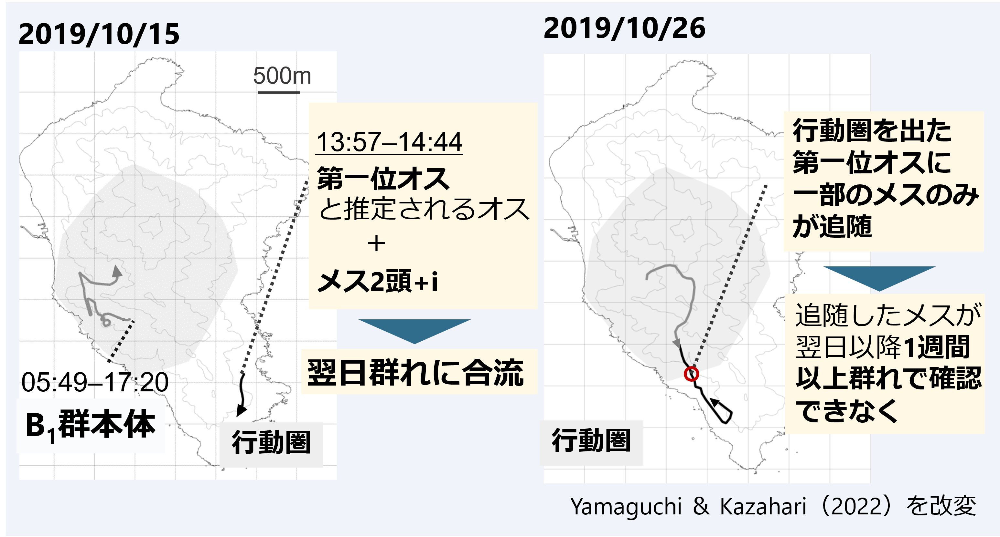

--- 
title: "Fission-fusion dynamics in B1 troop"
author: "Tsubasa Yamaguchi"
date: "`r Sys.Date()`"
output: 
  bookdown::gitbook:
    split_by: rmd  
    split_bib: yes  
    number_sections: true   
    toc_depth: 4 
    css: custom_style.css   
    df_print: paged
site: bookdown::bookdown_site  
output_dir: "docs"  
documentclass: book  
header-includes:
   - \usepackage{amsmath}
   - \usepackage{nccmath}
biblio-style: jecon    
bibliography: FFDronbun.bib   
link-citations: yes
csl: american-journal-of-primatology.csl
---

```{r, echo = FALSE}
knitr::opts_chunk$set(echo = TRUE, message = FALSE,
                      warning = FALSE, fig.align = "center",
                      cache = TRUE)
```

# 本稿の目的 {-}   
宮城県金華山島B1群では、2019年以降第一位オス「タイヨウ(*TY*)」と第二位オス「イツモ(*IT*)」が群れを頻繁に出入りするというニホンザルでは特異な行動が観察され、それに伴って群れの離合集散が頻繁に生じている可能性が報告されている[@Yamaguchi2020a; @Yamaguchi2022a; @Yamaguchi2023a; @Yamaguchi2023b; @Yamaguchi2022]。しかし、**こうした報告は全て事例報告に基づくものであり、群れの離合集散が実際にオスの出入りによるものなのかを知るためには、それ以外の要因の影響も考慮したうえで定量的に分析を行うことが必要である**。そこで本稿では、オスとメスの出欠データをそのほかの要因（メスの属性、オスとの親密度、オスからメスへの攻撃頻度など）と共に定量的に分析することで、B1群で生じている群れの離合集散動態の要因を明らかにすることを目的とする。本稿は[こちら](https://tsubasayamaguchi-jinrui.github.io/FFDronbun/)からみられる。     
<br/>  


```{r, out.width = "90%", fig.align = "center", echo = FALSE, fig.cap = "B1群で観察された離合集散事例（Yamaguchi & Kazahari, 2022）"}

```

